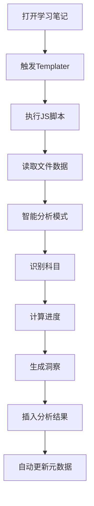

# 📜 自动化学习追踪.js 脚本功能详解

#javascript #templater #automation #documentation

## 🎯 脚本概述

**文件名**: `自动化学习追踪.js`  
**类型**: Templater JavaScript 脚本  
**作用**: 为Obsidian笔记自动收集和分析学习数据

## 🔧 核心功能

### 1. **智能数据收集** 📊
```javascript
// 自动获取当前文件的详细信息
async getCurrentFileData() {
    // ✅ 文件标题、路径、大小
    // ✅ 字数统计
    // ✅ 现有frontmatter数据
}
```

**实际效果**:
- 📄 自动读取当前笔记内容
- 📏 计算文件大小和字数
- 🏷️ 提取现有的元数据

### 2. **学习模式智能识别** 🧠
```javascript
// 根据编辑时长和内容自动判断学习类型
detectLearningPattern(data) {
    if (editTime > 1800 && wordCount > 500) {
        return "深度学习";      // 30分钟+ & 500字+
    } else if (editTime > 600 && hasImages) {
        return "资料整理";      // 10分钟+ & 有图片
    } else if (editTime > 300) {
        return "知识记录";      // 5分钟+
    } else {
        return "快速浏览";      // 其他情况
    }
}
```

**智能判断逻辑**:
- 🕐 **深度学习**: 长时间编辑 + 大量文字
- 📁 **资料整理**: 中等时间 + 包含图片  
- ✍️ **知识记录**: 一般时间编辑
- 👀 **快速浏览**: 短时间浏览

### 3. **科目自动识别** 🎓
```javascript
// 根据文件路径自动识别学科
detectSubject(filePath) {
    const subjectMap = {
        'L4财务管理学': '财务管理学',
        'L5 投资学': '投资学',
        'L7统计学': '统计学',
        'L_经济法': '经济法',
        // ... 其他科目映射
    };
}
```

**自动识别规则**:
- 📂 扫描文件路径中的关键词
- 🏫 匹配预定义的科目名称
- 🔄 自动标记笔记所属学科

### 4. **学习进度自动计算** 📈
```javascript
// 基于科目笔记统计自动计算进度
calculateProgress(subject) {
    // ✅ 统计该科目所有笔记
    // ✅ 计算平均进度
    // ✅ 返回科目整体进度
}
```

**计算逻辑**:
- 🔍 查找同科目的所有笔记
- 📊 统计已有进度数据
- 🧮 计算科目整体完成度

### 5. **学习洞察生成** 💡
```javascript
// 智能生成学习分析报告
generateInsights() {
    // ✅ 今日学习文件统计
    // ✅ 学习连击天数计算  
    // ✅ 最活跃科目识别
    // ✅ 学习习惯分析
}
```

**洞察内容**:
- 📚 `今日已学习 X 个文件`
- 🔥 `已连续学习 X 天`
- ⭐ `最活跃科目: XX学`

### 6. **数据统计分析** 📋

#### 今日学习统计
```javascript
getTodayStudiedFiles() {
    // 扫描所有笔记的last_studied字段
    // 筛选出今日修改的文件
    // 返回今日学习活动列表
}
```

#### 学习连击计算
```javascript
getStudyStreak() {
    // 收集所有学习日期
    // 计算连续学习天数
    // 激励持续学习
}
```

#### 最活跃科目分析
```javascript
getMostActiveSubject() {
    // 统计最近7天的学习活动
    // 按科目分组计算活跃度
    // 识别学习重点领域
}
```

## 🎮 使用方法

### 1. **Templater中调用**
```markdown
1. 在任意笔记中插入 Templater 代码块
2. 引用这个JS脚本
3. 脚本自动运行并插入分析结果
```

### 2. **自动模板触发**
```javascript
// 在笔记模板中添加:
<%* tp.file.include("[[自动化学习追踪.js]]") %>
```

### 3. **手动触发分析**
```bash
Ctrl+P → "Templater: Insert 自动化学习追踪"
```

## 📋 输出结果示例

脚本运行后会在笔记中自动插入：

```markdown
## 🤖 自动学习统计

- **最后学习**: 2025-01-02
- **学习模式**: 深度学习
- **字数统计**: 1,256
- **科目**: 财务管理学
- **自动进度**: 78%

## 💡 学习洞察

- 📚 今日已学习 5 个文件
- 🔥 已连续学习 12 天
- ⭐ 最活跃科目: 财务管理学

*自动更新时间: 2025/1/2 22:45:30*
```

## 🔄 工作流程



## ⚡ 优势特点

### 🚀 **完全自动化**
- ❌ 无需手动输入数据
- ✅ 一键生成详细分析
- 🔄 实时更新学习状态

### 🧠 **智能识别**
- 🎯 自动判断学习模式
- 🏫 自动识别学科分类
- 📊 自动计算学习进度

### 📈 **数据驱动**
- 📊 基于真实编辑数据
- 🔢 精确的时间统计
- 💡 有意义的学习洞察

### 🎨 **用户友好**
- 📝 清晰的输出格式
- 🎯 直观的进度显示
- ⚡ 即时的反馈结果

## 🔧 技术实现

### **面向对象设计**
```javascript
class AutoLearningTracker {
    // 封装所有自动化功能
    // 模块化的方法设计
    // 易于维护和扩展
}
```

### **错误处理机制**
```javascript
try {
    // 执行自动化逻辑
} catch (error) {
    // 友好的错误提示
    // 不影响正常使用
}
```

### **数据安全保护**
- 🔒 只读取必要的元数据
- 🛡️ 不修改原始文件内容
- 📊 本地处理，保护隐私

## 🎯 实际应用场景

### 📚 **日常学习**
- 每次打开学习笔记时自动分析
- 了解当前的学习模式和进度
- 获得激励性的学习洞察

### 📊 **进度跟踪**
- 自动更新学习统计数据
- 跟踪各科目的学习进展
- 识别学习习惯和模式

### 🎯 **学习优化**
- 基于数据调整学习策略
- 识别最需要关注的科目
- 保持学习连击和动力

---

**总结**: 这个JS脚本是一个**智能学习助手**，能够自动分析您的学习行为，提供有价值的学习洞察，让学习变得更加高效和有趣！🎉

*文档更新时间: 2025-01-02 22:50* 