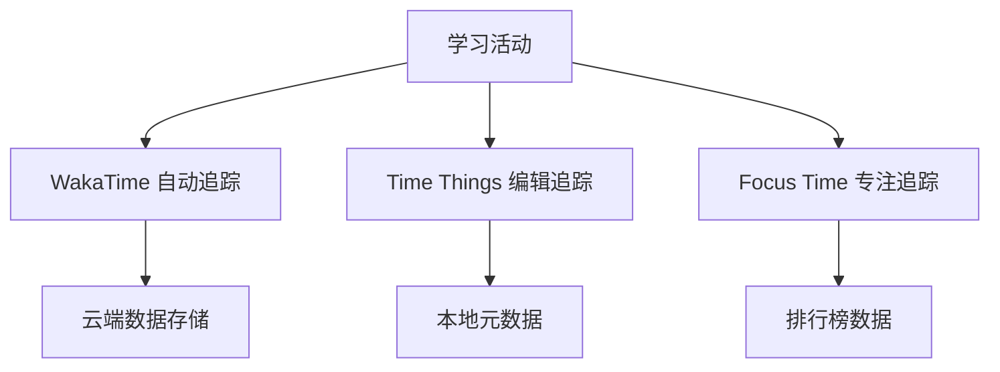

# 🤖 自动化学习追踪系统

#automation #learning-tracker #time-tracking #productivity

## 🎯 自动化目标

实现学习进度的自动检测和记录，减少手动更新的工作量：
- ✅ **自动时间追踪** - 检测学习时长
- ✅ **自动进度更新** - 基于活动自动更新进度
- ✅ **智能数据同步** - 自动更新元数据
- ✅ **活动分析** - 自动生成学习洞察

## 🔧 推荐插件组合

### 核心时间追踪插件

#### 1. **Timekeep** (推荐⭐⭐⭐⭐⭐)
- **功能**: 任务时间追踪，支持多种导出格式
- **自动化程度**: 中等
- **优势**: 
  - 数据持久性好（JSON格式存储）
  - 支持CSV/PDF导出
  - 与模板系统集成
- **安装**: 社区插件商店搜索 "Timekeep"

#### 2. **Time Things** (推荐⭐⭐⭐⭐)
- **功能**: 自动记录笔记编辑时长和最后修改时间
- **自动化程度**: 高
- **优势**:
  - 自动更新frontmatter
  - 状态栏显示当前笔记编辑时长
  - 完全自动化，无需手动操作
- **GitHub**: `https://github.com/plasmabit/timethings`

#### 3. **Super Simple Time Tracker** (推荐⭐⭐⭐⭐)
- **功能**: 简单易用的时间追踪器
- **自动化程度**: 中等
- **优势**:
  - 与Dataview集成
  - 数据可用于分析
  - 界面简洁

### 高级集成插件

#### 4. **WakaTime** (推荐⭐⭐⭐⭐⭐)
- **功能**: 全自动活动追踪和度量
- **自动化程度**: 极高
- **优势**:
  - 完全自动化
  - 详细的时间分析
  - 支持多平台数据聚合
  - 提供仪表板和报告
- **设置**: 需要WakaTime账户和API密钥

#### 5. **Focus Time** (推荐⭐⭐⭐⭐)
- **功能**: 自动追踪每个笔记的专注时间
- **自动化程度**: 高
- **优势**:
  - 排行榜功能
  - 自动检测活跃状态
  - 支持中英文界面

## 🚀 自动化实施方案

### 方案一：完全自动化 (推荐)

**插件组合**: WakaTime + Time Things + Focus Time

```markdown
1. 安装 WakaTime
   - 注册 wakatime.com 账户
   - 获取 API 密钥
   - 在Obsidian中配置插件

2. 安装 Time Things
   - 启用自动frontmatter更新
   - 配置时间格式
   - 启用编辑时长追踪

3. 安装 Focus Time
   - 启用自动追踪
   - 配置排行榜显示
```

**自动化效果**:
- ✅ 完全自动记录学习时间
- ✅ 自动更新笔记元数据
- ✅ 自动生成学习排行榜
- ✅ 详细的时间分析报告

### 方案二：半自动化

**插件组合**: Timekeep + Time Things + Templater

```markdown
1. 安装 Timekeep
   - 在每个学习笔记中插入时间追踪器
   - 学习时手动开始/停止计时

2. 配置 Templater 自动化
   - 创建自动更新模板
   - 定时执行数据同步

3. 使用 Time Things 自动元数据
   - 自动记录最后编辑时间
   - 自动计算编辑时长
```

## 📊 自动化数据流

### 数据收集层


### 数据处理层
```javascript
// 自动数据同步脚本 (Templater)
const wakaTimeData = await getWakaTimeData();
const timeThingsData = getTimeThingsData();
const focusTimeData = getFocusTimeData();

// 合并和分析数据
const learningInsights = analyzeLearningData({
    wakaTime: wakaTimeData,
    timeThings: timeThingsData,
    focusTime: focusTimeData
});

// 自动更新仪表板
updateDashboard(learningInsights);
```

### 数据展示层
- 📈 **实时仪表板** - 显示当前学习状态
- 📊 **趋势图表** - 显示学习趋势
- 🏆 **排行榜** - 显示最活跃的学习笔记
- 📝 **智能报告** - 自动生成学习总结

## 🔄 自动化流程配置

### 1. WakaTime 自动配置
```javascript
// .wakatime.cfg
[settings]
debug = false
api_key = YOUR_API_KEY_HERE
exclude = 
    .*\.log$
    .*/node_modules/.*
    .*/速成/.*  # 排除敏感文件夹
```

### 2. Time Things 自动配置
```yaml
# Time Things 设置
frontmatter:
  modified: "YYYY-MM-DD[T]HH:mm:ss.SSSZ"
  edit_duration: "PT{{duration}}S"
  study_session: "{{session_count}}"
  
clock:
  format: "HH:mm:ss"
  update_interval: 1000
```

### 3. Templater 自动化脚本
```javascript
// 自动更新学习数据
<%*
const currentFile = tp.file.find_tfile(tp.file.title);
const wakaTimeData = await tp.user.getWakaTimeData(tp.file.title);

if (wakaTimeData) {
    await tp.file.include("[[学习数据同步模板]]", {
        study_time: wakaTimeData.grand_total.total_seconds,
        last_activity: wakaTimeData.last_heartbeat,
        productivity_score: wakaTimeData.productivity
    });
}
%>
```

## 📱 移动端支持

### 移动端兼容插件
- ✅ **Time Things** - 完全支持
- ✅ **Focus Time** - 完全支持  
- ❌ **WakaTime** - 有限支持
- ❌ **PDF导出** - 不支持

### 移动端优化策略
```markdown
1. 使用 Focus Time 作为主要追踪工具
2. 配置 Time Things 自动更新元数据
3. 使用简化的仪表板界面
4. 定期同步到桌面端进行详细分析
```

## 🎛️ 高级自动化功能

### 1. 智能学习检测
```javascript
// 自动检测学习模式
function detectLearningPattern() {
    const editingTime = getEditingTime();
    const noteLength = getNoteLength();
    const imageCount = getImageCount();
    
    if (editingTime > 300 && noteLength > 100) {
        return "深度学习";
    } else if (editingTime > 60 && imageCount > 0) {
        return "资料整理";
    } else {
        return "快速浏览";
    }
}
```

### 2. 自动进度计算
```javascript
// 基于活动自动计算进度
function calculateProgress(subject) {
    const totalNotes = getNotesCount(subject);
    const completedNotes = getCompletedNotes(subject);
    const avgTimePerNote = getAverageTimePerNote(subject);
    const totalTimeSpent = getTotalTimeSpent(subject);
    
    return Math.min(100, (completedNotes / totalNotes) * 100);
}
```

### 3. 智能复习提醒
```javascript
// 基于遗忘曲线的智能提醒
function generateReviewReminders() {
    const notes = getAllLearningNotes();
    const reminders = [];
    
    notes.forEach(note => {
        const lastReview = note.last_studied;
        const difficulty = note.difficulty;
        const nextReview = calculateNextReview(lastReview, difficulty);
        
        if (isToday(nextReview)) {
            reminders.push(note);
        }
    });
    
    return reminders;
}
```

## 📈 数据分析和洞察

### 自动生成学习报告
```dataview
TABLE 
    round(sum(rows.edit_duration)/3600, 1) as "总学时",
    round(average(rows.edit_duration)/60, 1) as "平均时长(分钟)",
    length(rows) as "笔记数量",
    round(average(rows.difficulty), 1) as "平均难度"
FROM "大二下"
WHERE edit_duration
GROUP BY subject
SORT 总学时 DESC
```

### 学习效率分析
```javascript
// 自动分析学习效率
const efficiencyAnalysis = {
    peakHours: findPeakLearningHours(),
    bestSubjects: findMostEffectiveSubjects(), 
    improvementAreas: identifyWeakAreas(),
    recommendations: generateRecommendations()
};
```

## 🔐 隐私保护

### 自动化数据过滤
```yaml
# 自动排除敏感内容
exclude_patterns:
  - "*/速成/*"
  - "**/private/**"
  - "**.secret.**"
  
# 数据匿名化
anonymize_data: true
local_only_tracking: true
```

## 🎯 实施步骤

### 第一阶段：基础自动化 (本周)
1. ✅ 安装 Time Things 插件
2. ✅ 配置自动元数据更新
3. ✅ 设置基础时间追踪

### 第二阶段：高级追踪 (下周)
1. 📅 安装 WakaTime 插件
2. 📅 配置 Focus Time 插件
3. 📅 集成数据分析

### 第三阶段：完全自动化 (下个月)
1. 📅 实施智能检测算法
2. 📅 建立自动化报告系统
3. 📅 优化数据洞察功能

---

**下一步行动**: 
1. 选择适合的插件组合
2. 配置自动化参数
3. 测试数据收集效果
4. 优化和调整设置

*更新时间: 2025-01-02 22:30* 