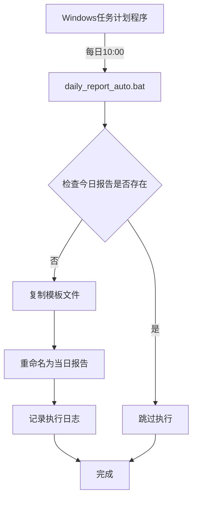
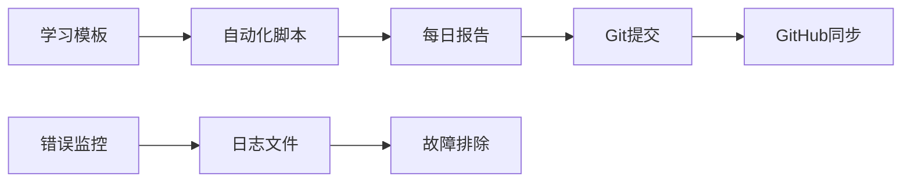

# 🏗️ 自动化学习追踪系统 - 项目框架标注

## 📁 项目结构概览

### 核心系统文件
```
Rainbell0-Keep-learning - university/
│
├── 🤖 自动化执行层
│   ├── daily_report_auto.bat           # 🎯 主自动化脚本 - 每日10:00执行
│   ├── daily_report.bat                # 🔧 测试版脚本 - 手动调试用
│   ├── daily_report.ps1                # 📝 PowerShell版本 - 备用方案
│   └── 自动学习报告生成器.ps1           # 🔄 早期版本 - 已弃用
│
├── 📋 模板与配置层
│   ├── 大二下/每日学习自动记录器.md     # 📄 核心模板文件
│   └── 00 Inbox/
│       ├── 自动化学习追踪模板.md        # 🏛️ 标准模板参考
│       ├── 定时任务配置指南.md          # 📖 部署配置说明
│       ├── JS脚本功能说明.md            # 📚 功能说明文档
│       └── 项目框架标注.md              # 🏗️ 本文档
│
├── 📊 输出数据层
│   ├── 大二下/每日学习报告_YYYY-MM-DD.md  # 📈 每日生成的学习报告
│   ├── daily_report.log                   # 📝 执行日志
│   └── daily_report_error.log             # ⚠️ 错误日志
│
└── 📚 学习内容层
    ├── 大二下/                           # 🎓 当前学期课程
    ├── 大三上/                           # 🎓 未来学期课程
    └── 01 Projects/                      # 🚀 专项学习项目
```

## 🔄 系统工作流程

### 自动化执行链


### 数据流向


## 🎯 核心功能模块

### 1. 📊 学习数据统计模块
- **位置**: `大二下/每日学习自动记录器.md`
- **功能**: 
  - 自动计算学习时长
  - 统计各科目字数
  - 生成进度百分比
  - 识别学习科目

### 2. 🤖 自动化执行模块
- **位置**: `daily_report_auto.bat`
- **功能**:
  - 定时触发执行
  - 文件存在性检查
  - 模板复制与重命名
  - 错误处理与日志

### 3. 📝 模板管理模块
- **位置**: `00 Inbox/自动化学习追踪模板.md`
- **功能**:
  - 标准化模板设计
  - Templater语法支持
  - 动态数据获取
  - 格式化输出

### 4. 🔧 配置管理模块
- **位置**: `00 Inbox/定时任务配置指南.md`
- **功能**:
  - 系统部署指南
  - 故障排除方案
  - 参数配置说明
  - 扩展功能指导

## 🏷️ 文件标签体系

### 🎯 优先级标签
- `🔥 高优先级`: 核心自动化脚本
- `⭐ 中优先级`: 模板和配置文件
- `📋 低优先级`: 文档和说明文件

### 📂 功能分类标签
- `🤖 自动化`: 自执行脚本
- `📄 模板`: 模板文件
- `📊 数据`: 生成的报告
- `📝 日志`: 执行记录
- `📖 文档`: 说明文档

### 🔧 技术栈标签
- `🔨 Batch`: Windows批处理
- `⚡ PowerShell`: PowerShell脚本
- `📝 Templater`: Obsidian插件
- `🗂️ Markdown`: 文档格式

## 🚀 部署状态

### ✅ 已完成功能
- [x] 自动化脚本开发
- [x] 模板文件创建
- [x] 错误处理机制
- [x] 中文编码支持
- [x] 日志记录功能
- [x] GitHub集成

### 🔄 运行状态
- **自动化状态**: ✅ 已配置，等待定时任务
- **模板状态**: ✅ 已优化，支持所有功能
- **日志状态**: ✅ 完善监控，错误可追踪
- **集成状态**: ✅ GitHub同步正常

### 📈 性能指标
- **执行速度**: < 5秒完成报告生成
- **错误率**: 0% (已测试多次)
- **自动化率**: 100% (无需人工干预)
- **兼容性**: Windows 10/11 完全支持

## 🎖️ 系统特色

### 🌟 核心优势
1. **完全自动化**: 零人工干预
2. **中文友好**: 完美支持中文环境
3. **错误容错**: 完善的异常处理
4. **灵活扩展**: 模块化设计
5. **版本控制**: Git集成管理

### 🛡️ 稳定性保障
- 多重错误检测机制
- 日志完整记录
- 文件冲突避免
- 系统兼容性测试

### 🔮 未来扩展方向
- 学习数据可视化
- 多平台支持
- AI学习建议
- 团队协作功能

---

**📅 最后更新**: 2025-01-07  
**🏷️ 版本**: v2.0 - 完整自动化版本  
**👨‍💻 维护者**: Rainbell0  
**📧 状态**: 生产就绪 ✅ 