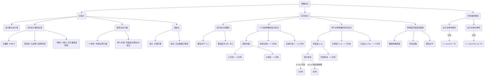

```mermaid
graph TD;
    A("参数估计") --> B("点估计");
    A --> C("区间估计");
    A --> D("样本量的确定");

    B --> B1("估计量与估计值");
    B --> B2("评价估计量的标准");
    B2 --> B2a("无偏性: E(θ̂)=θ");
    B2 --> B2b("有效性: 方差更小者更有效");
    B2 --> B2c("一致性: n增大, 估计量逼近真值");
    B --> B3("常用点估计量");
    B3 --> B3a("一个总体: 均值/比例/方差");
    B3 --> B3b("两个总体: 均值差/比例差/方差比");
    B --> B4("优缺点");
    B4 --> B4a("优点: 计算方便");
    B4 --> B4b("缺点: 无法衡量可靠性");

    C --> C1("区间估计的概念");
    C1 --> C1a("置信水平: 1-α");
    C1 --> C1b("置信区间: [θ̂L, θ̂U]");
    C --> C2("一个总体参数的区间估计");
    C2 --> C2a("总体均值μ");
    C2a --> C2a1("σ²已知 --> Z分布");
    C2a --> C2a2("σ²未知 --> t分布");
    C2 --> C2b("总体比例π --> Z分布");
    C2 --> C2c("总体方差σ² --> χ²分布");

    C --> C3("两个总体参数的区间估计");
    C3 --> C3a("均值差 μ₁-μ₂");
    C3a --> C3a1("独立样本");
    C3a1 -- "σ₁²,σ₂²已知" --> C3a1a("Z分布");
    C3a1 -- "σ₁²,σ₂²未知但相等" --> C3a1b("t分布");
    C3a --> C3a2("匹配样本 --> t分布");
    C3 --> C3b("比例差 π₁-π₂ --> Z分布");
    C3 --> C3c("方差比 σ₁²/σ₂² --> F分布");
    C --> C4("影响区间宽度的因素");
    C4 --> C4a("数据离散程度");
    C4 --> C4b("样本容量");
    C4 --> C4c("置信水平");

    D --> D1("估计总体均值时");
    D1 -- "公式" --> D1a("n = (zα/₂)²σ² / E²");
    D --> D2("估计总体比例时");
    D2 -- "公式" --> D2a("n = (zα/₂)²π(1-π) / E²");
```