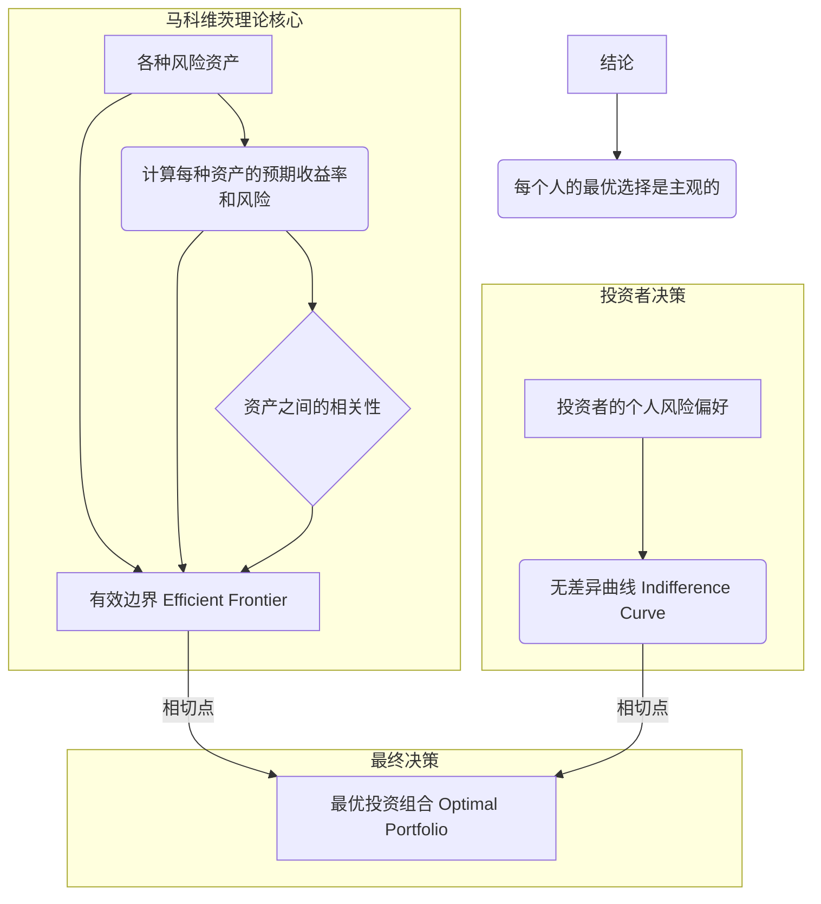
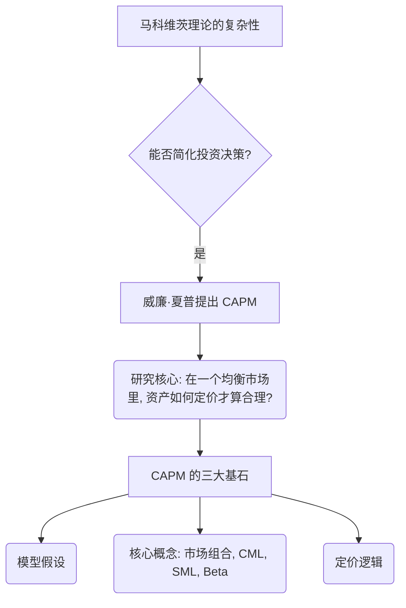
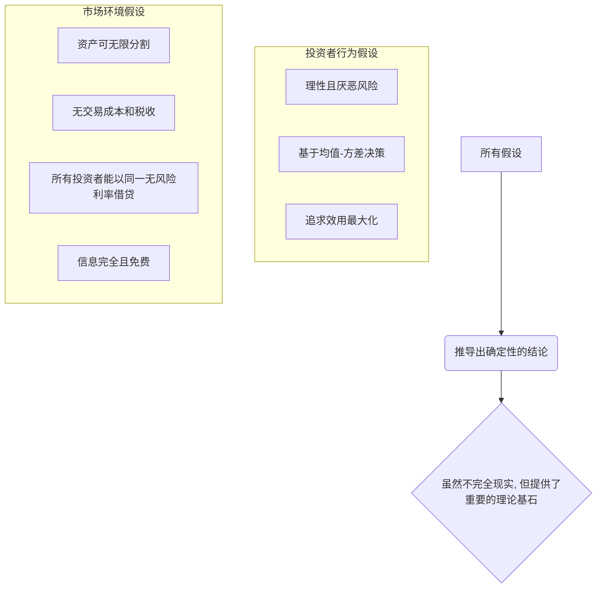
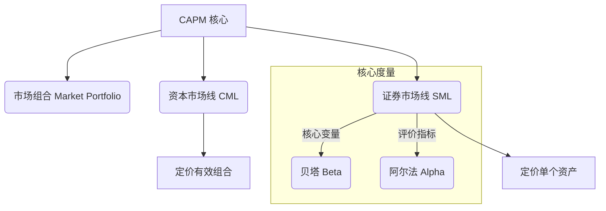

# 1 资本资产定价模型 (CAPM) 深度解析：从零到专家

你好！很高兴能和你一起探索金融世界里一个非常重要的理论——**资本资产定价模型 (Capital Asset Pricing Model, 简称 CAPM)**。

别担心，虽然名字听起来很“高大上”，但它的核心思想非常直观。我们会像搭积木一样，一块一块地把它搭建起来。

---

## 1.1 第一部分：回顾基础 - 我们从哪里来？(马科维茨投资组合理论)

在学习 CAPM 之前，我们必须先站稳脚跟，回顾一下它的“爸爸”——**马科维茨投资组合理论**。CAPM 就是在这个理论的基础上发展起来的。

### 1.1.1 知识框架 (Knowledge Framework)

### 1.1.2 细节深度解析

#### 1.1.2.1 有效边界 (Efficient Frontier)

*   **这是什么？**
    想象一下，市场上有很多种投资品（股票、债券等），就像超市里有很多种水果。每种水果都有自己的“甜度”（预期收益）和“酸度”（风险）。马科维茨理论告诉我们，通过把不同的水果搭配在一起做成“水果沙拉”（投资组合），我们可以调配出各种不同口味的沙拉。
    **有效边界**就是所有“最棒的”水果沙拉的集合。什么叫“最棒的”？就是说，在同样的“酸度”（风险）下，它的“甜度”（收益）是最高的；或者在同样的“甜度”（收益）下，它的“酸度”（风险）是最低的。这条线上的每一个点，都代表一个经过科学搭配、不浪费任何一点风险和收益的“黄金比例”投资组合。

*   **一句话概括精髓：**
    > 在所有可能的投资组合中，用最小的风险换取同样收益，或用同样的风险换取最大收益的那些“明星组合”的集合。

*   **讲给8岁小朋友听：**
    > 想象一下你在玩一个游戏，可以用“勇气值”（风险）来换“糖果”（收益）。有效边界就像游戏里的“超级兑换商店”，商店里列出了所有最划算的兑换方法，保证你花的每一点“勇气”都能换到最多的“糖果”。

#### 1.1.2.2 投资者的无差异曲线 (Indifference Curve)

*   **这是什么？**
    接上个例子，虽然“超级兑换商店”（有效边界）告诉了你所有划算的兑换方式，但具体换哪个，取决于你**自己**。
    *   胆子大的小朋友，可能愿意用很多“勇气值”去换一大堆糖果。
    *   胆子小的小朋友，可能只想用一点点“勇气值”换几颗糖果，图个心安。
    **无差异曲线**就代表了你的个人偏好。在这条线上，所有不同的“勇气”和“糖果”的组合，给你的“满意度”都是一样的。你有无数条这样的曲线，越往上的曲线代表满意度越高。

*   **一句话概括精髓：**
    > 代表个人风险与收益偏好的一条线，线上的所有点对这个投资者的吸引力都相同。

*   **讲给8岁小朋友听：**
    > 这就是你的“开心线”。比如，给你“$1$点勇气换$2$颗糖”和“$3$点勇气换$8$颗糖”，你觉得这两个选项让你一样开心，那它们就在你的同一条“开心线”上。

#### 1.1.2.3 最优投资组合 (Optimal Portfolio)

*   **这是什么？**
    当你的“开心线”（无差异曲线）和“超级兑换商店”（有效边界）**刚好碰到一起（相切）**的那个点，就是你的**最优投资组合**。
    这个点既是你能达到的、最划算的组合（在有效边界上），又恰好是你最最满意的那个组合（在你最高的无-差异曲线上）。
    
    *图中 D 点和 F 点，就是两位不同投资者（风险偏好不同）的个人最优投资组合。*

*   **核心区别：客观 vs. 主观**
    *   **有效边界**是**客观存在**的，对所有人都一样。市场上的资产和它们的数据是公开的，所以“最划算的兑换商店”对所有人都开放。
    *   **最优投资组合**是**主观选择**的。因为每个人的“开心线”（风险偏好）不一样，所以大家最终选择的那个“相切点”也**不一样**。这就是原文说的 `“可能这是主观上客观啊……最终风险组合大家对应该是客观的……因为追求投诉是客观加主观m，加上我们的”` 这段话的核心意思。原文这里 थोड़ा 混乱，但它想表达的就是：组合的构建（有效边界）是客观的，但最终的选择（最优投资组合）是主观的。

*   **一句话概括精髓：**
    > 结合了市场客观机会（有效边界）和个人主观偏好（无差异曲线）后，找到的那个最适合自己的独一无二的投资方案。

*   **讲给8岁小朋友听：**
    > 你拿着你的“开心线”地图，去“超级兑换商店”门口比对，找到那个既在商店列表上，又刚好在你最向往的那条“开心线”上的商品，那个就是你的“梦中情物”！

---

## 1.2 第二部分：CAPM 登场 - 一种更简洁的智慧

马科维茨理论很棒，但太复杂了。每个投资者都要自己算一遍有效边界，再找到自己的切点，太难了！于是，威廉·夏普（William Sharpe）等人就想：我们能不能简化一下？

### 1.2.1 知识框架 (Knowledge Framework)

### 1.2.2 细节深度解析

#### 1.2.2.1 CAPM 的诞生与意义

*   **它解决了什么问题？**
    马科维茨理论告诉你如何“量身定做”一个适合你自己的西装。而 CAPM 则更进一步，它说：在一个理想化的世界里，其实有一套“最佳版型”的西装（**市场组合**），所有人都应该先买这套。然后根据自己的胖瘦（风险偏好），再决定是多穿一件毛衣（借钱多买点），还是少穿一件衬衫（买点无风险资产）。
    它把复杂的“选股”问题，简化成了一个简单的“资产配置”问题。

*   **与马科维茨的关系 (原文考证)**
    原文说的很清楚：`“他们两个之间没有真正的师生关系”`，威廉·夏普是在马科维茨的理论基础上，做了进一步的拓展和简化。马科维茨是博士答辩委员会主席，夏普的研究正好建立在马科维茨的理论之上。这是一种学术上的传承和发展。

*   **一句话概-括精髓：**
    > CAPM 提供了一个简单公式，告诉我们任何一项风险资产的合理预期回报率应该是多少，这取决于它的系统性风险。

*   **讲给8岁小朋友听：**
    > 以前，每个小朋友都要自己学习营养学，自己去菜市场挑几十种菜来搭配自己的“完美午餐”，太累了！现在，CAPM 就像一个超级营养师，告诉你：“别麻烦了，学校食堂的‘标准营养午餐’（市场组合）就是最棒的！你只要决定是吃一份、一份半，还是半份就行了。”

#### 1.2.2.2 CAPM 的前提假设 (Assumptions)

任何一个完美的模型，都需要一些“完美”的假设。CAPM 也不例外，它的假设非常严格，这也是它在现实中会被批评的原因。

##### 1.2.2.2.1 知识框架 - 模型假设

##### 1.2.2.2.2 细节讲解

1.  **所有投资者都用“预期收益率-标准差”来决策**：和马科维茨一样，假设所有人都用“甜度-酸度”这个标准。
2.  **投资者都是理性的，追求不满足（多多益善）**：大家都是聪明人，都想要更多收益，讨厌风险。
3.  **每个投资者都是价格的接受者**：你的买卖行为不会影响市场价格。就像你在超市买一瓶可乐，不会导致可乐涨价。
4.  **资产可以无限分割**：你可以买 `$0.01` 股的茅台。**（现实中很难做到）**
5.  **所有投资者都可以用相同的无风险利率借贷资金**：所有人借钱和存钱的利息都一样，都是那个“无风险利率”。**（现实中，借钱的利率远高于存钱的利率）**
6.  **没有交易费用和税收**：买卖股票没有手续费，赚了钱也不用交税。**（现实中不可能）**

*   **为什么要有这些“不现实”的假设？**
    为了在复杂的现实世界中，搭建一个纯净的“实验室环境”。在这样的环境里，我们可以排除所有干扰因素，专心研究**风险和收益**这两个核心变量之间的关系。得出的结论虽然是理想化的，但它为我们提供了一个思考问题的基准和框架。

*   **一句话概括精髓：**
    > CAPM 的所有假设都是为了创造一个“完美 frictionless 的投资世界”，以便清晰地揭示风险与回报的核心关系。

*   **讲给8岁小朋友听：**
    > 想象一下我们在玩一个棋盘游戏，为了让规则简单明了，我们规定：
    > 1.  所有玩家都绝顶聪明。
    > 2.  棋子可以走到格子的任何一个角落，哪怕是$1/100$的位置。
    > 3.  移动棋子不消耗任何体力。
    > 4.  游戏里没有“倒霉卡”或“幸运卡”。
    > 在这种“绝对公平”的规则下，我们才能研究出最佳的下棋策略。CAPM 的假设就是这个游戏的“绝对公平”规则。

---

## 1.3 第三部分：CAPM 的核心内容 (模型精髓)

这部分是原文计划要讲，但还没来得及展开的 `“市场组合、CML、SML、阿尔法和贝塔”`。这是 CAPM 最精华的部分，我帮你补充完整，让你成为真正的大师。

### 1.3.1 知识框架 (Knowledge Framework)

### 1.3.2 细节深度解析

#### 1.3.2.1 市场组合 (Market Portfolio) & 资本市场线 (CML)

*   **市场组合 (M)**：在 CAPM 的完美世界里，既然所有人都理性，信息都对称，那么所有人看到的“有效边界”都是同一条。更进一步，当引入“无风险借贷”后，所有人的最优风险资产组合都会是**同一个**——那就是包含市场上所有风险资产（所有股票、债券等），并按其市值加权的组合。这个组合就是**市场组合 M**。
*   **资本市场线 (Capital Market Line, CML)**：这是一条从“无风险利率点”出发，与“有效边界”相切于“市场组合 M”的直线。这条线代表了**最佳的投资机会线**。所有理性的投资者，都会在这条线上选择一个点进行投资。
    *   在线的下半部分：持有部分无风险资产 + 部分市场组合M。
    *   在切点 M：$100\%$ 持有市场组合 M。
    *   在线的上半部分：借入无风险资金，加杠杆买入更多的市场组合 M。
    

*   **一句话概括精髓：**
    > CML 告诉我们，最聪明的投资方法就是“坐大巴”（投资市场组合M），你要么少花点钱坐半程（持有现金），要么多花点钱坐全程甚至站票（加杠杆）。

*   **CML 的公式：**
    $$ E(R_p) = R_f + \frac{E(R_m) - R_f}{\sigma_m} \sigma_p $$
    *   **直观解释**：一个“最优组合”的预期收益 $E(R_p)$ = 你白拿的收益 ($R_f$) + 你承担风险得到的“奖励”。这个奖励等于“市场的风险价格”（每单位市场风险给多少超额回报）乘以“你承担的总风险”($\sigma_p$)。
    *   **注意**：CML 只衡量**总风险** ($\sigma_p$)，只适用于**有效组合**。

#### 1.3.2.2 贝塔 (Beta, β) & 证券市场线 (SML)

*   **CML 解决了组合问题，但单个股票怎么定价？** 这就要靠 SML 和 Beta。
*   **风险的分解**：CAPM 认为，一个资产的总风险可以分为两部分：
    1.  **系统性风险 (Systematic Risk)**：也叫市场风险，是无法通过分散投资消除的风险。比如经济衰退、战争等，所有公司都受影响。**Beta (β) 就是衡量这个风险的指标。**
    2.  **非系统性风险 (Unsystematic Risk)**：也叫公司特有风险，是可以通过分散投资消除的风险。比如 CEO 辞职、工厂失火等。在一个充分分散的组合里，这个风险可以忽略不计。
*   **CAPM 的核心论断**：市场**只**会为“系统性风险”提供回报，因为“非系统性风险”你自己可以通过分散投资免费消除掉，市场没理由为此付钱。
*   **贝塔 (Beta, β)**：
    *   **它衡量什么？** 衡量一个资产的收益率相对于整个市场收益率的**敏感度**或**波动性**。
    *   **β = 1**：该股票和市场同涨同跌，风险水平与市场平均相同。
    *   **β > 1**：该股票比市场波动更大，牛市时涨得更多，熊市时也跌得更惨。比如科技股。
    *   **0 < β < 1**：该股票比市场波动更小，具有防御性。比如公用事业股。
    *   **β = 0**：该资产与市场波动无关，比如无风险资产。
    *   **β < 0**：该资产与市场反向变动，比如黄金在某些时期表现出这种特性。
*   **证券市场线 (Security Market Line, SML)**：
    *   这是 CAPM 的最终成果，是一个给**任何单个资产或组合**定价的公式。
    *   **公式：**
        $$ E(R_i) = R_f + \beta_i [E(R_m) - R_f] $$
    *   **直观解释**：一项资产 i 的合理预期收益率 $E(R_i)$ = 无风险收益 ($R_f$，这是你的保底收入) + 风险溢价。这个风险溢价 = 它的系统性风险大小 ($\beta_i$) × 市场对每单位系统性风险的奖励 ($E(R_m) - R_f$，也叫市场风险溢价)。

*   **讲给8岁小朋友听 (Beta是什么)：**
    > 想象一下，整个市场是一艘大船，在海浪（经济波动）中上下起伏。
    > *   **Beta = 1 的股票**，就像是甲板上的你，船上升$1$米，你也跟着上升$1$米。
    > *   **Beta = 2 的股票**，就像是桅杆顶上的人，船上升$1$米，你因为晃得更厉害，感觉自己上升了$2$米。
    > *   **Beta = 0.5 的股票**，就像是在船舱里的人，船上升$1$米，你感觉晃动没那么大，只上升了$0.5$米。
    > SML 就是说，你在船上晃得越厉害（Beta 越高），你就应该得到越多的“刺激奖励”（额外收益）。

*   **阿尔法 (Alpha, α)**
    *   **这是什么？** 它是资产的**实际回报率**与 SML 模型预测的**合理回报率**之间的差值。
    *   **α > 0**：意味着这个资产的实际收益比模型预测的要高，说明它被**低估**了，是个好买卖。
    *   **α < 0**：意味着实际收益比模型预测的低，被**高估**了，应该卖出。
    *   **α = 0**：价格合理，正好落在 SML 线上。

---

## 1.4 第四部分：大师级总结与对比

现在你已经掌握了所有细节，让我们站得更高，进行对比和总结，真正成为这个领域的大师。

### 1.4.1 马科维茨理论 vs. 资本资产定价模型 (CAPM)

| 特性 | 马科维茨投资组合理论 | 资本资产定价模型 (CAPM) | 大师点评 |
| :--- | :--- | :--- | :--- |
| **核心目标** | 如何为**单个投资者**构建最优的投资组合。 | 如何在**市场均衡**时，为**任何资产**定价。 | 从“为我服务”到“解释世界”，格局打开了。 |
| **风险衡量** | **总风险** (用方差或标准差衡量)。 | **系统性风险** (用 Beta 衡量)。 | CAPM 做了关键区分：只有不能分散的风险才值得被补偿。 |
| **关键输出** | **有效边界** (一条曲线)。 | **证券市场线 (SML)** (一条直线)。 | 从曲线到直线，是巨大的简化，大大增强了实用性。 |
| **对投资者的要求** | 每个投资者都需计算自己的最优组合。 | 所有投资者都投资于市场组合和无风险资产的再组合。 | 从“私人定制”变成了“标准化套餐 + 自选冷饮”。 |
| **假设** | 假设投资者是理性的、厌恶风险的。 | 增加了更多、更严格的假设（无税收、无交易成本、完美市场等）。 | 为了模型的简洁和普适性，牺牲了部分现实性。 |
| **关系** | CAPM 是马科维茨理论的**延伸和特例**。 | 是建立在马科维茨理论基础上的一个均衡模型。 | 青出于蓝而胜于蓝，虽然不完美，但影响力更广。 |

### 1.4.2 最终结论

你已经学完了从马科维茨到 CAPM 的全过程。请记住：

*   **马科维茨**给了我们“不要把所有鸡蛋放在一个篮子里”的科学方法，即**分散化投资**。
*   **CAPM**则更进一步，告诉我们，在一个理想世界里，最聪明的做法是“买下整个菜市场”（投资市场组合），然后根据你的胆量决定是借钱多买点，还是留点现金保平安。它提供了一个简洁的尺子（SML 和 Beta），去衡量任何资产的风险和它应该对应的回报。

虽然 CAPM 的假设在现实中并不完全成立，但它深刻地改变了现代金融学的思维方式，为我们理解风险与回报的关系提供了一个无与伦-比的、简洁而强大的理论框架。

希望这次的深度解析，能让你对 CAPM 有一个透彻的理解！你现在已经具备了向朋友，甚至是向小朋友清晰解释这个模型的能力了。