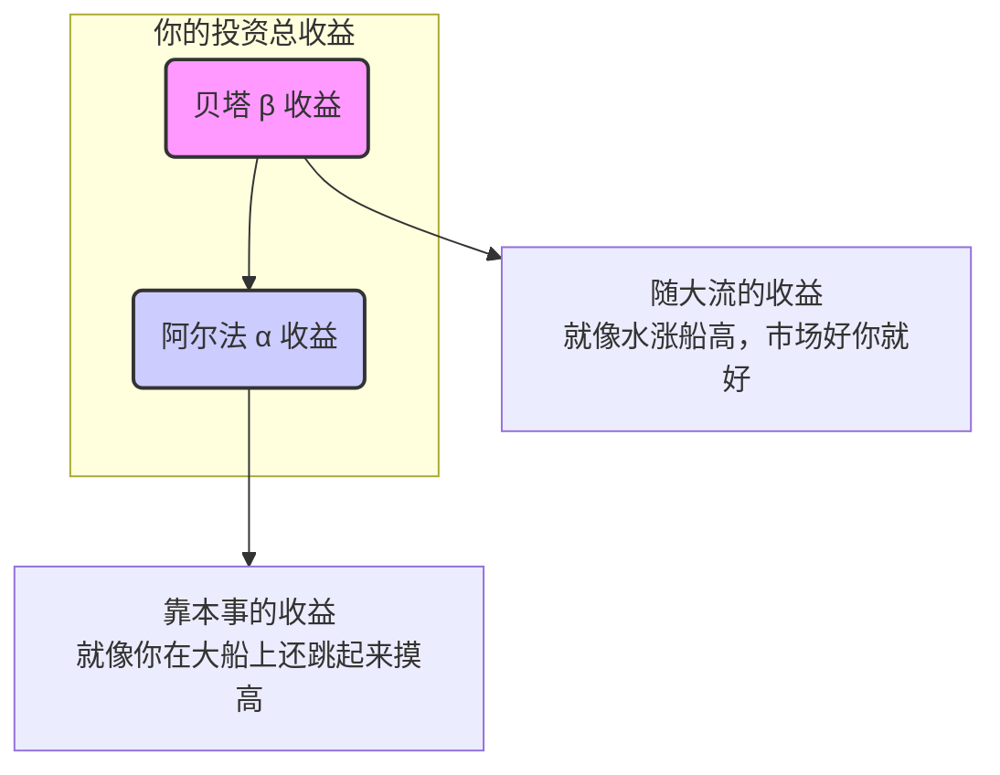
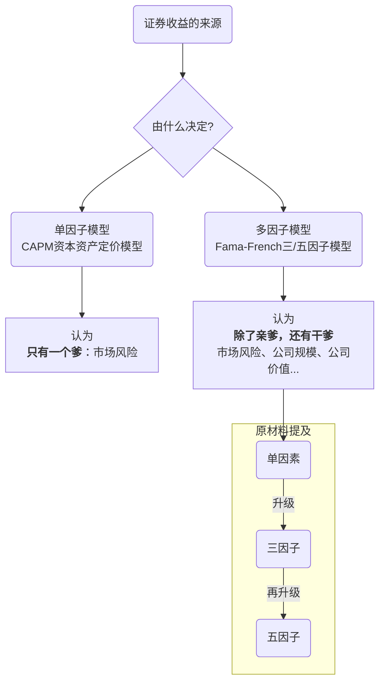
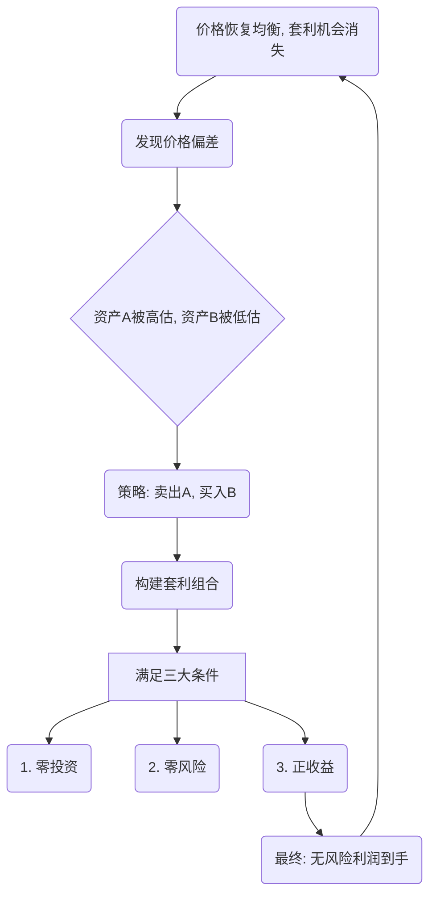
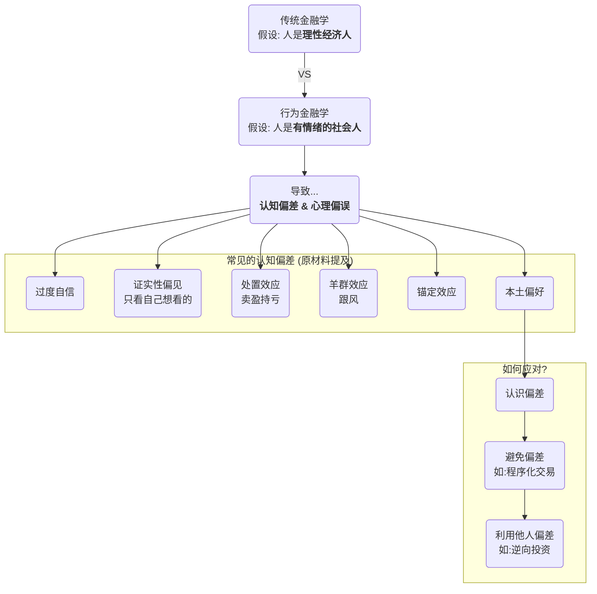

## 0.1 零、一切的起点：Alpha (α) 与 Beta (β)

在进入复杂的模型之前，我们必须先理解投资收益的两个基本组成部分，这也是整个投资学的基石。原材料中提到的“被动型基金”、“市场平均收益率”和“超额收益”说的就是它们。

### 0.1.1 知识框架 (Knowledge Framework)

这是一个关于收益来源的最基础的地图。



### 0.1.2 一句话概括

> 贝塔（β）是你跟着市场整体波动赚到的钱，而阿尔法（α）是你凭自己本事比市场多赚的钱。

### 0.1.3 细节深度解析

#### 0.1.3.1 什么是贝塔 (β) 收益？
*   **通俗解释**：想象一下，全班同学的平均分是 $80$ 分。你就算躺平不怎么努力，只要跟着大家一起上课，也差不多能考到这个分数。这个“平均分”就是**贝塔收益**。在金融市场里，这个“全班”就是整个市场（比如上证指数、标普500指数），它的平均收益率就是贝塔收益。
*   **精髓**：**贝塔收益是被动获得的，代表了市场本身的系统性风险与回报。** 你承担了市场的整体风险（比如经济衰退，所有股票都跌），所以市场上涨时，你也理应分一杯羹。
*   **来源**：它来源于你持有市场本身。当你购买一个“指数基金”（就像原材料里提到的“被动型基金”）时，你买的其实是“一篮子”的股票，完美复制了整个市场的表现。所以，你获得的就是纯粹的贝塔收益。
*   **给8岁小朋友讲**：你想买玩具，但不知道哪个最好。于是你妈妈帮你把店里每种玩具都买了一点点。这样，不管哪个玩具变得最流行，你都拥有它，你的快乐程度就和整个玩具店的“平均时髦度”一样。这个“平均时髦度”带来的快乐，就是贝塔。

#### 0.1.3.2 什么是阿尔法 (α) 收益？
*   **通俗解释**：还是那个例子，全班平均分是 $80$ 分，但你通过自己的努力、独特的学习方法或者课后开小灶，最终考了 $95$ 分。那多出来的 $15$ 分（$95 - 80 = 15$），就是你的**阿尔法收益**。
*   **精髓**：**阿尔法收益是主动获得的，代表了你的选股能力、择时能力等超越市场的“超额”部分。**
*   **来源**：它来源于基金经理或你个人的研究和判断。你没有买下整个市场，而是精挑细选出你认为会“跑赢”市场的几只好股票（就像原材料里说的“主动选股”）。如果它们真的涨得比市场平均水平好，你就获得了阿尔法。
*   **给8岁小朋友讲**：这次，你没有让你妈妈买所有玩具。你仔细研究，发现机器人玩具马上要出新动画片了，肯定会火！于是你只买了机器人玩具。结果，它真的成了最抢手的，比其他所有玩具加起来都更受欢迎。你因为自己的聪明判断获得的“额外快乐”，就是阿尔法。

> [!EXAMPLE] 举个例子
> 假设今年上证指数（市场）上涨了 $10\%$。
> *   你买的指数基金，净值也上涨了约 $10\%$。你的收益几乎全部是 **贝塔收益**。
> *   你朋友自己炒股，经过一番神操作，他的账户总共赚了 $15\%$。那么他的收益可以分解为：
>     *   $10\%$ 的**贝塔收益**（随大盘上涨的部分）
>     *   $5\%$ 的**阿尔法收益**（他选的股票比大盘表现更好的部分）

---

## 0.2 一、单因子与多因子模型：给收益一个“说法”

原材料中提到的“单因素模型”、“三因子模型”和“五因子模型”都属于这个范畴。它们就像侦探，试图找出究竟是什么“因素”导致了一只股票会涨会跌。

### 0.2.1 知识框架



### 0.2.2 一句话概括

> 因子模型就是用一个或多个“特征”（比如市场好坏、公司大小）来解释和预测股票的收益率，就像用“天气”、“施肥”、“除虫”等因素来预测一棵苹果树能结多少果子。

### 0.2.3 细节深度解析

#### 0.2.3.1 单因子模型（资本资产定价模型 - CAPM）

这是最经典的模型，认为影响股票收益的核心因素**只有一个**。

*   **核心思想**：一只股票的预期收益，只跟它和整个市场的“联动性”（也就是它的贝塔β）有关。你承担了越大的市场风险（你的股票波动比市场还剧烈），你就应该得到越高的回报补偿。
*   **来源**：这个模型由威廉·夏普等人在20世纪60年代提出，是现代金融学的基石之一。原材料里那句“正确的收益率等于预期，收益率，再加上系统性的风险”就是对它最通俗的描述。
*   **公式与推导**：
    $$
    E(R_i) = R_f + \beta_i (E(R_m) - R_f)
    $$
    *   **$E(R_i)$**：**预期收益率 (Expected Return of asset i)**。这是我们想知道的，就是“我投资这个股票，期望能赚多少？”
    *   **$R_f$**：**无风险收益率 (Risk-Free Rate)**。这是你把钱存银行或买国债能得到的收益，完全没有风险。可以看作是投资的“保底”收益。
    *   **$E(R_m)$**：**市场预期收益率 (Expected Return of the Market)**。就是我们前面说的“贝塔收益”，整个市场的平均回报。
    *   **$(E(R_m) - R_f)$**：**市场风险溢价 (Market Risk Premium)**。这是市场为了补偿投资者承担“市场风险”而提供的额外回报。可以理解为“你敢于投资股市而不是存银行，市场多奖励你的那部分”。
    *   **$\beta_i$**：**贝塔系数 (Beta of asset i)**。这是核心！它衡量了你的股票相对于整个市场的波动性。
        *   $\beta = 1$：你的股票和市场同涨同跌，幅度一样。
        *   $\beta > 1$：你的股票比市场波动更剧烈，是“进攻型”股票。市场涨$10\%$，它可能涨$15\%$；市场跌$10\%$，它可能跌$15\%$。风险大，预期回报也高。
        *   $\beta < 1$：你的股票比市场波动更小，是“防守型”股票。
*   **给8岁小朋友讲**：你想去海上坐船。
    *   **$R_f$ (无风险)**：待在绝对安全的港湾里，也能看到一点风景（国债利息）。
    *   **$E(R_m)$ (市场)**：坐上一艘平稳的大游轮出海，能看到更美的风景，但有风浪（市场平均收益和风险）。
    *   **$\beta > 1$ 的股票**：你坐的是一艘快艇，浪大的时候感觉要飞起来（涨得多），但也可能被一个大浪打翻（跌得狠）。
    *   **$\beta < 1$ 的股票**：你坐的是一艘大货轮，虽然慢，但风浪再大也感觉很稳。
    CAPM模型告诉你，你想看多刺激的风景（高回报），就得坐多颠簸的船（高贝塔）。

#### 0.2.3.2 多因子模型（Fama-French三因子模型）

原材料里提到的“法玛和弗兰奇”就是这个模型的创始人。他们觉得只用一个“市场风险”因子来解释收益太简单了。

*   **核心思想**：除了市场风险，还有其他因子也能稳定地解释超额收益。他们发现了两个特别显著的“干爹”。
*   **来源**：尤金·法玛（Eugene Fama）和肯尼斯·弗兰奇（Kenneth French）在1992年提出。
*   **三个因子**：
    1.  **市场风险因子 (Market Risk)**：和CAPM里的一样，就是贝塔。这是“亲爹”。
    2.  **规模因子 (Size Factor, SMB - Small Minus Big)**：从历史上看，**小公司的股票**（小盘股）长期回报倾向于高于**大公司的股票**（大盘股）。原材料中说的“小公司效应”就是这个。
    3.  **价值因子 (Value Factor, HML - High Minus Low)**：从历史上看，**价值被低估的公司的股票**（高账面市值比，可以理解为“便宜货”）长期回报倾向于高于**价值被高估的公司的股票**（成长股，可以理解为“明星货”）。
*   **给8岁小朋友讲**：你开了一个零食店。
    *   **市场因子**：天气好，大家出门多，你店里生意就好。这是大环境。
    *   **规模因子 (SMB)**：你发现，隔壁那种不起眼的小店，卖些新奇的小零食，虽然名气不大，但利润率特别高，比沃尔玛那种大超市能赚钱。这就是“小公司效应”。
    *   **价值因子 (HML)**：你还发现，一些包装不好看、但味道超赞的老牌子零食（价值股），卖得比那些广告打得响、但味道一般的新潮零食（成长股）要好得多。这就是“价值效应”。
    Fama-French模型就是说，一个零食店的生意好坏，不仅取决于天气，还取决于它是不是“小而美”，以及卖的是不是“物超所值”的东西。

> [!NOTE] 模型的演进
> 后来，研究者们又加入了**盈利因子**（赚钱能力强的公司表现更好）和**投资因子**（投资策略保守的公司表现更好），就变成了“五因子模型”。这些都说明，解释股票收益的“侦探工具”越来越精细了。

---

## 0.3 二、套利定价理论 (APT)：寻找不合理，创造无风险

原材料中对“套利”的描述非常生动，就是利用价格错配来赚钱。APT就是把这种思想理论化了。

### 0.3.1 知识框架



### 0.3.2 一句话概括

> 套利定价理论（APT）认为，任何不需要花钱、又没有任何风险、还能稳赚不赔的机会（套利机会）一旦出现，就会被聪明人立刻抓住，从而迅速消失。

### 0.3.3 细节深度解析

*   **核心逻辑**：APT不像CAPM那样预先规定好因子是什么，它更像一个框架。它认为，股票的收益是由一系列宏观经济因素或统计因素决定的（比如通胀率、GDP增长、利率等）。如果两只股票或两个投资组合受到这些因素的影响完全一样，那么它们的预期收益率也应该一样。如果不一样，就存在套利机会。
*   **给8岁小朋友讲**：你在两个不同的市场上卖一模一样的“奥特曼”卡片。
    *   A市场卖 $10$ 元一张。
    *   B市场只卖 $5$ 元一张。
    *   **套利行为**：你立刻在B市场花 $5$ 元买入，然后跑到A市场以 $10$ 元卖出。你一分钱没垫（因为卖掉的钱马上就收回来了），也没有任何风险（因为卡片是一样的），净赚了 $5$ 元。这就是套利。
*   **套利组合的三个黄金条件**（原材料中提到的）：
    1.  **零投资 (Zero Investment)**：套利组合的构建不应需要你额外掏钱。通常是通过“卖空”一个被高估的资产，用获得的钱去“买入”一个被低估的资产来实现的。就像上面的例子，你卖掉卡片收回的 $10$ 元，已经覆盖了你买入的 $5$ 元成本。
    2.  **零风险 (Zero Risk)**：这个组合对所有影响价格的“因子”都不敏感。也就是说，无论未来经济是好是坏、通胀是高是低，这个组合的价值都不会变。它的收益是确定的。这在现实中非常难以做到，是理论上的理想状态。
    3.  **正收益 (Positive Return)**：在零投资、零风险的前提下，这个组合还能给你带来正的、确定的利润。
*   **APT与CAPM的对比总结**

| 特性 | **套利定价理论 (APT)** | **资本资产定价模型 (CAPM)** |
| :--- | :--- | :--- |
| **因子** | 允许多个未指明的因子（可以是宏观经济变量） | 只有一个明确的因子（市场风险） |
| **假设** | 假设更少、更宽松（不要求市场均衡） | 假设非常严格（如所有投资者都理性、信息对称等） |
| **关系** | APT是一个更普适的框架 | CAPM可以看作是APT只有一个因子的特例 |
| **应用** | 理论上更灵活，但实际应用中需要自己找因子 | 理论清晰，应用广泛，但解释力有限 |

---
## 0.4 三、有效市场假说 (EMH)：你真的能赚到“超额”的钱吗？

原材料里那个“地上有钱没人捡”的段子，就是对“有效市场假说”最经典、最生动的诠释。

### 0.4.1 知识框架

```mermaid
graph TD
    A(有效市场假说<br>Efficient Market Hypothesis) --> B{核心: 价格反映一切信息};

    subgraph "效率的三个层次"
        C(弱式有效<br>Weak Form)
        D(半强式有效<br>Semi-strong Form)
        E(强式有效<br>Strong Form)
    end

    B --> C & D & E

    C --> C1[价格反映<b>历史信息</b><br>看K线图没用 (技术分析失效)]
    D --> D1[价格反映所有<b>公开信息</b><br>看财报也没用 (基本面分析失效)]
    E --> E1[价格反映所有<b>内幕信息</b><br>找内幕消息也没用 (内幕交易失效)]

    C1 --> F(结论: 基本面/内幕消息可能有用)
    D1 --> G(结论: 只有内幕消息可能有用)
    E1 --> H(结论: 谁都没用, 只能躺平买指数基金)

```

### 0.4.2 一句话概括

> 有效市场假说（EMH）认为，市场是极其聪明的，任何有用的信息都会被瞬间消化并反映在股票价格上，所以你别想通过分析信息来持续地战胜市场。

### 0.4.3 细节深度解析

*   **核心比喻**：**地上有100块钱**。
    *   **为什么没人捡？** 因为一个“有效率”的马路上，有成千上万个“理性”的行人路过。如果这钱是真的，早就被第一个看到的人捡走了。所以，你现在还能看到它，唯一的解释就是：**这钱是假的**。
    *   **映射到股市**：股票市场就是这条马路，投资者就是行人，而“赚钱的机会”就是地上的钱。EMH认为，任何一个能让你赚钱的“好消息”或“低估的价格”，都会被无数聪明的投资者瞬间发现并利用，导致价格立刻上涨到合理位置，机会消失。所以，你看到的股价，永远是“公平”的。
*   **EMH的三个层次** (原材料中详细讲了)

| 层次 | **弱式有效市场 (Weak-form EMH)** | **半强式有效市场 (Semi-strong EMH)** | **强式有效市场 (Strong-form EMH)** |
| :--- | :--- | :--- | :--- |
| **价格反映的信息** | **所有历史信息** (过去的股价、成交量等) | **所有公开信息** (历史信息 + 财报、新闻、分析师报告等) | **所有信息** (公开信息 + 内幕消息) |
| **失效的分析方法** | **技术分析** (看K线图找规律) | **技术分析 + 基本面分析** (研究公司基本面) | **技术分析 + 基本面分析 + 内幕交易** |
| **如何赚钱?** | 靠**基本面分析**或**内幕消息**。 | 只能靠**内幕消息** (违法)。 | **无法持续获得超额收益**。 |
| **8岁小朋友版** | 你不能通过看“昨天谁跑得快”来预测“今天谁跑得快”。 | 你不仅不能看“昨天”，你看“今天的跑步计划”也没用，因为大家都看到了。 | 你连“教练偷偷告诉某个队员的秘诀”都知道也没用，因为价格已经涨上去了。 |
| **现实世界的影子** | 大部分学者认为，像中国A股这样的市场，可能处于**弱式有效**或向半强式过渡的阶段。技术分析时灵时不灵，但深入的基本面研究仍有机会。 | 美国等成熟市场更接近**半强式有效**，普通人想通过公开信息打败市场非常困难。 | **强式有效**是一个几乎不可能达到的理想状态，连巴菲特都用他的业绩来反驳它。 |

*   **对投资者的启示**
    *   **如果你是EMH的信徒**：你会认为主动选股是浪费时间，因为市场不可战胜。最好的策略是“被动投资”，即购买**指数基金**，获取市场的平均收益（贝塔收益），省心省力。
    *   **如果你是EMH的反对者**：你会认为市场充满了错误和机会。你会努力去做研究（像巴菲特那样），或者利用市场情绪，去寻找那些被错杀的股票，以期获得超额收益（阿尔法收益）。

---

## 0.5 四、行为金融学：人，毕竟不是机器

这是对EMH最强有力的挑战。原材料中提到的投资者情绪、各种偏见、助推等，都属于行为金融学的范畴。

### 0.5.1 知识框架



### 0.5.2 一句话概括

> 行为金融学告诉你，投资者都是有血有肉、会恐惧会贪婪的普通人，他们的非理性行为会系统性地影响市场价格，从而创造出机会和陷阱。

### 0.5.3 细节深度解析

*   **核心思想**：金融世界的主体是人，而人的大脑有两套系统（如心理学家卡尼曼所说）：
    *   **系统1（直觉思维）**：快、自动、情绪化。比如你看到蛇就害怕。
    *   **系统2（理性思维）**：慢、费力、逻辑化。比如你做一道复杂的数学题。
    大多数时候，我们都在用系统1做决策，这导致了一系列可预测的“不理性”行为。
*   **常见的认知偏差与心理陷阱** (原材料中提到的)
    *   **过度自信 (Overconfidence)**：高估自己的判断力，导致交易过于频繁，承担过多风险。
        *   **给8岁小朋友讲**：你觉得自己是游戏天才，每一把都能赢，结果总是冲在最前面，然后第一个“阵亡”。
    *   **证实性偏见 (Confirmation Bias)**：你买了一只股票后，会不自觉地只去寻找对它有利好的消息，而忽略所有负面消息。
        *   **给8岁小朋友讲**：你认定你最喜欢的奥特曼是最强的，所以你只看他打赢怪兽的剧集，自动忽略他被打败的那些集。
    *   **处置效应 (Disposition Effect)**：投资者倾向于**过早地卖出**正在**赚钱**的股票（“落袋为安”），却**长期持有**正在**亏钱**的股票（“不卖就不算亏”）。这恰恰是反的，正确的做法是“截断亏损，让利润奔跑”。
        *   **给8-year-old讲**：你手里有两根棒棒糖，一根越来越甜，一根越来越苦。你却急着把甜的吃完，然后一直含着那根苦的，希望它能变甜。
    *   **羊群效应 (Herding)**：不管自己的判断如何， einfach地模仿别人的行为。这源于恐惧（怕错过）和贪婪（怕踏空）。
        *   **给8岁小朋友讲**：一个小朋友开始跑，你不知道为什么，但看到所有人都跟着跑，你也赶紧跑了起来。
    *   **锚定效应 (Anchoring)**：做决策时，过度依赖最先获得的信息（“锚”）。比如，一只股票曾经到过$100$元，现在跌到$50$元，你就会觉得它“很便宜”，而忽略了它的基本面可能已经恶化。
        *   **给8岁小朋友讲**：商店里一件玩具标价$1000$元，然后划掉写上$100$元。你就会觉得捡了个大便宜，即使它可能只值$50$元。那个$1000$元就是“锚”。
*   **行为金融学的实践应用**（如何成为更聪明的投资者）
    1.  **认识自己 (Know Thyself)**：学习这些认知偏差，反思自己在投资中是否也犯过类似的错误。
    2.  **避免犯错 (Avoid Mistakes)**：可以采用一些策略来对抗自己的天性。
        *   **投资日志**：写下买入和卖出的理由，用逻辑约束自己。
        *   **程序化交易**：让电脑严格执行预设的规则，排除情绪干扰。
    3.  **利用他人 (Exploit Others)**：这才是大师级别的玩法。当市场因为“羊群效应”而集体恐慌抛售时，理性的投资者（如巴菲特）会认识到这是贪婪的好时机，去买入那些被错杀的优质资产。这就是所谓的“逆向投资”。

> [!QUOTE] 沃伦·巴菲特
> "在别人贪婪时我恐惧，在别人恐惧时我贪婪。"
> 这句话就是行为金融学最精辟的实践总结。

---
### 0.5.4 **最终总结与成长路径**

恭喜你！我们已经一起走完了这段金融学核心概念的旅程。现在，你已经不再是0基础的小白了。

你的成长路径是这样的：
1.  **理解收益构成 (α & β)**：你知道了赚钱分为“跟风赚”和“凭本事赚”。
2.  **学习分析工具 (因子模型 & APT)**：你知道了可以用各种“因子”来科学地解释为什么能赚钱。
3.  **看清市场本质 (EMH)**：你理解了“市场是聪明的”这一主流观点，并知道了它对普通投资者的意义。
4.  **洞察人性弱点 (行为金融学)**：你最终明白了，市场虽然聪明，但组成市场的人并不总是理性的，这正是风险和机遇的来源。

现在，你不仅可以理解金融新闻，甚至可以开始分析自己和他人的投资行为了。记住，投资的道路，最终是一场关于认知和心性的修行。希望这份笔记能成为你地图，在你未来的探索之路上为你指引方向！