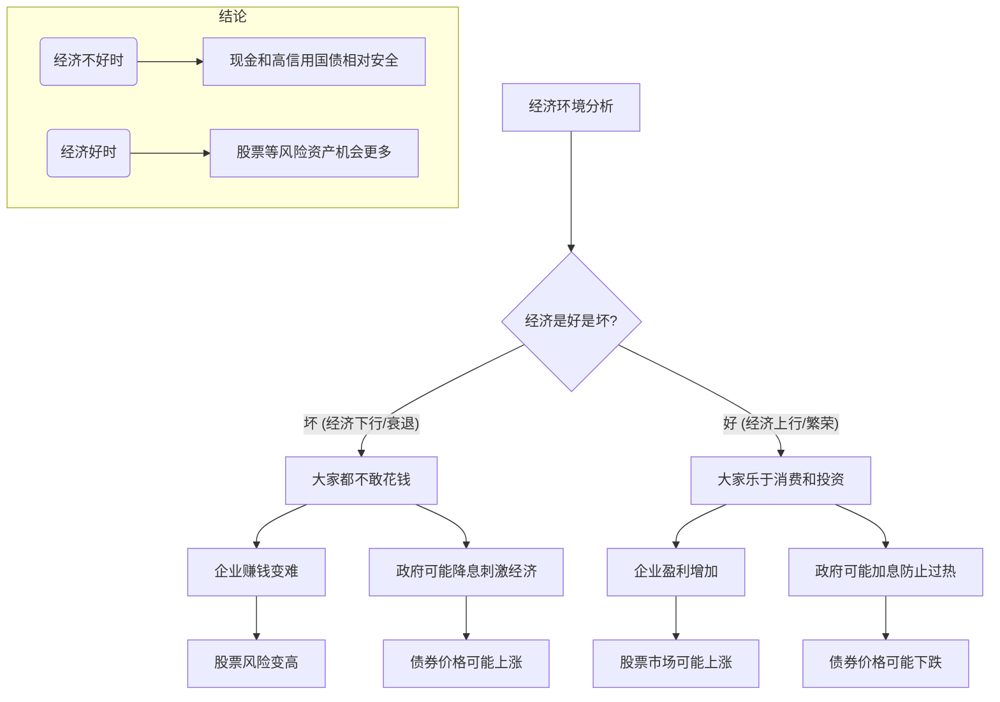
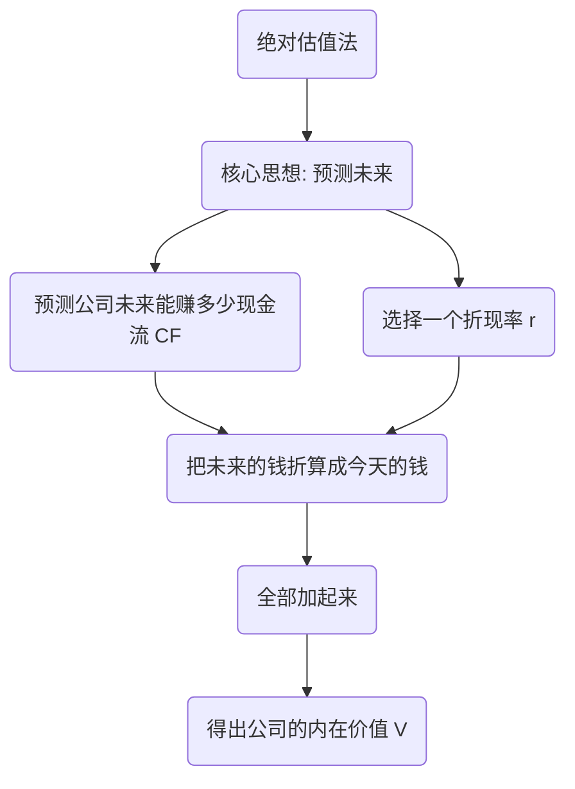
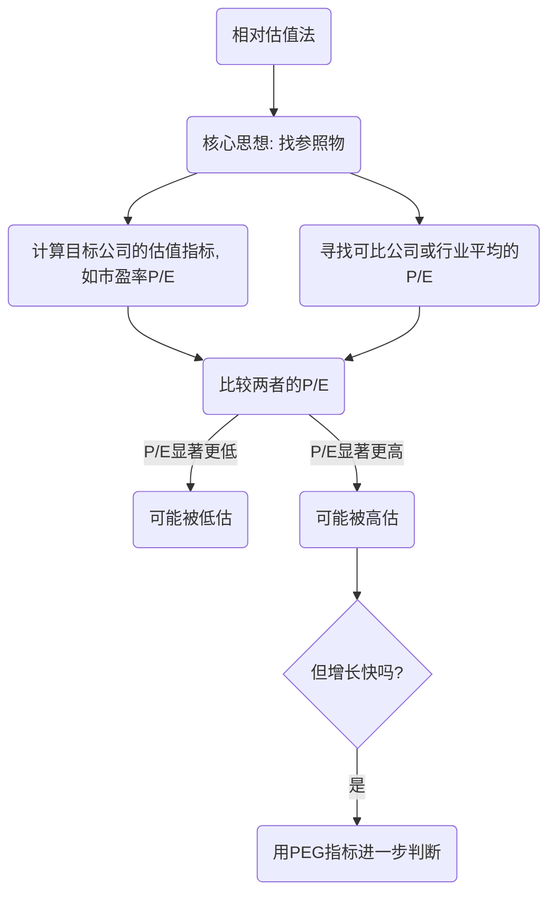

# 1 基金投资与公司估值：从小白到大师的系统学习笔记

你好！这份笔记将带你系统地学习课堂上提到的所有核心概念。原始材料就像一盘打乱的珠子，我们将把它们一颗颗捡起来，按照主题串成一条条精美的项链。每一部分都会从一个**知识框架图**开始，让你先看到全貌，再深入细节。

## 1.1 第一部分：投资决策的宏观背景 (Macroeconomic Context)

> **原始材料提及**：通胀下行，经济下行。这个阶段债券实际上，如果是企业债券国债的话，风险就更大。债券最好是国债...现金或者现金最安全。

在决定买什么之前，我们得先看看“天气”怎么样。投资里的“天气”就是宏观经济。

### 1.1.1 知识框架 (Mermaid)



### 1.1.2 一句话精髓

> 经济好的时候，大家一起赚钱胆子大，买股票；经济不好的时候，大家捂紧钱包保平安，买国债存现金。

### 1.1.3 给8岁小朋友听

想象一下，你们班要开一个联欢会。
*   **经济好的时候**：就像爸爸妈妈这个月奖金很多，给了你好多零花钱。你胆子也大了，愿意花$10块钱去抽奖（买**股票**），虽然可能抽不到，但万一抽到大奖呢？你也愿意把钱借给那些有超酷点子的同学（买**企业债券**），帮他们办节目，期望他们能分你更多零食。
*   **经济不好的时候**：就像这个月零花钱很少，你只想保住这点钱。你可能会把钱紧紧攥在手里（持有**现金**），或者只借给班长（买**国债**），因为你知道班长最靠谱，肯定会还你钱，虽然他给的利息（零食）可能不多，但最安全。

### 1.1.4 大师级思考：为什么经济下行时，企业债风险比国债大？

*   **国债 (Government Bond)**：是国家向你借钱。国家有印钞机、有税收，几乎不可能还不上钱。它被看作是“无风险”的。
*   **企业债 (Corporate Bond)**：是公司向你借钱。经济下行时，公司生意不好做，可能赚不到钱甚至破产。一旦破产，它就可能还不上你的钱，这叫“违约风险”。
*   **结论**：所以，在经济不好的时候，大家都会去追逐更安全的国债，抛售风险更高的企业债。

---

## 1.2 第二部分：给公司估值 - 两大派系 (Valuing a Company)

> **原始材料提及**：两种方法，一种是绝对估值法（巴菲特用的），另一种是相对估值法（市盈率P/E，PEG）。

想买一家公司（的股票），你总得知道它到底值多少钱吧？这里主要有两种“称重”的方法。

### 1.2.1 绝对估值法：挖掘公司的“内在价值” (DCF)

> **原始材料提及**：自由现金流折现...公式不要记错...`F1=612`...`r=20%`...`g=3%`...`一加g没有对吧？现在把它加进去`...

#### 1.2.1.1 知识框架 (Mermaid)



#### 1.2.1.2 一句话精髓

> 一家公司今天的价值，等于它未来能赚到的所有钱，换算成今天的人民币来看值多少。

#### 1.2.1.3 给8岁小朋友听

你有一只会下金蛋的鹅，你想把它卖掉。怎么给它定价呢？
你不能只看它现在有多重，而是要算算它**未来一共能下多少个金蛋**。
假设它每年能下1个金蛋，能活5年。那它未来就能产出5个金蛋。
但是，**明年的1个金蛋，和今天的1个金蛋，价值不一样**。因为你今天拿到金蛋，可以马上拿去换成糖果吃掉，或者换成钱存银行生利息。所以，未来的金蛋在你心里要打个“折扣”。
这个“折扣”就是**折现率 (r)**。
绝对估值法，就是把这只鹅未来每一年下的金蛋，都打个折算成今天的价值，然后全部加起来，就是这只鹅今天的价格。

#### 1.2.1.4 公式详解：自由现金流折现模型 (DCF - Discounted Cash Flow)

**核心公式**:
$$ V = \frac{CF_1}{(1+r)^1} + \frac{CF_2}{(1+r)^2} + \dots + \frac{CF_n}{(1+r)^n} + \frac{TV}{(1+r)^n} $$

*   **V (Value)**: 公司的内在价值，也就是我们要求的最终价格。
*   **CF (Cash Flow)**: 自由现金流。你可以理解为公司一年经营下来，刨去所有开销和再投资后，口袋里真正剩下的、可以自由支配的钱。`CF₁`是第1年的，`CF₂`是第2年的...
*   **r (rate)**: 折现率。这是最关键的参数。它代表了你要求的最低回报率，通常是你把钱投资到其他地方能得到的收益率（比如国债收益率）加上你为承担这家公司风险所要求的额外补偿。**原始材料里的`r=20%`就是一个例子**。
*   **n**: 预测的年限。
*   **TV (Terminal Value)**: 终值。因为公司可能会“永远”活下去，我们不可能无限地预测下去。所以通常我们详细预测5-10年，然后用一个公式估算10年之后所有年份的价值总和，这就是终值。

**简化的永续增长模型 (戈登增长模型)**
当公司进入一个稳定增长阶段，我们可以用一个简化公式来计算它的终值(TV)或者直接计算它的总价值(V)。
$$ V = \frac{CF_1}{r - g} $$
或者，如果基于第0年的现金流 `CF₀` 来计算：
$$ V = \frac{CF_0 \times (1+g)}{r - g} $$

*   **g (growth)**: 永续增长率。指公司在未来能永远保持的、一个比较低的、稳定的增长速度。**原始材料里的`g=3%`就是一个例子**。

**分析原始材料中的计算**:
老师提到的计算似乎是这个简化模型的变体。
> `f1=612` (这里的`F`应该是指`CF`，即第一年的现金流 `CF₁=612`)
> `r=20%`
> `g=3%`
> 老师说的“`一加g没有对吧？现在把它加进去`” 是在强调，正确的公式分子应该是下一年的现金流 `CF₁`。如果已知的是今年的现金流 `CF₀`，那么 `CF₁ = CF₀ * (1+g)`。
> 老师提到的计算可能是在算一个永续价值，但公式应用上有些口语化。如果按照戈登增长模型，这家公司的价值可能是：
> $$ V = \frac{CF_1}{r - g} = \frac{612}{20\% - 3\%} = \frac{612}{0.17} \approx 3600 $$
> 这和材料中提到的“`560, 600多`”有出入，说明老师可能在演示一个多年期折现过程中的某一步，或者口述简化了。但核心思想不变：**用未来的现金流(CF)、增长率(g)和折现率(r)来计算今天的价值(V)**。

#### 1.2.1.5 大师级思考

*   **优点**：非常严谨，基于公司基本面，试图找到一个“绝对”的价值，不受市场情绪影响。巴菲特等价值投资者非常推崇。
*   **缺点**：**“垃圾输入，垃圾输出”**。`r`和`g`的微小变动，会对结果`V`产生巨大影响。而这两个参数都是主观预测，很难精确。
*   **适用场景**：适合业务稳定、现金流可预测的成熟公司（如电力、高速公路），不适合初创科技公司或强周期性公司。

### 1.2.2 相对估值法：货比三家 (P/E & PEG)

> **原始材料提及**：相对估值法...合理市盈率...特斯拉...市盈率P/E=100倍...高科技公司市盈率比较高...用PEG来考察...`PEG = PE / G`...`100 / 200 = 0.5`...PEG小于1说明可能被低估。

#### 1.2.2.1 知识框架 (Mermaid)



#### 1.2.2.2 一句话精髓

> 不算它自己值多少钱，而是看它和旁边的“邻居们”比，是卖贵了还是卖便宜了。

#### 1.2.2.3 给8岁小朋友听

你想买一个玩具，但不知道它卖$100块贵不贵。
*   **市盈率 (P/E)**：你就去旁边几家玩具店看看，一模一样的玩具卖多少钱。如果别人都卖$120，那这家店卖$100就算便宜。如果别人都卖$80，那它就卖贵了。这就是“货比三家”。这里的“价格”就是股价(P)，“货”的价值就是公司每年的盈利(E)。
*   **市盈率-增长率 (PEG)**：现在，你发现有两个玩具，A玩具卖$100，B玩具卖$200。B看起来贵很多。但是，老板告诉你，B玩具是个变形金刚，每年都能学会一种新变形（**高增长**），而A玩具就是个普通小车（**低增长**）。这么一看，B虽然贵，但“成长性”好，未来会更值钱，可能$200也就不算贵了。PEG就是用来衡量，这个价格相对于它的“成长性”，到底合不合理。

#### 1.2.2.4 公式详解：P/E 和 PEG

**市盈率 (P/E Ratio - Price-to-Earnings Ratio)**
$$ PE = \frac{P}{E} = \frac{\text{公司市值}}{\text{公司净利润}} \quad \text{或} \quad \frac{\text{每股股价}}{\text{每股收益}} $$
*   **P (Price)**: 公司的总市值或股价。
*   **E (Earnings)**: 公司的净利润或每股收益。
*   **直观解释**：市盈率100倍，意味着你花100块钱买这家公司的股票，需要这家公司为你赚100年才能回本（假设利润不变）。
*   **应用**：**原始材料中，特斯拉（或中芯国际）的市值是4400亿，利润44亿，所以`P/E = 4400 / 44 = 100`倍。** 这意味着它的估值很高，市场愿意为它支付高价，因为市场预期它未来能高速增长。

**市盈率-增长率 (PEG Ratio - Price/Earnings-to-Growth Ratio)**
$$ PEG = \frac{P/E}{G} $$
*   **P/E**: 市盈率，我们上面刚算过。
*   **G**: 盈利的年增长率（注意：用百分数的数字，而不是小数。如200%的增长率，G就取200）。
*   **直观解释**：它回答了“市盈率高，是否因为增长也高？”这个问题。
*   **应用**: **原始材料中，该公司P/E是100，未来增长率预期是200%（`G=200`）**。
    $$ PEG = \frac{100}{200} = 0.5 $$
*   **判断标准（经验法则）**：
    *   `PEG < 1`: 通常认为股票价值可能被低估，有投资价值。
    *   `PEG = 1`: 估值相对合理。
    *   `PEG > 1`: 可能被高估，需要警惕。
*   **结论**：材料中的公司PEG为0.5，远小于1，所以老师得出的结论是：“**可能被低估，有投资价值，可以买入**”。

#### 1.2.2.5 大师级思考：两大估值方法对比

| 特征 | 绝对估值法 (DCF) | 相对估值法 (P/E, PEG) |
| :--- | :--- | :--- |
| **核心逻辑** | 公司值多少钱，取决于其内在的赚钱能力。 | 公司值多少钱，取决于市场愿意给它和同类公司多少钱。 |
| **优点** | 理论基础扎实，不受市场短期情绪影响。 | 简单、直观、易于使用，反映了市场共识。 |
| **缺点** | 对参数假设极其敏感，计算复杂，主观性强。 | 容易受市场情绪影响，可比公司难找，可能整个行业都被高估或低估。 |
| **“8岁”比喻** | **算命先生**：通过你的生辰八字（基本面）推算你一生的价值。 | **裁判**：不看你本人，只看你在所有赛跑选手里的排名来给你打分。 |
| **巴菲特会怎么用？** | 巴菲特的核心是DCF，但他也看P/E。他会用DCF算出“内在价值”，如果当前价格（P）远低于这个价值，他才会买入，形成“安全边际”。他不会仅仅因为一个公司的P/E比同类低就买。 |

---

## 1.3 第三部分：评价基金经理的业绩 - 夏普比率 (Sharpe Ratio)

> **原始材料提及**：两个基金经理A和B...A收益率15%，标准差20%...B收益率25%，标准差30%...无风险利率5%...谁的业绩更好？...`Sharpe Ratio = (Rp - Rf) / σp`

你把钱交给两个基金经理去管，年底一个赚了15%，一个赚了25%。B是不是一定比A厉害？不一定，我们还要看他们为了赚钱冒了多大的风险。

### 1.3.1 知识框架 (Mermaid)

```mermaid
graph TD
    A(评价投资业绩) --> B{只看收益率够吗?};
    B -- 不够 --> C(需要同时考虑风险!);
    C --> D(夏普比率: 衡量“性价比”的工具);
    D --> E(计算公式: (投资回报 - 无风险回报) / 风险);
    E --> F(比率越高, 说明承担单位风险换来的超额回报越多);
    F --> G(结论: 夏普比率高者更优秀);
```

### 1.3.2 一句话精髓

> 夏普比率衡量的是：你每承担一分风险，能换回来几分超出银行存款的“额外奖励”。

### 1.3.3 给8岁小朋友听

小明和小红都去爬山，都爬到了100米的高度（**收益率**）。
*   小明走的是一条铺好的台阶路，很安全，但有点绕（**风险低**）。
*   小红走的是一条悬崖边的小路，非常危险，随时可能掉下去（**风险高**）。

虽然他们达到的高度一样，但你是不是觉得走安全路线的小明更“厉害”？
夏普比率就是评价他们谁更厉害的工具。它不仅看你爬了多高（收益），更看你走的路有多险（风险）。**用很小的风险爬到同样的高度，才是真正的高手**。

### 1.3.4 公式详解：夏普比率 (Sharpe Ratio)

$$ S_p = \frac{R_p - R_f}{\sigma_p} $$

*   **Sₚ (Sharpe Ratio)**: 基金P的夏普比率。
*   **Rₚ (Return of portfolio)**: 投资组合（基金）的实际收益率。
*   **R𝒻 (Risk-free rate)**: 无风险收益率。可以理解为把钱放在最安全的地方（如国债、银行定期）能拿到的利率。**原始材料中为`5%`**。
*   **Rₚ - R𝒻**: **超额收益**。这是你冒着风险投资，所获得的超过“无风险”部分的回报。是你承担风险的“奖赏”。
*   **σₚ (Standard deviation of portfolio)**: 投资组合收益率的标准差。这是衡量**风险**的指标。标准差越大，意味着基金的净值波动越剧烈，像过山车一样，风险就越高。

**分析原始材料中的计算**:
*   **已知条件**:
    *   基金经理A: 收益率 `R_a = 15%`, 风险(标准差) `σ_a = 20%`
    *   基金经理B: 收益率 `R_b = 25%`, 风险(标准差) `σ_b = 30%`
    *   无风险利率: `R_f = 5%`

*   **计算A的夏普比率**:
    $$ S_A = \frac{R_a - R_f}{\sigma_a} = \frac{15\% - 5\%}{20\%} = \frac{10\%}{20\%} = 0.5 $$

*   **计算B的夏普比率**:
    $$ S_B = \frac{R_b - R_f}{\sigma_b} = \frac{25\% - 5\%}{30\%} = \frac{20\%}{30\%} \approx 0.67 $$

*   **比较与结论**:
    *   `0.67 > 0.5`，所以基金经理B的夏普比率更高。
    *   **结论**: 虽然B的风险(30%)比A(20%)要高，但他创造的超额收益(20%)也远高于A(10%)。**他每承担1单位的风险，换回了0.67单位的超额收益，这个“效率”比A的0.5要高。** 所以，**基金经理B的业绩更好**。

### 1.3.5 大师级思考

*   **核心用途**：夏普比率是基金业绩比较的“行业标准”。它让不同风险等级的基金可以放在同一个天平上比较。
*   **局限性**：
    1.  它假设收益率是正态分布的（像个钟形），但金融市场常有“黑天鹅”（极端事件），夏普比率无法衡量这种尾部风险。
    2.  如果基金收益率为负，夏普比率会失真。比如两个都亏钱的基金，风险越大的那个夏普比率反而可能更高（更接近0），这不合理。
*   **相关指标**：还有其他评价指标，如**特雷诺比率(Treynor Ratio)**，它用`Beta`系数代替标准差作为风险衡量，衡量的是系统性风险带来的回报。**索提诺比率(Sortino Ratio)**只考虑下跌的风险（下行标准差），更符合投资者对“风险”的直观感受。

---
> 由于篇幅限制和为了保证每个部分的学习深度，我将在这里暂停。以上是前三个核心主题的超详细解析。你可以先消化一下这部分内容。

> **后续内容预告**：根据你的材料，我们接下来还可以系统地学习：
> *   **第四部分：构建投资组合** (如何通过分散化降低风险，有效边界和最优投资组合是什么)
> *   **第五部分：资产如何定价 (CAPM)** (一个资产的合理回报率应该由什么决定)
> *   **第六部分：市场真的有效吗？** (行为金融学里的各种有趣现象，如处置效应、周末效应等)

当你准备好继续学习时，请告诉我，我将为你生成后续部分的详细笔记。这种分步学习的方式可以确保你对每个知识点都理解透彻，真正做到从0到1，再到精通。