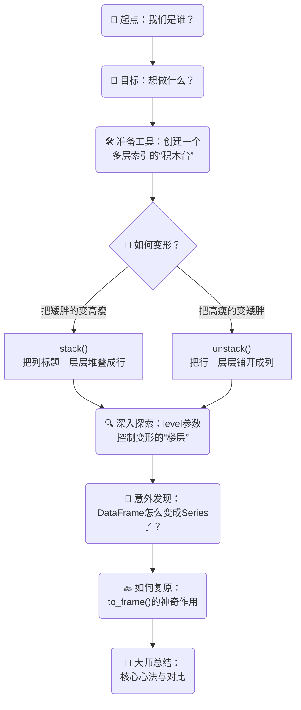

---

## 0.1 🎯 我们的目标：DataFrame 的“变形金刚”

> **一句话概括精髓**：我们想让数据表（DataFrame）像变形金刚一样，根据我们的需要，自由地把“横着”的结构（列）和“竖着”的结构（行）互相转换。

想象一下，你有一个玩具收纳盒，里面分了很多小格子。
*   **行索引 (Index)**：就像是收纳盒的 **“层”**，比如第一层放乐高，第二层放卡片。
*   **列索引 (Columns)**：就像是每一层的 **“格子”**，比如乐高那层的红色格子、蓝色格子。

`stack()` 和 `unstack()` 就是帮你整理这个收纳盒的魔法：
*   `stack()`：把 **“格子”**（列）拿出来，一个个 **“堆叠”** 起来，变成新的 **“层”**（行）。收纳盒会变得更高、更窄。
*   `unstack()`：把 **“层”**（行）拿出来，一个个 **“铺开”**，变成新的 **“格子”**（列）。收纳盒会变得更矮、更宽。

---

### 0.1.1 准备工作：创建一个多层索引的“积木台” (DataFrame)

> **一句话概括精髓**：我们先搭一个“实验台”，这个台子有两层“楼梯”（行索引），方便我们后续玩“搬运”游戏。

在动手之前，我们得先有一个多层索引的 DataFrame。这里我们用到了一个很酷的方法 `pd.MultiIndex.from_product`。

*   **什么是 `from_product`？**
    *   它的全称是 "from Cartesian product"，来源于数学中的 **“笛卡尔积”**。
    *   **给8岁小朋友讲**：想象你有2件上衣（`'Python'`, `'数学'`）和2种考试（`'期中'`, `'期末'`）。笛卡尔积就是帮你把所有可能的搭配都列出来：
        *   Python + 期中
        *   Python + 期末
        *   数学 + 期中
        *   数学 + 期末
    *   它就像一个“配对大师”，把两组东西（或者更多组）两两组合，创造出所有可能性。

**代码与解释**：

```python
import pandas as pd
import numpy as np

# 1. 创建行索引：使用笛卡尔积
# 我们有4个名字和2个考试类型
names = ['张三', '李四', '王五', '赵六']
terms = ['期中', '期末']
# from_product 会生成所有 (名字, 考试) 的组合
# 4个名字 x 2个考试 = 8个组合
idx = pd.MultiIndex.from_product([names, terms], names=['name', 'term'])

# 2. 创建数据
# np.random.randint(60, 101, size=(8, 2)) 的意思是：
# - 在 60 到 100 之间生成随机整数
# - size=(8, 2) 表示生成一个 8行2列的矩阵
data = np.random.randint(60, 101, size=(8, 2))

# 3. 创建列索引
cols = ['Python', '数学']

# 4. 组合成DataFrame
df = pd.DataFrame(data, index=idx, columns=cols)
```

**来看看我们创建的 `df`**：

> `df`

|          |          | Python | 数学  |
| :------- | :------- | :----: | :-: |
| **name** | **term** |        |     |
| 张三       | 期中       |   85   | 92  |
|          | 期末       |   78   | 66  |
| 李四       | 期中       |   99   | 71  |
|          | 期末       |   62   | 88  |
| 王五       | 期中       |   75   | 95  |
|          | 期末       |   81   | 60  |
| 赵六       | 期中       |   90   | 83  |
|          | 期末       |   68   | 91  |

*   **观察**：我们的行索引有两层：`name`（外层）和 `term`（内层）。这就像一个两层的楼梯。

---

### 0.1.2 核心操作一：`unstack()` - 把“楼梯”变“门牌” (行转列)

> **一句话概括精髓**：`unstack()` 就是把行索引（楼梯）的某一层，抽出来，“横”着放，变成列索引（一排排的门牌号），让表格变宽。

#### 0.1.2.1 默认的 `unstack()`

默认情况下，`unstack()` 会操作 **最里面** 的那一层行索引。在我们的 `df` 中，最内层是 `term`（期中/期末）。

```python
# 对 df 使用 unstack()
df_unstacked = df.unstack()
```

**执行结果 `df_unstacked`**：

> `df_unstacked`

|          | Python      | 数学      |
| :------- | :---------- | :---------- |
| **term** | **期中** | **期末** | **期中** | **期末** |
| **name** |          |          |          |          |
| 张三       | 85       | 78       | 92       | 66       |
| 李四       | 99       | 62       | 71       | 88       |
| 王五       | 75       | 81       | 95       | 60       |
| 赵六       | 90       | 68       | 83       | 91       |

*   **发生了什么？**
    *   原来的行索引 `term`（期中/期末）不见了。
    *   它跑到了列索引的下面，变成了新的一层列索引。
    *   现在我们的列索引变成了两层：科目（`Python`, `数学`）和 考试类型（`期中`, `期末`）。
    *   表格从 8 行 2 列 变成了 4 行 4 列。变矮了，也变宽了。

#### 0.1.2.2 带 `level` 参数的 `unstack()`

`level` 参数就像电梯的按钮，告诉 `unstack()` 你想操作哪一层“楼梯”（行索引）。
*   `level=0`：操作最外层（第0层）。
*   `level=1`：操作第1层。
*   `level=-1`：操作最内层（倒数第1层），这是默认值。

让我们试试把最外层的 `name` 索引 unstack 一下。

```python
# 我们把这个结果命名为 DF2，就像原文里一样
df2 = df.unstack(level=0) 
```

**执行结果 `df2`**：

> `df2`

|          | Python          | 数学            |
| :------- | :-------------- | :-------------- |
| **name** | **张三** | **李四** | **王五** | **赵六** | **张三** | **李四** | **王五** | **赵六** |
| **term** |                 |                 |                 |                 |                 |                 |                 |                 |
| 期中       | 85              | 99              | 75              | 90              | 92              | 71              | 95              | 83              |
| 期末       | 78              | 62              | 81              | 68              | 66              | 88              | 60              | 91              |

*   **发生了什么？**
    *   最外层的行索引 `name` 被抽出来，变成了列索引的第二层。
    *   现在的行索引只剩下 `term` 这一层了。
    *   这个新的 `df2` 有一个单层行索引和两层列索引，非常适合我们接下来演示 `stack()`。

---

### 0.1.3 核心操作二：`stack()` - 把“门牌”变“楼梯” (列转行)

> **一句话概括精髓**：`stack()` 正好相反，它是把列索引（门牌）的某一层，拿下来，“竖”着放，变成新的行索引（加盖一层楼梯），让表格变高。

现在我们用刚刚得到的 `df2` 来做实验。`df2` 的列索引有两层：最外层是科目（`level=0`），最内层是名字（`level=1` 或 `level=-1`）。

#### 0.1.3.1 默认的 `stack()`

默认情况下，`stack()` 会操作 **最里面** 的那一层列索引。在 `df2` 中，最内层是 `name`。

```python
# 对 df2 使用 stack()
df2_stacked = df2.stack()
```

**执行结果 `df2_stacked`**：

> `df2_stacked`

|          |          | Python | 数学 |
| :------- | :------- | :----: | :--: |
| **term** | **name** |        |      |
| 期中       | 张三       | 85     | 92   |
|          | 李四       | 99     | 71   |
|          | 王五       | 75     | 95   |
|          | 赵六       | 90     | 83   |
| 期末       | 张三       | 78     | 66   |
|          | 李四       | 62     | 88   |
|          | 王五       | 81     | 60   |
|          | 赵六       | 68     | 91   |

*   **发生了什么？**
    *   最内层的列索引 `name` 被拿下来，“堆叠”成了新的最内层行索引。
    *   我们神奇地发现，这个结果和我们最开始的 `df` 结构一模一样！只是行索引的顺序变了（`term` 在外，`name` 在内）。
    *   `stack()` 和 `unstack()` 真是一对可逆的操作，就像穿上和脱下外套一样。

#### 0.1.3.2 带 `level` 参数的 `stack()`

同样，`level` 参数可以指定 `stack()` 操作哪一层“门牌”（列索引）。

让我们试试把最外层的科目索引 `stack` 一下。

```python
# 操作最外层的列索引 (level=0)
df2_stacked_level0 = df2.stack(level=0)
```

**执行结果 `df2_stacked_level0`**：

> `df2_stacked_level0`

|          |        | 张三   | 李四   | 王五   | 赵六   |
| :------- | :----- | :---: | :---: | :---: | :---: |
| **term** |        |      |      |      |      |
| 期中       | Python | 85   | 99   | 75   | 90   |
|          | 数学   | 92   | 71   | 95   | 83   |
| 期末       | Python | 78   | 62   | 81   | 68   |
|          | 数学   | 66   | 88   | 60   | 91   |

*   **发生了什么？**
    *   最外层的列索引（科目）被拿下来，变成了新的最内层行索引。
    *   现在的行索引有两层（`term` 和 `科目`），列索引只剩一层（`name`）。

---

### 0.1.4 深入探索：当操作“出错”时我们学到了什么？

> **一句话概括精髓**：有时候不小心多操作一步，会让数据表“压扁”成一根“数据条”（Series），但这反而让我们学到了新知识。

原文中提到了一个非常好的“意外”：如果不小心对 `df2` **又用了一次 `unstack()`** 会怎样？

```python
# 让我们重现这个“美丽的意外”
# df2 的行索引只有一层 ('term')
oops_series = df2.unstack() 
```

**执行结果 `oops_series`**：

> `oops_series`
> 
> ```
> Python  张三  期中    85
>               期末    78
>         李四  期中    99
>               期末    62
>         王五  期中    75
>               期末    81
>         赵六  期中    90
>               期末    68
> 数学    张三  期中    92
>               期末    66
>         李四  期中    71
>               期末    88
>         王五  期中    95
>               期末    60
>         赵六  期中    91
>               期末    91
> dtype: int64
> ```

*   **发生了什么？**
    *   我们的 DataFrame 消失了！变成了一个叫 **Series** 的东西。
    *   **为什么会这样？** DataFrame 就像一个表格，它必须有行和列。`df2` 的行索引只有 `term` 这一层。当我们用 `unstack()` 把这最后一层行索引也抽走，想让它变成列时，**数据本身就没有“行”的结构来支撑了**。
    *   **给8岁小朋友讲**：想象你有一个立体的积木城堡（DataFrame）。你把它的地基（最后一层行索引）也抽走了，这个城堡就“垮”了，变成了一长条散落的积木（Series）。
    *   这一长条积木（Series）的每一块积木（数据值）都有一个非常详细的“地址标签”（三层的 MultiIndex），告诉你它来自 `(科目, 名字, 考试类型)` 的哪个位置。

#### 0.1.4.1 如何从 `Series` 变回 `DataFrame`？

Pandas 提供了一个方便的 `to_frame()` 方法。

```python
# 把 Series 变回 DataFrame
oops_df = oops_series.to_frame()
```

**执行结果 `oops_df`**：

> `oops_df`

|        |        |      |  0   |
| :----- | :----- | :--- | :--: |
| Python | 张三   | 期中 |  85  |
|        |        | 期末 |  78  |
|        | 李四   | 期中 |  99  |
|        |        | 期末 |  62  |
| ...    | ...    | ...  | ...  |

*   它变回来了！但是列名是默认的 `0`。我们可以给它起个名字。

```python
# 起个名字叫 'score'
oops_df_named = oops_series.to_frame(name='score')
```

**执行结果 `oops_df_named`**：

> `oops_df_named`

|        |        |      | score |
| :----- | :----- | :--- | :---: |
| Python | 张三   | 期中 |  85   |
|        |        | 期末 |  78   |
|        | 李四   | 期中 |  99   |
|        |        | 期末 |  62   |
| ...    | ...    | ...  |  ...  |

*   看，现在列名就是我们指定的 `'score'` 了，非常清晰！

---

### 0.1.5 👑 大师总结：核心心法与对比

> **一句话概括精髓**：别死记硬背，大胆去试！`stack()` 是堆叠（变高），`unstack()` 是铺开（变宽）。

就像原文作者说的，学习编程最重要的一点是：

> **你永远不需要死记硬背，就像你走路时不需要思考先迈左脚还是右脚。代码的美妙之处在于你可以无限次尝试。**
>
> 调一个函数，看看结果是不是你想要的。如果是，太棒了！如果不是，换个参数试试。这个试错的成本非常低，但收获巨大。你就是这样一步步从新手变成专家的。

**`stack()` vs `unstack()` 对比总结**

| 特性     | `stack()` (堆叠)                               | `unstack()` (铺开)                                   |
| :------- | :--------------------------------------------- | :--------------------------------------------------- |
| **比喻**   | 把横着的“门牌” **堆叠** 成竖着的“楼梯”            | 把竖着的“楼梯” **铺开** 成横着的“门牌”                  |
| **方向**   | **列 (Columns) -> 行 (Index)**                 | **行 (Index) -> 列 (Columns)**                       |
| **形状变化** | 表格 **变高 (more rows)**, **变窄 (fewer columns)** | 表格 **变宽 (more columns)**, **变矮 (fewer rows)**      |
| **数据**   | 通常从 DataFrame 得到 DataFrame 或 Series      | 通常从 DataFrame 得到 DataFrame 或 Series            |
| **默认操作** | `level=-1`，操作 **最内层** 的 **列索引**        | `level=-1`，操作 **最内层** 的 **行索引**                |
| **核心参数** | `level`：指定要堆叠的 **列索引** 层级            | `level`：指定要铺开的 **行索引** 层级                  |

现在，你已经掌握了 `stack` 和 `unstack` 的所有核心秘密。去打开你的电脑，亲手尝试一下这些“变形”魔法吧！你会发现，数据在你的手中，真的可以随心所欲地变换形态。