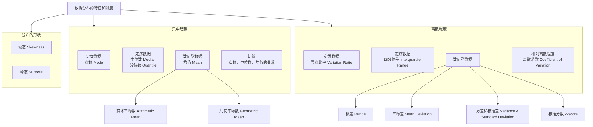

```mermaid
graph TD
    A[数据分布的特征和测度] --> B[集中趋势 Central Tendency]
    A --> C[离散程度 Dispersion]
    A --> D[分布的形状 Shape]

    subgraph B[集中趋势]
        B1[定类数据<br>众数 Mode]
        B2[定序数据<br>中位数 Median<br>分位数 Quantile]
        B3[数值型数据<br>均值 Mean]
        B4[比较<br>众数、中位数、均值的关系]
    end

    B3 --> B3a[算术平均数 Arithmetic Mean]
    B3 --> B3b[几何平均数 Geometric Mean]

    subgraph C[离散程度]
        C1[定类数据<br>异众比率 Variation Ratio]
        C2[定序数据<br>四分位差 Interquartile Range]
        C3[数值型数据]
        C4[相对离散程度<br>离散系数 Coefficient of Variation]
    end

    C3 --> C3a[极差 Range]
    C3 --> C3b[平均差 Mean Deviation]
    C3 --> C3c[方差和标准差 Variance & Standard Deviation]
    C3 --> C3d[标准分数 Z-score]

    subgraph D[分布的形状]
        D1[偏态 Skewness]
        D2[峰态 Kurtosis]
    end
```