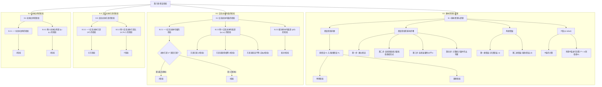

```mermaid
graph TD;
    A[第八章 假设检验] --> B[8.1 基本思想与逻辑];
    A --> C[8.2 正态总体均值的检验];
    A --> D[8.3 正态总体方差的检验];
    A --> E[8.4 总体比例的检验];

    subgraph 8.1 基本思想与逻辑
        B --> B1[假设检验问题];
        B1 --> B1_1[原假设 H₀ 与 备择假设 H₁];
        B1_1 --> B1_1_1[单侧检验];
        B1_1 --> B1_1_2[双侧检验];
        B --> B2[假设检验的基本步骤];
        B2 --> B2_1[第一步: 建立假设];
        B2 --> B2_2[第二步: 选择检验统计量和拒绝域形式];
        B2 --> B2_3[第三步: 选择显著性水平 α];
        B2 --> B2_4[第四步: 计算统计量并作出判断];
        B --> B3[两类错误];
        B3 --> B3_1["第一类错误 (弃真错误, α)"];
        B3 --> B3_2["第二类错误 (取伪错误, β)"];
        B --> B4["P值 (p-value)"];
        B4 --> B4_1[P值的计算];
        B4 --> B4_2["利用P值进行决策: P < α 则拒绝H₀"];
    end

    subgraph 8.2 正态总体均值的检验
        C --> C1[8.2.1 一个正态总体均值的检验];
        C1 --> C1_1{"总体方差 σ² 是否已知?"};
        C1_1 --"是 (或大样本)"--> C1_1_1[Z检验];
        C1_1 --"否 (小样本)"--> C1_1_2[t检验];

        C --> C2["8.2.2 两个正态总体均值差 (μ₁-μ₂) 的检验"];
        C2 --> C2_1["方差已知 (Z检验)"];
        C2 --> C2_2["方差未知但相等 (t检验)"];
        C2 --> C2_3["方差未知且不等 (近似t检验)"];

        C --> C3["8.2.3 配对样本均值差 (μD) 的检验"];
        C3 --> C3_1[配对t检验];
    end

    subgraph 8.3 正态总体方差的检验
        D --> D1["8.3.1 一个正态总体方差 (σ²) 的检验"];
        D1 --> D1_1[卡方检验];
        D --> D2["8.3.2 两个正态总体方差比 (σ₁²/σ₂²) 的检验"];
        D2 --> D2_1[F检验];
    end

    subgraph 8.4 总体比例的检验
        E --> E1[8.4.1 一个总体比例的检验];
        E1 --> E1_1[Z检验];
        E --> E2["8.4.2 两个总体比例差 (p₁-p₂) 的检验"];
        E2 --> E2_1[Z检验];
    end
```

