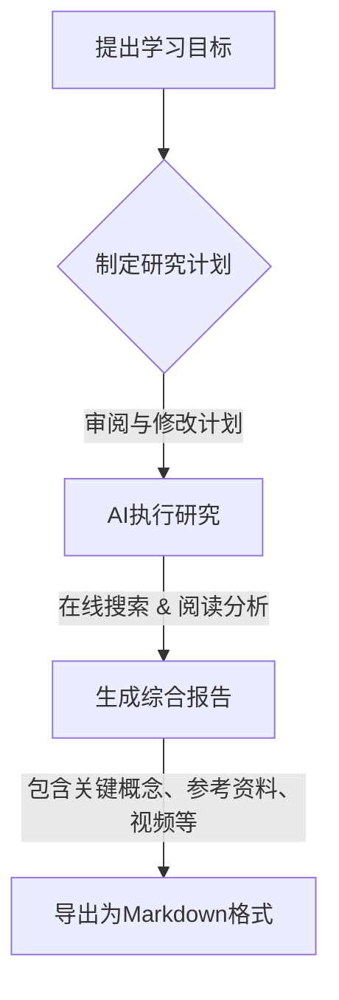
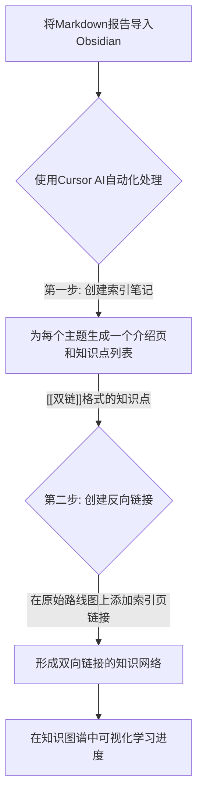

## 0.1 总结
**第一步：提出你的问题**
打开Google Gemini（你需要能够访问谷歌相关服务），在对话框里输入一个精心设计的**提示（Prompt）**。这个提示词非常关键，它决定了AI助理的工作质量。
> 提示词模板：
> 
> "如果我想学习[你的学习主题]，请为我创建一个学习路线图。这个路线图应该从最基础的概念开始，一直到[你的最终目标]。"


在Cursor中，打开你的Obsidian仓库文件夹。选中刚刚导入的路线图文件，然后对AI说出你的指令。
> 提示词模板（第一步）：
> 
> "这是一个学习路线图报告。我需要你做以下步骤：
> 
> 1. 基于这个学习路线图，为每个大的主题章节（比如 'Introduction to Large Language Models'）创建一个新的Markdown文件。
>     
> 2. 在每个新创建的主题文件中，写一段简短的介绍，然后列出该主题下所有的关键知识点。
>     
> 3. **重要**：每个知识点标题都应该用`[[双层方括号]]`括起来。"
>     
**示例（视频中使用的提示）**：

**第二步：创建反向链接 (Create Backlinks)**
现在，我们有了“索引页”，但原始的“路线图”还不知道这些新页面的存在。我们需要在路线图上，也加上指向这些新索引页的链接，形成**双向链接**。
继续在Cursor里，对AI说：
> 提示词模板（第二步）：
> 
> "在原始的路线图文件里，在你刚刚为之创建了新文件的每个主题标题下面，添加一个指向那个新文件的链接。记住，也要使用[[双层方括号]]来引用文件名。"


# 1 💎 Obsidian x Gemini：从零到大师的终极学习指南
你好，未来的学习大师！欢迎来到这个为你量身打造的学习指南。我们将一起揭开“更快学习任何事物”的秘密。这个方法的核心是让两个强大的工具为你服务：
1. **Google Gemini**: 一个超级聪明的AI研究助理，能帮你瞬间读完网上成千上万的资料，并整理出精华。
2. **Obsidian**: 一个功能强大的本地笔记软件，就像你的第二大脑，帮你连接所有知识点，形成你自己的知识网络。
通过本指南，你将学会如何将这两者结合，把过去需要几周甚至几个月的研究学习过程，缩短到几十分钟。准备好了吗？让我们开始这趟神奇的知识之旅吧！
## 1.1 第一部分：使用Google Gemini进行深度研究 (AI帮你“读书”)
### 1.1.1 知识框架速览
首先，让我们看看第一部分“AI帮你读书”的整体流程是什么样的。

**一句话精髓概括**：这部分就像是你雇佣了一个超级聪明的机器人研究员，你只需要告诉它你想学什么，它就会帮你阅读全世界的资料，然后写一份完美的、图文并茂的学习报告给你。
### 1.1.2 什么是Gemini的“深度研究”？
在开始操作前，我们得先明白这个工具为什么这么厉害。
- **给8岁小朋友听**：想象一下，你想知道“恐龙是怎么灭绝的”。
    - **普通搜索（像Google）**：会给你一大堆关于恐龙的网站链接，像给了你一堆书，让你自己去看。
    - **AI搜索（像Perplexity）**：会帮你翻看这些书，然后告诉你一个大概的答案。
    - **Gemini深度研究**：它更厉害！它会先想：“要回答好这个问题，我应该先查查恐龙生活的时代，再查查当时地球发生了什么，然后看看科学家们都有哪些猜测，最后把这些信息整理成一个完整的故事。” 它会先列一个计划，问你满不满意，然后才去执行。它就像一个真正的研究专家。
- **大师级对比总结**：

|   |   |   |   |
|---|---|---|---|
|**工具类型**|**工作方式**|**优点**|**缺点**|
|**传统搜索引擎 (Google)**|提供相关网页链接列表|信息源广泛，自主性强|需要自己筛选、阅读、整合，耗时耗力|
|**AI搜索引擎 (Perplexity)**|阅读网页并生成一个综合答案|直接给出答案，节省初步阅读时间|答案可能不够深入，信息来源有时不清晰|
|**Gemini深度研究 (Deep Research)**|**先制定研究计划**，再执行，并生成详细报告|结构化、系统化、深入，报告质量高，来源可靠|需要几分钟生成报告，不适合快速查找简单问题|
**核心来源**：这个功能的本质是一个“AI代理（AI Agent）”。它不是简单地执行一个指令，而是模仿人类专家的工作流程：**理解任务 -> 拆解任务（制定计划） -> 执行子任务 -> 整合结果 -> 交付报告**。这是目前AI领域一个非常前沿和强大的技术方向。
### 1.1.3 实战操作：让Gemini为你创建学习路线图
现在，让我们跟着视频里的例子，一步步操作。假设我们要学习“什么是大语言模型（LLM）以及如何用它来构建AI应用”。
**第一步：提出你的问题**
打开Google Gemini（你需要能够访问谷歌相关服务），在对话框里输入一个精心设计的**提示（Prompt）**。这个提示词非常关键，它决定了AI助理的工作质量。
> 提示词模板：
> 
> "如果我想学习[你的学习主题]，请为我创建一个学习路线图。这个路线图应该从最基础的概念开始，一直到[你的最终目标]。"
**示例（视频中使用的提示）**：
```
如果我想学习什么是大语言模型，以及如何使用大语言模型构建AI应用程序，请为我创建一个学习路线图。
```
**第二步：审查和修改计划**
提交提示后，Gemini不会立刻开始搜索。它会首先为你生成一个**研究计划**。
例如，它可能会列出这样的计划：
1. 查找“大语言模型”的基本定义和历史。
2. 研究大语言模型的核心技术原理。
3. 探索如何使用API来调用大语言模型。
4. 收集构建AI应用的实际案例和教程。
5. ...
这时，你可以像视频中那样，**编辑这个计划**，加入你更感兴趣的点。比如，你可以添加：“查找关于埃隆·马斯克的星际飞船愿景的信息”。这给了你主导研究方向的权力。
**第三步：启动研究并获取报告**
当你对计划满意后，点击“开始”。Gemini就会像不知疲倦的助理一样，开始在互联网上为你工作。它会阅读几十甚至上百页的资料，包括学术文章、新闻报道、官方文档、甚至是YouTube视频。
几分钟后，你会得到一份非常详尽的报告。这份报告的特点是：
- **结构清晰**：分章节、分主题，逻辑性很强。
- **内容丰富**：不仅有文字解释，还可能包含图片、图表和视频链接。
- **来源可靠**：所有信息都会标注来源，比如维基百科、官方网站、NASA报告等，避免了AI胡编乱造的问题。
**第四步：导出为Markdown格式**
这是连接到我们“第二大脑”Obsidian的关键一步。在报告页面的右上角，找到导出选项，选择 **“以Markdown格式下载”**。

## 1.2 第二部分：在Obsidian中构建你的知识图谱 (AI帮你“建大脑”)
### 1.2.1 知识框架速览
我们已经有了原材料，现在要开始搭建我们自己的知识宫殿了。

**一句话精髓概括**：这部分是让另一个AI工具（Cursor）像一个图书管理员，帮你把之前得到的报告拆成一张张知识卡片，并把它们全部用线串联起来，方便你随时查找和学习。
### 1.2.2 为什么是Obsidian？
在开始之前，我们先理解为什么选择Obsidian作为我们的“第二大脑”。
- **给8岁小朋友听**：想象一下你的大脑，当你想起“苹果”，你可能会同时想到“红色”、“水果”、“手机”等等。你的大脑里，知识点是像一张网一样连在一起的。Obsidian就是模仿你的大脑，它让你写的每一条笔记（比如“什么是Transformer架构”）都能轻松地和另一条笔记（比如“什么是Attention机制”）连接起来。当你连接的笔记越来越多，你就会拥有一张属于你自己的、独一无二的“知识地图”。
- **核心理念来源**：这个方法论源自**《卡片笔记写作法》（How to Take Smart Notes）**，也叫**Zettelkasten**。它的核心思想是：
    1. **原子化笔记**：每张卡片只记录一个核心概念。
    2. **建立连接**：将新卡片与已有的相关卡片连接起来。
    3. **自下而上生长**：知识网络会随着你记录的增多而自然生长，而不是预先设定一个僵化的框架。
- **大师级对比总结**：

|   |   |   |   |
|---|---|---|---|
|**笔记方法**|**结构**|**优点**|**缺点**|
|**传统线性笔记 (如Word, Google Docs)**|自上而下的文件夹/文档结构|结构清晰，易于上手|知识点隔离，难以发现联系，不灵活|
|**思维导图 (MindManager, XMind)**|树状放射结构|视觉化，利于头脑风暴|过于复杂后难以维护，不适合记录大量文本|
|**卡片盒笔记法 (Obsidian, Roam Research)**|**网状结构**|**促进思考，发现意外联系，知识网络会自我生长**|需要一定的学习成本来理解其理念|
### 1.2.3 实战操作：用Cursor AI自动化构建知识图谱
手动把一份长长的报告拆分成几百张卡片笔记太慢了！视频中介绍了一个神器 **Cursor** 来自动化这个过程。
> 什么是Cursor?
> 
> 给8岁小朋友听：你可以把它想象成一个内置了AI助手的文本编辑器。你可以在里面打开你的Obsidian笔记文件夹，然后直接用聊天的方式，让AI帮你修改文件、创建新文件。
**准备工作：**
1. 在电脑上安装 [Obsidian](https://obsidian.md/ "null") 和 [Cursor](https://cursor.sh/ "null")。
2. 在Obsidian中创建一个新的“仓库”（Vault），这就是你存放笔记的文件夹。
3. 将之前从Gemini下载的`.md`路线图文件，拖到这个文件夹里。
**第一步：创建索引笔记 (Create Index Notes)**
在Cursor中，打开你的Obsidian仓库文件夹。选中刚刚导入的路线图文件，然后对AI说出你的指令。
> 提示词模板（第一步）：
> 
> "这是一个学习路线图报告。我需要你做以下步骤：
> 
> 1. 基于这个学习路线图，为每个大的主题章节（比如 'Introduction to Large Language Models'）创建一个新的Markdown文件。
>     
> 2. 在每个新创建的主题文件中，写一段简短的介绍，然后列出该主题下所有的关键知识点。
>     
> 3. **重要**：每个知识点标题都应该用`[[双层方括号]]`括起来。"
>     
**示例（视频中使用的提示）**：
```
这是一个学习路线图报告，我需要你做以下步骤，基于学习路线图，为每个主题创建markdown文件列表，对于每个主题文件，写一个介绍和一个知识点列表，每个知识点标题应该用双方括号书写。
```
为什么用[[双层方括号]]?
这是Obsidian的核心魔法！在Obsidian里，给文字加上[[和]]，它就会自动变成一个指向另一篇笔记的链接。如果那篇笔记还不存在，点击它就会自动创建。这就是我们连接知识点的方式。
AI执行后，你会看到你的文件夹里多了很多新的`.md`文件，每个文件都对应路线图里的一个章节，并且里面充满了`[[知识点链接]]`。
**第二步：创建反向链接 (Create Backlinks)**
现在，我们有了“索引页”，但原始的“路线图”还不知道这些新页面的存在。我们需要在路线图上，也加上指向这些新索引页的链接，形成**双向链接**。
继续在Cursor里，对AI说：
> 提示词模板（第二步）：
> 
> "在原始的路线图文件里，在你刚刚为之创建了新文件的每个主题标题下面，添加一个指向那个新文件的链接。记住，也要使用[[双层方括号]]来引用文件名。"
**示例（视频中使用的提示）**：
```
在路线图文件下添加你创建的文件名列表，放在每个主题下，相关，记住，使用双括号引用文件名。
```
AI执行后，你的原始路线图文件就被更新了。现在，你可以从路线图轻松跳转到任何一个主题的索引页，也可以从索引页轻松跳回路线图。
### 1.2.4 见证奇迹：你的个人知识图谱
完成以上所有步骤后，回到Obsidian。点击左侧边栏的“关系图谱”（Graph view）按钮。
你会看到一个由点和线组成的星空图。
- **每一个点**：代表一篇你的笔记（一个知识点）。
- **每一条线**：代表笔记之间的链接。
这就是你的个人知识图谱！它不再是一份静态的文档，而是一个活生生的、可以交互的知识网络。
**如何使用它学习？**
1. **从路线图开始**：打开你的路线图，它就像教科书的目录。
2. **点击进入章节**：点击一个你感兴趣的章节链接，比如 `[[大语言模型简介]]`。
3. **学习原子概念**：在索引页中，点击一个你想学习的知识点，比如 `[[Transformer模型]]`。Obsidian会自动为你创建一个空白笔记。
4. **撰写你的笔记**：在这个新页面里，用你自己的话写下你对“Transformer模型”的理解。你可以看Gemini报告里提供的参考文章和视频来学习。
5. **不断重复**：每完成一个知识点的学习，图谱上对应的那个点就会变得更“真实”。你可以清晰地看到自己的学习进度，哪些已经学了，哪些还是空白。
## 1.3 总结：新时代的学习范式
我们刚刚一起走过的这个流程，本质上是学习方式的一次革命。
传统学习流程 (耗时：数天 ~ 数周)
自己找资料 -> 自己读资料 -> 自己整理笔记 -> 自己构建联系 -> 缓慢学习
AI辅助学习流程 (耗时：~30分钟)
提出目标 -> AI生成高质量学习材料 -> AI自动化构建笔记框架 -> 你专注于核心的理解和内化 -> 极速学习
你把所有重复、繁琐、耗时的体力劳动都外包给了AI，而你，作为学习的主人，只需要专注于最高价值的脑力活动：**思考、理解、创造和连接**。
希望这份超详细的指南能帮你推开新世界的大门。现在，就去选择一个你一直想学却望而却步的主题，亲手尝试一下这个神奇的工作流吧！你的知识宇宙，正等待着你去创造。