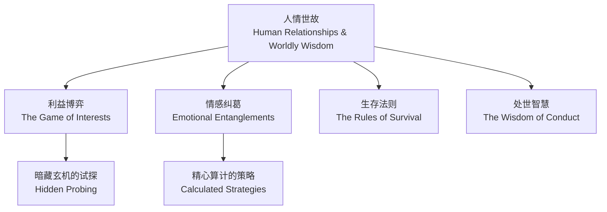
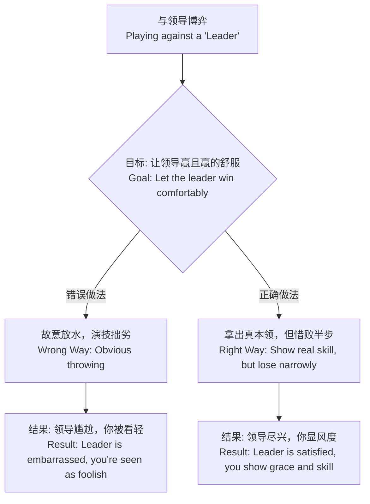
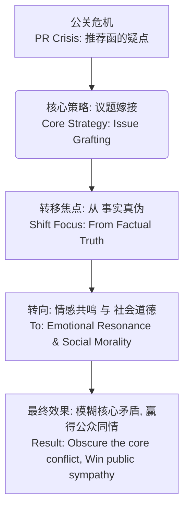

# 1 《青瓷》人情世故深度解析 (Obsidian 精排版)
你好！欢迎来到今天的学习。我们将一起探索《青瓷》这部剧中蕴含的深刻社会智慧。你可以把“人情世故”想象成一个复杂但有趣的游戏，我们今天的目标就是弄懂这个游戏的规则，让你从“小白”变成“高手”。
## 1.1 模块一：什么是“人情世故”？(游戏世界观)
在我们开始分析具体案例之前，首先要明白我们到底在聊什么。
### 1.1.1 知识框架：人情世故的核心构成
我们可以用一个简单的图来理解“人情世故”这个游戏世界的构成：

### 1.1.2 精髓概括（一句话）
**所谓“人情世故”，就是在规则之下，看懂人心、办成事情的智慧。**
### 1.1.3 零基础入门（给8岁小朋友的解释）
想象一下，你在和朋友们一起玩搭积木的游戏。
- **明面上的规则**：是把积木搭得更高。
- **“人情世故”的规则**：是你不但要让自己的积木很高，还要让你最好的朋友（比如颜若水这样的“大朋友”）也玩得开心。你不能直接把最好的积木都给他，那样他会觉得没意思，像你在让着他。你应该自己努力搭，同时巧妙地让他拿到一些关键的积木，最后他搭得比你高一点点，他会觉得是靠自己赢的，特别有成就感。你们俩都玩得很开心，下次还愿意一起玩。
剧中的张仲平，就是这样一个既会搭积木，又会让别人玩得开心的顶级玩家。
## 1.2 模块二：博弈的艺术——如何“输”得漂亮？
这是“人情世故”游戏中的第一关，也是非常重要的一关。
### 1.2.1 案例分析：张仲平 VS 颜若水（下棋）
视频开头，张仲平和颜若水下棋。张仲平输了，但他输得恰到好处。
#### 1.2.1.1 知识框架：如何与“领导”博弈

#### 1.2.1.2 精髓概括（一句话）
**真正的“会办事”，不是简单的顺从，而是让对方在你的“安排”下，体面地达成他的目的。**
#### 1.2.1.3 零基础入门（给8岁小朋友的解释）
这就像你和爸爸下棋。如果你第一步就乱走，让他轻松吃掉你的“帅”，爸爸会觉得很无聊，觉得你在敷衍他。
正确的做法是：你要很努力地思考，跟他杀得“难解难分”，甚至把他逼出一头汗，最后因为一个“小失误”输给了他。然后你还要不服气地说：“哎呀，就差一点点！下次我肯定能赢！”
你看，这样一来，爸爸会觉得他棋艺高超，赢得酣畅淋漓，同时还会夸你“棋艺进步真快”，你俩都高兴。张仲平就是这么做的，他满头大汗，输了棋还开玩笑说：“您赢得也不算轻松嘛”。
#### 1.2.1.4 “大师”公式与心法
这里面蕴含着一个非常重要的社交公式：
> 表面上的全力以赴+关键时刻的“大意失荆州”=一次完美的“失败”
**核心心法**：**端正态度，摆正心态。** 你的态度必须是“我要赢”，但你的心态必须是“我要让他赢”。
## 1.3 模块三：人脉的本质——“圈子”的搭建与维护
这是游戏的进阶关卡：如何组建和运用自己的力量。
### 1.3.1 案例分析：徐艺与他的检察院同学 & 景区经理的故事
徐艺能联系上检察院的同学，说明他有人脉。但视频中那个“景区经理”的例子，才真正讲透了人脉的本质。
#### 1.3.1.1 知识框架：如何打造社交圈
```mermaid
graph TD;
    A[组建人脉圈子<br>Building a Social Network] --> B{三大核心能力<br>Three Core Abilities};
    B --> C[人情世故<br>Understanding Social Rules];
    B --> D[真诚<br>Sincerity];
    B --> E[基本素质<br>Basic Qualities (Speech, Character)];
```
#### 1.3.1.2 精髓概括（一句话）
**真正的人脉关系，本质是一种价值交换，你必须先思考自己能给予什么，而不是索取什么。**
#### 1.3.1.3 零基础入门（给8岁小朋友的解释）
交朋友就像往一个公共的储钱罐里放糖果。你不能总想着从里面拿糖吃，也要记得经常往里面放糖。如果你放的糖又多又好吃，别的小朋友就都喜欢跟你玩，也愿意把他们的糖跟你分享。如果你只拿不放，很快储钱罐空了，就没人跟你玩了。
“真诚”就是你放进去的糖是真的糖，而不是一块石头。“人情世故”就是你知道什么时候该放糖，该放什么样的糖。
#### 1.3.1.4 “大师”公式与心法：景区经理案例全解析
这个例子是理解“人情往来”的最佳教材。
**场景**：你要带一家老小（6个人）去你朋友（景区经理）那里旅游。
**错误的做法（只索取，不付出）**：
1. 不提前买票，不打招呼就直接去。
2. 到了之后，给朋友打电话，让他“安排一下”。
3. 把“让你朋友办妥”当成理所当然。
> **后果**：你让朋友非常为难。他帮你，是违反规定；不帮你，又伤了感情。你把难题甩给了他。
**正确的做法（先付出，后看对方意愿）**：
4. **提前买好所有人的票**。
5. 到了之后，老老实实去排队。
6. 排队时给朋友发个消息：“我到了，正排队呢，你忙你的，不用管我。”
> **分析**：你把选择权完全交给了朋友。他如果方便，自然会来帮你，比如带你走特殊通道。如果他不方便，你也没有给他任何压力。这叫“进退自如”。
**人情往来的“数学公式”**：
如果你朋友最后帮你免了票（价值 600 元），你该怎么做？
> 收到的便利价值≈回馈的礼物价值
> 
> 比如说，你在离开时，送给他价值相当（比如 600 元左右）的好酒或土特产。
**核心心法**：**不要凭着感情去索取，而要看凭着感情，他能主动提供什么。** 这句话一定要背下来，是人际关系的精髓。
## 1.4 模块四：语言的力量——如何用话语重塑现实？
这是游戏的高级关卡，也是最有威力的一关：操控语言。
### 1.4.1 案例分析：张仲平的“电视演讲”
张仲平为了让有“污点”的推荐函变得合理，进行了一场堪称教科书级别的公关演讲。
#### 1.4.1.1 知识框架：危机公关的语言艺术

#### 1.4.1.2 精髓概括（一句话）
**最高明的沟通，不是解释事实，而是赋予事实一个令人无法拒绝的意义。**
#### 1.4.1.3 零基础入门（给8岁小朋友的解释）
假设你不小心打碎了妈妈最喜欢的花瓶（这是**事实**）。
- **糟糕的应对**：撒谎说“不是我干的”或者找借口“是小猫碰倒的”。
- **张仲平式的应对**：你哭着对妈妈说：“妈妈对不起！我打碎了花瓶。我刚才看到花瓶上有灰尘，想把它擦干净让你开心，结果手一滑……我知道这个花瓶对你很重要，我真的很难过。”
你看，你没有否认事实，但是你把“打碎花瓶”这个行为，从一个“错误”变成了一个“好心办了坏事”的故事。妈妈的注意力就会从“破碎的花瓶”转移到“你爱妈妈的这份心意”上，很可能就不忍心再责备你了。
#### 1.4.1.4 “大师”公式与心法
张仲平的演讲完美运用了“**议题嫁接**”这一高级技巧。
> 议题嫁接=（事实+崇高的动机+情感故事）>事实本身
**演讲逻辑拆解**：
1. **定义事实**：承认推荐函存在，但立刻把它和死者左达联系起来。
2. **嫁接动机**：这不是一桩生意，而是“一个死者对生者的恳求”，“一个忏悔者最后的自我救赎”。
3. **注入情感**：把 500 万的欠款，具体化为 200 多个家庭、孩子的学费、老人的医药费、妻子的一件新衣。这让冰冷的数字充满了温度和画面感，引发所有人的共情。
4. **重塑责任**：最后，他把推荐函从一张“可能有问题的纸”，升华为一份沉甸甸的“责任”。
对比总结：
视频中提到了很多电影，比如《独立日》总统演讲、《华尔街之狼》的动员，都是利用语言激发情感，从而让听众忽略事实、逻辑，跟随演讲者的意图行动。这说明，语言在很多时候，是比事实更强大的武器。
## 1.5 模块五：权力的游戏——“踢皮球”的艺术
最后一关，我们来看看体制内的生存智慧。
### 1.5.1 案例分析：颜若水 VS 鲁冰（电话沟通）
面对胜利大厦这个“烫手山芋”，两位“老狐狸”上演了一场精彩的“踢皮球”大戏。
#### 1.5.1.1 知识框架：责任的推诿
```mermaid
graph TD;
    A[烫手山芋: 拍卖决策<br>Hot Potato: Auction Decision] --> B{双方目标: 都不想担责<br>Goal for Both: Avoid Responsibility};
    B -- 颜若水 (官员) --> C["踢皮球"给鲁冰(法院)<br>"Kick the ball" to Lu Bing];
    B -- 鲁冰 (法院) --> D["踢皮球"回给颜若水<br>"Kick the ball" back to Yan];
    C -- 用“你说呢?”试探 --> D;
    D -- 用“你说呢?”回敬 --> C;
    E[最终结果: 权力更大者(颜)做出决定<br>Final Result: The more powerful one (Yan) decides];
```
#### 1.5.1.2 精髓概括（一句话）
**在复杂的体系中，很多时候，不做决定比做错误的决定更安全。**
#### 1.5.1.3 零基础入门（给8岁小朋友的解释）
老师问：“是谁把教室的玻璃打碎了？” 你和你的同桌互相指着对方说：“是他！” 这就是“踢皮球”。因为谁承认了，谁就要负责任（比如赔钱、写检讨）。
颜若水和鲁冰就像这两个小孩，他们都不想为“是否按推荐函办事”这个决定负责，因为万一以后出事了，谁做的决定谁就要倒霉。所以他们都对对方说“你说呢？”，意思就是“你来做决定，你来负责任”。
#### 1.5.1.4 “大师”公式与心法
这里体现了体制内一个常见的“**缓兵之计**”，也叫“**拖字诀**”。
> **核心逻辑**：当一件事有风险时，通过把决策流程变得复杂（比如从推荐函快捷方式变成公开竞标），或者把决策权推给对方，来为自己规避责任。
最终，因为颜若水的行政权力更大，鲁冰成功地把“皮球”踢了回去，逼得颜若水不得不做出“走竞争机制”的决定。
### 1.5.2 **总结：从“小白”到“大师”**
通过对《青瓷》这些经典片段的拆解，我们学习了从个人博弈、人脉搭建，到语言操控、体制生存的四大核心智慧。
1. **漂亮的输**：是一种姿态，更是一种智慧。
2. **人脉的本质**：是价值的相互给予，而非单向索取。
3. **语言的力量**：能重塑现实，改变人心。
4. **权力的游戏**：核心是规避风险，而非解决问题。
希望这次的深度解析能为你打开一扇新的窗户，让你在未来的生活和工作中，更能看懂局、读懂人，游刃有余。记住，多观察、多思考，你也能成为真正的“人情世故”高手。