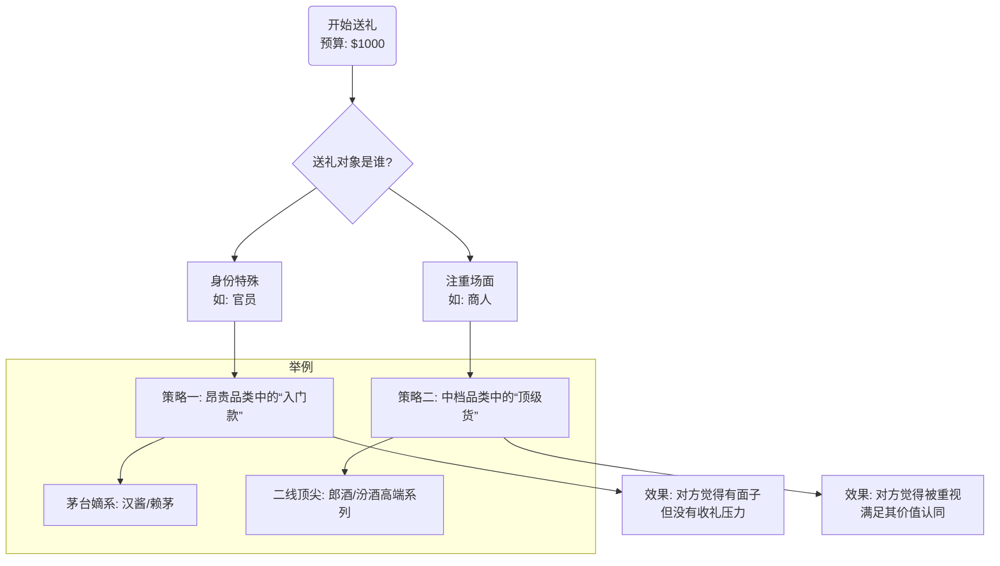
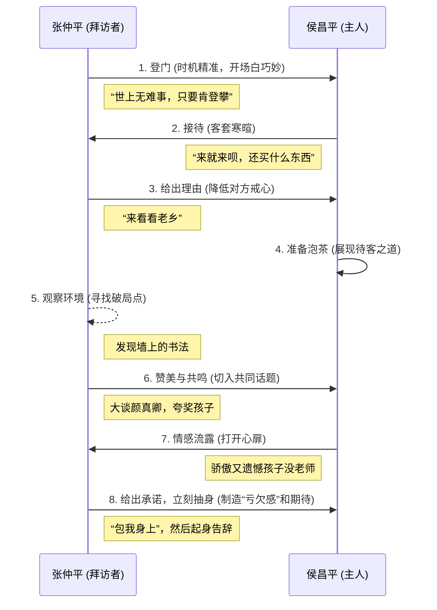

# 1 「送礼的艺术」- 《青瓷》深度解析 (Obsidian 小白精讲版)
你好！欢迎来到这堂关于“送礼的艺术”的深度解析课。我们将以视频《“送礼得学啊”精讲【青瓷P4】》的内容为核心，从零开始，一步步带你掌握其中蕴含的复杂人情世故和社交智慧。
这份笔记是为你量身定制的，特点如下：
- **Obsidian 优先**：所有格式都为 Obsidian 设计，特别是 `Mermaid` 图表，复制代码即可直接使用。
- **零基础友好**：我会把所有概念都拆解得像给8岁小朋友讲故事一样，让你轻松理解。
- **框架先行**：每个部分开始前，我们都会先用一个知识框架（通常是`Mermaid`图）来帮你建立整体概念。
- **细节致胜**：我们会深挖每一个细节，解释每一句“话术”背后的逻辑和心理学原理。
- **精髓概括**：每个模块都会有一句总结，帮你瞬间抓住核心思想。
现在，让我们开始吧！
## 1.1 模块一：送礼的核心总纲
在开始学习具体技巧前，我们首先要建立一个顶层认知。送礼的本质不是花钱，而是一门关于“**心理账户**”的学问。
### 1.1.1 知识框架 (Mermaid 图)
这是一个决策流程图，展示了送礼最核心的两种策略。

### 1.1.2 核心原理解析
**一句话精髓**：**送礼的终极目标，是在对方的心里，让你的礼物显得“最值”，而不是在发票上价格最高。**
给小朋友的解释：
想象一下，你有两种方法可以送给朋友一个玩具：
1. 送一个世界顶级玩具品牌（比如乐高）里，一个最小最便宜的入门套装。
2. 送一个普通玩具品牌里，最大最酷炫的旗舰套装。
这两种送法，给朋友的感觉是完全不一样的。第一种让他觉得“哇，是乐高！”，第二种让他觉得“哇，这个玩具好厉害！”。送礼，就是根据朋友的性格，来选择哪种“哇！”。
深度解析：
这个原则基于一个心理学概念叫做“心理账户（Mental Accounting）”。人们会在心里对不同类别的东西进行划分和估价。
- **“昂贵品类里的便宜货”**：比如茅台（昂贵品类）下面的汉酱（相对便宜）。接收者首先会被“茅台”这个品牌光环所震撼，心理估价瞬间被拉高。你的解释“这是入门款，不贵”则完美地帮他解决了“收贵重礼物”的心理负担。面子是品牌给的，里子（实际价格不高）让你和他都不尴尬。
- **“不太昂贵的品类里挑顶尖价格的”**：比如郎酒（相比茅台，属二线品类）里的高端系列。这满足了另一类人“要就要最好”的心理。你送的是这个品类里的“王者”，直接肯定了对方的地位和品味，让他感受到极大的尊重和认同。
### 1.1.3 对比总结
|   |   |   |
|---|---|---|
|**特征**|**策略一 (对官员)**|**策略二 (对商人)**|
|**品类选择**|顶级品牌|中档或二线品牌|
|**产品选择**|入门款/基础款|旗舰款/顶级款|
|**核心心理**|规避风险，追求“中庸”|彰显实力，追求“极限”|
|**话术要点**|强调“不贵”、“入门”|强调“顶尖”、“最适合你”|
|**最终效果**|有面子，无压力|被认同，有地位|
## 1.2 模块二：教科书式案例分析 - 张仲平拜访侯昌平
视频中的核心剧情，是张仲平拜访侯昌平的整个过程。这短短的几分钟，堪称一部完美的送礼与人际交往的微电影。我们把它拆解成8个步骤来看。
### 1.2.1 知识框架 (Mermaid 图)

### 1.2.2 步骤详解
#### 1.2.2.1 **步骤1：登门的话术与时机**
- **原文金句**：“世上无难事，只要肯登攀呐。”
- **一句话精髓**：**用一句宏大叙事的玩笑话，既化解了初见的尴尬，又暗示了自己前来的不易，让对方无法拒绝。**
- **细节解析**：
    1. **一语双关**：字面意思是引用伟人名言，显得有文化、有格局。深层意思是“我提着这箱酒爬楼上来，可真不容易”，把送礼这个行为变得轻松幽默。
    2. **时机选择**：选择在晚饭后（`7点`后）、休息前（`9点`前）。这个时间点，主人家不忙乱，不会因为要不要留你吃饭而尴尬。这是为对方着想的顶级体现。
#### 1.2.2.2 **步骤2：给自己找一个“台阶”**
- **原文金句**：“上回咱俩不都论得老乡了吗？我来看看老乡啊。”
- **一句话精髓**：**永远不要暴露你拜访的真实目的，一个轻描淡写的理由是最好的保护色。**
- **细节解析**：张仲平预演过所有可能被问到的问题。“看老乡”这个理由，合情合理，无法反驳，瞬间将一次可能带有目的性的拜访，转化为一次纯粹的情感交流，大大降低了侯昌平的防备心。
#### 1.2.2.3 **步骤3：寻找并利用“破局点”**
- **原文金句**：“这字写得很大气呀，它有点颜真卿的风骨啊。”
- **一句话精髓**：**最高级的赞美，是赞美对方最珍视、最引以为傲，但又或许是他软肋的地方。**
- **细节解析**：
    1. **敏锐观察**：在主人去泡茶的短暂间隙，张仲平迅速扫视房间，找到了墙上的字——这是整个家中最显眼的“精神追求”的出口。
    2. **知识储备**：他没有说“这字真好看”这种空洞的话，而是直接点出“颜真卿”、“太子太师”、“篆书融入楷书”，展现了自己深厚的学识。这让他的赞美变得极具分量和可信度。
    3. **击中要害**：他夸的不是侯昌平，而是侯昌平的儿子。对于一个父亲来说，没有什么比夸奖自己的孩子更能让他打开心扉的了。
> 如果不懂书法怎么办？
> 
> 视频给出了备用方案。侯昌平说“老婆都不知道什么是好茶”，证明他本人懂茶、爱茶。这就是另一个破局点。可以从“茶”入手，用同样的方式，先学习，再交流。核心是找到对方的“爱好”和“骄傲”。
#### 1.2.2.4 **步骤4：创造“人情债”并抽身而退**
- **原文金句**：“咱们给孩子找一个好的书法老师......包我身上......这时间也不早了，那我就不打搅了。”
- **一句话精髓**：**在对方最需要的时候给出承诺，然后立刻离开，把“期待”的种子种在对方心里。**
- **细节解析**：
    1. **正中下怀**：当侯昌平流露出“请不起老师”的遗憾时，张仲平立刻抓住了这个机会，承诺解决这个“痛点”。
    2. **欲擒故纵**：给出承诺后，他没有继续深入，而是马上起身告辞。这避免了“交易感”，让帮助显得更纯粹。同时，这也把侯昌平从一个被动接受者，变成了主动期待者，他会日夜盼望张仲平兑现承诺。这时，张仲平这个人在他心中的分量就完全不同了。
#### 1.2.2.5 **步骤5：处理礼物的终极话术**
- **一句话精髓**：**消解礼物的商品属性，赋予其“人情”和“不可抗拒”的属性。**
- **细节解析**：面对侯昌平的拒收，张仲平打出了一套组合拳。
    1. **切断价格来源**：“代理商朋友送的”、“内部特供”、“没价”。这就让侯昌平无法用金钱来衡量，也就无法用“给钱”的方式来两清。
    2. **角色转换**：“我拿您的钱，我这不成代理商了吗？”用一个玩笑，避免了正面冲突。
    3. **诉诸情感和体力**：“搬上来不容易沉着呢，我再往下搬，您要累死我呀？”把问题从“该不该收”变成了“你忍不忍心让我再搬下去”，让对方无法拒绝。
    4. **撇清未来诉求**：“您跟我相处时间还不长......我这人，从来不强人所难。”打消对方“收了礼就得办事”的顾虑。
## 1.3 模块三：延伸的社会现实观察
视频后半部分，通过几个次要情节，揭示了更广泛的社会现象。
### 1.3.1 博士导师招生的“潜规则”
- **知识框架**：博士导师只招四种人。
    1. **当官有权的** -> 解决社会关系
    2. **商人企业家** -> 解决买单问题
    3. **年轻漂亮的** -> 解决个人问题（原文中带有讽刺意味）
    4. **真正做学问的** -> 解决衣钵传承
- **一句话精髓**：**在任何看似纯粹的领域，背后都可能存在着资源互换的逻辑。**
- **深度解析**：这段话虽然尖锐，但它揭示了一个道理：在资源稀缺的情况下（如博士名额），竞争不仅仅是学术能力的竞争，更是综合资源的博弈。它提醒我们，要用更立体、更复杂的眼光去看待一些社会身份和关系。
### 1.3.2 “清官”的两种形态：侯昌平 vs. 丛林
- **一句话精髓**：**真正的“生存智慧”，不是要非黑即白，而是在复杂的灰色地带中保持平衡和底线。**
- **对比总结**：

|          |                  |                    |
| -------- | ---------------- | ------------------ |
| **特征**   | **侯昌平 (理想主义清官)** | **丛林 (现实主义清官)**    |
| **行事风格** | 原则性极强，刚正不阿       | 灵活变通，讲究人情往来        |
| **社交方式** | 相对封闭，不收礼         | 懂得利用职务之便还人情        |
| **核心逻辑** | 人情和工作完全切割        | 在不违背大原则下，人情是工作的润滑剂 |
| **剧中结局** | 在基层干到退休          | 有机会获得晋升            |
- **深度解析**：
    - **侯昌平**代表了一种“洁癖式”的清官，值得尊敬，但在现实中难以走得更远。
    - **丛林**则代表了更普遍、也更具生存智慧的官员形象。他嘴上说“所有的事情我都不会帮忙”，但会“无意间”透露关键信息（香水河项目），会帮忙引荐人脉。他守住了“不直接用权力换钱”的底线，但把“人情”和“信息”作为一种资源，在复杂的社会关系网络中游刃有余。
    - **作者的表叔案例**进一步印证了“丛林”式人物的真实性：他们不是贪官，但他们深谙人情世故，懂得如何利用规则和人脉为自己和他人创造价值，同时保持自身的安全。
## 1.4 最终总结
通过对这段视频的深度解构，我们可以得到关于“送礼”乃至“人情世故”的几点核心认知：
1. **价值对等，而非价格对等**：送礼的核心是让对方在心理上感受到对等的价值，甚至超额的价值。
2. **万事皆需预演**：所有看似行云流水的操作，背后都是充足的准备和反复的推演。从拜访时间到可能被问到的问题，都要提前想好。
3. **寻找情感连接点**：单纯的物质交换是低级的，最高级的关系建立，是找到并满足对方的情感需求（如对孩子的骄傲、对个人爱好的痴迷）。
4. **创造“亏欠感”是关系升级的开始**：单向的付出难以持久。通过巧妙地为对方解决一个难题，并让他心怀感激和期待，是建立长期关系的有效途径。
5. **灰色是现实的底色**：世界不是非黑即白的。理解并适应那些“不上台面”但真实存在的规则，是在复杂社会中生存和发展的必修课。
希望这份笔记能为你打开一扇新的窗户，让你更好地理解这个复杂而又充满智慧的现实世界。