# 1 📋 ch7 Parameter Estimation (第7章 参数估计) 整体结构框架
## 1.1 🗂️ 章节目录与学习路径
### 1.1.1 章节概览
第1节：点估计的概念和评价标准 - 核心主题：如何用一个“点”（具体数值）去猜总体的参数，以及怎么判断这个猜测好不好。
第2节：区间估计的概念 - 核心主题：从猜一个点，升级到猜一个“范围”，并理解这个范围的可信度。
第3节：一个总体参数的区间估计 - 核心主题：学习如何对一个群体的平均值、比例、方差这三个核心指标，给出具体的估计范围。
第4节：两个总体参数的区间估计 - 核心主题：学习如何比较两个群体的平均值、比例、方差，看它们之间有没有差异。
第5节：样本量的确定 - 核心主题：在做调查前，如何科学地决定到底要找多少样本才够用。
### 1.1.2 📊 整体逻辑结构思维导图

```mermaid
graph TD
    A["PPT主题:<br/>第7章 参数估计"] --> B["第1节: 点估计<br/>(用一个数去猜)"]
    A --> C["第2节: 区间估计<br/>(用一个范围去猜)"]
    A --> E["第5节: 样本量确定<br/>(开始前要准备多少样本)"]
    B --> B1["是什么: 估计量与估计值"]
    B --> B2["怎么评判: 无偏性、有效性、一致性"]
    C --> D["第3节: 单总体区间估计<br/>(怎么算一个群体的范围)"]
    C --> F["第4节: 双总体区间估计<br/>(怎么算两个群体的差异范围)"]
    D --> D1["估计均值(μ)"]
    D --> D2["估计比例(π)"]
    D --> D3["估计方差(σ²)"]
    F --> F1["估计均值差(μ1-μ2)"]
    F --> F2["估计比例差(π1-π2)"]
    F --> F3["估计方差比(σ₁²/σ₂²)"]
    B -- 为...提供基础 --> C
    C -- 具体应用 --> D
    D -- 扩展 --> F
    D & F -- 实践前提 --> E
    style A fill:#e1f5fe
    style B fill:#f3e5f5
    style C fill:#e8f5e8
    style D fill:#fff3e0
    style E fill:#fbe9e7
    style F fill:#e0f7fa
```

### 1.1.3 🎯 学习建议顺序
**建议学习顺序**：严格按照 **第1节 → 第2节 → 第3节 → 第4节 → 第5节** 的顺序学习。本章逻辑环环相扣，后面的内容是前面内容的应用和延伸。
**章节重要性**：
- ⭐⭐⭐ **第3节 & 第4节**：考试的绝对核心！几乎所有计算题和应用题都集中在这里。
- ⭐⭐ **第1节 & 第2节**：理论基础，是理解3、4节的关键，选择题和名词解释的常考点。
- ⭐ **第5节**：应用型知识，通常作为选择题或简单计算题出现，理解了公式就不难。
**前置知识要求**：
- 需要基本了解**样本**和**总体**的概念。
- 需要知道什么是**均值**、**方差**、**正态分布**、**t分布**、**卡方分布**和**F分布**。如果对这些不熟，理解本章会有些困难。
### 1.1.4 📝 使用指南
- 请输入 **"第1节"** 来获取该节的详细解析。
- 例如：输入 **"第1节"** 开始学习第一节内容。
### 1.1.5 🧵 整体逻辑主线概括
PPT整体思路：
本章PPT的逻辑就像一个侦探破案的过程。
- **起点问题 (要干什么?)**：我们想知道一个很大群体（比如全国大学生）的某个特征（比如平均月消费），但不可能问每一个人。我们该怎么办？
- **分析过程 (怎么干?)**：
    1. **提出两种“猜”法**：第一种是直接猜一个数，比如“我猜全国大学生平均月消费是1500元”，这就是 **点估计 (第1节)**。但这样猜风险很大，所以我们引入了评判标准（无偏性、有效性），确保我们的猜测方法是靠谱的。
    2. 第二种是猜一个范围，比如“我猜在1200到1800元之间”，这就是 **区间估计 (第2节)**，这种方法更稳妥，因为它包含了一个“置信度”的概念。
    3. **开始“实战演练”**：学会了方法，我们就要应用。先从最简单的开始，对 **一个群体的平均值、比例、方差进行区间估计 (第3节)**。这是整个章节最核心的计算部分。
    4. **处理“复杂案情”**：学会了估计一个群体，我们自然想比较 **两个群体**，比如男生和女生的月消费有没有差别？这就是 **两个总体参数的区间估计 (第4节)**。
- **得出结论 (收尾工作)**：在所有这些“猜”的方法开始之前，有一个最基本的问题：我们到底要抽多少样本，这个“猜”才算数？**第5节 (样本量确定)** 就解决了这个前提问题，告诉我们在不同的精度要求下需要多大的样本量。
**总结一下**：整个PPT从“**提出估计思想**”（点估计 vs 区间估计）出发，到“**学习核心技术**”（一个总体的区间估计），再到“**技术升级**”（两个总体的区间估计），最后回归到“**实践准备**”（样本量确定），形成了一个从理论到实践、从简单到复杂的完整知识闭环。
现在，你可以输入 **"第1节"**，我会为你提供该节的详细解析。