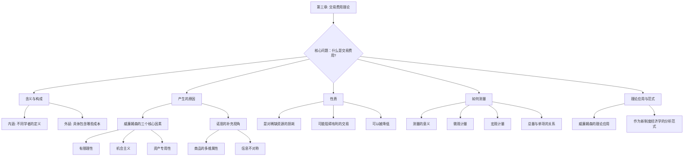

# 1 第三章 交易费用理论 (全面升级版)
你好！欢迎来到制度经济学的核心腹地。在上一章我们知道了“制度”就像是游戏的规则，它决定了我们怎么玩。那我们为什么要制定规则呢？一个核心的答案就是为了**降低交易费用**。如果搞不懂交易费用，就无法真正理解制度经济学。所以，这一章是我们的重中之重！
## 1.1 知识框架概览 (Mermaid 图)
在我们深入细节之前，再次确认一下本章的知识地图。这能帮助你建立一个整体的认知框架，知道我们正处在哪一个位置，将要走向哪里。

## 1.2 交易费用的含义、性质、产生原因和测量
现在，我们开始对每个知识点进行地毯式地学习和补充。
### 1.2.1 交易费用的含义与构成
#### 1.2.1.1 **一句话精髓**
> **交易费用，就是为了做成一笔生意，除了商品本身价格外，你付出的所有“麻烦”成本。**
#### 1.2.1.2 (1) 交易费用的内涵：群贤毕至的定义
经济学大师们从不同角度给交易费用下了定义，虽然听起来高深，但本质上说的是一回事。我们来看看这个“名人堂”：
- **科斯 (Coase) - 奠基人**：他最早提出这个概念，说交易费用是 **“利用价格机制的成本”**。
    - **来源与解读**：科斯发现，市场这个“价格机制”不是免费的。你要找到那个“价格”，并围绕这个价格达成交易，本身就要花钱。就像上面买苹果的例子，你要发现那个最合适的价格，就需要付出成本。
- **阿罗 (Arrow) - 宏观视角**：他将交易费用定义为 **“经济制度运行费用”**。
    - **来源与解读**：阿罗的视角更广，他把交易费用看作是维持整个经济制度（比如市场、法律、政府）运行的“润滑油”和“维修费”。没有这些费用，整个系统就会卡顿甚至崩溃。
- **威廉姆森 (Williamson) - 集大成者**：他把这个理论发扬光大，说交易费用是 **“经济系统运转所要付出的代价或费用”**。
    - **来源与解读**：他把整个经济看成一个大机器，交易费用就是机器运转时摩擦产生的热量，是一种必然的消耗。
- **诺思 (North) - 历史与契约视角**：他是历史学家，他说交易费用是 **“规定和实施构成交易基础的契约的成本”**。
    - **来源与解读**：诺斯更强调“规则”和“契约”。他认为，交易的核心是签合同（无论是口头的还是书面的），而制定和执行这些合同（规则）是需要成本的。
- **张五常 - 最通俗的视角**：他的定义非常经典，**“所有那些在鲁宾逊经济中不可能存在的成本”**。
    - **来源与解读**：鲁宾逊一个人在荒岛上，自己种地、自己盖房、自己消费，他不需要和任何人交易，所以没有讨价还价、没有监督欺骗。凡是这种只有一个人时不存在，多于一个人（即有社会和交易）时才出现的成本，就是交易费用。
- **埃格特森 (Eggertsson) - 产权视角**：他认为交易费用是 **“个人交换他们对于经济资产的所有权和确立他们的排他性权利的费用。”**
    - **来源与解读**：这位学者强调了交易的本质——产权的交换。你买苹果，实际上是购买了苹果的“所有权”。为了完成这个所有权的转移并确保别人不能再拿走你的苹果，所付出的代价就是交易费用。
核心对比总结

| 学者 | 定义侧重点 | 核心思想 |
| :--- | :--- | :--- |
| 科斯 | 市场机制 | 使用市场本身是有成本的 |
| 威廉姆森| 经济系统 | 交易是经济运转的摩擦和损耗 |
| 诺思 | 契约与规则 | 制定和执行游戏规则需要成本 |
| 张五常 | 社会性 | 只要有交换，就有交易费用 |
| 阿罗 | 制度运行 | 维持经济制度运转的成本 |
| 埃格特森| 产权交换 | 交换和界定产权的成本 |
#### 1.2.1.3 (2) 交易费用的外延：到底包含哪些“麻烦”？
交易费用的外延，就是它具体包括哪些内容。我们可以按照一笔交易从无到有的过程，把它分解成几个阶段：
1. **交易前 (Ex Ante)**
    - **搜寻与信息成本**：寻找交易对象、了解商品信息、比较价格和质量的成本。比如你想租房子，花在中介网站、到处看房的时间和交通费。
    - **谈判与缔约成本**：与交易对手讨价还价、起草和签订合同的成本。比如买卖双方律师的费用、谈判花费的时间和精力。
2. **交易中 (In a transaction)**
    - **监督与执行成本**：监督对方是否按照合同履约，确保商品或服务质量的成本。比如装修时你天天去监工，或者公司派专人去检查供应商产品的质量。
3. **交易后 (Ex Post)**
    - **违约与维权成本**：当一方不履行合同时，另一方为强制其履行或寻求赔偿所付出的成本。比如打官司的诉讼费、律师费和时间成本。
    - **保护成本**：为保护自己的产权不被侵犯而付出的成本。比如给房子装防盗门、给软件加密。
**讲给8岁小朋友听**
> 想象一下，你想用你的一个玩具小汽车，去和朋友小明换他的一个变形金刚。
> 
> - **交易前**：你得先跑去小明家，问他愿不愿意换（搜寻成本），然后你们俩可能会争论半天，说好了一换一，不许反悔，并拉钩上吊（缔约成本）。
>     
> - **交易中**：你得保证小明给你的变形金刚没坏，他也得看看你的小汽车能不能跑（监督成本）。
>     
> - 交易后：万一第二天你发现变形金刚是坏的，你得跑回去找他理论（维权成本）。
>     
>     这些换玩具过程中的所有“跑腿”和“费口舌”的力气，就是交易费用。
>     
### 1.2.2 交易费用产生的原因
为什么会有这些“麻烦”的成本呢？凭什么交易就不能瞬间、零成本地完成？威廉姆森和诺思给了我们答案。
#### 1.2.2.1 **一句话精髓**
> **因为我们不是无所不知的圣人（有限理性），又总想耍点小聪明占便宜（机会主义），而且很多东西一旦投入就很难挪作他用（资产专用性），再加上商品本身很复杂（多维属性）且信息总不对称，所以交易才这么麻烦。**
#### 1.2.2.2 **(1) 威廉姆森的“三驾马车”**
威廉姆森认为，交易费用主要来自三个根深蒂固的人性和现实因素。
1. **有限理性 (Bounded Rationality)**
    - **详细解释**：这个词听起来很玄乎，但意思很简单：我们想做到完全理性，但我们的能力（知识、信息、计算能力）是有限的。我们是“想当超人，但只是凡人”。我们不可能知道关于一笔交易的所有信息，也不可能预见到未来所有可能发生的情况。
    - **如何导致交易费用**：因为我们知道得不全、想不到得那么远，所以我们需要花时间去搜集信息、去预测未来，这就产生了**搜寻成本**和**缔约成本**。合同也因此变得不完美，总有漏洞，为未来的纠纷埋下伏笔。
2. **机会主义 (Opportunism)**
    - **详细解释**：这指的是人们为了自己的利益而采取欺骗、撒谎、误导、违约等“耍小聪明”的行为。
    - **如何导致交易费用**：为了防止别人耍小聪明，你就必须花大力气去监督他们，这就产生了高昂的**监督成本**。万一被骗了，还得花钱去**维权**。
3. **资产专用性 (Asset Specificity)**
    - **详细解释**：指的是一项资产为了某一个特定的交易而投入，一旦这个交易黄了，这项资产很难或者根本无法转作他用，其价值会大幅降低。
    - **如何导致交易费用**：资产专用性越高，被对方“敲竹杠”的风险就越大。为了避免这种风险，就必须要求签订一个非常详细、长期的、带有惩罚条款的复杂合同，来“锁定”对方。谈判和签订这种复杂合同，**缔约成本**和**监督成本**自然就非常高了。
#### 1.2.2.3 **(2) 诺思的补充视角**
诺思从经济史的角度，对交易费用的来源做了更深入的补充，他特别强调了商品本身的特性和信息问题。
1. **商品和服务的多维属性**
    - **详细解释**：任何一个商品或服务，都不是单一维度的，它有很多属性。一个苹果，不仅有重量，还有甜度、脆度、新鲜度、有无农药、产地等无数个维度。我们不可能在交易时把所有属性都测量清楚并写进合同。
    - **如何导致交易费用**：因为属性太多太复杂，测量它们的成本（信息成本）就非常高。买方和卖方往往只关注其中几个主要属性（比如重量和外观），而忽略其他属性。这就为“机会主义”提供了温床——卖家可能在你看不到的属性上做文章（比如用打了蜡的不新鲜苹果冒充新鲜的）。
2. **信息不对称与人的机会主义动机**
    - **详细解释**：基于商品的多维属性，交易双方掌握的信息几乎总是不对称的。卖方通常比买方更了解自己商品的真实情况（比如二手车车主比买家更清楚车况）。
    - **如何导致交易费用**：这种信息上的优势，会诱使掌握信息的一方产生机会主义行为（欺骗、隐瞒）。正如诺思所说：“当进行交换的一方进行欺骗、偷窃或说谎所获取的收益超过他所获得的可选机会的价值时，他就会这样做。”为了防范这种行为，另一方就必须付出额外的成本去甄别信息、监督对方，从而产生高昂的交易费用。
两大理论视角对比

| 理论家  | 视角   | 核心原因                         | 解释重点                  |
| :--- | :--- | :--------------------------- | :-------------------- |
| 威廉姆森 | 契约理论 | 人的行为特征（有限理性、机会主义）+ 资产特征（专用性） | 为什么企业和市场的边界是这样安排的     |
| 诺思   | 经济史  | 商品特征（多维属性）+ 信息特征（不对称）        | 为什么在历史上测量和执行产权如此困难和重要 |
### 1.2.3 交易费用的性质
理解了交易费用是什么、从哪来，我们再来看看它有什么样的“脾气”。
#### 1.2.3.1 **一句话精髓**
> **交易费用是一种不可避免的社会“内耗”，它会吃掉我们的财富，阻碍我们合作，但好消息是，我们可以通过好的“规则”来减少它。**
1. **是对稀缺资源的损耗**：交易费用本身不创造价值，只是为了促成价值转移而发生的消耗。这些资源本可以用来生产更多的东西。
2. **高额的交易费用可能减少或消除本来有利的市场交易**：有时候，一笔交易明明对买卖双方都有好处，但就是因为交易费用太高，这笔生意做不成了。
3. **虽然交易费用无法彻底消除，但却是可以降低的**：我们可以通过两种主要的力量来降低它：**制度**（如清晰的产权保护、有效的合同法）和**技术**（如互联网、区块链）。
### 1.2.4 交易费用的测量
怎么衡量一个国家或一笔交易的“麻烦”程度呢？这就需要测量交易费用。
#### 1.2.4.1 (1) 测量的意义：为什么我们要测量它？
你可能会问，这么虚无缥缈的东西，为什么非要去测量？美国著名学者赫伯特·西蒙一针见血地指出，如果不进行实证研究和测量，交易费用理论就可能沦为一种“怎么说都有理”的空谈。
**测量的核心意义在于**：
- **让理论科学化**：将理论从思辨和故事，转变为可以检验和量化的科学。
- **评估经济效率**：通过衡量交易费用的高低，我们可以直接评估一个经济体或一项制度安排的效率。
- **指导政策制定**：了解交易费用的构成和大小，可以帮助政府进行科学管理，设计出能有效降低交易费用的制度。
#### 1.2.4.2 (2) 宏观计量：总量交易费用
- **如何测量**：经济学家通常把国民经济中不直接进行物质生产，而是为交易服务的部门（如金融、保险、法律、批发零售、政府管理等）的产值加总，来估算整个国家的交易费用总量。
- **公式理解**：TC=K×GDP  
    - **直观解释**：一个国家的经济规模越大（GDP越高），它需要处理的交易就越多，所以交易费用的绝对总量（TC）通常也越大。
#### 1.2.4.3 (3) 总量与单项交易费用的关系
这是一个非常有趣且反直觉的结论！
> **经济总量越大 ➡️ 交易费用总量越多 ➡️ 但平均到每一笔交易上的费用（单项交易费用）反而越少。**
- **详细解释**：因为**规模经济**！当一个国家为交易服务的体系（如法律系统、金融网络、物流系统）建立起来后，这个体系越庞大、越成熟，服务越多的交易，平摊到每一笔交易上的成本就越低。
- **推论**：我们可以通过一个国家或地区的**单项交易费用**的高低来判断其发达程度。单项交易费用越低，说明其市场机制越完善，经济越发达。
#### 1.2.4.4 (4) 微观计量：单项交易费用的测量
- **如何测量**：选择一个具体的交易过程，把其中花费的时间、金钱、精力等都尽可能量化。
- **例子**：课件中提到的90年代在中国买车。除了车价本身，还要交各种附加费、执照费、使用税费等等。这些费用加起来占车价的5%-30%，而在美国同期只有4%左右。这多出来的部分，就是因为制度不完善而导致的极高的**单项交易费用**。
## 1.3 交易费用理论的应用与分析范式
最后，我们来理解一下，为什么说“交易费用”这个概念如此重要，以至于它成为了新制度经济学分析问题的基本框架。
#### 1.3.1.1 (1) 威廉姆森的交易费用理论应用
威廉姆森是把交易费用理论应用到极致的大师，他的分析有几个鲜明特点：
1. **更注重微观分析**：他关心的是具体的交易，以及企业应该如何组织（比如是自己生产零件还是从外部购买）才能使交易费用最小化。
2. **更谨慎的行为假定**：他提出的“有限理性”和“机会主义”，比传统经济学的“完全理性经济人”假定更贴近现实。
3. **强调资产专用性**：他首次系统地分析了资产专用性如何影响交易方式，这是他理论的基石之一。
4. **依靠制度的比较分析**：他总是比较不同的治理结构（如市场、企业、混合形式）在处理特定交易时的优劣。
5. **视企业为“治理结构”**：他认为企业不仅仅是一个生产函数（投入产出），更是一种解决合同问题、治理交易关系的“小政府”或“法庭”。
#### 1.3.1.2 (2) 作为新制度经济学的分析范式
“范式”指的是一个学科共同遵守的思考模式和分析框架。交易费用理论之所以能成为一种范式，是因为：
1. **提出了新颖的视角**：它把传统经济学忽略的“交易费用”置于分析的中心，告诉我们**现实世界是有摩擦的**，从而根本上改变了我们分析问题的出发点。
2. **成为核心分析工具**：有了“交易费用”这个工具，很多以前解释不通的问题都迎刃而解了，比如为什么会有企业、为什么需要合同、为什么需要品牌信誉等。
3. **极大拓展了经济学领域**：它让经济学家的目光从单纯的价格和产量，拓展到了对法律、产权、组织、合同、文化等“制度”层面的研究。
4. **成为理解社会问题的重要约束**：它让我们明白，很多看似“不完美”的制度安排（如“法律面前人人平等”），其实是在高昂的交易费用约束下最有效率的选择。
5. **具有广泛的应用性**：从企业组织到政治制度，从外部性问题到集体行动困境，交易费用分析被广泛用于解释各种经济社会现象，成为一种通用的分析模式。
## 1.4 最终总结
恭喜你！我们已经完成了对第三章“交易费用理论”的全面升级学习。
现在，你应该深刻地理解了：**交易费用是人类协作的伴生成本，它源于我们作为普通人的局限性（有限理性）、私心（机会主义），以及我们所处世界的复杂性（资产专用性、多维属性、信息不对称）。它虽然是经济运行的阻力，但我们人类社会一直在努力通过创造更好的技术和更完善的制度来驯服它、降低它。一部人类文明的进步史，在某种程度上，也是一部与交易费用作斗争并不断取得胜利的历史。**
希望这份全面升级版的解读能让你彻底掌握交易费用理论的精髓！