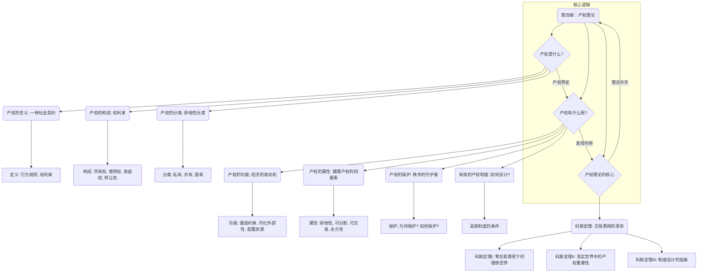

# 1 第四章：产权理论 (Chapter 4: Property Rights Theory)
## 1.1 知识框架（鸟瞰全景）

## 1.2 产权的内涵、构成与分类（产权究竟是什么？）
### 1.2.1 产权的含义
> **一句话精髓：** 产权与其说是人与物的关系，不如说它是一种由物而生的、规定人与人之间如何相处的**社会契约**。
- 讲给8岁小朋友听：
    想象一下，你的玩具汽车。“产权”不是指你和这辆玩具车本身的关系，而是指关于这辆车的一套“游戏规则”。规则说：你有权决定怎么玩它、要不要把它拆开、或者借给谁玩；同时，规则也对其他小朋友说：你们不能不经过同意就拿走它，也不能故意弄坏它。如果没人遵守这个规则，大家就会为了抢玩具而吵架甚至打架，结果谁也玩不好。所以，产权就是大家共同遵守的、关于“东西”的规矩，它让大家能和平相处。
- 从0到专家的深度解析：
    产权的本质是一种社会建构，它定义了人们在资源稀缺世界中的行为边界。
    - **法律定义（《大不列颠百科全书》）：** 产权是“法律权利的客体”，这强调了产权的**合法性**和**强制性**，它需要国家暴力作为最终后盾。
    - **经济学定义（阿尔钦）：** 产权是“一种通过社会强制而实现的对某种经济物品的多种用途进行选择的权利”。这更进一步，强调了产权的**经济功能**——选择权。拥有产权意味着你拥有了决定资源如何使用的权力，从而引导资源流向你认为价值最高的地方。
    - **新制度经济学定义（巴泽尔）：** 他区分了“经济权利”和“法律权利”。`经济权利`是指个人实际控制和享用一项资产利益的能力，哪怕没有法律支持（比如黑市交易）。`法律权利`则是国家承认并保护的权利。当法律权利能有效保护经济权利时，社会的交易成本会大大降低，经济才能繁荣。
    - **我们的定义：** 综合来看，
        产权
        不是指人与物之间的关系，而是指由物的存在及其使用所引起的人们之间相互认可的行为关系。它是一束权利的集合，明确了谁可以在什么条件下对什么物品做什么事，以及当权利受侵害时，谁有责任来纠正。
### 1.2.2 产权的构成
> **一句话精髓：** 完整的产权就像一把功能强大的瑞士军刀，由所有权、使用权、收益权、转让权这四个核心“刀片”组成，并且这些“刀片”可以被灵活地组合、拆分和交易。
- 讲给8岁小朋友听：
    还是那辆玩具车。
    1. **所有权：** 你是这辆车的“国王”，拥有最终决定权。你能大声说：“这是我的车！”
    2. **使用权：** 你可以在家里开着它到处跑，甚至可以在浴缸里当船玩。
    3. **收益权：** 你把车“租”给邻居家的小朋友玩，他每天给你一颗糖作为“租金”。这些糖就是你的收益。
    4. **转让权：** 你长大了，不喜欢玩具车了。你可以把它送给弟弟（赠与），或者在跳蚤市场卖给同学换成钱（出售）。
- 从0到专家的深度解析：
    这四项基本权利（
    所有权、使用权、收益权、转让权
    ）构成了一束可分割的产权。
    - 所有权
        ：最根本的权利，但并非没有限制。比如，你拥有一块土地的所有权，但你不能在上面建立一个核废料处理厂，因为这会危害公共安全。所有权总是在法律和社会规范的框架内行使。
    - 使用权
        ：决定了资源的物理用途。这项权利的界定对于避免冲突至关重要。例如，公寓楼里，你对自己家有使用权，但不能在半夜开派对，因为这侵犯了邻居的“安宁使用权”。
    - 收益权
        ：获取资产所产生利益的权利。这是激励人们投资和有效利用资产的核心动力。没有收益权，人们就没有动机去维护和改善资产。
    - 转让权
        ：将上述权利转让给他人的权利。这是**市场经济的灵魂**。没有转让权，资源就无法从低效率使用者流向高效率使用者，市场配置资源的功能就无从谈起。转让权使得“死”的资产（如土地、房屋）可以变成“活”的资本。
- **对比总结：产权的统一与分割**
    - **产权统一：** 四权合一，归属单一主体。简单明了，决策迅速。
    - **产权分割：** 将不同权利赋予不同主体，是现代经济复杂协作的基础。
        - **例子1（公司）：** 股东拥有`所有权`和`剩余收益权`，但将`使用权`（对公司资产的日常支配）和部分`收益权`（薪水和奖金）授予了职业经理人团队。这种分割使得资本所有者（股东）和专业管理者可以合作，极大地提高了效率。
        - **例子2（知识产权）：** 一位小说家拥有作品的`所有权`。他可以把电影改编权（一种`使用权`和`收益权`的组合）卖给电影公司，把翻译权（另一种`使用权`）授权给外国出版商，同时保留自己出版纸质书的权利。这种精细的分割让知识产权的价值得到了最大化的开发。
    - **结论：** 产权分割是社会进步的标志，它促进了专业化和规模经济。但其**前提**是，分割后的每一项权利都必须在法律上得到清晰界定和有力保护，否则分割带来的不是效率，而是无休止的纠纷和交易成本。
### 1.2.3 产权的分类
> **一句话精髓：** 根据“闲人免入”这块牌子的适用范围和执行力度，产权可以被看作一个光谱，从完全排他的私有产权，到群体排他的共有产权，再到名义上全民所有但实则由代理人控制的国有产权。
- **讲给8岁小朋友听：**
    - **私有产权：** 你的日记本。只有你一个人能看，这是最严格的“闲人免入”。
    - **共有产权：** 你们班级的图书角。班里的同学都可以借阅，但别的班的同学不行。这是对一个“圈子”里的人开放。如果图书角的书谁都可以拿走不还，很快就会空空如也，这就是“公地悲剧”。
    - **国有产权：** 公园里的长椅。理论上，这个国家的所有公民都可以坐。但实际上，你不能把它搬回家，也不能决定把它漆成什么颜色，这些事由公园的管理员（政府的代理人）决定。
- 从0到专家的深度解析：
    分类的核心是
    **排他性的程度及其带来的激励结构**差异。
    - 私有产权
        ：权利主体明确为个人或法人，其决策和后果由该主体完全承担。这创造了最强的激励，让所有者有动力去维护、改善和最有效地利用资产，因为所有的收益和损失都与他息息相关。这是市场经济效率的微观基础。
    - 共有产权
        ：权利归属于一个封闭的共同体。它面临着著名的**“公地悲剧”**（The Tragedy of the Commons）风险。当共同体成员无法有效协调时，每个人都有过度使用资源的激励（因为收益归自己，成本由大家分摊），而缺乏维护资源的激励。
        - **延伸思考（奥斯特罗姆的贡献）：** 传统观点认为解决公地悲剧只有两条路：私有化或政府管制。但诺贝尔奖得主埃莉诺·奥斯特罗姆通过研究发现，在很多情况下，社区可以自发地演化出一套有效的规则（如准入、监督、惩罚机制）来管理共有资源，从而避免悲剧。这说明有效的**自主治理**是共有产权成功的关键。
    - 国有产权
        ：名义上权利属于全体公民，但实际由政府代理人控制。其核心问题是**“委托-代理问题”**（Principal-Agent Problem）。“委托人”（全体公民）的目标是社会福利最大化，而“代理人”（政府官员）有自己的目标（如权力、灰色收入、轻松的工作）。由于公民监督官员的成本极高（信息不对称），代理人往往会追求自身利益而非公共利益，导致资源错配、腐败和低效率。
## 1.3 产权的功能、属性与保护（产权为什么这么神？）
### 1.3.1 产权的功能
> **一句话精髓：** 清晰的产权是一套强大的激励系统，它能点燃个人创造财富的激情（激励），划定行为的责任边界（约束），消化经济活动中的外部“副作用”（内化外部性），并为资源找到最佳归宿（资源配置）。
- **从0到专家的深度解析：**
    - **激励和约束功能：** 这是产权最核心、最直接的功能。它通过将个人努力与其收益直接挂钩，解决了“谁受益，谁付出”的问题。
        - **正面例子：** 专利制度（一种知识产权）保护了发明家的`所有权`和`收益权`，激励他们投入时间和金钱进行研发。
        - **反面例子：** 在产权模糊的旧式国企中，干好干坏一个样，工人的积极性普遍不高，因为个人努力与个人收益关系不大。
    - **外部性内在化：**
        外部性
        是市场失灵的一个重要原因。产权通过将权利“赋予”受影响的一方，创造了谈判和交易的可能，从而将外部成本/收益转变为内部成本/收益。
        - **负外部性例子（污染）：** 当法律规定居民拥有清洁空气的权利，工厂就必须为它的污染行为“付费”（安装净化设备、缴纳排污费或赔偿居民），污染这个外部成本就被工厂“内在化”了。
        - **正外部性例子（蜜蜂与果园）：** 一个蜂农的蜜蜂为邻近的果园授粉，增加了果园产量，这是正外部性。如果产权清晰，果园主可以与蜂农签订合同，支付一笔费用以换取稳定的授粉服务，这样蜂农的外部贡献就得到了内部补偿，他也有动力去维持蜂群规模。
    - **资源配置功能：** 这是产权在宏观层面上的巨大作用。在一个产权清晰且可自由交易的社会里，资源会通过价格机制自发地从价值较低的用途流向价值较高的用途。
        - **例子：** 一块土地，在农民手里种玉米，年产值1万。一个开发商认为在这块土地上建购物中心，年产值可以达到100万。如果产权清晰且可交易，开发商就可以出一个远高于1万的价格（比如10万）从农民手中买下这块地。交易达成后，土地这一资源就从低效用途（种地）配置到了高效用途（商业开发），整个社会的总财富增加了。没有清晰的产权，这场高效的资源重新配置就不可能发生。
### 1.3.2 产权的属性
> **一句话精髓：** 一个“健康”的产权制度，必须赋予权利四个黄金属性：排他性（我的地盘我做主）、可分割性（化整为零的智慧）、可交易性（让资产流动起来）、永久性（对未来的稳定承诺）。缺少任何一个，产权的价值都会大打折扣。
- **从0到专家的深度解析：**
    - 排他性
        ：产权的基石。如果一项权利不能有效排除他人的侵害，它就名存实亡。弱排他性会导致权利人不愿意为资产投入，因为投入的成果很可能被他人攫取。
    - 可分割性
        ：现代经济复杂性的要求。它允许一项资产的不同功能被最擅长的人利用，实现“人尽其才，物尽其用”。如果产权不可分割，很多高效的商业模式（如租赁、外包、特许经营）都将无法存在。
    - 可交易性
        ：实现资源优化配置的动脉。不可交易的产权，就像一潭死水，其价值被锁定在初始所有者手中，无论他是否是最高效的使用者。允许交易，才能让价格这只“看不见的手”发挥作用。
    - 永久性（或安全性）
        ：激励长期投资的关键。如果产权随时可能被任意剥夺，理性的人只会进行短期、掠夺性的开发，而绝不会进行有利于长期发展的投资（如修建水利、技术升级、品牌建设）。对产权安全的稳定预期，是市场信心的定海神针。
### 1.3.3 产权的保护
> **一句话精髓：** 产权保护是将纸面上的权利变成现实财富的转换器。若无保护，产权只是空谈，社会秩序将退化为弱肉强食的丛林法则。而最有效的保护，源于以国家强制力为后盾的法治体系。
- **从0到专家的深度解析：**
    - **为何要保护？**
        1. **维护社会秩序：** 明确的权利边界和有效的保护是和平与合作的基础。
        2. **激励财富创造与积累：** 保护是激励的保障，人们确信自己的劳动果实不会被抢走，才会去努力创造。
        3. **降低交易成本：** 有了可靠的国家保护，人们在交易时就不需要花费巨大成本去“自我防卫”，可以更信任交易对手。
        4. **奠定国家发展的基础：** 历史反复证明，对产权提供稳定、公平保护的国家，更容易吸引投资、鼓励创新，从而走向繁荣。反之，产权混乱是经济停滞和社会动荡的共同特征。
    - **如何保护？（实施机制的光谱）**
        1. **个人武力（自力救济）：** 最原始，只适用于小范围和简单社会。在现代社会，成本极高且会破坏公共秩序。
        2. **非正式制度（社会规范）：** 依靠声誉、习俗、道德、宗教等。在熟人社会中非常有效，但覆盖范围有限，且对“陌生人”约束力弱。
        3. **国家强制（法治）：** 现代社会最核心、最低成本的保护方式。它通过建立一套**普遍适用**的法律规则，并由中立的司法系统（法院）和强大的执法系统（警察、军队）来强制执行。国家提供的产权保护具有巨大的**规模经济效应**：用一套法律体系保护所有人的成本，远低于每个人都雇佣保镖来保护自己的成本总和。一个独立的司法系统对于防止国家权力本身侵犯产权尤为重要。
## 1.4 科斯定理（产权理论的皇冠）
> **一句话精髓：** 科斯的革命性贡献在于，他把“交易费用”这个被主流经济学忽略的“摩擦力”置于舞台中央，从而颠覆性地揭示了产权界定与资源配置的真实关系：在理想世界（零交易费用），产权界定无关效率；但在真实世界（正交易费用），产权界定和制度设计本身就是决定效率的关键。
- 讲给8岁小朋友听（经典案例-升级版）：
    想象一下，你家隔壁住着一个爱弹钢琴的小姐姐，但你每天下午需要睡午觉。矛盾出现了。
    - **科斯的第一步：忘掉谁对谁错，只看谁的价值更大。** 也许你睡午觉能让你晚上精神百倍地做作业，这个“价值”对你来说值10块钱。而小姐姐弹钢琴能让她放松心情，这个“价值”对她来说值5块钱。
    - **情况A：法律规定你有“安静权”。** 小姐姐想弹琴，就必须“买”你的权利。她最多愿意出5块，但你觉得午觉值10块，所以你不会为了5块就放弃。∗∗结果：你不卖，她不弹。你睡了午觉（价值10），她没弹成琴（放弃价值$5）。社会总价值：$10。**
    - **情况B：法律规定她有“弹琴权”。** 现在轮到你想睡觉，必须去“买”她的权利了。你的午觉值10块，所以你最多愿意出10块请她别弹。而她觉得弹琴只值5块，所以只要给她超过5块钱（比如6块），她就愿意不弹。∗∗结果：你花6块买了她的“不弹琴权”。你睡了午觉（价值10），她得到了6块（高于她弹琴的$5价值）。社会总价值：10（你的午觉价值）+$1（她多赚的） = $11？不对，应该是你获得了价值$10的午觉，她获得了$6的补偿，而她放弃了价值5的弹琴乐趣。资源（下午的时间）被用在了价值更高的地方（睡觉）。**
    - **科斯的洞见（**
        科斯定理I
        **）：** 你看，只要你们俩商量不费劲（交易费用为零），不管法律最初把权利给谁，最后的结果都是一样的：资源（下午的时间）会被用来做价值更高的事情（睡觉）。权利的初始分配只影响谁给谁钱（财富分配），而不影响最终的效率结果（资源配置）。
- **从0到专家的深度解析：**
    - 科斯定理Ⅰ
        ：**如果交易费用为零，无论产权如何初始界定，市场交易都会使资源达到最优配置。**
        - **深刻含义：** 这不是在描述现实，而是在做一个**思想实验**。它告诉我们，如果市场是完美的（没有交易费用），那么法律在资源配置效率上是“中性”的。这反过来点明了现实世界的问题所在：**正是因为交易费用无处不在，法律和制度才变得至关重要。**
        - **什么是交易费用？** 它是达成交易所付出的所有成本，主要包括：
            1. **搜寻与信息成本：** 找到谁拥有你想要的权利，并了解其真实价值的成本。
            2. **谈判与签约成本：** 讨价还价、起草合同、达成协议的成本。
            3. **监督与执行成本：** 确保对方遵守合同，以及在对方违约时寻求救济的成本。
    - 科斯定理Ⅱ
        ：**当交易费用为正的情况下，产权的初始界定将深刻影响资源的最终配置和经济效率。**
        - **现实世界：** 这才是对真实世界的描述。当交易费用高昂时，市场交易可能根本无法发生。
        - **例子：** 一家工厂向河流排放污水，影响了下游数万居民的饮水安全。让这数万居民组织起来，与工厂进行一场有效的谈判，其交易费用（组织成本、搭便车问题、谈判成本）几乎是无穷大。在这种情况下，如果法律将“清洁水源权”赋予居民，工厂就必须停止污染或进行补偿，资源配置的结果是水质得到保护。如果法律默许工厂的排污权，那么低成本的谈判无法发生，结果就是河流被持续污染。可见，此时的产权初始界定**直接决定**了最终的效率结果。
    - 科斯定理Ⅲ
        ：**当交易费用大于零时，清晰地界定和保护产权、建立有效率的制度，是降低交易成本、改进经济效率的关键。**
        - **实践指南：** 这是科斯定理对政策制定最重要的启示。既然交易费用是客观现实，那么制度设计的核心目标就应该是**尽可能地降低交易费用**。一个好的法律制度（如清晰的合同法、高效的法院、可靠的产权登记系统）能够极大地减少不确定性，降低交易各方的成本，从而让更多有效率的交易得以发生，促进经济增长。
- 总结与精髓：
    科斯定理的革命性在于它提供了一个全新的分析范式。它告诉我们，不能在“真空”中讨论市场，必须把制度和交易费用这两个变量放回经济分析的核心。外部性问题，本质上不是市场失灵，而是高昂的交易费用阻碍了市场的正常运作。因此，解决之道不在于简单地抛弃市场、诉诸政府干预，而在于通过构建更好的制度来帮助市场更好地运作。
## 1.5 学习总结与大师之路
恭喜你！我们已经完成了一次对第四章的深度探索。现在，你对产权理论的理解，已经远远超出了基本概念的范畴，进入了能够运用其分析复杂现实问题的层面。
- **回顾一下，你现在应该能更有深度地回答：**
    - 为什么说“风能进，雨能进，国王不能进”不仅体现了产权的排他性，更体现了对**公权力**进行限制的法治精神？
    - 为什么股份公司的发明被誉为“人类最伟大的发明之一”？（它通过精妙的产权分割，解决了大规模资本筹集与专业化管理的矛盾，极大地降低了交易费用）。
    - 为什么许多资源丰富的国家反而陷入贫困（“资源诅咒”）？从产权角度看，往往是因为缺乏有效的产权制度来保护资源收益不被少数精英集团掠夺，导致寻租活动猖獗而非生产性活动。
    - 面对一个外部性问题（如城市交通拥堵），你现在可以从交易费用的角度分析，为什么市场难以自发解决（数百万司机无法相互谈判），并思考何种制度设计（如拍卖车牌、征收拥堵费）是在高交易费用下更有效率的产权界定方式。
你已经从一个0基础的小白，成长为了能够洞悉制度背后经济逻辑的思考者。记住，经济学的魅力就在于它提供了一套穿透表象、直达本质的分析工具。产权理论，正是这套工具箱中最为锋利、最为根本的一把“解剖刀”。用它，你将能更好地理解这个由无数规则和互动构成的复杂世界。