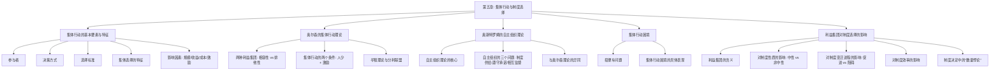

# 1 第五章 集体行动与制度选择

你好呀！欢迎来到第五章的学习。这一章非常有趣，它探讨的是：**一群人是怎么凑在一起做决定的？为什么有时候大家一起做事这么难？不同的利益小团体又是如何影响社会规则的？**

咱们先通过一个知识框架图，看看这一章都聊了些什么。



## 1.1 一、集体行动的基本要素和集体选择特征

### 1.1.1 什么是集体行动？

> **一句话概括：** 就是一群人凑到一块儿，商量和决定那些和大家都有关系的事儿。

**给8岁小朋友讲：** 想象一下，你们班同学想决定周末是去公园玩还是去看电影。大家坐在一起讨论、投票，最后做出一个决定，这个过程就是“集体行动”。

### 1.1.2 我们为什么要研究集体行动？

我们生活在一个充满各种“集体”的社会里，比如国家、公司、社团、家庭等等。这些集体是怎么做决定的？为什么有的集体效率很高，有的却总是吵来吵去办不成事？理解了集体行动，就能更好地理解我们身边的世界是如何运转的。

### 1.1.3 集体行动的基本要素

一个集体行动要想发生，至少需要这几样东西：

- **(1) 参与者：** 就是参加这次行动的人。他们可以是自愿来的，也可能是被要求的。人数可多可少。
    
- **(2) 决策方式：** 大家用什么方法来做决定。
    
    - **集权独裁决策：** 一个人说了算，比如班长决定。
        
    - **分散自我决策：** 各管各的。
        
    - **专家决策：** 请最有经验的人来决定。
        
    - **一致同意决策：** 所有人必须都同意才行，这是最难的。
        
    - **授权决策：** 大家选出几个代表，让他们替大家做决定。
        
- **(3) 选择标准：** 做决定的依据是什么？是为了让大家最开心？还是为了成本最低？
    

### 1.1.4 集体选择的特征（它的“小脾气”）

和我们自己一个人做决定相比，一群人做决定有几个很特别的地方：

- **(1) 交易成本更高：**
    
    - **小白话解释：** 大家一起商量事儿，比自己拿主意费劲多了。
        
    - **细节深挖：** 你需要花时间开会、讨论、说服别人、投票... 这些花掉的时间和精力，就是“交易成本”。人越多，想法越杂，这个成本就越高。
        
- **(2) 不能满足所有人的偏好：**
    
    - **小白话解释：** 总有人会不满意最终的决定。
        
    - **细节深挖：** 比如投票决定去公园，那些想看电影的同学就不开心了。集体选择追求的是“集体利益”或“大多数人”的利益，很难让每个人都100%满意。
        
- **(3) 需要依靠代表：**
    
    - **小白话解释：** 人一多，不可能事事都全体投票，得选些代表出来。
        
    - **细节深挖：** 除非是一个非常非常小的团体（比如几个人），否则让成千上万的人一起做具体决定是不现实的。所以需要选举人大代表、董事会成员等“代表”来替大家行使权力。
        
- **(4) “多数派被贪婪的少数派所利用”：**
    
    - **小白话解释：** 有时候，一小撮特别在乎某件事的人，能把大多数无所谓的人给“绑架”了。
        
    - **细节深挖：** 这句话听起来有点绕。意思是，对于某个政策，可能对一小撮人有巨大的好处，而对大多数人只有一点点坏处。这一小撮人会拼尽全力去争取，而大多数人因为觉得“无所谓”或“懒得管”，就随他们去了。结果，这个政策就通过了。
        
- **(5) 大多数公民处于“理性无知”状态：**
    
    - **小白话解释：** 对大多数人来说，花时间去搞懂每一件公共事务，太累了，不划算。
        
    - **细节深挖：** “理性无知”（Rational Ignorance）是个很重要的概念。比如，要选举一个官员，彻底了解所有候选人的政策主张需要花费大量时间和精力。但你的一票起到的作用微乎其微。所以，从“成本-收益”角度看，保持“无知”反而是“理性”的。这就给了那些特殊利益集团可乘之机。
        

### 1.1.5 影响集体行动的因素

什么情况下集体行动更容易成功呢？主要看这四点：

- **(1) 集体（组织）规模大小：**
    
    - **核心思想：** 人越少，越容易办事。
        
    - **大师级解读：** 这背后是著名的“**免费搭车**”（Free-riding）问题。人越多，每个人就会想：“总有别人会去做的，我不用出力也能享受到好处。”结果大家都不出力，事情就黄了。小集团里，谁没出力，一眼就能看出来，不好意思“搭便车”。
        
- **(2) 个人获益程度：**
    
    - **核心思想：** 这事儿办成了对我好处越大，我越有动力。
        
    - **大师级解读：** 如果一个政策能让你直接受益（比如减税），你就会积极支持。如果对你影响不大，你可能就懒得管了。
        
- **(3) 集体的组织成本：**
    
    - **核心思想：** 把大家组织起来的成本越低，越容易行动。
        
    - **大师级解读：** 组织成本包括了前面说的开会、沟通等交易成本。如果成员之间本来就认识，或者有现成的联络渠道（比如微信群），组织成本就低。
        
- **(4) “选择性”激励：**
    
    - **核心思想：** 只给那些付出了努力的成员发“小奖品”，就能有效防止搭便车。
        
    - **大师级解读：** 这是奥尔森理论的核心之一。集体行动成功带来的好处（公共品）是大家共享的，但我们可以设置一些“私人物品”作为奖励。比如，加入行业协会可以享受集体争取来的政策优惠（公共品），但只有交了会费的会员才能拿到协会内部的资讯和业务介绍（选择性激励）。
        

## 1.2 二、奥尔森的集体行动理论

曼瑟尔·奥尔森（Mancur Olson）是这个领域的大神，他的理论彻底改变了我们对集体行动的看法。

### 1.2.1 奥尔森理论解决了什么问题？

> **一句话概括：** 奥尔森解释了为什么那些对大多数人都有好处的事，反而常常办不成；而一些低效率、不公平的制度，却能长期存在。

**核心观点：** 不能想当然地认为，只要存在共同利益，人们就会自动组织起来去追求它。**个人理性≠集体理性**。

### 1.2.2 主要内容

- **(1) 两种利益集团：**
    
    - **相容性集团 (Inclusive Group)：** 集团的利益像一个大蛋糕，成员越多，来分蛋糕的人也越多，但蛋糕本身可能也会变大。比如，一个行业的所有企业都希望政府减税，新加入一个企业，虽然也来享受减税的好处，但也壮大了行业声势。**奥尔森认为，这种集团更有可能实现集体利益。**
        
    - **排他性集团 (Exclusive Group)：** 集团的利益是固定的，多一个成员就多一个人来瓜分。比如，几个寡头企业搞价格联盟，多一个企业加入，就得多分一份利润出去。所以它们倾向于排斥新成员。
        
- **(2) 集体行动成功的两个关键条件：**
    
    - **人数足够少（小集团优势）：** 正如前面所说，小集团可以有效克服“搭便车”问题，组织成本也低。
        
    - **存在“选择性刺激” (Selective Incentives)：** 用“小奖品”（或惩罚）来激励成员为集体利益做贡献。
        
    - **推论：** 社会上，那些**规模小、组织严密**的集团（如行业协会、特殊利益团体）比**规模大、松散**的集团（如全体消费者、纳税人）更有影响力。这就形成了**强势利益集团**和**弱势利益集团**。
        
- **(3) 寻租理论与“分利联盟”：**
    
    - **小白话解释：** 一些利益集团不通过创造新财富，而是通过影响政府政策来为自己捞好处，这种行为叫“寻租”。这些集团就是“分利联盟”。
        
    - **大师级解读：** “寻租”（Rent-seeking）不是去租房子，而是指利用政治权力，而不是通过生产活动，来为自己获取经济利益。比如，某行业协会游说政府给他们设置贸易壁垒，限制外国产品进口，这样他们就能在国内卖高价。他们没有创造更多价值，只是把消费者的钱转移到了自己口袋里。
        
    - **分利联盟 (Distributional Coalition)：** 这些靠寻租为生的利益集团，会像藤蔓一样缠绕在经济体上。它们会努力维持那些对自己有利的、哪怕是低效率的制度，阻碍创新和改革，因为改革会损害它们的既得利益。奥尔森认为，一个国家如果“分利联盟”太多太强大，经济就会僵化，最终导致衰落。
        

## 1.3 三、奥斯特罗姆的自主组织理论

埃莉诺·奥斯特罗姆（Elinor Ostrom）是另一位大神，她因为对公共资源治理的研究获得了诺贝尔经济学奖。她的理论和奥尔森形成了有趣的对话。

### 1.3.1 自主组织理论的核心

> **一句话概括：** 奥斯特罗姆认为，别小看普通人，在特定条件下，一群人完全可以自己组织起来，设计规则，有效管理好公共资源，而不需要政府干预或私有化。

**核心观点：** 在“市场失灵”和“政府失灵”之间，存在第三条道路——**社群自主治理**。

### 1.3.2 自主组织要解决的三个问题

奥斯特罗姆通过研究世界各地大量案例发现，一个成功的自主组织，必须解决好三个核心问题：

- **(1) 制度供给问题：** 谁来设计规则？谁有动力去干这件吃力不讨好的事？（通常是那些从新规则中获益最大的人）
    
- **(2) 可信承诺问题：** 如何确保大家都会遵守规则？光说不做怎么办？（需要建立有效的监督和惩罚机制）
    
- **(3) 相互监督问题：** 如何低成本地监督彼此的行为？（利用社群内部的社会资本和信息优势）
    

### 1.3.3 和奥尔森理论的对比总结

|   |   |   |
|---|---|---|
|**特征**|**奥尔森的理论**|**奥斯特罗姆的理论**|
|**研究焦点**|大规模的、匿名的集体行动，解释其为何**失败**。|小规模的、基于社群的集体行动，解释其为何能**成功**。|
|**核心障碍**|搭便车、组织成本。|制度供给、承诺、监督。|
|**解决方案**|小集团优势、选择性激励。|自主设计规则、自我管理、社会资本。|
|**对政府态度**|暗示政府干预（或被利益集团俘获）是常态。|认为政府强制干预或私有化往往是错误药方，应相信社群能力。|

**一句话总结：** 奥尔森告诉我们**为什么大集团办事难**，而奥斯特罗姆则向我们展示了**小社群如何能办成事**。他们其实是在研究同一个问题的不同层面。

## 1.4 四、集体行动困境

这里是对前面问题的总结和深化。

### 1.4.1 搭便车问题 (The Free Rider Problem)

> **一句话概括：** 人人都想不劳而获，享受集体行动带来的好处，但自己却不愿付出成本。

这是集体行动最核心、最难解决的困境。因为集体行动的成果，比如更干净的空气、更安全的社区，是一种“**公共品**”（Public Good）。它的特点是**非竞争性**（一个人享用不会减少别人享用）和**非排他性**（很难阻止不付钱的人享用）。

**因此，从个人理性出发，最优策略就是“搭便车”。但如果人人都这么想，最终结果就是公共品供给不足，大家一起遭殃。这就是“个人理性”与“集体理性”的矛盾。**

### 1.4.2 集体行动困境的具体表现

- **(1) 决策难产，个人利益无法最大化：** 由于搭便车和协调成本，集体很难做出最优决策。
    
- **(2) 影响力与人数不成正比：** 规模庞大的弱势集团（如消费者）反而没有规模小但组织好的强势集团（如某行业垄断者）有影响力。这违背了“少数服从多数”的直觉。
    
- **(3) 博弈结果往往是非均衡的：** 利益集团之间的博弈，不一定能达到一个公平的均衡状态，而常常是让某些特殊利益集团获利。
    

## 1.5 五、利益集团对制度选择的重要影响

### 1.5.1 什么是利益集团？

> **一句话概括：** 就是一群有共同目标的人组织起来，试图影响公共政策，为自己捞好处的团体。

### 1.5.2 利益集团如何影响制度？

这是本章的落脚点。制度（社会的游戏规则）并不是凭空产生的，它是在各种力量的博弈中形成的，其中，利益集团扮演了至关重要的角色。

- **(1) 对制度性质的影响 -> 制度可能是“不中性”的**
    
    - **小白话解释：** 规则不一定是公平的，它可能偏向某些人。
        
    - **大师级解读：** 理想的制度应该是“中性”的，对所有人一视同仁。但现实中，很多制度是“非中性”的，它们由独裁者、强势利益集团或政治上的多数派创立，目的就是为了让自己获益，哪怕这会损害社会整体利益。比如，产权制度的改变，总会使一部分人受益，另一部分人受损，这就是它的“再分配效应”。
        
- **(2) 对制度变迁进程的影响 -> 既能促进，也能阻碍**
    
    - **小白话解释：** 利益集团会支持对自己有利的改革，阻挠对自己不利的改革。
        
    - **大师级解读：** 在不发达国家，已经形成的**既得利益集团**（Vested Interests）往往是制度改革最大的绊脚石。他们控制着政治权力，会不惜一切代价维护现状。在发达国家，各种院外集团、游说团体也会深刻影响立法和行政过程。
        
- **(3) 对制度效率的影响 -> 制度不一定都是有效率的**
    
    - **大师级解读：** 这是对新古典经济学“效率至上”观点的一个有力挑战。诺斯指出，制度的建立，服务的是那些有能力创造规则的集团的利益，而不是社会效率。一个对社会整体来说是低效的制度，只要能让强势集团获利，它就可能被建立并长期维持下去。
        

### 1.5.3 制度决定中的“数量悖论” (The Paradox of Numbers)

> **一句话概括：** 在决定社会规则的博弈中，人少的一方反而常常能赢过人多的一方。

这是奥尔森理论最惊人的结论之一。

- **为什么会这样？**
    
    - **人少的一方（小集团）：** 成员利益集中，人均收益高，有强烈的激励去行动；容易协调，组织成本低；容易监督，能有效防止搭便车。
        
    - **人多的一方（大集团）：** 成员利益分散，人均收益低，激励不足；难以协调，组织成本高；“搭便车”现象严重。
        
- **结果：** 在政策和制度的制定过程中，那些代表少数人利益的、组织严密的强势集团，其影响力远远超过了代表多数人利益的、松散的弱势集团。这导致很多政策和制度最终偏离了公共利益。
    

**学习总结：**

恭喜你！我们完成了第五章的学习。现在我们知道了，集体行动远比想象的复杂。**“搭便车”**是其核心困境，**集团规模**是决定其成败的关键因素。奥尔森的理论解释了为什么社会中常常出现**“少数绑架多数”**的现象，以及“分利联盟”如何阻碍经济发展。而奥斯特罗姆则为我们展示了**社群自主治理**的可能性。最后我们明白，社会的制度和规则，正是在这些不同**利益集团**的博弈和“**数量悖论**”的作用下，被塑造出来的。

希望这份详尽的笔记能帮助你彻底掌握这一章的精髓！# 第五章 集体行动与制度选择

你好呀！欢迎来到第五章的学习。这一章非常有趣，它探讨的是：**一群人是怎么凑在一起做决定的？为什么有时候大家一起做事这么难？不同的利益小团体又是如何影响社会规则的？**

咱们先通过一个知识框架图，看看这一章都聊了些什么。

```
graph TD;
    A[第五章: 集体行动与制度选择] --> B[集体行动的基本要素与特征];
    A --> C[奥尔森的集体行动理论];
    A --> D[奥斯特罗姆的自主组织理论];
    A --> E[集体行动困境];
    A --> F[利益集团对制度选择的影响];

    B --> B1[参与者];
    B --> B2[决策方式];
    B --> B3[选择标准];
    B --> B4[集体选择的特征];
    B --> B5[影响因素: 规模/收益/成本/激励];

    C --> C1[两种利益集团: 相容性 vs 排他性];
    C --> C2[集体行动的两个条件: 人少 + 激励];
    C --> C3[寻租理论与分利联盟];

    D --> D1[自主组织理论的核心];
    D --> D2[自主组织的三个问题: 制度供给/遵守承诺/相互监督];
    D --> D3[与奥尔森理论的异同];

    E --> E1[搭便车问题];
    E --> E2[集体行动困境的具体表现];

    F --> F1[利益集团的含义];
    F --> F2[对制度性质的影响: 中性 vs 非中性];
    F --> F3[对制度变迁进程的影响: 促进 vs 阻碍];
    F --> F4[对制度效率的影响];
    F --> F5[制度决定中的“数量悖论”];
```

## 1.6 一、集体行动的基本要素和集体选择特征

### 1.6.1 什么是集体行动？

> **一句话概括：** 就是一群人凑到一块儿，商量和决定那些和大家都有关系的事儿。

**给8岁小朋友讲：** 想象一下，你们班同学想决定周末是去公园玩还是去看电影。大家坐在一起讨论、投票，最后做出一个决定，这个过程就是“集体行动”。

### 1.6.2 我们为什么要研究集体行动？

我们生活在一个充满各种“集体”的社会里，比如国家、公司、社团、家庭等等。这些集体是怎么做决定的？为什么有的集体效率很高，有的却总是吵来吵去办不成事？理解了集体行动，就能更好地理解我们身边的世界是如何运转的。

### 1.6.3 集体行动的基本要素

一个集体行动要想发生，至少需要这几样东西：

- **(1) 参与者：** 就是参加这次行动的人。他们可以是自愿来的，也可能是被要求的。人数可多可少。
    
- **(2) 决策方式：** 大家用什么方法来做决定。
    
    - **集权独裁决策：** 一个人说了算，比如班长决定。
        
    - **分散自我决策：** 各管各的。
        
    - **专家决策：** 请最有经验的人来决定。
        
    - **一致同意决策：** 所有人必须都同意才行，这是最难的。
        
    - **授权决策：** 大家选出几个代表，让他们替大家做决定。
        
- **(3) 选择标准：** 做决定的依据是什么？是为了让大家最开心？还是为了成本最低？
    

### 1.6.4 集体选择的特征（它的“小脾气”）

和我们自己一个人做决定相比，一群人做决定有几个很特别的地方：

- **(1) 交易成本更高：**
    
    - **小白话解释：** 大家一起商量事儿，比自己拿主意费劲多了。
        
    - **细节深挖：** 你需要花时间开会、讨论、说服别人、投票... 这些花掉的时间和精力，就是“交易成本”。人越多，想法越杂，这个成本就越高。
        
- **(2) 不能满足所有人的偏好：**
    
    - **小白话解释：** 总有人会不满意最终的决定。
        
    - **细节深挖：** 比如投票决定去公园，那些想看电影的同学就不开心了。集体选择追求的是“集体利益”或“大多数人”的利益，很难让每个人都100%满意。
        
- **(3) 需要依靠代表：**
    
    - **小白话解释：** 人一多，不可能事事都全体投票，得选些代表出来。
        
    - **细节深挖：** 除非是一个非常非常小的团体（比如几个人），否则让成千上万的人一起做具体决定是不现实的。所以需要选举人大代表、董事会成员等“代表”来替大家行使权力。
        
- **(4) “多数派被贪婪的少数派所利用”：**
    
    - **小白话解释：** 有时候，一小撮特别在乎某件事的人，能把大多数无所谓的人给“绑架”了。
        
    - **细节深挖：** 这句话听起来有点绕。意思是，对于某个政策，可能对一小撮人有巨大的好处，而对大多数人只有一点点坏处。这一小撮人会拼尽全力去争取，而大多数人因为觉得“无所谓”或“懒得管”，就随他们去了。结果，这个政策就通过了。
        
- **(5) 大多数公民处于“理性无知”状态：**
    
    - **小白话解释：** 对大多数人来说，花时间去搞懂每一件公共事务，太累了，不划算。
        
    - **细节深挖：** “理性无知”（Rational Ignorance）是个很重要的概念。比如，要选举一个官员，彻底了解所有候选人的政策主张需要花费大量时间和精力。但你的一票起到的作用微乎其微。所以，从“成本-收益”角度看，保持“无知”反而是“理性”的。这就给了那些特殊利益集团可乘之机。
        

### 1.6.5 影响集体行动的因素

什么情况下集体行动更容易成功呢？主要看这四点：

- **(1) 集体（组织）规模大小：**
    
    - **核心思想：** 人越少，越容易办事。
        
    - **大师级解读：** 这背后是著名的“**免费搭车**”（Free-riding）问题。人越多，每个人就会想：“总有别人会去做的，我不用出力也能享受到好处。”结果大家都不出力，事情就黄了。小集团里，谁没出力，一眼就能看出来，不好意思“搭便车”。
        
- **(2) 个人获益程度：**
    
    - **核心思想：** 这事儿办成了对我好处越大，我越有动力。
        
    - **大师级解读：** 如果一个政策能让你直接受益（比如减税），你就会积极支持。如果对你影响不大，你可能就懒得管了。
        
- **(3) 集体的组织成本：**
    
    - **核心思想：** 把大家组织起来的成本越低，越容易行动。
        
    - **大师级解读：** 组织成本包括了前面说的开会、沟通等交易成本。如果成员之间本来就认识，或者有现成的联络渠道（比如微信群），组织成本就低。
        
- **(4) “选择性”激励：**
    
    - **核心思想：** 只给那些付出了努力的成员发“小奖品”，就能有效防止搭便车。
        
    - **大师级解读：** 这是奥尔森理论的核心之一。集体行动成功带来的好处（公共品）是大家共享的，但我们可以设置一些“私人物品”作为奖励。比如，加入行业协会可以享受集体争取来的政策优惠（公共品），但只有交了会费的会员才能拿到协会内部的资讯和业务介绍（选择性激励）。
        

## 1.7 二、奥尔森的集体行动理论

曼瑟尔·奥尔森（Mancur Olson）是这个领域的大神，他的理论彻底改变了我们对集体行动的看法。

### 1.7.1 奥尔森理论解决了什么问题？

> **一句话概括：** 奥尔森解释了为什么那些对大多数人都有好处的事，反而常常办不成；而一些低效率、不公平的制度，却能长期存在。

**核心观点：** 不能想当然地认为，只要存在共同利益，人们就会自动组织起来去追求它。**个人理性≠集体理性**。

### 1.7.2 主要内容

- **(1) 两种利益集团：**
    
    - **相容性集团 (Inclusive Group)：** 集团的利益像一个大蛋糕，成员越多，来分蛋糕的人也越多，但蛋糕本身可能也会变大。比如，一个行业的所有企业都希望政府减税，新加入一个企业，虽然也来享受减税的好处，但也壮大了行业声势。**奥尔森认为，这种集团更有可能实现集体利益。**
        
    - **排他性集团 (Exclusive Group)：** 集团的利益是固定的，多一个成员就多一个人来瓜分。比如，几个寡头企业搞价格联盟，多一个企业加入，就得多分一份利润出去。所以它们倾向于排斥新成员。
        
- **(2) 集体行动成功的两个关键条件：**
    
    - **人数足够少（小集团优势）：** 正如前面所说，小集团可以有效克服“搭便车”问题，组织成本也低。
        
    - **存在“选择性刺激” (Selective Incentives)：** 用“小奖品”（或惩罚）来激励成员为集体利益做贡献。
        
    - **推论：** 社会上，那些**规模小、组织严密**的集团（如行业协会、特殊利益团体）比**规模大、松散**的集团（如全体消费者、纳税人）更有影响力。这就形成了**强势利益集团**和**弱势利益集团**。
        
- **(3) 寻租理论与“分利联盟”：**
    
    - **小白话解释：** 一些利益集团不通过创造新财富，而是通过影响政府政策来为自己捞好处，这种行为叫“寻租”。这些集团就是“分利联盟”。
        
    - **大师级解读：** “寻租”（Rent-seeking）不是去租房子，而是指利用政治权力，而不是通过生产活动，来为自己获取经济利益。比如，某行业协会游说政府给他们设置贸易壁垒，限制外国产品进口，这样他们就能在国内卖高价。他们没有创造更多价值，只是把消费者的钱转移到了自己口袋里。
        
    - **分利联盟 (Distributional Coalition)：** 这些靠寻租为生的利益集团，会像藤蔓一样缠绕在经济体上。它们会努力维持那些对自己有利的、哪怕是低效率的制度，阻碍创新和改革，因为改革会损害它们的既得利益。奥尔森认为，一个国家如果“分利联盟”太多太强大，经济就会僵化，最终导致衰落。
        

## 1.8 三、奥斯特罗姆的自主组织理论

埃莉诺·奥斯特罗姆（Elinor Ostrom）是另一位大神，她因为对公共资源治理的研究获得了诺贝尔经济学奖。她的理论和奥尔森形成了有趣的对话。

### 1.8.1 自主组织理论的核心

> **一句话概括：** 奥斯特罗姆认为，别小看普通人，在特定条件下，一群人完全可以自己组织起来，设计规则，有效管理好公共资源，而不需要政府干预或私有化。

**核心观点：** 在“市场失灵”和“政府失灵”之间，存在第三条道路——**社群自主治理**。

### 1.8.2 自主组织要解决的三个问题

奥斯特罗姆通过研究世界各地大量案例发现，一个成功的自主组织，必须解决好三个核心问题：

- **(1) 制度供给问题：** 谁来设计规则？谁有动力去干这件吃力不讨好的事？（通常是那些从新规则中获益最大的人）
    
- **(2) 可信承诺问题：** 如何确保大家都会遵守规则？光说不做怎么办？（需要建立有效的监督和惩罚机制）
    
- **(3) 相互监督问题：** 如何低成本地监督彼此的行为？（利用社群内部的社会资本和信息优势）
    

### 1.8.3 和奥尔森理论的对比总结

|   |   |   |
|---|---|---|
|**特征**|**奥尔森的理论**|**奥斯特罗姆的理论**|
|**研究焦点**|大规模的、匿名的集体行动，解释其为何**失败**。|小规模的、基于社群的集体行动，解释其为何能**成功**。|
|**核心障碍**|搭便车、组织成本。|制度供给、承诺、监督。|
|**解决方案**|小集团优势、选择性激励。|自主设计规则、自我管理、社会资本。|
|**对政府态度**|暗示政府干预（或被利益集团俘获）是常态。|认为政府强制干预或私有化往往是错误药方，应相信社群能力。|

**一句话总结：** 奥尔森告诉我们**为什么大集团办事难**，而奥斯特罗姆则向我们展示了**小社群如何能办成事**。他们其实是在研究同一个问题的不同层面。

## 1.9 四、集体行动困境

这里是对前面问题的总结和深化。

### 1.9.1 搭便车问题 (The Free Rider Problem)

> **一句话概括：** 人人都想不劳而获，享受集体行动带来的好处，但自己却不愿付出成本。

这是集体行动最核心、最难解决的困境。因为集体行动的成果，比如更干净的空气、更安全的社区，是一种“**公共品**”（Public Good）。它的特点是**非竞争性**（一个人享用不会减少别人享用）和**非排他性**（很难阻止不付钱的人享用）。

**因此，从个人理性出发，最优策略就是“搭便车”。但如果人人都这么想，最终结果就是公共品供给不足，大家一起遭殃。这就是“个人理性”与“集体理性”的矛盾。**

### 1.9.2 集体行动困境的具体表现

- **(1) 决策难产，个人利益无法最大化：** 由于搭便车和协调成本，集体很难做出最优决策。
    
- **(2) 影响力与人数不成正比：** 规模庞大的弱势集团（如消费者）反而没有规模小但组织好的强势集团（如某行业垄断者）有影响力。这违背了“少数服从多数”的直觉。
    
- **(3) 博弈结果往往是非均衡的：** 利益集团之间的博弈，不一定能达到一个公平的均衡状态，而常常是让某些特殊利益集团获利。
    

## 1.10 五、利益集团对制度选择的重要影响

### 1.10.1 什么是利益集团？

> **一句话概括：** 就是一群有共同目标的人组织起来，试图影响公共政策，为自己捞好处的团体。

### 1.10.2 利益集团如何影响制度？

这是本章的落脚点。制度（社会的游戏规则）并不是凭空产生的，它是在各种力量的博弈中形成的，其中，利益集团扮演了至关重要的角色。

- **(1) 对制度性质的影响 -> 制度可能是“不中性”的**
    
    - **小白话解释：** 规则不一定是公平的，它可能偏向某些人。
        
    - **大师级解读：** 理想的制度应该是“中性”的，对所有人一视同仁。但现实中，很多制度是“非中性”的，它们由独裁者、强势利益集团或政治上的多数派创立，目的就是为了让自己获益，哪怕这会损害社会整体利益。比如，产权制度的改变，总会使一部分人受益，另一部分人受损，这就是它的“再分配效应”。
        
- **(2) 对制度变迁进程的影响 -> 既能促进，也能阻碍**
    
    - **小白话解释：** 利益集团会支持对自己有利的改革，阻挠对自己不利的改革。
        
    - **大师级解读：** 在不发达国家，已经形成的**既得利益集团**（Vested Interests）往往是制度改革最大的绊脚石。他们控制着政治权力，会不惜一切代价维护现状。在发达国家，各种院外集团、游说团体也会深刻影响立法和行政过程。
        
- **(3) 对制度效率的影响 -> 制度不一定都是有效率的**
    
    - **大师级解读：** 这是对新古典经济学“效率至上”观点的一个有力挑战。诺斯指出，制度的建立，服务的是那些有能力创造规则的集团的利益，而不是社会效率。一个对社会整体来说是低效的制度，只要能让强势集团获利，它就可能被建立并长期维持下去。
        

### 1.10.3 制度决定中的“数量悖论” (The Paradox of Numbers)

> **一句话概括：** 在决定社会规则的博弈中，人少的一方反而常常能赢过人多的一方。

这是奥尔森理论最惊人的结论之一。

- **为什么会这样？**
    
    - **人少的一方（小集团）：** 成员利益集中，人均收益高，有强烈的激励去行动；容易协调，组织成本低；容易监督，能有效防止搭便车。
        
    - **人多的一方（大集团）：** 成员利益分散，人均收益低，激励不足；难以协调，组织成本高；“搭便车”现象严重。
        
- **结果：** 在政策和制度的制定过程中，那些代表少数人利益的、组织严密的强势集团，其影响力远远超过了代表多数人利益的、松散的弱势集团。这导致很多政策和制度最终偏离了公共利益。
    

**学习总结：**

恭喜你！我们完成了第五章的学习。现在我们知道了，集体行动远比想象的复杂。**“搭便车”**是其核心困境，**集团规模**是决定其成败的关键因素。奥尔森的理论解释了为什么社会中常常出现**“少数绑架多数”**的现象，以及“分利联盟”如何阻碍经济发展。而奥斯特罗姆则为我们展示了**社群自主治理**的可能性。最后我们明白，社会的制度和规则，正是在这些不同**利益集团**的博弈和“**数量悖论**”的作用下，被塑造出来的。

希望这份详尽的笔记能帮助你彻底掌握这一章的精髓！