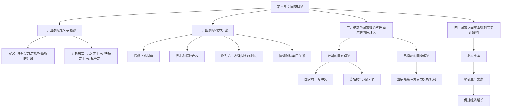

# 1 第六章 国家理论

你好呀！欢迎来到制度经济学的第六章——国家理论。这一章非常重要，因为它把我们之前学过的产权理论和国家这个角色紧密地联系在了一起。在制度经济学家看来，国家可不是一个抽象的概念，而是实实在在影响经济好坏的一个“玩家”。它制定规则，也可能破坏规则。理解了国家，我们才能更深刻地理解为什么有的地方富裕，有的地方贫穷。让我们一起开始探索吧！

### 1.1.1 **本章知识框架总览**



## 1.2 一、国家的定义与起源

> [!TIP] 一句话精髓
> 
> 国家就是一个拥有“合法暴力”的超级组织，它说了算，负责制定和执行规则。

> [!NOTE] 知识框架
> 
> ```
> graph TD;
>     A[国家的定义与起源] --> B{国家是什么?};
>     B --> C[诺斯的定义: 具有暴力潜能的组织];
>     B --> D[巴泽尔的定义: 第三方实施暴力的机制];
>     B --> E[我们的定义: 垄断性、强制性提供法律秩序的组织];
>     A --> F{如何分析国家?};
>     F --> G[无为之手 (放任不管)];
>     F --> H[扶持之手 (帮助市场)];
>     F --> I[掠夺之手 (与民争利)];
> ```

> [!QUOTE] 详细解读
> 
> #### 1. 国家的各种定义（它到底是个啥？）
> 
> 想象一下，在一个没有警察、没有法庭的村庄里，如果两个人发生矛盾，比如张三的牛吃了李四的庄稼，他们可能会吵架，甚至打起来。谁力气大谁就占便宜。这样大家都没法安心生产。为了解决这个问题，大家合计了一下，推举出村里最厉害、最公正的人（或者一群人）来当“裁判”。这个“裁判”有权力说：“张三，你必须赔李四损失！”而且，如果张三不听，这个“裁判”有能力强制他执行。慢慢地，这个“裁判”就演变成了“国家”。
> 
> - **诺斯说**：国家是一个“具有暴力潜能的组织”。这里的“暴力”不是说国家天天打人，而是指它有最终的、合法的强制执行能力，比如警察、军队、法庭。这种能力是别人没有的，是垄断的。它的主要工作就是提供法律和秩序。
>     
> - **巴泽尔说**：国家是一个“第三方实施的暴力机制”。就像上面例子里的“裁判”，它不偏袒任何一方（理论上是这样），专门负责执行规矩（契约）。
>     
> - **我们的总结**：所以，国家就是一个拥有**合法使用暴力**的权力，并且**垄断**了这个权力，**强制性**地为大家提供法律、秩序的这么一个组织。它最终要为一个国家的经济好坏负责。
>     
> 
> #### 2. 分析国家的三种“姿势”（它会怎么做？）
> 
> 经济学家们在看待国家这个“玩家”时，有三种不同的视角，就像给它画了三幅不同的肖像：
> 
> - **“无为之手” (Laissez-faire hand)**
>     
>     - **通俗解释**：国家就像个“佛系”的家长，觉得“儿孙自有儿孙福”，对经济活动基本不管不问，认为市场自己能搞定一切，国家管得越少越好。
>         
>     - **核心思想**：这派观点认为，政府干预只会添乱，破坏市场原有的完美秩序。
>         
> - **“扶持之手” (Helping hand)**
>     
>     - **通俗解释**：国家像个“慈祥”的家长，时刻关心着经济这个“孩子”的发展。哪里有困难，它就去哪里帮忙。比如市场解决不了环境污染问题，国家就出台环保法规；市场没动力修路，国家就来投资基础设施。
>         
>     - **核心思想**：这派观点认为，国家应该扮演一个积极的角色，弥补市场失灵，帮助经济更好地发展。
>         
> - **“掠夺之手” (Grabbing hand)**
>     
>     - **通俗解释**：国家像个“贪婪”的家长，总想着从经济这个“孩子”身上捞好处。它不是为了公共利益，而是为了统治者自己的腰包。它会制定各种对自己有利的规定，限制竞争，压榨民众，把社会财富往自己手里划拉。
>         
>     - **核心思想**：这派观点认为，国家有自私的一面，它的行为可能会损害整个社会的利益，导致经济停滞甚至衰退。新制度经济学特别关注这一面。
>         

## 1.3 二、国家的四大职能

> [!TIP] 一句话精髓
> 
> 国家主要干四件事：制定规则、保护大家的东西、确保规则被遵守、以及当大家的和事佬。

> [!NOTE] 知识框架
> 
> ```
> graph TD;
>     A[国家的四大职能] --> B[1. 提供最多的正式制度];
>     A --> C[2. 对产权进行界定和保护];
>     A --> D[3. 作为第三方强制实施制度];
>     A --> E[4. 协调不同利益集团间的利益关系];
> 
>     B --> B1[制度的性质 (好制度还是坏制度?)];
>     B --> B2[制度的数量 (够用吗?还是太多了?)];
>     B --> B3[制度的效率 (执行起来方便吗?)];
>     C --> C1[为什么保护? (市场交易的前提)];
>     C --> C2[怎么保护? (法治是最好的方式)];
> ```

> [!QUOTE] 详细解读
> 
> #### 1. 提供最多的正式制度（当“规则制定者”）
> 
> 我们生活中绝大多数的正式规则，比如法律、法规、政策，都是国家制定的。国家在提供这些“制度产品”时，面临三个核心问题：
> 
> - **(1) 提供什么性质的制度？**
>     
>     - **解释**：国家制定的规则，是鼓励大家去努力工作、创新创造（比如保护专利），还是鼓励大家去钻空子、搞关系（比如审批流程复杂，寻租空间大）？这决定了一个国家的经济是健康发展还是停滞不前。**制度的质量比数量更重要**。
>         
> - **(2) 制度供给数量够不够？**
>     
>     - **解释**：就像市场上的商品一样，制度也有供给和需求。
>         
>         - **供给不足**：经济发展需要新规则，但国家反应慢，迟迟不推出，就会阻碍发展。
>             
>         - **供给过剩**：国家管得太宽，规定太多太细，让人无所适从，也会增加做事的成本（交易费用）。
>             
>         - **供需相等**：这是最理想的状态。
>             
> - **(3) 制度供给效率高不高？**
>     
>     - **解释**：制定的规则执行起来是否方便、成本低？如果办个证要跑十几个部门、盖上百个章，那效率就太低了。
>         
> 
> #### 2. 对产权进行界定和保护（当“财产守护神”）
> 
> 这是国家最核心的职能之一。
> 
> - **(1) 为什么国家要界定和保护产权？**
>     
>     - **理论上**：从古到今，思想家们都认识到，如果一个人的财产随时可能被别人抢走，他就没有动力去创造财富了。英国的《大宪章》、休谟的《人性论》都在强调保护私有财产的重要性。
>         
>     - **实践中**：市场经济的本质就是产权的交换。你买一个苹果，实际上是购买了这个苹果的所有权。如果产权不清晰，这个苹果到底是谁的都说不清，交易就没法进行。**一个地方的产权保护得越好，资本和人才就越愿意流向那里，经济就越发达。** 国家之间的竞争，很大程度上就是产权保护制度的竞争。
>         
> - **(2) 怎样有效界定和保护产权？**
>     
>     - **答案是法治**。在一个法治国家，产权的保护不是靠某个领导一句话，而是靠公开、透明、稳定的法律。这样，每个人都有一个稳定的预期，知道自己的财富是安全的，从而大大降低了保护产权的成本。
>         
> 
> #### 3. 国家作为第三方来强制实施制度（当“终极裁判”）
> 
> - **解释**：还记得上面张三和李四的例子吗？国家就是那个最权威、最有力量的“第三方裁判”。当人们签订合同（契约）后，如果有人想耍赖，国家就有能力强制他履行合同。因为国家来做这件事，比任何个人或小团体来做都更有效率，成本也更低。这叫“规模经济效应”和“比较优势”。
>     
> 
> #### 4. 国家要协调不同利益集团间的利益关系（当“和事佬”）
> 
> - **解释**：一个社会里有各种各样的人群，比如工人、农民、企业家、教师等等，他们有各自的利益诉求，这些就是“利益集团”。这些集团之间有时会有利益冲突。国家的一个重要职能，就是作为总协调人，调节这些集团之间的矛盾，不让矛盾激化，从而维持社会稳定。
>     

## 1.4 三、诺斯的国家理论与巴泽尔的国家理论

> [!TIP] 一句话精髓
> 
> 诺斯揭示了国家既想让你富裕（好多收税）又想掠夺你的矛盾心理，而巴泽尔则解释了国家是如何从一片混乱中作为“裁判”诞生的。

> [!NOTE] 知识框架
> 
> ```
> graph TD;
>     A[两大国家理论] --> B[诺斯的国家理论];
>     A --> C[巴泽尔的国家理论];
> 
>     B --> B1[核心观点];
>     B1 --> B1a[1. 国家是一种组织];
>     B1 --> B1b[2. 国家与产权紧密相连];
>     B1 --> B1c[3. 国家追求两个相互矛盾的目标];
>     B1 --> B1d[4. 国家存在内在矛盾(“诺斯悖论”)]
> 
>     B1c --> B1c_1[目标一: 统治者租金最大化(自利)];
>     B1c --> B1c_2[目标二: 社会产出最大化(增加税收)];
> 
>     C --> C1[核心观点];
>     C1 --> C1a[1. 国家是第三方暴力实施机制];
>     C1 --> C1b[2. 它的出现需要被有效制约];
>     C1 --> C1c[3. 法律实施取决于成本比较];
> ```

> [!QUOTE] 详细解读
> 
> #### 1. 诺斯的国家理论（一个矛盾的“统治者”）
> 
> 诺贝尔奖得主诺斯对国家的分析非常深刻，是新制度经济学的核心。
> 
> - **(1) 国家也是一种“组织”**：诺斯认为，分析国家和分析一个公司（企业）的逻辑是相通的，它们都是一种组织安排。
>     
> - **(2) 国家与产权的“捆绑”关系**：离开国家，产权就是一句空话。国家决定了什么样的产权结构是被允许和保护的。
>     
> - **(3) 国家追求的两个“矛盾”目标**：这是诺斯理论的精髓！他认为，国家（或者说统治者）脑子里同时在想两件事：
>     
>     - **目标一（自私的目标）**：**让自己捞到最多好处**。统治者会设计一套规则（包括产权制度），来最大化自己的“租金”（就是各种收益）。比如，把赚钱的行业垄断起来，只让自己的亲信去做。
>         
>     - **目标二（长远的目标）**：**让整个社会产出最大化**。因为蛋糕做得越大，统治者能分到的税收才会越多。
>         
>     - **为什么这两个目标是矛盾的？**
>         
>         - 如果统治者只想着**目标一**，过分掠夺，就会打击大家生产的积极性，把经济搞垮，蛋糕变小，最终税收也没了。（杀鸡取卵）
>             
>         - 如果统治者只想着**目标二**，建立一套非常有效率的产权制度，充分保护私人财产，那么他就没法随心所欲地“捞好处”了，自己的直接收益就会减少。
>             
>         - 这种**自利**与**增加税基**之间的冲突，是理解国家行为的关键，也导致了历史上王朝的兴衰更替。
>             
> - **(4) 著名的“诺斯悖论”**
>     
>     > **“国家的存在是经济增长的关键，然而国家又是人为经济衰退的根源。”**
>     
>     - **通俗解释**：这就像水一样，既能载舟，也能覆舟。
>         
>         - **“载舟”的一面**：没有国家来保护产权、提供秩序，经济这部大船寸步难行，所以国家是经济增长的**必要条件**。
>             
>         - **“覆舟”的一面**：国家这个“守护神”随时可能变成“恶龙”，它掌握的巨大权力一旦被滥用，就会限制、侵害甚至掠夺个人财产，导致产权残缺，让经济这部大船沉没。
>             
>     - 这个悖论深刻地揭示了国家内在的、无法消除的二重性。如何限制住国家“作恶”的冲动，同时发挥它“行善”的功能，是所有社会面临的永恒挑战。
>         
> 
> #### 2. 巴泽尔的国家理论（从“丛林”到“法庭”）
> 
> 巴泽尔的理论更侧重于解释国家是如何从无到有演变出来的。
> 
> - **(1) 国家是“第三方暴力实施机制”**
>     
>     - **解释**：他认为，人类社会最早处于一种“霍布斯丛林状态”，人人为敌，谁拳头大谁有理。在这种状态下，交易风险极高，大家都不敢进行长期的合作。为了能安心做买卖，人们需要一个可信的、中立的第三方来执行合同。于是，国家这个“第三方暴力实施机制”就应运而生了。
>         
> - **(2) 国家的出现需要“被套上笼头”**
>     
>     - **解释**：但是，谁来当这个“暴力实施者”呢？如果这个人滥用权力怎么办？所以，巴泽尔强调，只有当这个“暴力实施者”的权力能被有效制约时，国家才能真正出现并稳定下来。否则，它就不是一个保护者，而是一个更大的掠夺者。
>         
> - **(3) 法律的实施是“成本权衡”的结果**
>     
>     - **解释**：国家会不会去保护某项权利，取决于保护它的成本和收益。如果界定和保护一项权利的成本太高，国家可能就会选择不去管。因此，现实中我们看到的法律体系，都是国家在权衡各种成本之后的结果。
>         

## 1.5 四、国家之间竞争对制度变迁影响

> [!TIP] 一句话精髓
> 
> 国家和国家之间的竞争，说到底不是比谁的军队强，而是比谁的“游戏规则”更好，更能吸引人来投资和创造财富。

> [!NOTE] 知识框架
> 
> ```
> graph TD;
>     A[国家间竞争] --> B(实质是制度竞争);
>     B --> C{好制度 vs 坏制度};
>     C -- 好制度 --> D[低交易费用 + 权利有保障];
>     D --> E[吸引大量的生产要素(资本、人才)流入];
>     E --> F[促进本国经济增长];
>     F --> G[对坏制度国家形成压力，迫使其制度变迁];
> ```
> 
> [!QUOTE] 详细解读
> 
> - **竞争的实质是制度竞争**
>     
>     - **解释**：想象一下，有两个相邻的国家，A国和B国。
>         
>         - **A国**：制度优越，法律公正，产权保护得很好，开公司手续简单，税负也合理。
>             
>         - **B国**：制度糟糕，官员腐败，产权没有保障，今天你的工厂还好好的，明天就可能被没收，做什么事都要靠关系。
>             
>     - 结果会怎么样？全世界的资本家和有才能的人，都会更愿意去A国投资、工作。而B国的人才和资本会不断外流。
>         
> - **竞争如何引发制度变迁？**
>     
>     - **流动性**：资本、技术、人才这些“生产要素”是会流动的，它们会“用脚投票”，选择能让它们增值和感到安全的地方。
>         
>     - **压力**：当B国看到A国因为好制度而越来越富强，而自己越来越衰落时，就会感受到巨大的竞争压力。为了不被淘汰，B国的统治者就可能被迫进行改革，学习A国的好制度，改善自己的营商环境。
>         
>     - **结论**：因此，国家之间的竞争，特别是经济上的竞争，是推动制度变迁的一个非常重要的外部力量。它使得那些更有效率、更能降低交易费用、更能保护产权的制度安排，更有可能在竞争中胜出并被模仿和扩散。
>