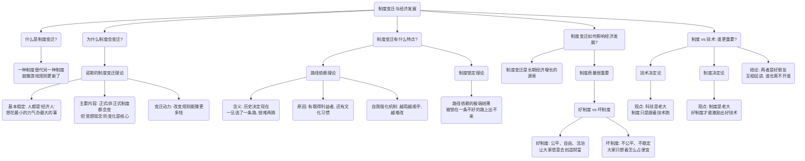

# 1 第七章 制度变迁与经济发展

你好呀！欢迎来到制度经济学的第七章！这一章超级有趣，它探讨的是一个国家是怎么富起来的，或者为什么会一直穷。我们以前可能觉得，一个国家富裕是因为科技发达，但这一章会告诉你一个更深层的秘密：**制度**，也就是我们社会里的各种“游戏规则”，可能才是决定我们贫穷还是富有的关键。

想象一下，我们玩的任何游戏，比如跳棋或者 Monopoly，规则是不是超级重要？规则变了，整个游戏的玩法和结果就都变了。社会也是一个超大的游戏，而这一章就是研究这个大游戏里的规则是怎么变的，以及这些变化怎么影响我们每个人的生活和整个国家的命运。

准备好了吗？让我们一起探索制度变迁和经济发展的奇妙世界吧！

## 1.1 **本章知识框架 (Mermaid 图)**

在我们深入细节之前，先来看一下本章的“地图”，这样我们就不会迷路啦。这张图清晰地展示了本章所有知识点之间的关系。

## 1.2 **一、 诺斯的制度变迁理论**

> **一句话精髓：** 制度就像一个国家的游戏规则，它之所以会改变，是因为有人（比如企业家或政治家）觉得改变规则能给自己带来更大的好处，而这种改变的背后，其实是人们的思想观念在悄悄地发生变化。

想象一下，你是班级的班长。一开始班里的规定是“谁先举手谁回答问题”，后来你发现，这样总是那几个反应快的同学在回答，其他同学没机会。于是你把规则改成“每个小组轮流回答”。这就是一次小小的“制度变迁”。你为什么要改呢？因为你觉得新规则对全班同学的“潜在利润”（这里的利润就是指更好的学习效果）更大。诺斯的理论就是把这个逻辑放大到整个国家层面。

### 1.2.1 **1. 制度变迁的含义**

- **通俗解释：** 就是一个社会的游戏规则发生了变化。可能是旧的规则被新的规则替代了，也可能是在原来的规则上做了修改。比如，以前我们买东西都用现金（旧规则），现在大家都用手机支付（新规则），这就是一次重大的制度变迁。
    
- **专业解读：** 制度变迁是指制度的替代、转换和交易过程。诺斯认为，这种变迁是理解一个国家为什么能长期富裕起来的钥匙。它不像盖房子那样简单，会受到很多社会和技术的限制。
    

### 1.2.2 **2. 诺斯制度变迁理论的基本假定**

诺斯的理论建立在三个“如果……”的基础上，就像玩游戏前的基本设定。

- **(1) “经济人”假定：**
    
    - **给小朋友听：** 想象一下，你口袋里有$5块钱，你想买到最好吃的零食。你不会随便买，而是会比较一下哪个又大又好吃。这就是“经济人”，意思是我们每个人，甚至每个组织、每个国家，在做选择的时候，都想用最小的代价，获得最大的好处。
        
    - **专业解读：** 理论假设个体、组织（如公司、社团）和政府都是理性的，追求自身利益最大化。
        
- **(2) 变迁的诱导因素：**
    
    - **给小朋友听：** 你为什么会想换一个新游戏玩？因为你觉得新游戏可能更好玩、更有挑战性，能给你带来更大的快乐（潜在利润）。制度变迁也是一样，当人们觉得改变现有的规则能赚到更多的钱，或者得到更大的利益时，他们就有动力去推动改变。
        
    - **专业解读：** 制度变迁是被获取潜在利润的期望所驱动的。
        
- **(3) 变迁的必要条件：**
    
    - **给小朋友听：** 你想买一个很贵的玩具（改变制度），但你妈妈告诉你，你必须用未来一年的零花钱来换（改变成本）。如果你觉得这个玩具带给你的快乐，比你一年不吃零食的痛苦要大，你就会买。制度变迁也是如此，只有当改变规则带来的好处，大于改变它所付出的代价时，这种改变才会真正发生。
        
    - **专业解读：** 只有当改变制度的潜在收益大于其成本时，制度变迁才会发生。
        

### 1.2.3 **3. 诺斯制度变迁理论的主要内容**

> **核心思想对比**
> 
> - **传统经济学：** 经济增长靠的是技术进步，比如蒸汽机、电脑的发明。
>     
> - **诺斯的理论：** 技术很重要，但更重要的是**激励**人们去发明和使用这些技术的**制度**。没有好的制度（比如专利保护），谁愿意花大力气去搞发明呢？
>     

- **(1) 制度变迁包括什么？**
    
    - **给小朋友听：** 制度就像一个“大礼包”，里面有三样东西：
        
        1. **正式制度**：写在纸上的、白纸黑字的规则，比如国家的法律、学校的校规。
            
        2. **非正式制度**：没写在纸上，但大家都默认遵守的习惯，比如排队、尊老爱幼、诚实守信。
            
        3. **实施机制**：确保这些规则能被执行的力量，比如警察、法院、老师的监督。
            
    - **诺斯的特别关注点：** 他特别强调**非正式制度**，尤其是**意识形态**（就是人们的世界观、价值观）的重要性。他认为，法律可以一夜之间改变，但人们脑子里的想法很难改变，而这才是决定制度变迁成败的关键。
        
- **(2) 制度变迁的两种方式**
    
    - **通俗解释：** 规则的改变有两种速度。
        
        1. **激进式（非连续性）变迁**：像地震一样，突然发生剧烈变化。通常是指一个国家的根本大法（正式制度）通过暴力革命等方式被彻底改变。
            
        2. **渐进式（连续性）变迁**：像小草发芽一样，慢慢地、一点一点地变化。这通常是指人们的习惯、观念（非正式制度）在潜移默化中演进。
            
    - **诺斯的观点：** 他认为，历史上的大多数制度变迁都是**渐进式**的，就像温水煮青蛙，这种悄无声息的变化对经济发展的长期影响最大。
        
- **(3) 制度变迁的渐进性特征分析**
    
    - **什么引发了渐进式变迁？**
        
        - **最直接的原因：相对价格变化。**
            
            - **给小朋友听：** 想象一下，以前请人写一封信需要10块钱，而打一个长途电话要100块。大家都会选择写信。后来技术进步了，打电话只要$1块钱了，而写信的成本没变。这时，“价格”关系变了，大家的行为就都变成了打电话。
                
            - **专业解读：** 当生产要素（如劳动力、土地）的价格比例、获取信息的成本、或者技术水平发生变化时，就会改变人们的成本-收益计算，从而诱导他们改变行为，进而推动制度变迁。
                
        - **更深层的原因：思想观念的过滤。**
            
            - **给小朋友听：** 同样是“打电话比写信便宜”这个事实，有的人会想“太好了，以后联系方便了”，而有的人可能会想“手写的信才有感情，我不喜欢冷冰冰的电话”。人们会用自己脑子里的“滤镜”（也就是思想、观念）去理解和解读这个价格变化。
                
            - **专业解读：** 诺斯认为，单纯用价格变化来解释人类行为太简单了。相对价格的变化必须经过人们“心智模式”（Mental Models）的过滤，才能转化成具体的行为。因此，**思想、观念、意识形态**在制度变迁中扮演了至关重要的角色。
                
- **(4) 为什么意识形态如此重要？**
    
    - **第一，意识形态是“节约机制”。**
        
        - **给小朋友听：** 你看到红灯会停，看到绿灯会走，几乎不用思考。这是因为“红灯停，绿灯行”这个规则已经变成了你脑子里的“默认程序”，帮你省去了每次都要判断“现在过马路安不安全”的麻烦。意识形态就像这种“默认程序”，它简化了我们对复杂世界的认识，从而降低了我们做决策的成本。
            
    - **第二，意识形态关乎“公平”的判断。**
        
        - **给小朋友听：** 老师说，这个星期表现好的同学可以得到一朵小红花。如果大家心里都觉得“表现好=得奖励”是公平的，那么这个规则就很容易执行，大家都会努力表现。但如果大家觉得“老师偏心，只给她的‘小可爱’发”，那么这个规则就没人信了，执行起来成本就特别高。
            
        - **专业解读：** 意识形态的核心内容之一，就是人们对一项制度是否“公平”、“正义”的主观评价。当社会成员普遍认为某项制度是公平时，执行这项制度的成本（比如监督、惩罚的费用）就会大大降低。反之，成本就会急剧升高。
            
    - **第三，意识形态与国家和产权紧密相连。**
        
        - **给小朋友听：** 国家制定了法律来保护你的玩具不被别人抢走（保护产权）。你是否相信国家能做到这一点，并且认为这样做是“对的”，这就是一种意识形态。如果你和大多数人都相信，那么社会就会很稳定，大家也愿意去创造更多的“玩具”（财富）。
            
        - **专业解读：** 随着社会分工越来越复杂，人与人之间的交易需要一个强大的第三方（国家）来强制执行合同和保护产权。但国家如何保护、保护得好不好，很大程度上取决于国民的意识形态。人们会根据自己的价值观来判断国家行为的合法性，这直接影响到制度的实施效果。
            

## 1.3 **二、 制度变迁的路径依赖理论和制度锁定理论**

> **一句话精髓：** 历史很重要，我们一旦选择了一条路，就像坐上了一列无法轻易掉头的火车，即使发现前方有更好的路线，也很难再变道了，甚至可能被“锁定”在这条旧轨道上。

### 1.3.1 **1. 路径依赖理论**

- **(1) 路径依赖的含义**
    
    - **起源故事：** 这个词最早来自生物学，说的是一个物种的进化路径，一旦选定了，后面的子子孙孙就只能沿着这条路走下去。后来，经济学家保罗·戴维用一个著名的例子把它带到了经济学领域。
        
    - **QWERTY键盘的例子：**
        
        - **给小朋友听：** 你看我们现在用的电脑键盘，第一排字母是“QWERTY”开头的。这个布局其实不是为了让我们打字更快，恰恰相反，它是为了在早期打字机时代，让人们打字**慢一点**，防止机械杆卡住。后来技术进步了，卡杆问题解决了，出现了更科学、打字更快的键盘布局。但为什么我们还在用这个“慢”键盘呢？因为所有人都已经习惯了它，打字员的培训、键盘的生产线全都基于它，换一个新的键盘布局成本太高了！我们被“锁定”在了这条“QWERTY”的路径上。
            
    - **专业解读：** 路径依赖指人们过去的选择决定了他们现在的可能选择。经济体系或制度一旦进入某一路径，就会由于各种原因（如学习效应、协调效应）自我强化，导致对这种路径的依赖。这意味着，**历史至关重要**。
        
- **(2) 制度变迁的路径依赖**
    
    - **通俗解释：** 一个国家的游戏规则也是如此。它在历史上是如何形成的，会深深地影响它今天和未来的样子。比如，一个国家历史上一直是中央集权，那么它在进行现代化改革时，就很难一下子变成一个完全分权的国家，总会带有过去的影子。
        
    - **专业解读：** 指一种制度一旦形成，无论其效率高低，都会在一定时期内持续存在并自我强化，从而影响后续的制度选择。制度变迁只能沿着已经铺设好的轨道进行。
        
- **(3) 路径依赖产生的原因**
    
    - **给小朋友听：** 为什么我们很难离开“QWERTY”这条老路？
        
        1. **有“既得利益者”：** 那些已经熟练掌握这套打字法的人、生产这种键盘的工厂，他们可不希望改变，因为改变会损害他们的利益。
            
        2. **有“文化传统和习惯”：** 就像我们习惯了用筷子吃饭一样，这种长年累月形成的习惯（非正式制度），是非常强大的力量，改变它需要很长时间。
            
    - **诺斯的解释（心智模式与政治过程）：** 诺斯认为，由于我们认识世界的能力是有限的（心智模式不完备），加上政治活动中讨价还价的成本很高，导致最初可能并不高效的制度，会催生出依赖这套制度生存的组织和集团（既得利益者）。这些集团会反过来影响政治决策，维护现有制度，从而让一些没效率的制度长期存在。
        
- **(4) 自我强化机制（为什么越走越难回头？）**
    
    - 诺斯和其它学者认为，制度会像滚雪球一样，越滚越大，这就是自我强化。主要有以下几种力量：
        
        1. **初设成本高：** 设计一套新制度就像盖一座大楼，一开始要投入很多钱和精力。一旦建好了，再加一层或者装修一下的成本就低多了。所以大家宁愿在旧制度上修修补补，也不愿推倒重来。
            
        2. **学习效应：** 组织和个人会不断学习如何在现有规则下玩得更好、赚得更多。他们的知识和技能都是围绕现有制度建立的，这些知识反过来又巩固了这套制度。
            
        3. **协调效应：** 一项核心制度（比如市场经济）确立后，会像磁铁一样，吸引很多配套制度（如公司法、合同法、会计准则）向它靠拢，形成一个庞大而复杂的网络。想改变其中一个，就得牵动整个网络，非常困难。
            
        4. **适应性预期：** 当大家都习惯了在某种规则下生活和做生意，就会形成稳定的预期。比如，大家都预期明年政策不会大变，就会放心地做长期投资。这种稳定的预期本身就成了一种不想改变的理由。
            

### 1.3.2 **2. 制度锁定理论**

- **通俗解释：** 这是路径依赖最糟糕的结果。就像你坐的火车，不仅不能换轨道，还开进了一个死胡同，彻底卡住了，出不来了。
    
- **专业解读：** 指制度变迁沿着既定的、可能是错误的路径持续自我强化，最终被“锁定”在一种无效率的状态中。一旦进入锁定，除非有非常强大的外部力量（如政府的强力干预、战争等）介入，否则几乎不可能靠自身力量摆脱。
    

## 1.4 **三、 制度变迁对长期经济发展的影响**

> **一句话精髓：** 好的制度就像肥沃的土壤，能长出经济发展的参天大树；坏的制度就像盐碱地，什么都长不出来。一个国家是穷是富，长期来看，关键就看它的“制度土壤”好不好。

### 1.4.1 **1. 制度变迁对长期经济发展的影响**

- **历史学家的共识：**
    
    - **奥尔森：** 比较了穷国和富国，发现他们之间人均收入的巨大差距，主要是由**制度和经济政策**决定的。
        
    - **刘易斯：** 认为制度变化和经济发展是**相互促进**的好朋友。
        
    - **库兹涅茨：** 认为现代经济增长虽然靠技术，但技术只是“潜在”的力量，必须有相应的**制度和意识形态**调整，才能把技术的潜力发挥出来。
        
    - **诺斯（集大成者）：** 直接指出，经济增长的历史，就是**制度创新的历史**。制度创新通过降低交易成本（也就是做生意的各种麻烦成本），让越来越复杂的交换成为可能，这才是经济增长的真正秘密。
        

### 1.4.2 **2. 制度质量对经济发展的影响**

- **什么是制度质量？**
    
    - **通俗解释：** 就是制度的“好”与“坏”。能鼓励大家努力工作、创造财富，并且分配相对公平的，就是**好制度**。反之，让大家整天想着投机取巧、钻空子、占别人便宜的，就是**坏制度**。
        
    - **关键要素：** 一个高质量的市场经济制度，离不开**自由、平等、民主、法治**这些核心要素。没有这些，市场经济也可能变成一个“坏”的市场经济。
        
- **制度质量如何影响经济发展？**
    
    1. **解释国家间的贫富差距：** 制度质量是解释为什么有些国家竞争力强、经济表现好，而另一些国家却停滞不前的主要原因。
        
    2. **实现共享式增长：** 好的制度和政府治理能力，能让经济增长的成果惠及更多人，而不是只被少数人占有。
        
    3. **促进社会和谐：** 高质量的制度可以减少社会矛盾和冲突。
        
    4. **引导企业家的行为：**
        
        - **给小朋友听：** 在一个好制度的国家，一个聪明人会想：“我怎样才能发明一个新产品，满足大家的需求来赚钱？”（这是**生产性**的，创造财富）。
            
        - 在一个坏制度的国家，一个聪明人可能会想：“我怎样才能和官员搞好关系，拿到独家经营权，然后涨价来赚钱？”（这是**非生产性**的，也叫“寻租”，只是在重新分配财富，而不是创造新财富）。
            
        - **专业解读：** 制度质量决定了一个国家的精英人才，是把他们的聪明才智用于创造价值，还是用于分利和掠夺。
            

## 1.5 **四、 经济发展的“技术决定论”和“制度决定论”**

> **一句话精髓：** 关于经济发展的动力，有人说是“技术”这位超级英雄，也有人说是“制度”这位幕后军师。但真相是，他们俩是一个团队，谁也离不开谁，需要并肩作战。

### 1.5.1 **1. 经济发展的“技术决定论”**

- **核心观点：** 科学技术是决定经济社会发展的**最关键因素**，制度只是被动地跟着技术跑。
    
- **两个核心命题：**
    
    1. 技术是**自主**的，它有自己的发展逻辑，会自我成长，不可阻挡。
        
    2. 技术变迁**决定**制度变迁和社会发展。
        
- **典型代表：** 马克思主义的“生产力决定生产关系”就是典型的技术决定论。
    
- **局限性：** 历史上有许多时期，并没有重大的技术突破，但社会生产率却提高了，经济也发展了。技术决定论解释不了这些现象。
    

### 1.5.2 **2. 经济发展的“制度决定论”**

- **核心观点（新制度经济学的主张）：** 制度在经济发展中扮演着**决定性**的角色。制度创新**决定**技术创新。
    
- **逻辑链条：**
    
    1. 一个社会先要有**高效率的制度**（比如清晰的产权保护、公平的市场竞争规则）。
        
    2. 这种制度会**激励**人们去投资、去创新、去追求知识和技术。
        
    3. 最终才会带来技术进步和经济增长。
        
- **结论：** 制度，而非技术，才是决定**长期**经济增长的关键。即使没有技术创新，单靠制度创新（比如中国农村的家庭联产承包责任制），也能实现经济增长。
    

### 1.5.3 **3. 技术变迁和制度变迁的联系与互动**

- **正确的关系：** 它们不是“谁决定谁”的简单关系，而是**紧密联系、互相影响、互相促进**的。
    
- **技术如何影响制度？**
    
    1. **创造新的获利机会：** 比如，互联网技术的发展，使得电子商务（一种新的企业制度）变得有利可图。
        
    2. **降低制度变迁成本：** 信息技术的发展，让政府推行新政策、收集反馈的成本大大降低。
        
    3. **形成对新制度的需求：** 新技术的出现，会带来新的财富和利益分配格局，这就需要新的制度来规范和调整。
        
- **互动模式：** 通常，在经济活动中，往往是**技术进步**率先发生，它打破了原有的平衡，对现行制度提出了挑战和新的要求，从而**诱导制度变迁**。从这个角度看，技术创新是制度创新的重要源泉和动力。