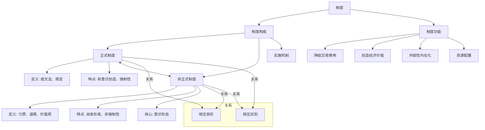
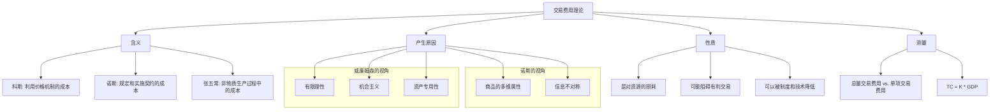
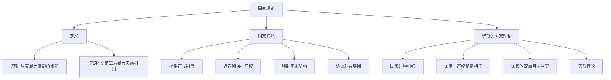

# 1 制度经济学复习笔记
## 1.1 总览：课程复习重点

```mermaid
graph TD;
    A[制度经济学核心] --> B[第一章: 导论];
    A --> C[第二章: 制度与人类行为];
    A --> D[第三章: 交易费用理论];
    A --> E[第四章: 产权理论];
    A --> F[第五章: 集体行动理论];
    A --> G[第六章: 国家理论];
    A --> H[第七章: 制度变迁与经济发展];
    B --> B1[新制度经济学的行为假设];
    B --> B2[研究对象];
    C --> C1[制度构成: 正式与非正式];
    C --> C2[制度功能与实施机制];
    C --> C3[两者关系];
    D --> D1[交易费用的含义与原因];
    D --> D2[交易费用的性质];
    D --> D3[总量与单项交易费用关系];
    E --> E1[产权的构成与属性];
    E --> E2[产权的保护];
    E --> E3[科斯定理];
    F --> F1[集体行动的影响因素];
    F --> F2[奥尔森集体行动理论];
    F --> F3[集体行动困境: 寻租/分利联盟];
    G --> G1[诺斯国家理论];
    G --> G2[国家的职能];
    G --> G3[诺斯悖论];
    H --> H1[路径依赖与制度锁定];
    H --> H2[制度质量对经济发展的影响];
    H --> H3[技术变迁与制度变迁关系];
    subgraph 核心问题
        B1; B2;
    end
    subgraph 基础概念
        C1; C2; C3;
    end
    subgraph 核心理论
        D1; D2; D3;
        E1; E2; E3;
        F1; F2; F3;
        G1; G2; G3;
    end
    subgraph 应用与发展
        H1; H2; H3;
    end
```

## 1.2 第一章：导论 - 新制度经济学的起点
> **一句话精髓**: 新制度经济学认为，人不是全知全能的神，社会也不是完美无缺的天堂，正因为人的“有限”和现实的“不完美”，才需要“制度”这个东西来让世界运转得更好。
### 1.2.1 核心概念
#### 1.2.1.1 **行为假设 (Behavioral Assumptions)**
- **小白入门**: 想象一下，传统的经济学认为我们每个人都像一台超级计算机，能瞬间算出怎么做对自己最有利，这叫“完全理性经济人”。但新制度经济学说，别傻了，我们都是普通人，脑子没那么好使，信息也没那么全，我们只能做到**有限理性 (Bounded Rationality)**。
- **大师详解**:
    > 有限理性: 由赫伯特·西蒙提出，指人们在做决策时，主观上追求理性，但客观上受到自身认知能力、获取信息的成本和时间等限制，只能在有限的范围内做出相对满意的决策，而不是最优决策。
    > 
    > 机会主义 (Opportunism): 这是另一个重要假设。指的是人们在交往中，为了自身利益而可能采取的欺骗、撒谎、违约等“不老实”的行为。这和“有限理性”加在一起，就解释了为什么社会需要制度来约束行为，降低人与人之间打交道的风险。
#### 1.2.1.2 **研究对象 (Research Object)**
- **小白入门**: 就是研究社会上的各种“游戏规则”（制度）本身，以及这些规则如何影响经济活动。
- **大师详解**: 新制度经济学关注的是**制度、制度安排、制度变迁以及制度与经济绩效之间的关系**。它试图回答：制度是如何产生和演化的？为什么有的国家富裕，有的国家贫穷？这背后的制度原因是什么？
## 1.3 第二章：制度与人类行为 - 社会的游戏规则
> **一句话精髓**: 制度就像交通规则，有的是写在法典里的“红灯停，绿灯行”（正式制度），有的则是大家约定俗成的“女士优先”（非正式制度），两者共同指挥着社会这部大车如何前行。
### 1.3.1 知识框架

### 1.3.2 核心概念详解
#### 1.3.2.1 **正式制度 (Formal Institutions)**
- **小白入门**: 就是白纸黑字写出来的规则，比如国家的宪法、法律、公司的规章制度。这些是国家或组织强制你必须遵守的，不遵守就会受到惩罚。
- **大师详解**:
    > 定义: 人们有意识地创造的、由成文的相关规定构成的规范体系，它们在组织和社会活动中具有明确的合法性，并靠组织的正式结构（如政府、法院）来实施。
    > 
    > 例子: 《劳动合同法》规定了公司必须为员工缴纳社保，这就是一个正式制度。
#### 1.3.2.2 **非正式制度 (Informal Institutions)**
- **小白入门**: 就是那些没写下来，但大家都默认遵守的规矩。比如排队、尊老爱幼、诚实守信这些。违反了它，你可能不会被警察抓走，但会受到良心的谴责或者周围人的鄙视。
- **大师详解**:
    > 定义: 在人们长期生活交往中自发形成的、不成文的行为规范，如习惯、惯例、风俗、传统、价值观、道德观念、伦理规范、意识形态等。
    > 
    > 核心是意识形态: 意识形态是人们对世界最根本的看法，它像一个“思想滤镜”，深刻地影响着我们如何看待和遵守正式制度。
#### 1.3.2.3 **正式与非正式制度的关系**
- **小白入门**:
    - **互相补充**: 法律不可能规定所有事，很多时候需要道德来补充。
    - **可能冲突**: 有时候法律规定和传统习惯会打架。比如，法律提倡男女平等，但在一些传统观念很深的地方，可能仍然存在重男轻女的现象。一个好的社会，是让法律和道德尽量“情投意合”。
- **大师详解**:
    - **相互依存**: 正式制度的有效实施，需要非正式制度（如民众的认同和支持）的配合。非正式制度也需要正式制度来提供最终的保障。
    - **相互区别**:
        - **变迁速度**: 正式制度（如颁布新法律）可以一夜改变，但非正式制度（改变一个人的观念）非常缓慢。
        - **移植性**: 法律条文可以从一个国家复制到另一个国家，但文化传统很难。
        - **供给主体**: 正式制度主要由政府提供，非正式制度来自民间。
#### 1.3.2.4 **实施机制 (Implementation Mechanism)**
- **小白入门**: 规则定好了，得有人来执行和监督才行。警察、法院、甚至是你我这样的普通人，都是实施机制的一部分。如果规则没人执行，那就是一张废纸。
- **大师详解**: 制度实施机制是确保制度被遵守的关键。它包括了所有用于监督、裁决和惩罚违规行为的组织和程序。一个国家制度好不好，很大程度上就看它的实施机制强不强。
#### 1.3.2.5 **制度的主要功能**
- **降低交易费用**: 明确的规则让大家不用每次交易都去讨价还价、斗智斗勇，节省了时间和精力。
- **创造经济价值**: 好的制度能把“死”的财富变成“活”的资本。比如，专利制度保护了发明，激励了创新，从而创造了更多财富。
## 1.4 第三章：交易费用理论 - 做任何事都有的“隐形成本”
> **一句话精髓**: 除了买东西本身花的钱（生产成本），为了达成这笔交易而付出的所有努力，比如找卖家、谈价格、签合同、防止被骗所花的时间和精力，都叫“交易费用”。
### 1.4.1 知识框架

### 1.4.2 核心概念详解
#### 1.4.2.1 **交易费用的含义 (Definition)**
- **小白入门**: 想象一下你要在网上买一部二手手机。你花的时间（搜索信息、对比价格）、精力（和卖家聊天、担心被骗）、以及可能的风险（手机是坏的），这些都是交易费用。
- **大师详解**:
    > 科斯: “利用价格机制的成本”。
    > 
    > 诺斯: “规定和实施构成交易基础的契约的成本。”
    > 
    > 张五常: “所有那些在鲁宾逊经济中不可能存在的成本。”（鲁滨逊一人在孤岛上，没有交换，也就没有交易费用）。
#### 1.4.2.2 **交易费用产生的原因**
- **威廉姆森的解释**:
    1. **有限理性**: 我们没法知道关于交易的所有信息。
    2. **机会主义**: 交易的对方可能会骗我们。
    3. **资产专用性**: 比如，你为了给特定客户生产一种特殊零件而买了一台专用机器，这台机器很难再用作他途。一旦客户毁约，你的机器就砸手里了，这种风险也增加了交易费用。
- **诺斯的解释**:
    1. **商品的多维属性**: 一个商品（比如苹果）有很多属性（大小、甜度、产地、有无农药），我们很难完全了解和衡量所有属性。
    2. **信息不对称**: 卖家通常比买家更了解商品的真实情况，这就为机会主义行为（如隐瞒缺陷）创造了条件。
#### 1.4.2.3 **交易费用的性质**
1. **是对稀缺资源的损耗**: 花在交易上的时间、金钱和精力，本可以用在生产上。
2. **可能阻碍有利的交易**: 如果交易费用太高（比如办个证要盖100个章），很多人可能就放弃这笔生意了。
3. **可以被降低**: 好的制度（如清晰的法律、诚信的社会风气）和技术（如互联网平台）可以大大降低交易费用。
#### 1.4.2.4 **总量交易费用 vs. 单项交易费用**
- **小白入门**:
    - **总量**: 整个国家一年为所有交易付出的总成本。
    - **单项**: 你个人做一笔交易所付出的成本。
    - **关系**: 一个国家的经济越发达，分工越细，交易越多，所以**总量**交易费用会越高。但是，因为交易量大，服务交易的设施（如网络、物流）会更完善，所以平均到每笔交易的**单项**费用反而会更低。
- **大师详解**:
    > 关系: 经济总量越大 ➡️ 交易费用总量越多 ➡️ 单项交易费用越少。
    > 
    > 反之，经济总量越小 ➡️ 交易费用总量越少 ➡️ 单项交易费用越多。
    > 
    > 因此，我们可以通过一个国家单项交易费用的高低来判断其发达程度。
    > 
    > 公式:
    > 
    > TC=K×GDP
    > 
    > - TC: 交易费用总量 (Total Transaction Cost)
    >     
    > - GDP: 国民收入总量 (Gross Domestic Product)
    >     
    > - K: 交易费用系数，代表交易费用占GDP的比重 (0<K<1)。
    >     
    >     公式解读: 这个公式直观地表达了总量交易费用与国民经济规模成正比。一个国家的经济体量越大，其内部发生的交换活动就越多、越复杂，因此维持这个巨大交换网络运转所需要的“润滑成本”（即交易费用）自然也就越多。
    >     
## 1.5 第四章：产权理论 - “这是我的！”
> **一句话精髓**: 产权就是明确“东西是谁的，谁能用，用了能得到什么好处，以及能不能卖给别人”的一套规则，它是市场经济的基石。
### 1.5.1 知识框架
```mermaid
graph TD;
    A[产权理论] --> B[构成];
    B --> B1[所有权];
    B --> B2[使用权];
    B --> B3[收益权];
    B --> B4[转让权];
    A --> C[属性];
    C --> C1[排他性];
    C --> C2[可分割性];
    C --> C3[可交易性];
    C --> C4[永久性];
    A --> D[保护产权];
    D --> D1[为何保护: 激励/稳定预期];
    D --> D2[如何保护: 法律/国家];
    A --> E[科斯定理];
    E --> E1[科斯定理Ⅰ (交易费用=0)];
    E --> E2[科斯定理Ⅱ (交易费用>0)];
    E --> E3[科斯定理Ⅲ (产权界定)];
```
### 1.5.2 核心概念详解
#### 1.5.2.1 **产权的构成 (A Bundle of Rights)**
产权不是单一的权利，而是一束权利的集合。
1. **所有权**: 最终决定这个东西归谁的权利。
2. **使用权**: 使用这个东西的权利。
3. **收益权**: 从这个东西中获得好处（如租金、利润）的权利。
4. **转让权**: 把这些权利卖给别人的权利。
> **例子**: 你买了一套房子。
> 
> - 房产证上是你的名字，这是**所有权**。
>     
> - 你可以自己住，这是**使用权**。
>     
> - 你可以把房子租出去收租金，这是**收益权**。
>     
> - 你可以把房子卖掉，这是转让权。
>     
>     这些权利可以被分割。比如，你把房子租给别人，你就暂时出让了使用权，但保留了所有权、收益权和最终的转让权。
>     
#### 1.5.2.2 **产权的属性**
- **排他性**: 你拥有这个东西，别人就不能随便用。
- **可分割性**: 一束权利可以分开给不同的人。
- **可交易性**: 权利可以在市场上买卖。
- **永久性**: 产权是受长期保护的，这才能给人稳定的预期去投资和创造。
#### 1.5.2.3 **为什么要保护产权？**
- **小白入门**: 如果你的东西随时可能被别人抢走，你还会有心思去努力工作、去创造发明吗？肯定不会。所以，保护产权就是保护大家的劳动积极性。
- **大师详解**:
    1. **激励功能**: 明确的产权给人稳定的收益预期，激励人们去创造和积累财富。
    2. **外部性内在化**: 产权界定清楚后，污染等外部成本就可以内部化。比如，规定河流的产权归某个主体，那么污染者就需要向这个主体付费，从而将污染的社会成本转变为其自身的私人成本。
    3. **资源配置**: 产权清晰且可交易，资源才能从不擅长利用它的人手中，流向更擅长利用它的人手中，实现优化配置。
#### 1.5.2.4 **科斯定理 (Coase Theorem)**
这是产权理论的核心，也是诺贝尔奖级的思想。
- **科斯定理Ⅰ (理想世界)**:
    > 内容: 如果交易费用为零，那么无论产权最初如何界定，通过市场交易，资源最终都会配置到效率最高的地方。
    > 
    > 小白入门: 牧场主和农民是邻居，牛吃了农民的庄稼。
    > 
    > - **情况1 (产权归农民)**: 农民有权索赔。牧场主为了继续养牛，会和农民谈判，要么花钱给农民补偿，要么花钱修篱笆，他会选择成本更低的方式。
    >     
    > - **情况2 (产权归牧场主)**: 牧场主有权让牛随便吃。农民为了保护庄稼，会和牧场主谈判，要么花钱请牧场主修篱笆，要么自己修篱笆，他也会选择成本更低的方式。
    >     
    > - 结论: 不管最初法律规定谁对谁错，只要他们俩可以零成本地聊天、谈判、签合同，最后的结果（修篱笆）都是一样的，都是为了实现总产值最大化。
    >     
    >     注意: 这个定理的核心是“交易费用为零”，这是一个非常理想化的前提。
    >     
- **科斯定理Ⅱ (现实世界)**:
    > 内容: 当交易费用为正时，产权的初始界定就非常重要了，因为它会影响到最终的资源配置效率。
    > 
    > 小白入门: 还是上面那个例子。如果牧场主和农民谈判的成本很高（比如两人互相不信任，请律师打官司要花很多钱），那么法律最初把产权判给谁，结果可能就完全不同了。如果判给农民，牧场主可能因为赔不起或修不起篱笆而放弃养牛；如果判给牧场主，农民可能因为没钱修篱笆而只能忍受损失。
    > 
    > 结论: 在现实中，法律和制度的设计（即产权的初始界定）至关重要，应该尽可能地将产权赋予能使社会总价值最大的那一方。
- **科斯定理Ⅲ (引申义)**:
    > 内容: 清晰地界定和保护产权，本身就是降低交易费用的重要方式。
    > 
    > 精髓: 科斯定理的真正意义不在于那个“交易费用为零”的乌托邦，而在于强调了在“交易费用不为零”的现实世界里，一个清晰、稳定、可执行的产权制度是市场有效运行的根本前提。
## 1.6 第五章：集体行动理论 - “人多”不一定“力量大”
> **一句话精髓**: 个人理性不等于集体理性，如果没有好的组织和激励，一个群体的成员往往都想“搭便车”，坐享其成，最终导致对大家都有利的事情反而没人做。
### 1.6.1 知识框架
```mermaid
graph TD;
    A[集体行动理论] --> B[影响因素];
    B --> B1[集团规模大小];
    B --> B2[个人获益程度];
    B --> B3[组织成本];
    B --> B4[选择性激励];
    A --> C[奥尔森理论];
    C --> C1[小集团优势];
    C --> C2[搭便车问题];
    C --> C3[寻租 (Rent-seeking)];
    C --> C4[分利联盟 (Distributional Coalition)];
    A --> D[集体行动困境];
    D --> D1[决策困难];
    D --> D2[数量悖论];
    D --> D3[特殊利益集团形成];
```
### 1.6.2 核心概念详解
#### 1.6.2.1 **集体行动的困境：搭便车 (Free-rider Problem)**
- **小白入门**: 宿舍里大家都想搞卫生，让环境变好（这是集体利益）。但每个人都想：“等别人去扫吧，反正扫干净了我也能享受到。”结果就是，每个人都等别人，最后谁也不扫，宿舍越来越脏。这种想不劳而获的行为就叫“搭便车”。
- **大师详解**: 集体行动旨在提供“公共物品”（一旦提供，群体内每个人都能受益，且无法排斥他人使用）。由于公共物品的非排他性，理性自利的个人会倾向于不为公共物品的供给做出贡献，而坐等分享他人努力的成果。
#### 1.6.2.2 **奥尔森的集体行动理论**
- **核心观点**:
    1. **集团规模是关键**:
        - **小集团**更容易成功。因为人少，每个人的贡献都看得见，搭便车不容易，也更容易协调和监督。
        - **大集团**很难成功。因为人多，个人的贡献微不足道，搭便车的诱惑极大，组织和协调成本非常高。
    2. **选择性激励 (Selective Incentives)**: 要克服搭便车，需要给那些做出贡献的成员一些“私人物品”作为奖励，或者对不贡献的成员进行惩罚。比如，工会会给会员提供法律援助（这是不入会就享受不到的），这就是一种选择性激励。
#### 1.6.2.3 **寻租 (Rent-seeking)**
- **小白入门**: 企业不通过提高生产效率来赚钱，而是通过搞关系、走后门，去游说政府给自己一些特权（比如垄断经营权、免税政策），从而获得超额利润。这种“租”不是房租，而是“垄断租金”或“特权收益”。这种行为本身不创造任何社会财富，只是将社会财富从一部分人手里转移到另一部分人手里，是一种纯粹的消耗。
- **大师详解**: 寻租是指个人或利益集团通过非生产性活动，利用政治过程来影响公共政策，以获得对自身有利的特殊收益。这是集体行动在政治领域的一种负面表现。
#### 1.6.2.4 **分利联盟 (Distributional Coalition)**
- **小白入门**: 一些组织严密的小利益集团（比如某个行业协会），它们行动的最终目的不是把整个社会的“蛋糕”做大，而是想方设法从现有的“蛋糕”里为自己多切一块。这种联盟多了，整个社会的经济活力就会下降，因为大家都忙着去“分蛋糕”而不是“做蛋糕”了。
- **大师详解**: 奥尔森用“分利联盟”来解释国家的兴衰。一个社会如果长期稳定，各种分利联盟就会越来越多、越来越固化，它们会通过游说等方式阻碍技术进步和制度创新，维护自身既得利益，最终导致整个经济僵化和衰退。
#### 1.6.2.5 **制度决定中的“数量悖论”**
- **小白入门**: 这就是奥尔森理论最反直觉的结论。在社会博弈中，往往是那些**人数少但组织严密**的特殊利益集团（如行业巨头）能够影响政策，而**人数众多但一盘散沙**的普通大众（如消费者、纳税人）的利益反而常常被忽视。
- **大师详解**: 这是因为小集团克服了集体行动的困境，而大集团没有。因此，民主社会中的“多数决定”原则，在现实中可能演变成“有组织的少数”决定了“无组织的多数”的命运。
## 1.7 第六章：国家理论 - 必要的“恶”？
> **一句话精髓**: 国家既是保护我们财产安全、促进经济增长的关键（像个保安），但它本身又拥有最强的暴力，可能反过来侵害我们、阻碍发展（像个潜在的强盗）。理解这种内在矛盾是理解国家理论的核心。
### 1.7.1 知识框架

### 1.7.2 核心概念详解
#### 1.7.2.1 **国家的定义**
- **诺斯**: 国家是一个在特定地理范围内，对暴力拥有合法垄断权的组织。
- **核心**: 暴力垄断 + 提供公共服务（法律、秩序）。
#### 1.7.2.2 **国家的四大职能**
1. **提供正式制度**: 国家是法律、法规等最重要制度的供给者。
2. **界定和保护产权**: 这是国家最核心的经济职能。没有国家的强制力保护，产权就是一句空话。
3. **作为第三方强制实施契约**: 当交易双方发生纠纷时，国家（通过法院）充当公正的第三方来裁决和执行。
4. **协调不同利益集团的关系**: 充当社会矛盾的“调节器”，维持社会稳定。
#### 1.7.2.3 **诺斯的国家理论**
- **核心观点**:
    1. **国家的双重目标**:
        - **目标一 (统治者私利)**: 制定一套产权规则，使得**统治者自身的租金最大化**。
        - **目标二 (社会总产出)**: 降低交易费用，使得**整个社会的产出最大化**，这样国家的税收基础才能扩大。
    2. **目标冲突**: 这两个目标是**根本矛盾**的。为了让统治者自己捞钱最多而设计的制度（比如各种垄断和特权），往往会损害市场效率，阻碍社会总产出增长。反之，能让社会总产出最大的高效产权制度（比如自由竞争），又会限制统治者攫取租金的能力。
#### 1.7.2.4 **诺斯悖论 (North Paradox)**
> **“国家的存在是经济增长的关键，然而国家又是人为经济衰退的根源。”**
- **小白入门**:
    - **好的一面**: 我们需要一个强大的国家来保护我们，防止天下大乱，这样我们才能安心生产。
    - **坏的一面**: 这个强大的国家本身也可能成为最大的威胁。它有能力制定规则，就同样有能力破坏规则来为自己牟利，比如随意征税、侵占私人财产。
- **大师详解**: 这个悖论揭示了国家内在的二元性。一方面，国家权力是有效产权和经济发展的**必要条件**（提供秩序和保护）；另一方面，国家权力又是对产权和个人自由的**最大潜在威胁**（掠夺之手）。一个国家能否实现长期繁荣，关键就在于能否找到一套制度，既能让国家强大到足以保护产权，又能有效限制国家权力本身，防止它反过来侵害产权。这正是现代法治国家试图解决的核心问题。
## 1.8 第七章：制度变迁与经济发展 - 历史的车轮如何前行
> **一句话精髓**: 历史是有惯性的，一旦走上某条路（无论好坏），就很难掉头（路径依赖），甚至可能被锁死在错误的道路上（制度锁定）。因此，一个国家能否发展，不仅取决于技术，更取决于它能否建立并维持一套高质量的“游戏规则”。
### 1.8.1 核心概念详解
#### 1.8.1.1 **路径依赖 (Path Dependence)**
- **小白入门**: 想象一下电脑键盘的布局（QWERTY布局）。它当初被设计出来是为了防止打字机卡键，所以故意把常用字母分开，降低了打字速度。后来，即使有了不会卡键的电脑，更科学、更高效的键盘布局也出现了，但我们已经习惯了QWERTY，培训、生产线都基于它，更换的成本太高，所以这个并非最优的布局就一直沿用至今。这就是路径依赖——**过去的选择，锁定了我们现在的道路**。
- **大师详解**: 在制度变迁中，历史上的某些偶然事件或初始选择，会通过**报酬递增 (Increasing Returns)** 和**自我强化 (Self-reinforcement)** 机制，使得一种制度（即使不是最优的）一旦形成，就会不断巩固自身，排斥其他可能的选择。
- **自我强化机制**:
    - **高昂的初设成本**: 建立新制度很难，维护旧制度更容易。
    - **学习效应**: 人们会不断学习如何在现有制度下获利，从而强化这套制度。
    - **协调效应**: 各种配套的组织和规则都会围绕现有制度建立起来。
    - **适应性预期**: 人们习惯了现有制度，形成了稳定的预期。
#### 1.8.1.2 **制度锁定 (Institutional Lock-in)**
- **小白入门**: 如果路径依赖走到极端，一个社会可能被完全“锁死”在一条低效率甚至有害的制度路径上，无法自拔。就像一个陷入泥潭的人，越挣扎陷得越深。
- **大师详解**: 当一个非效率的制度通过自我强化机制产生了强大的既得利益集团，并且改变制度的成本变得异常高昂时，社会就可能陷入制度锁定状态。要打破这种锁定，往往需要巨大的外部冲击（如战争、革命）或强大的政治决心。
#### 1.8.1.3 **制度质量对经济发展的影响**
- **核心观点**: 决定一个国家贫富的，不是制度的数量，而是**制度的质量**。
- **高质量制度的特征**: 能够有效保护产权、鼓励创新和生产性活动、限制政府的掠夺行为、促进公平竞争。法治、民主、自由、平等是其重要内核。
- **影响**:
    1. **决定竞争力**: 高质量制度是国家长期竞争力的根本来源。
    2. **决定企业家行为**: 在高质量制度下，企业家会致力于**创造财富**（做大蛋糕）；在低质量制度下，企业家会致力于**寻租和分配财富**（分蛋糕）。
#### 1.8.1.4 **技术变迁 vs. 制度变迁**
- **辨析题考点**: “技术变迁和制度变迁是什么关系？”
- **错误观点 (技术决定论)**: 认为技术是唯一动力，制度只是被动适应。
- **正确观点 (互动关系)**:
    1. **制度决定论 (新制度经济学观点)**: **高效的制度是长期经济增长的决定性因素**。因为只有好的制度（如产权保护、专利法）才能为技术创新提供持续的激励。没有制度的保障，技术进步就是无源之水。
    2. **技术变迁推动制度变迁**: 新技术的出现会改变相对价格和收益-成本结构，从而诱发对新制度的需求。比如，互联网技术的发展，催生了电子商务法、数据安全法等新制度。
    3. **结论**: 两者是**相互联系、相互促进的互动关系**。制度为技术创新提供土壤和激励，技术进步又反过来对制度提出新的要求和挑战。但从根本上说，制度是更为基础和关键的变量。
*