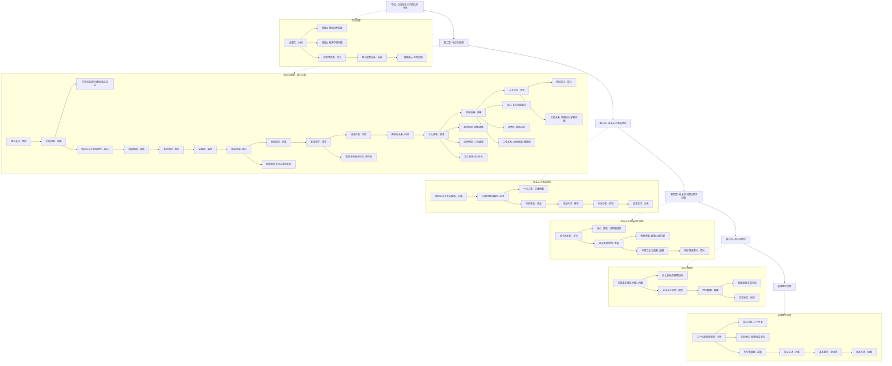

```mermaid
flowchart TD
    %% 主要章节流程
    A[导论 - 马克思主义中国化时代化] --> B[第二章 - 毛泽东思想]
    B --> C[第三章 - 社会主义改造理论]
    C --> D[第四章 - 社会主义建设初步探索]
    D --> E[第六章 - 邓小平理论]
    E --> F[后续理论成果]
    
    %% 导论部分
    subgraph SG1 [导论内容]
        A1[必要性 - 为何] --> A2[原因1: 理论自身发展]
        A1 --> A3[原因2: 解决中国问题]
        A1 --> A4[毛思想内涵 - 定义]
        A4 --> A5[两大成果关系 - 关系]
        A5 --> A6[一脉相承 & 与时俱进]
    end
    
    %% 第二章 毛泽东思想
    subgraph SG2 [毛泽东思想 - 重中之重]
        B1[遵义会议 - 转折] --> B2[活的灵魂 - 灵魂]
        B2 --> B3[实事求是/群众路线/独立自主]
        B2 --> B4[新民主主义革命理论 - 核心]
        
        %% 新民主主义革命理论详细展开
        B4 --> B5[国情依据 - 国情]
        B5 --> B6[革命两步 - 两步]
        B6 --> B7[总路线 - 路线]
        B7 --> B8[革命对象 - 敌人]
        B8 --> B9[革命动力 - 朋友]
        B9 --> B10[革命领导 - 领导]
        B10 --> B11[革命性质 - 性质]
        B11 --> B12[两革命关系 - 衔接]
        B12 --> B13[三大纲领 - 纲领]
        B13 --> B14[革命道路 - 道路]
        B14 --> B15[三大法宝 - 法宝]
        B15 --> B16[理论意义 - 意义]
        
        %% 分支细节
        B8 --> B17[民族革命与民主革命关系]
        B10 --> B18[新旧革命根本标志: 领导权]
        B13 --> B19[政治纲领: 国体/政体]
        B13 --> B20[经济纲领: 三大政策]
        B13 --> B21[文化纲领: 民/科/大]
        B14 --> B22[核心: 农村包围城市]
        B14 --> B23[必然性: 国情决定]
        B14 --> B24[三者关系: 土地/武装/根据地]
        B15 --> B25[三者关系: 党是核心,掌握武器]
    end
    
    %% 第三章 社会主义改造
    subgraph SG3 [社会主义改造理论]
        C1[新民主主义社会性质 - 过渡] --> C2[过渡时期总路线 - 总线]
        C2 --> C3[一化三改 - 主体两翼]
        C2 --> C4[对资改造 - 改造]
        C4 --> C5[改造方式 - 赎买]
        C5 --> C6[利润分配 - 四马]
        C6 --> C7[最高形式 - 合营]
    end
    
    %% 第四章 初步探索
    subgraph SG4 [社会主义建设初步探索]
        D1[论十大关系 - 方针] --> D2[核心: 调动一切积极因素]
        D1 --> D3[社会矛盾思想 - 矛盾]
        D3 --> D4[两类矛盾: 敌我/人民内部]
        D3 --> D5[中国工业化道路 - 道路]
        D5 --> D6[初步探索意义 - 意义]
    end
    
    %% 第六章 邓小平理论
    subgraph SG5 [邓小平理论]
        E1[首要基本理论问题 - 问题] --> E2[什么是社/怎样建设社]
        E1 --> E3[社会主义本质 - 本质]
        E3 --> E4[理论精髓 - 精髓]
        E4 --> E5[解放思想/实事求是]
        E4 --> E6[历史地位 - 地位]
    end
    
    %% 后续理论
    subgraph SG6 [后续理论成果]
        F1[三个代表重要思想 - 代表] --> F2[核心内容: 三个代表]
        F1 --> F3[历史地位: 重要组成部分]
        F1 --> F4[科学发展观 - 发展]
        F4 --> F5[核心立场 - 为本]
        F5 --> F6[基本要求 - 全协持]
        F6 --> F7[根本方法 - 统筹]
    end
    
    %% 连接主流程和子图
    A -.-> SG1
    B -.-> SG2
    C -.-> SG3
    D -.-> SG4
    E -.-> SG5
    F -.-> SG6
```
