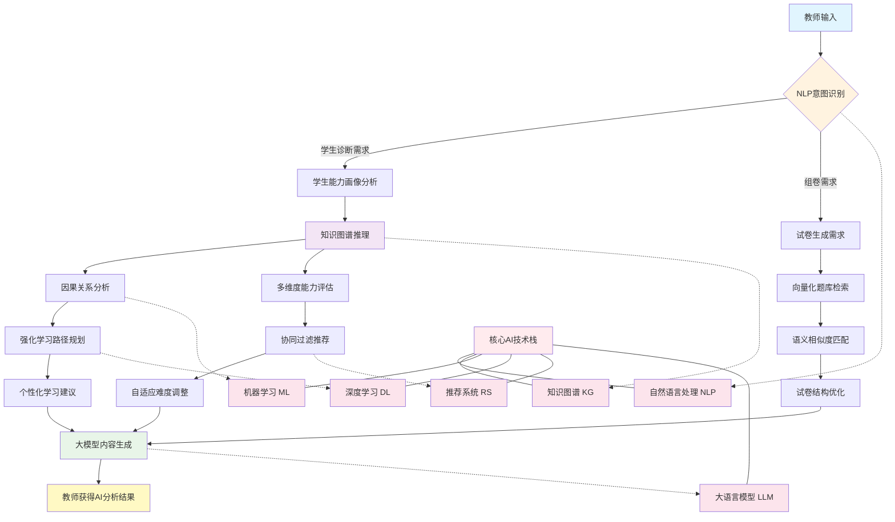

```mermaid
flowchart TD
    A[教师输入] --> B{NLP意图识别}
    
    B -->|学生诊断需求| C[学生能力画像分析]
    B -->|组卷需求| D[试卷生成需求]
    
    C --> E[知识图谱推理]
    D --> F[向量化题库检索]
    
    E --> G[因果关系分析]
    E --> H[多维度能力评估]
    
    G --> I[强化学习路径规划]
    H --> J[协同过滤推荐]
    F --> K[语义相似度匹配]
    
    I --> L[个性化学习建议]
    J --> M[自适应难度调整]
    K --> N[试卷结构优化]
    
    L --> O[大模型内容生成]
    M --> O
    N --> O
    
    O --> P[教师获得AI分析结果]
    
    %% AI技术标注
    Q[核心AI技术栈]
    Q1[自然语言处理 NLP]
    Q2[知识图谱 KG]
    Q3[机器学习 ML]
    Q4[深度学习 DL]
    Q5[推荐系统 RS]
    Q6[大语言模型 LLM]
    
    Q --- Q1
    Q --- Q2
    Q --- Q3
    Q --- Q4
    Q --- Q5
    Q --- Q6
    
    %% 技术对应关系
    B -.-> Q1
    E -.-> Q2
    G -.-> Q3
    I -.-> Q4
    J -.-> Q5
    O -.-> Q6
    
    style A fill:#e1f5fe
    style B fill:#fff3e0
    style E fill:#f3e5f5
    style O fill:#e8f5e8
    style P fill:#fff9c4
    style Q fill:#ffebee
    style Q1 fill:#fce4ec
    style Q2 fill:#fce4ec
    style Q3 fill:#fce4ec
    style Q4 fill:#fce4ec
    style Q5 fill:#fce4ec
    style Q6 fill:#fce4ec
```
