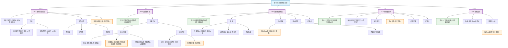

```mermaid
graph TD
    A[第十章：短期筹资管理] --> B[10.1 短期筹资政策]
    A --> C[10.2 自然性筹资]
    A --> D[10.3 短期借款筹资]
    A --> E[10.4 短期融资券]
    A --> F[10.5 债券回购]
    
    %% 10.1 短期筹资政策
    B --> B1[特征: 速度快, 弹性好, 成本低, 风险大]
    B --> B2[分类]
    B2 --> B2_1[按金额是否确定: 确定 vs 不确定]
    B2 --> B2_2[按形成情况: 自然性 vs 临时性]
    B --> B3[政策类型]
    B3 --> B3_1[激进型]
    B3 --> B3_2[配合型]
    B3 --> B3_3[稳健型]
    B --> B4[风险与报酬关系-含计算题💡]
    
    %% 10.2 自然性筹资
    C --> C1[定义: 正常经营中自然形成的短期负债]
    C --> C2[主要形式]
    C2 --> C2_1[商业信用]
    C2_1 --> C2_1_1[形式: 赊购商品, 预收货款]
    C2_1 --> C2_1_2[信用成本-放弃现金折扣的机会成本-含计算题💡]
    C2_1 --> C2_1_3[控制: 信息系统, 余额控制, 道德控制]
    C2 --> C2_2[应付费用]
    C2_2 --> C2_2_1[定义: 应付未付的费用-工资税金]
    C2_2 --> C2_2_2[筹资额计算-含计算题💡]
    
    %% 10.3 短期借款筹资
    D --> D1[定义: 向银行等金融机构借入的短期款项]
    D --> D2[种类]
    D2 --> D2_1[信用借款: 信用额度, 循环协议]
    D2 --> D2_2[担保借款: 保证, 抵押, 质押]
    D2 --> D2_3[票据贴现]
    D --> D3[考虑因素]
    D3 --> D3_1[借款成本-有效利率-含计算题💡]
    D3 --> D3_2[贷款银行的选择]
    D --> D4[基本程序]
    D --> D5[优缺点]
    
    %% 10.4 短期融资券
    E --> E1[定义: 大型企业发行的短期无担保本票]
    E --> E2[种类: 按发行方式/发行人/范围划分]
    E --> E3[发行程序]
    E --> E4[成本计算-含计算题💡]
    E --> E5[信用评级]
    E --> E6[优缺点]
    
    %% 10.5 债券回购
    F --> F1[定义: 一方卖出债券并约定未来购回]
    F --> F2[种类: 买断式 vs 质押式]
    F --> F3[期限与价格]
    F3 --> F3_1[购回价格计算-含计算题💡]
    
    %% 样式定义
    classDef mainTopic fill:#e1f5fe,stroke:#0277bd,stroke-width:3px
    classDef subTopic fill:#f3e5f5,stroke:#7b1fa2,stroke-width:2px
    classDef calculation fill:#fff3e0,stroke:#f57c00,stroke-width:2px
    classDef definition fill:#e8f5e8,stroke:#388e3c,stroke-width:2px
    
    class A mainTopic
    class B,C,D,E,F subTopic
    class B4,C2_1_2,C2_2_2,D3_1,E4,F3_1 calculation
    class C1,D1,E1,F1 definition

```
