### 0.1.1 内容总结要点
- **财务管理概念**：核心是组织企业的**财务活动**（筹资、投资、营运、分配）并处理在此过程中的**财务关系**。企业的组织形式（个人独资、合伙、公司）决定了其财务特征，其中**公司制**因其有限责任、所有权与经营权分离等特点成为现代财务管理的主要研究对象。
- **财务管理目标**：
    - **利润最大化**：一个传统目标，但有忽略时间价值、风险、投入资本等缺陷。
    - **股东财富最大化**：现代财务管理的**主流目标**，通常以**股票价格最大化**来体现。它克服了利润最大化目标的缺点，综合考虑了风险和时间价值。
- **利益冲突与协调**：由于所有权和经营权分离，产生了**委托—代理问题**，主要体现在：
    - 股东与管理者之间的冲突。
    - 大股东与中小股东之间的冲突。
    - 股东与债权人之间的冲突。
    - 解决方式包括设计激励约束机制、完善公司治理、法律法规等。
- **财务管理环境**：企业财务管理受到多种外部环境因素的影响。
    - **经济环境**：如经济周期、通货膨胀等。
    - **法律环境**：如《公司法》、税法等，直接影响企业决策。
    - **金融市场环境**：为企业投融资提供平台和信息。
    - **利息率**：是资金的价格，其构成（纯利率、通胀补偿、风险报酬）是财务决策的重要依据，其中**风险报酬的计算**是重点。
### 0.1.2 Obsidian Mermaid 流程图
您可以直接将下方的代码块复制到您的Obsidian笔记中，即可生成流程图。

```mermaid
graph TD
    A[总论: 财务管理] --> B[第一节: 财务管理的概念]
    A --> C[第二节: 财务管理的目标]
    A --> D[第三节: 财务管理环境]
    
    %% 第一节: 财务管理的概念
    B --> B1[定义: 组织财务活动, 处理财务关系]
    B --> B2[企业组织形式]
    B --> B3[四大财务活动]
    B --> B4[财务关系]
    
    B2 --> B2_1[个人独资]
    B2 --> B2_2[合伙企业]
    B2 --> B2_3["公司制<br/>(现代财务管理重点)"]
    
    B3 --> B3_1[筹资活动]
    B3 --> B3_2[投资活动]
    B3 --> B3_3[资金营运活动]
    B3 --> B3_4[利润分配活动]
    
    %% 第二节: 财务管理的目标
    C --> C1[传统目标: 利润最大化]
    C --> C2[现代目标: 股东财富最大化]
    C --> C3[利益相关者的冲突与协调]
    
    C1 --> C1_1[缺点: 忽略风险、时间价值等]
    
    C2 --> C2_1[优点: 综合考虑风险与时间价值]
    C2 --> C2_2[实现方式: 股票价格最大化]
    
    C3 --> C3_1[股东 vs 管理者 委托代理问题]
    C3 --> C3_2[大股东 vs 中小股东]
    C3 --> C3_3[股东 vs 债权人]
    C3 --> C3_4[社会责任]
    
    %% 第三节: 财务管理环境
    D --> D1["经济环境<br/>(经济周期、通胀等)"]
    D --> D2["法律环境<br/>(公司法、税法等)"]
    D --> D3[金融市场环境]
    D --> D4["利息率及其测算 (含计算题) 💡"]
    D --> D5[社会文化环境]
    
    D4 --> D4_1["利率 = 纯利率 + 通胀补偿 + 风险报酬"]
    D4_1 --> D4_2["风险报酬 = 违约风险 + 流动性风险 + 期限风险"]
    
    %% 样式定义
    classDef mainSection fill:#e1f5fe,stroke:#01579b,stroke-width:2px
    classDef subSection fill:#f3e5f5,stroke:#4a148c,stroke-width:1px
    classDef formula fill:#fff3e0,stroke:#e65100,stroke-width:2px
    classDef important fill:#ffebee,stroke:#c62828,stroke-width:2px
    
    class A mainSection
    class B,C,D mainSection
    class B1,B2,B3,B4,C1,C2,C3,D1,D2,D3,D5 subSection
    class D4,D4_1,D4_2 formula
    class B2_3 important
```
