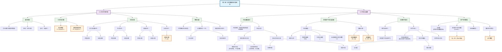

```mermaid
graph TD
    A[第二章：财务管理的价值观念] --> B[2.1 货币时间价值]
    A --> C[2.2 风险与报酬]
    
    %% 2.1 货币时间价值部分
    B --> B1[基本概念]
    B --> B2[一次性收付款]
    B --> B3[年金计算]
    B --> B4[特殊问题]
    
    B1 --> B1_1[货币随时间推移的增值]
    B1 --> B1_2[单利：本金计息]
    B1 --> B1_3[复利：利滚利 💡]
    
    B2 --> B2_1["复利终值<br/>F = P(1+i)^n 💡"]
    B2 --> B2_2["复利现值/贴现<br/>P = F(1+i)^-n 💡"]
    
    B3 --> B3_1[后付/普通年金 💡]
    B3 --> B3_2[先付年金 💡]
    B3 --> B3_3[递延年金 💡]
    B3 --> B3_4[永续年金 💡]
    
    B3_1 --> B3_1_1[终值计算]
    B3_1 --> B3_1_2[现值计算]
    B3_2 --> B3_2_1[终值计算]
    B3_2 --> B3_2_2[现值计算]
    B3_3 --> B3_3_1[终值计算]
    B3_3 --> B3_3_2[现值计算]
    B3_4 --> B3_4_1["现值计算<br/>P = A/i"]
    
    B4 --> B4_1[不等额现金流现值 💡]
    B4 --> B4_2[计息期短于一年 💡]
    B4 --> B4_3[插值法求折现率 💡]
    
    B4_2 --> B4_2_1[名义利率]
    B4_2 --> B4_2_2[有效年利率]
    
    %% 2.2 风险与报酬部分
    C --> C1[风险基础理论]
    C --> C2[单项资产风险与报酬]
    C --> C3[证券组合理论]
    C --> C4[资产定价模型]
    
    C1 --> C1_1[风险概念：结果的变动程度/不确定性]
    C1 --> C1_2[风险分类]
    
    C1_2 --> C1_2_1[按投资主体分类]
    C1_2 --> C1_2_2[按公司本身分类]
    
    C1_2_1 --> C1_2_1_1["系统性风险<br/>(市场风险，不可分散)"]
    C1_2_1 --> C1_2_1_2["非系统性风险<br/>(公司特有，可分散)"]
    
    C1_2_2 --> C1_2_2_1[经营风险]
    C1_2_2 --> C1_2_2_2[财务风险]
    
    C2 --> C2_1[风险衡量 💡]
    C2 --> C2_2[报酬计算 💡]
    
    C2_1 --> C2_1_1[概率分布]
    C2_1 --> C2_1_2["期望报酬率<br/>E(R)"]
    C2_1 --> C2_1_3["方差/标准差<br/>σ"]
    C2_1 --> C2_1_4["标准离差率/变异系数<br/>CV"]
    
    C2_2 --> C2_2_1["风险报酬率<br/>Rr = bV"]
    C2_2 --> C2_2_2["总报酬率<br/>K = Rf + Rr"]
    
    C3 --> C3_1[组合收益率 💡]
    C3 --> C3_2[组合风险 💡]
    
    C3_1 --> C3_1_1[单项资产的加权平均]
    
    C3_2 --> C3_2_1["风险分散效应<br/>(取决于资产间相关性)"]
    C3_2 --> C3_2_2[相关性衡量 💡]
    C3_2 --> C3_2_3[组合风险计算 💡]
    
    C3_2_2 --> C3_2_2_1[协方差]
    C3_2_2 --> C3_2_2_2[相关系数]
    
    C4 --> C4_1["β系数<br/>(系统风险衡量指标)"]
    C4 --> C4_2["资本资产定价模型<br/>(CAPM) 💡"]
    C4 --> C4_3[多因素模型 💡]
    C4 --> C4_4[套利定价模型 💡]
    
    C4_2 --> C4_2_1["Rj = Rf + (Rm-Rf)βj"]
    C4_4 --> C4_4_1["APT模型"]
    
    %% 样式定义
    classDef chapterNode fill:#e1f5fe,stroke:#01579b,stroke-width:3px,color:#000
    classDef sectionNode fill:#f3e5f5,stroke:#4a148c,stroke-width:2px,color:#000
    classDef conceptNode fill:#e8f5e8,stroke:#1b5e20,stroke-width:1px,color:#000
    classDef formulaNode fill:#fff3e0,stroke:#e65100,stroke-width:2px,color:#000
    classDef importantNode fill:#ffebee,stroke:#c62828,stroke-width:2px,color:#000
    
    class A chapterNode
    class B,C sectionNode
    class B1,B2,B3,B4,C1,C2,C3,C4 conceptNode
    class B2_1,B2_2,B3_4_1,C2_2_1,C2_2_2,C4_2_1,C4_4_1 formulaNode
```
