### 0.1.1 **内容总结**
以下是根据您提供的PPT文件《债券与股票的估值》提取的核心内容总结：
- **一价定律**: 核心金融学原理，指出同质资产在不同市场的价格应一致，是所有资产定价的基础。无套利机会是正确定价的标志。
- **债券估值**:
    - **核心思想**: 债券的价值等于其未来所有现金流（利息和本金）的现值总和。
    - **基本要素**: 票面价值、票面利率、到期日。
    - **估值模型**:
        - **息票债券**: 价格等于未来每期利息的现值与到期本金现值之和。其价格与市场利率成反比。
        - **永久债券**: 价格等于年利息除以市场利率。
        - **零息债券**: 价格等于面值的现值。
        - **特殊计息方式**: 考虑了半年付息、一次性还本付息等不同情况的计算。
    - **投资优缺点**: 优点是本金安全、收入稳定；缺点是存在购买力风险和利率风险。
- **股票估值**:
    - **核心思想**: 股票的价值等于其能创造的未来所有现金流（股利）的现值总和。
    - **股票分类**: 主要分为普通股和优先股。
        - **普通股**: 公司的最终所有者，享有管理权、分红权等，风险和回报都较高。
        - **优先股**: 介于债券和普通股之间，股息固定，求偿权优先于普通股。
    - **估值模型 (股利定价模型)**:
        - **固定增长模型**: 适用于股利以一个固定比率（g）持续增长的公司。
        - **无增长模型**: 适用于股利保持不变的公司，其估值模型类似于永久年金。
        - **优先股估值**: 如果是永续优先股，其估值方法与无增长模型相同。
    - **投资优缺点**: 优点是可能获得高回报、降低购买力风险；缺点是风险大，价格波动剧烈，收入不稳定。
### 0.1.2 **Obsidian Mermaid 流程图**
您可以将以下代码复制到Obsidian的Mermaid代码块中，以生成流程图。

```mermaid
graph TD
    A[债券与股票的估值] --> B[基本原理: 一价定律]
    A --> C[第一节: 债券的估值]
    A --> D[第二节: 股票的估值]
    
    %% 债券估值部分
    C --> C1[1. 债券特征]
    C1 --> C1_1[票面价值]
    C1 --> C1_2[票面利率]
    C1 --> C1_3[到期日]
    
    C --> C2[2. 债券分类与估价]
    C2 --> C2_1["息票债券估值 💡<br/>P = I × PVIFA + M × PVIF"]
    C2 --> C2_2["永久债券估值 💡<br/>P = I / k"]
    C2 --> C2_3["零息债券估值 💡<br/>P = M × PVIF"]
    C2 --> C2_4["一次还本付息债券估值 💡<br/>P = (M + M×i×n) × PVIF"]
    C2 --> C2_5["半年付息债券估值 💡"]
    
    C --> C3[3. 投资优缺点]
    C3 --> C3_1[优点: 安全性高、收入稳定]
    C3 --> C3_2[缺点: 购买力风险、利率风险]
    
    %% 股票估值部分
    D --> D1[1. 股票构成要素]
    D1 --> D1_1[股票价值]
    D1 --> D1_2[股票价格]
    D1 --> D1_3[股利]
    
    D --> D2[2. 股票类别]
    D2 --> D2_1[普通股]
    D2 --> D2_2[优先股]
    
    D --> D3[3. 股票估值 股利定价模型]
    D3 --> D3_1["基本模型: V = Σ(Dt / (1+k)^t)"]
    D3 --> D3_2["固定增长模型 💡<br/>V = D1 / (k - g)"]
    D3 --> D3_3["无增长模型 💡<br/>V = D / k"]
    D3 --> D3_4["优先股估值 💡<br/>永续优先股: V = D / k"]
    
    D --> D4[4. 投资优缺点]
    D4 --> D4_1[优点: 回报高、抗通胀]
    D4 --> D4_2[缺点: 风险大、价格波动剧烈]
    
    %% 样式定义
    classDef mainTitle fill:#e1f5fe,stroke:#01579b,stroke-width:3px
    classDef sectionTitle fill:#f3e5f5,stroke:#4a148c,stroke-width:2px
    classDef formula fill:#fff3e0,stroke:#e65100,stroke-width:2px
    classDef advantage fill:#e8f5e8,stroke:#2e7d32,stroke-width:1px
    classDef disadvantage fill:#ffebee,stroke:#c62828,stroke-width:1px
    
    class A mainTitle
    class C,D sectionTitle
    class C2_1,C2_2,C2_3,C2_4,C2_5,D3_1,D3_2,D3_3,D3_4 formula
    class C3_1,D4_1 advantage
    class C3_2,D4_2 disadvantage
```
