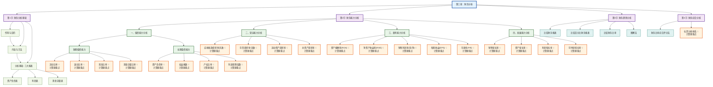

```mermaid
graph TD
    A[第三章：财务分析] --> A1[第1节: 财务分析基础]
    A --> B[第2节: 财务能力分析]
    A --> C[第3节: 财务趋势分析]
    A --> D[第4节: 财务综合分析]
    
    %% 第1节: 财务分析基础
    A1 --> A1_1[作用与目的]
    A1 --> A1_2[内容与方法]
    A1 --> A1_3[分析基础: 三大报表]
    A1_1 --> A1_2 --> A1_3
    A1_3 --> A1_3_1[资产负债表]
    A1_3 --> A1_3_2[利润表]
    A1_3 --> A1_3_3[现金流量表]
    
    %% 第2节: 财务能力分析
    B --> B1[一、偿债能力分析]
    B --> B2[二、营运能力分析]
    B --> B3[三、盈利能力分析]
    B --> B4[四、发展能力分析]
    
    %% 偿债能力分析
    B1 --> B1_1[短期偿债能力]
    B1 --> B1_2[长期偿债能力]
    
    B1_1 --> B1_1_1["流动比率 💡<br/>计算题重点"]
    B1_1 --> B1_1_2["速动比率 💡<br/>计算题重点"]
    B1_1 --> B1_1_3["现金比率 💡<br/>计算题重点"]
    B1_1 --> B1_1_4["现金流量比率 💡<br/>计算题重点"]
    
    B1_2 --> B1_2_1["资产负债率 💡<br/>计算题重点"]
    B1_2 --> B1_2_2["权益乘数 💡<br/>计算题重点"]
    B1_2 --> B1_2_3["产权比率 💡<br/>计算题重点"]
    B1_2 --> B1_2_4["利息保障倍数 💡<br/>计算题重点"]
    
    %% 营运能力分析
    B2 --> B2_1["应收账款周转率/天数 💡<br/>计算题重点"]
    B2 --> B2_2["存货周转率/天数 💡<br/>计算题重点"]
    B2 --> B2_3["流动资产周转率 💡<br/>计算题重点"]
    B2 --> B2_4["总资产周转率 💡<br/>计算题重点"]
    
    %% 盈利能力分析
    B3 --> B3_1["资产报酬率(ROA) 💡<br/>计算题重点"]
    B3 --> B3_2["净资产收益率(ROE) 💡<br/>计算题重点"]
    B3 --> B3_3["销售利润率(毛/净) 💡<br/>计算题重点"]
    B3 --> B3_4["每股收益(EPS) 💡<br/>计算题重点"]
    B3 --> B3_5["市盈率(P/E) 💡<br/>计算题重点"]
    
    %% 发展能力分析
    B4 --> B4_1["销售增长率 💡<br/>计算题重点"]
    B4 --> B4_2["资产增长率 💡<br/>计算题重点"]
    B4 --> B4_3["利润增长率 💡<br/>计算题重点"]
    B4 --> B4_4["可持续增长率 💡<br/>计算题重点"]
    
    %% 第3节: 财务趋势分析
    C --> C1[比较财务报表]
    C --> C2[比较百分比财务报表]
    C --> C3[比较财务比率]
    C --> C4[图解法]
    
    %% 第4节: 财务综合分析
    D --> D1[财务比率综合评分法]
    D --> D2["杜邦分析体系 💡<br/>计算题重点"]
    
    %% 样式定义
    classDef mainTitle fill:#e3f2fd,stroke:#0d47a1,stroke-width:3px
    classDef sectionTitle fill:#f3e5f5,stroke:#4a148c,stroke-width:2px
    classDef categoryTitle fill:#e8f5e8,stroke:#1b5e20,stroke-width:2px
    classDef formula fill:#fff3e0,stroke:#e65100,stroke-width:2px
    classDef basic fill:#f1f8e9,stroke:#33691e,stroke-width:1px
    classDef method fill:#e0f2f1,stroke:#00695c,stroke-width:1px
    
    class A mainTitle
    class A1,B,C,D sectionTitle
    class B1,B2,B3,B4,B1_1,B1_2 categoryTitle
    class B1_1_1,B1_1_2,B1_1_3,B1_1_4,B1_2_1,B1_2_2,B1_2_3,B1_2_4,B2_1,B2_2,B2_3,B2_4,B3_1,B3_2,B3_3,B3_4,B3_5,B4_1,B4_2,B4_3,B4_4,D2 formula
    class A1_1,A1_2,A1_3,A1_3_1,A1_3_2,A1_3_3 basic
    class C1,C2,C3,C4,D1 method
```
