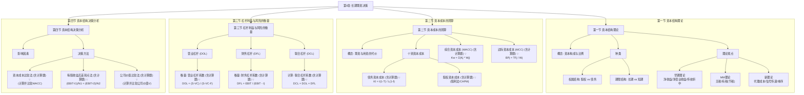

```mermaid
graph TD
    A["第6章 长期筹资决策"] --> B["第一节 资本结构理论"];
    A --> C["第二节 资本成本的测算"];
    A --> D["第三节 杠杆利益与风险的衡量"];
    A --> E["第四节 资本结构决策分析"];

    subgraph "第一节 资本结构理论"
        B1["概念: 资本构成与比例"]
        B2["种类"]
        B2_1["权属结构: 股权 vs 债务"]
        B2_2["期限结构: 长期 vs 短期"]
        B3["理论观点"]
        B3_1["早期理论<br/>净收益/净营业收益/传统折中"]
        B3_2["MM理论<br/>无税/有税(节税)"]
        B3_3["新理论<br/>代理成本/信号传递/啄序"]
        
        B --> B1
        B --> B2
        B2 --> B2_1
        B2 --> B2_2
        B --> B3
        B3 --> B3_1
        B3 --> B3_2
        B3 --> B3_3
    end

    subgraph "第二节 资本成本的测算"
        C1["概念: 筹资与用资的代价"]
        C2["个别资本成本"]
        C2_1["债务资本成本 (含计算题) 💡<br/>Kl = I(1-T) / L(1-f)"]
        C2_2["股权资本成本 (含计算题) 💡<br/>(股利法/CAPM)"]
        C3["综合资本成本 (WACC) (含计算题) 💡<br/>Kw = Σ(Kj * Wj)"]
        C4["边际资本成本 (MCC) (含计算题) 💡<br/>BPj = TFj / Wj"]

        C --> C1
        C --> C2
        C2 --> C2_1
        C2 --> C2_2
        C --> C3
        C --> C4
    end

    subgraph "第三节 杠杆利益与风险的衡量"
        D1["营业杠杆 (DOL)"]
        D1_1["衡量: 营业杠杆系数 (含计算题) 💡<br/>DOL = (S-VC) / (S-VC-F)"]
        D2["财务杠杆 (DFL)"]
        D2_1["衡量: 财务杠杆系数 (含计算题) 💡<br/>DFL = EBIT / (EBIT - I)"]
        D3["联合杠杆 (DCL)"]
        D3_1["计算: 联合杠杆系数 (含计算题) 💡<br/>DCL = DOL × DFL"]

        D --> D1
        D1 --> D1_1
        D --> D2
        D2 --> D2_1
        D --> D3
        D3 --> D3_1
    end

    subgraph "第四节 资本结构决策分析"
        E1["影响因素"]
        E2["决策方法"]
        E2_1["资本成本比较法 (含计算题) 💡<br/>(计算并比较WACC)"]
        E2_2["每股收益无差别点法 (含计算题) 💡<br/>(EBIT-I1)/N1 = (EBIT-I2)/N2"]
        E2_3["公司价值比较法 (含计算题) 💡<br/>(计算并比较公司价值V)"]
        
        E --> E1
        E --> E2
        E2 --> E2_1
        E2 --> E2_2
        E2 --> E2_3
    end
```