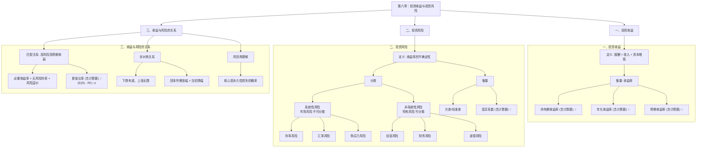

```mermaid
graph TD
    A[第六章：投资收益与投资风险] --> B[一、投资收益]
    A --> C[二、投资风险]
    A --> D[三、收益与风险的关系]
    
    subgraph "一、投资收益"
        B1[定义: 报酬 = 收入 + 资本增值]
        B2[衡量: 收益率]
        B2_1["持有期收益率 (含计算题) 💡"]
        B2_2["年化收益率 (含计算题) 💡"]
        B2_3["预期收益率 (含计算题) 💡"]
        
        B1 --> B2
        B2 --> B2_1
        B2 --> B2_2
        B2 --> B2_3
    end
    
    subgraph "二、投资风险"
        C1[定义: 收益率的不确定性]
        C2[分类]
        C2_1[系统性风险<br/>市场风险 不可分散]
        C2_2[非系统性风险<br/>特有风险 可分散]
        C2_1_1[利率风险]
        C2_1_2[汇率风险]
        C2_1_3[购买力风险]
        C2_2_1[经营风险]
        C2_2_2[财务风险]
        C2_2_3[道德风险]
        C3[衡量]
        C3_1[方差/标准差]
        C3_2["变异系数 (含计算题) 💡"]
        
        C1 --> C2
        C2 --> C2_1
        C2 --> C2_2
        C2_1 --> C2_1_1
        C2_1 --> C2_1_2
        C2_1 --> C2_1_3
        C2_2 --> C2_2_1
        C2_2 --> C2_2_2
        C2_2 --> C2_2_3
        C1 --> C3
        C3 --> C3_1
        C3 --> C3_2
    end
    
    subgraph "三、收益与风险的关系"
        D1[匹配关系: 高风险高预期收益]
        D1_1[必要收益率 = 无风险利率 + 风险溢价]
        D1_2["夏普比率 (含计算题) 💡<br/>(E(R) - Rf) / σ"]
        D2[非对称关系]
        D2_1[下跌有底，上涨无限]
        D2_2[回本所需涨幅 > 当初跌幅]
        D3[风险再理解]
        D3_1[核心是永久性损失的概率]
        
        D1 --> D1_1
        D1 --> D1_2
        D2 --> D2_1
        D2 --> D2_2
        D3 --> D3_1
    end
    
    B --> B1
    C --> C1
    D --> D1
    D --> D2
    D --> D3
```
