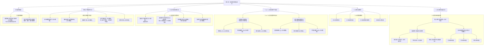

```mermaid
graph TD
    A[第七章：投资决策原理与实务] --> B[7.1 长期投资概述]
    A --> C[7.2 投资现金流量分析]
    A --> D[7.3 & 7.4 投资决策评价指标]
    A --> E[7.5 复杂投资决策分析]
    A --> F[风险与不确定性分析]
    A --> G[其他影响因素]
    
    subgraph "7.1 长期投资概述"
        B1[企业投资的意义]
        B2[企业投资的分类]
        B3[企业投资管理的原则]
        B4[企业投资过程分析]
        
        B1
        B2
        B3
        B4
    end
    
    subgraph "7.2 投资现金流量分析"
        C1[核心原则: 现金流量 vs 会计利润]
        C2[重要原则: 增量现金流原则]
        C2_1[相关成本: 机会成本、部门间影响]
        C2_2[不相关成本: 沉没成本]
        C2_3["税收与折旧的影响 (税盾效应) 💡"]
        C3["现金流量的构成与计算 (含计算题) 💡"]
        C3_1[初始现金流量]
        C3_2[营业现金流量]
        C3_3[终结现金流量]
        
        C1 --> C2
        C2 --> C2_1
        C2 --> C2_2
        C2 --> C2_3
        C1 --> C3
        C3 --> C3_1
        C3 --> C3_2
        C3 --> C3_3
    end
    
    subgraph "7.3 & 7.4 投资决策评价指标"
        D1[折现现金流量指标<br/>考虑货币时间价值]
        D2[非折现现金流量指标<br/>不考虑货币时间价值]
        
        D1_1["净现值 (NPV) (含计算题) 💡"]
        D1_2["内含报酬率 (IRR) (含计算题) 💡"]
        D1_3["获利指数 (PI) (含计算题) 💡"]
        
        D2_1["投资回收期 (PP) (含计算题) 💡"]
        D2_2["折现回收期 (含计算题) 💡"]
        D2_3["平均报酬率 (ARR) (含计算题) 💡"]
        
        D1 --> D1_1
        D1 --> D1_2
        D1 --> D1_3
        D2 --> D2_1
        D2 --> D2_2
        D2 --> D2_3
    end
    
    subgraph "7.5 复杂投资决策分析"
        E1["固定资产更新决策 (含计算题) 💡<br/>差量分析法"]
        E2["寿命期不同的项目比较 (含计算题) 💡<br/>最小公倍寿命法、年均净现值法"]
        E3["资本限额决策 (含计算题) 💡<br/>项目组合选择"]
        E4["投资时机/投资期选择决策 (含计算题) 💡"]
    end
    
    subgraph "风险与不确定性分析"
        F1["风险调整折现率法 (含计算题) 💡"]
        F2["确定当量法 (调整现金流) (含计算题) 💡"]
        F3["敏感性分析 (含计算题) 💡"]
        F4["盈亏平衡分析 (含计算题) 💡<br/>会计盈亏平衡点、财务盈亏平衡点"]
        F5["决策树分析 (含计算题) 💡"]
    end
    
    subgraph "其他影响因素"
        G1["通货膨胀对投资分析的影响 (含计算题) 💡<br/>名义/实际现金流与利率"]
        G2[投资决策中的实际选择权<br/>延期、放弃、改变规模等]
    end
    
    B --> B1
    B --> B2
    B --> B3
    B --> B4
    
    C --> C1
    
    D --> D1
    D --> D2
    
    E --> E1
    E --> E2
    E --> E3
    E --> E4
    
    F --> F1
    F --> F2
    F --> F3
    F --> F4
    F --> F5
    
    G --> G1
    G --> G2
```
