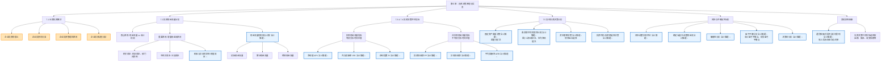

```mermaid
graph TD
    A[第七章：投资决策原理与实务] --> B[7.1 长期投资概述]
    A --> C[7.2 投资现金流量分析]
    A --> D[7.3 & 7.4 投资决策评价指标]
    A --> E[7.5 复杂投资决策分析]
    A --> F[风险与不确定性分析]
    A --> G[其他影响因素]
    
    B --> B1[企业投资的意义]
    B --> B2[企业投资的分类]
    B --> B3[企业投资管理的原则]
    B --> B4[企业投资过程分析]
    
    C --> C1[核心原则: 现金流量 vs 会计利润]
    C --> C2[重要原则: 增量现金流原则]
    C2 --> C2_1[相关成本: 机会成本、部门间影响]
    C2 --> C2_2[不相关成本: 沉没成本]
    C2 --> C2_3[税收与折旧的影响 税盾效应 💡]
    C --> C3[现金流量的构成与计算 含计算题 💡]
    C3 --> C3_1[初始现金流量]
    C3 --> C3_2[营业现金流量]
    C3 --> C3_3[终结现金流量]
    
    D --> D1[折现现金流量指标<br/>考虑货币时间价值]
    D --> D2[非折现现金流量指标<br/>不考虑货币时间价值]
    
    D1 --> D1_1[净现值 NPV 含计算题 💡]
    D1 --> D1_2[内含报酬率 IRR 含计算题 💡]
    D1 --> D1_3[获利指数 PI 含计算题 💡]
    
    D2 --> D2_1[投资回收期 PP 含计算题 💡]
    D2 --> D2_2[折现回收期 含计算题 💡]
    D2 --> D2_3[平均报酬率 ARR 含计算题 💡]
    
    E --> E1[固定资产更新决策 含计算题 💡<br/>差量分析法]
    E --> E2[寿命期不同的项目比较 含计算题 💡<br/>最小公倍寿命法、年均净现值法]
    E --> E3[资本限额决策 含计算题 💡<br/>项目组合选择]
    E --> E4[投资时机/投资期选择决策 含计算题 💡]
    
    F --> F1[风险调整折现率法 含计算题 💡]
    F --> F2[确定当量法 调整现金流 含计算题 💡]
    F --> F3[敏感性分析 含计算题 💡]
    F --> F4[盈亏平衡分析 含计算题 💡<br/>会计盈亏平衡点、财务盈亏平衡点]
    F --> F5[决策树分析 含计算题 💡]
    
    G --> G1[通货膨胀对投资分析的影响 含计算题 💡<br/>名义/实际现金流与利率]
    G --> G2[投资决策中的实际选择权<br/>延期、放弃、改变规模等]

    classDef importantNode fill:#FFE4B5,stroke:#FF8C00,stroke-width:2px
    classDef calculationNode fill:#E6F3FF,stroke:#0066CC,stroke-width:2px
    
    class B1,B2,B3,B4 importantNode
    class C2_3,C3,D1_1,D1_2,D1_3,D2_1,D2_2,D2_3,E1,E2,E3,E4,F1,F2,F3,F4,F5,G1 calculationNode
```
