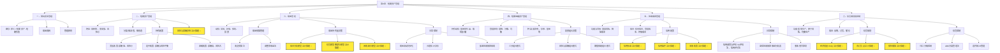

updated_at: 2025-07-01T08:35:20.032+08:00 edited_seconds: 10

```mermaid
graph TD
    A[第9章：短期资产管理] --> B[一、营运资本管理]
    A --> C[二、短期资产管理]
    A --> D[三、现金管理]
    A --> E[四、短期金融资产管理]
    A --> F[五、应收账款管理]
    A --> G[六、存货规划及控制]
    
    B --> B1[概念: 狭义 = 短期资产 - 短期负债]
    B --> B2[现金周转]
    B --> B3[管理原则]
    
    C --> C1[特征: 周转快、变现强、风险小]
    C --> C2[分类: 按流程、按形态]
    C --> C3[持有政策]
    C3 --> C3_1[宽松政策: 报酬低、风险小]
    C3 --> C3_2[适中政策: 报酬与风险平衡]
    C3 --> C3_3[紧缩政策: 报酬高、风险大]
    C --> C4[风险与报酬影响 含计算题 💡]
    
    D --> D1[动机: 交易、补偿、预防、投资]
    D --> D2[现金预算管理]
    D2 --> D2_1[收支预算法]
    D2 --> D2_2[调整净收益法]
    D --> D3[现金持有量决策]
    D3 --> D3_1[成本分析模型 含计算题 💡]
    D3 --> D3_2[存货模型 鲍默尔模型 含计算题 💡]
    D3 --> D3_3[米勒-欧尔模型 含计算题 💡]
    D --> D4[日常控制]
    D4 --> D4_1[现金流动同步化]
    D4 --> D4_2[合理估计浮存]
    D4 --> D4_3[加速应收账款收现]
    
    E --> E1[持有动机: 现金替代品、取得报酬]
    E --> E2[管理原则: 理智、分散、均衡]
    E --> E3[种类: 国库券、存单、基金等]
    E --> E4[投资组合决策]
    E4 --> E4_1[三分组合模式]
    E4 --> E4_2[风险与报酬组合模式]
    E4 --> E4_3[期限搭配组合模式]
    
    F --> F1[功能与目标: 增加销售、降低成本]
    F --> F2[成本: 机会成本、管理成本、坏账成本]
    F --> F3[信用政策]
    F3 --> F3_1[信用标准 含计算题 💡]
    F3 --> F3_2[信用条件 含计算题 💡]
    F3 --> F3_3[收账政策 含计算题 💡]
    F --> F4[日常控制]
    F4 --> F4_1[信用调查与评估 5C评估法、信用评分法]
    F4 --> F4_2[监控应收账款 账龄分析表]
    F4 --> F4_3[催收拖欠款项]
    
    G --> G1[功能: 保障生产、便于销售、均衡生产]
    G --> G2[成本: 采购、订货、储存]
    G --> G3[存货规划]
    G3 --> G3_1[经济批量 EOQ 含计算题 💡]
    G3 --> G3_2[再订货点 含计算题 💡]
    G3 --> G3_3[保险储备 含计算题 💡]
    G --> G4[存货控制]
    G4 --> G4_1[归口分级控制]
    G4 --> G4_2[ABC分类管理法]
    G4 --> G4_3[适时制JIT管理]
    
    classDef important fill:#ffeb3b,stroke:#333,stroke-width:2px
    class C4,D3_1,D3_2,D3_3,F3_1,F3_2,F3_3,G3_1,G3_2,G3_3 important
```