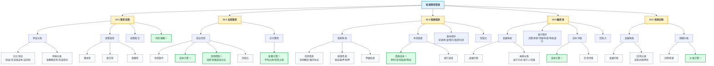

```mermaid
graph TD
    A["短期筹资管理"] --> B["10.1 筹资政策"]
    A --> C["10.2 自然筹资"]
    A --> D["10.3 短期借款"]
    A --> E["10.4 融资券"]
    A --> F["10.5 债券回购"]
    
    B --> B1["特征分类"]
    B1 --> B1a["四大特征<br/>快速/灵活/低成本/高风险"]
    B1 --> B1b["两种分类<br/>金额确定性/形成情况"]
    B --> B2["政策类型"]
    B2 --> B2a["激进型"]
    B2 --> B2b["配合型"]
    B2 --> B2c["稳健型"]
    B --> B3["政策配合"]
    B --> B4["风险报酬 🧮"]
    
    C --> C1["商业信用"]
    C1 --> C1a["信用条件"]
    C1 --> C1b["成本计算 🧮"]
    C1 --> C1c["信用控制 🧮<br/>周转率/账龄百分比"]
    C1 --> C1d["优缺点"]
    C --> C2["应付费用"]
    C2 --> C2a["金额计算 🧮<br/>平均占用/经常占用"]
    
    D --> D1["借款种类"]
    D1 --> D1a["信用借款<br/>信用额度/循环协议"]
    D1 --> D1b["担保借款<br/>保证/抵押/质押"]
    D1 --> D1c["票据贴现"]
    D --> D2["考虑因素"]
    D2 --> D2a["借款成本 🧮<br/>单利/复利/贴现/附加"]
    D2 --> D2b["银行选择"]
    D --> D3["基本程序<br/>申请/审查/签约/取得/归还"]
    D --> D4["优缺点"]
    
    E --> E1["发展种类"]
    E1 --> E1a["发展历程"]
    E1 --> E1b["券种分类<br/>发行方式/发行人/范围"]
    E --> E2["发行程序<br/>决策/承销/评级/申请/审批/发行"]
    E --> E3["成本评级"]
    E3 --> E3a["成本计算 🧮"]
    E3 --> E3b["信用评级"]
    E --> E4["优缺点"]
    
    F --> F1["发展种类"]
    F1 --> F1a["发展历程"]
    F1 --> F1b["回购分类<br/>买断式/质押式"]
    F --> F2["期限价格"]
    F2 --> F2a["回购期限"]
    F2 --> F2b["价格计算 🧮"]
    
    classDef default fill:#f9fafb,stroke:#6b7280,stroke-width:1px,color:#374151
    classDef main fill:#e0f2fe,stroke:#0ea5e9,stroke-width:2px,font-weight:bold
    classDef chapter fill:#fef3c7,stroke:#f59e0b,stroke-width:2px,font-weight:bold
    classDef subpoint fill:#eef2ff,stroke:#6366f1,stroke-width:1px
    classDef calc fill:#dcfce7,stroke:#16a34a,stroke-width:2px,color:#14532d
    
    class A main
    class B,C,D,E,F chapter
    class B1,B2,B3,C1,C2,D1,D2,D3,D4,E1,E2,E3,E4,F1,F2 subpoint
    class B4,C1b,C1c,C2a,D2a,E3a,F2b calc
```
