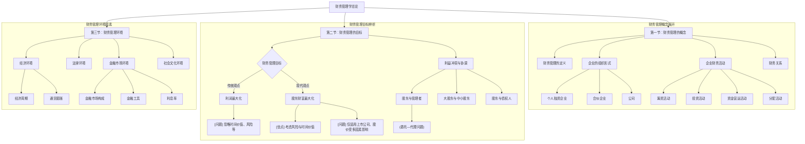

# 1 财务管理学：总论
## 1.1 PPT整体逻辑框架

📍 重点标注（基于PPT强调内容）
[!IMPORTANT] PPT重点内容
- **财务管理概念**：是组织企业财务活动，处理财务关系的一项管理工作。
- **公司的核心特点**：所有权和经营权分离（这是与其他两种组织形式的根本区别）。
- **财务管理目标**：是评价企业理财活动是否合理的基本标准。PPT对比分析了“利润最大化”和“股东财富最大化”两个目标。
- **委托—代理问题**：由所有权与经营权分离引起，是理解股东与管理者利益冲突的核心。
- **利息率的构成**：利息率 = 纯利率 + 通货膨胀补偿 + 风险报酬。
⚠️ 难点解析（基于PPT复杂内容）
[!WARNING] PPT难点识别：委托—代理问题与利益冲突
**难点1：股东与管理者的利益冲突 (委托—代理问题)**
- **PPT原文表述**：“当所有权与经营权相分离（产生的基本原因），居于企业外部的股东和居于企业内部的管理者将会发生利益上的冲突。” “产生条件：信息不对称，代理人与委托人的目标函数不一致。”
- **逻辑分解**：
    1. **分离**：公司的所有者（股东）不直接管理公司，而是委托给管理者（代理人）来经营。
    2. **目标不一致**：股东希望公司价值越高越好（股东财富最大化）。管理者的目标更复杂，可能包括高薪酬、职位稳定、权力等个人效用。
    3. **信息不对称**：管理者比股东更了解公司的实际经营情况。
    4. **冲突行为**：管理者可能利用信息优势，做出有利于自己但损害股东利益的决策（如：职务怠慢、过度在职消费等）。
- 关键理解：这个问题的核心在于“所有权和经营权的分离”以及由此导致的“信息不对
    称”和“目标不一致”。
**难点2：股东与债权人的利益冲突**
- **PPT原文表述**：“基本原因：现金流量要求权不同...产生条件：股东与债权人的目标函数不同、信息不对称...行为方式：高风险投资、发行新债”
- **逻辑分解**：
    ```
    graph TD
        A["股东与债权人"] --> B{"现金流量要求权不同"}
        B -- "债权人" --> C["要求固定的本金和利息回报<br/>偏好低风险"]
        B -- "股东" --> D["要求剩余收益<br/>收益不固定，承担高风险可能获得高回报"]
        D --> E{"股东倾向于高风险投资"}
        E -- "投资成功" --> F["股东获得大部分超额收益<br/>债权人只拿固定利息"]
        E -- "投资失败" --> G["公司破产，价值不足<br/>债权人本金可能无法收回<br/>股东承担有限责任，损失有限"]
        G --> H["[结论] 股东有动机损害债权人利益"]
    ```
- **关键理解**：股东的收益上不封顶，但亏损以出资额为限（有限责任）。债权人的收益有上限（固定的利息），但亏损可能是全部本金。这种收益与风险的不对称性，导致股东可能愿意冒更大的风险，而这种风险却可能损害债权人的利益。
🔄 易混点对比（基于PPT对比内容）

>[!CAUTION] PPT易混概念：公司制 vs 合伙制
| 对比维度 | 公司制 | 合伙制 | PPT中的区别说明 |
| :--- | :--- | :--- | :--- |
| 责任 | 股东个人不对公司债务承担责任（有限责任） | 有限合伙人对企业债务不承担责任，一般合伙人可能要承担无限责任 | 公司制的股东受有限责任保护，而合伙制中至少有一方需要承担无限责任。 |
| 税收 | 双重征税：公司收入要征企业所得税，分给股东的现金股利也要征个人所得税。 | 不交企业所得税，合伙人从企业获得利润需缴纳个人所得税。 | 公司在法人层面和股东分红层面都被征税，而合伙制只在合伙人个人层面征税。 |
| 存续期 | 公司可以无限存续 | 合伙制企业只有有限存续期 | 公司的生命不因股东的变更或退出而终结。 |
| 流动性 | 股份可以交易而公司无需终结 | 合伙制企业的交易市场一般不存在 | 公司的所有权（股票）更容易转让。 |
**记忆区分技巧（基于PPT内容）**
- **公司制**的特征：**法人**、**有限责任**、**双重税**、**易转让**。可以想象成一个独立、长寿且规范的“经济人”。
- **合伙制**的特征：**非法人**、**无限责任**（至少部分人）、**单一税**、**难转让**。可以想象成几个人“搭伙过日子”，关系更紧密，但风险共担。
📐 数学公式详解（基于PPT公式）
公式1：利息率的构成
- PPT原始公式：
    利息率=纯利率+通货膨胀补偿+风险报酬
- **逐项解释（基于PPT说明）**：
    - **纯利率**：指**无通货膨胀、无风险**的情况下的平均利率。PPT中提到，没有通货膨胀时，国库券的利率可以视为纯粹利率。
    - **通货膨胀补偿**：用于弥补因通货膨胀造成的购买力损失。
    - **风险报酬**：投资者因承担额外风险而要求获得的补偿。PPT中将其细分为：
        - **违约风险报酬**：补偿借款人无法按时支付利息或偿还本金的风险。
        - **流动性风险报酬**：补偿资产不易迅速变现的风险。
        - **期限风险报酬**：补偿因投资期限较长而带来的不确定性风险。
- **整体含义**：市场中我们观察到的具体利息率，是在一个最基础的无风险利率之上，根据通货膨胀的预期和投资标的所具有的各种风险，层层叠加补偿的结果。
- **PPT中的应用场景**：
    - **短期无风险证券利率** = 纯利率 + 通货膨胀补偿
    - **公司债券利率** = 短期无风险证券利率 + 违约风险报酬 + 流动性风险报酬 + 期限风险报酬
**公式理解框架（基于PPT逻辑）**
```
graph LR
    A["[前提条件]<br/>资金有时间价值(纯利率)<br/>存在通货膨胀<br/>投资存在各种风险"] --> B["[公式应用]<br/>利息率 = 纯利率 + 通胀补偿 + 风险补偿"]
    B --> C["[得出结论]<br/>不同风险、不同期限的投资<br/>其要求的利息率不同"]
```
🧠 记忆优化结构
PPT内容分层记忆
- **第一层：PPT基础概念**
    - **财务管理**：组织财务活动、处理财务关系的管理工作。
    - **企业组织形式**：个人独资、合伙、公司。
    - **财务活动**：筹资、投资、营运、分配。
    - **财务管理目标**：利润最大化、股东财富最大化。
- **第二层：PPT逻辑关系**
    ```
    graph TD
        A["[基础层]<br/>企业有不同的组织形式(公司制最重要)"] --> B["[推理层]<br/>公司制导致所有权与经营权分离"]
        B --> C["[冲突层]<br/>产生委托代理问题<br/>(股东与管理者、股东与债权人冲突)"]
        C --> D["[目标选择]<br/>为解决冲突，平衡各方利益<br/>现代财务管理选择'股东财富最大化'为目标"]
    ```
- **第三层：PPT综合应用**
    - **目标应用**：股东财富最大化作为判断投资、筹资决策好坏的标准。
    - **环境应用**：企业在做财务决策时，必须考虑经济周期、法律、金融市场（特别是利率）等外部环境因素。
**PPT核心逻辑链条**
```
graph LR
    A["PPT起点:<br/>什么是财务管理？<br/>(组织财务活动，处理财务关系)"] --> B["PPT分析:<br/>企业如何组织(独资/合伙/公司)？<br/>财务活动有哪些(筹/投/营/分)？<br/>理财的目标是什么(利润/股东财富)？<br/>目标实现中有何冲突(委托代理)？<br/>受什么外部环境影响？"]
    B --> C["PPT结论:<br/>现代公司财务管理的核心是<br/>在特定的法律金融环境下，<br/>围绕'股东财富最大化'目标，<br/>协调各方利益冲突，<br/>有效进行筹资、投资等活动。"]
```
📚 学习路径规划（基于PPT结构）
学习顺序（遵循PPT逻辑顺序）
```
graph TD
    A["第1步：掌握基本定义<br/>(什么是财务管理、企业形式、财务活动)"] --> B["第2步：理解核心目标<br/>(利润最大化 vs 股东财富最大化)"]
    B --> C["第3步：分析核心矛盾<br/>(委托代理问题及各方利益冲突)"]
    C --> D["第4步：了解外部环境<br/>(经济、法律、金融环境如何影响财务决策)"]
    D --> E["第5步：整合完整体系<br/>(将目标、矛盾、环境结合，形成财务管理总览)"]
```
复习重点分级（基于PPT强调程度）
[!TIP]
- **复习优先级A级（必须掌握）**：
    - 三种企业组织形式的对比，特别是公司的特点。
    - 利润最大化和股东财富最大化目标的优缺点对比。
    - 股东与管理者、股东与债权人的利益冲突（委托—代理问题）。
    - 利息率的构成公式。
- **B级（需要理解）**：
    - 四种基本的企业财务活动（筹资、投资、营运、分配）。
    - 有效市场假说的三种形式。
    - 财务管理面临的经济、法律、金融环境的主要内容。
- **C级（了解即可）**：
    - 财务关系的具体内容。
    - 经济周期中各阶段的财务对策。
    - 社会文化环境对财务管理的影响。
🔍 PPT内容完整性检查
覆盖度验证
- [ ] PPT主题和核心观点 (财务管理总论)
- [ ] PPT中的所有重要概念 (企业形式、财务目标、委托代理等)
- [ ] PPT中的所有公式和图表 (利息率公式、利益冲突图等)
- [ ] PPT中的所有对比和分类 (公司制vs合伙制、利润vs股东财富最大化)
- [ ] PPT的逻辑展开过程 (从概念到目标，再到环境)
- [ ] PPT的结论和总结 (各小节的总结图)
**理解度自测（基于PPT内容）**
- [ ] 能用自己的话解释为什么“股东财富最大化”优于“利润最大化”吗？
- [ ] 能解释“所有权与经营权分离”是如何导致股东与管理者冲突的吗？
- [ ] 能解释为什么股东可能喜欢高风险项目，而债权人不喜欢吗？
- [ ] 如果告诉你纯利率、通胀率和某公司债券的风险溢价，你能算出它的利率吗？
- [ ] 能说出公司制企业相对于合伙制企业的主要优缺点吗？
📋 **输出质量保证**
- **内容来源验证**：本次分析所有概念、逻辑、对比、公式、重点均直接来源于您提供的《1总论（新）.pdf》文件，未引入任何外部信息。
- **禁用内容提醒**：本文件严格遵守了禁用原则，未添加PPT中没有的历史背景、外部案例、公式推导、理论扩展或自创记忆口诀。