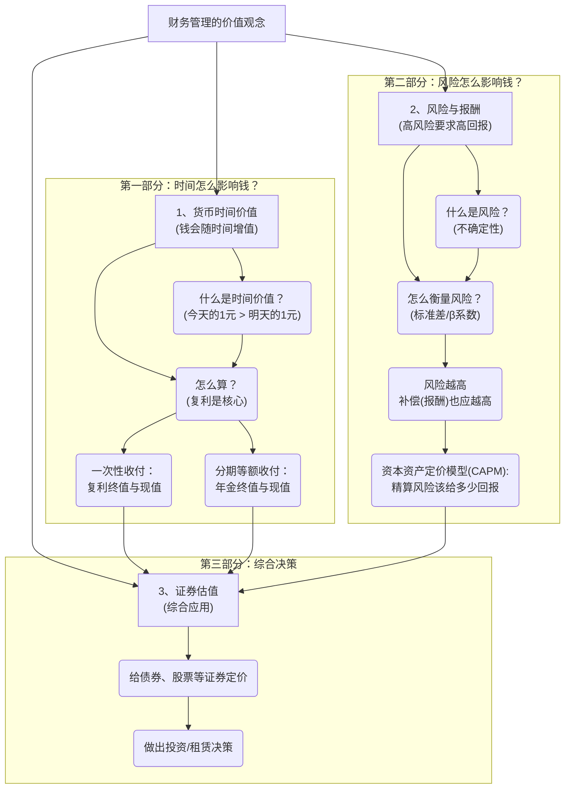

# 1 《财务管理的价值观念》PPT完整解析（文科友好版）
## 1.1 🧒 8岁小孩也能懂的概念解释
**把我们想象成第一次逛金融游乐园的小朋友，用最简单的话来理解这些新奇的概念：**
### 1.1.1 基础概念白话解释
- **货币时间价值 (Time Value of Money)**：
    - **8岁小孩版解释**：你今天手里的1块钱，比你明年才能拿到的1块钱更值钱。因为你今天的1块钱可以马上拿去买糖，或者存进银行，银行叔叔会给你一点点额外的奖励（利息），明年它就可能变成1块1毛钱了。这个多出来的1毛钱，就是你的钱在这一年里“长大”的部分，也就是它的“时间价值”。
    - **PPT原文定义**：货币在使用过程中随时间的推移而发生的增值。
    - **为什么要这样定义**：因为钱不是死东西，把它投资出去（比如存银行、开工厂），它就能像种下一颗种子，慢慢发芽、长大、结出新的果实（利润）。这个增值的过程需要时间，所以时间让钱变得更有价值。
- **风险 (Risk)**：
    - **8岁小孩版解释**：你参加一个游戏，有可能赢到10颗糖，但也有可能输掉你自己的5颗糖。这种“不确定性”，既可能让你变得更好，也可能让你变得更糟，就是风险。财务管理里的风险，主要就是担心你投出去的钱，最后没能赚到预期的那么多，甚至还赔了本。
    - **PPT原文定义**：在一定条件下和一定时期内可能发生的各种结果的变动程度。
- **复利 (Compound Interest)**：
    - **8岁小孩版解释**：想象你有一只会下蛋的母鸡。第一天，它下了1个蛋，你没吃，留着。第二天，这只母鸡和昨天那个蛋（假设也孵成了鸡）一起下蛋，你可能就有2个新蛋了。复利就是“利滚利”，不仅你的本金（最开始的母鸡）能产生利息（下蛋），你得到的利息（新孵出的鸡）也能在下一期继续产生新的利息。爱因斯坦说这是世界第八大奇迹，因为它能让财富像滚雪球一样越滚越大。
    - **PPT原文定义**：不仅本金要计算利息，利息也要计算利息，即通常所说的“利滚利”。
- **现值 (Present Value, PV) vs. 终值 (Future Value, FV)**：
    - **8岁小孩版解释**：
        - **终值(FV)** 就是“向未来看”，问你现在的100块钱，按照某个利率（比如每年5%），5年后会变成多少钱？（答案是会比100多）
        - **现值(PV)** 就是“从未来往回看”，问你为了5年后能拥有100块钱，你现在需要存进银行多少钱？（答案是会比100少）
        - **它们的关系**：终值是把现在的钱推向未来，所以会变多；现值是把未来的钱拉回现在，所以会“打折”，这个“折扣率”就叫折现率。
## 1.2 PPT整体逻辑框架
这份PPT的核心逻辑是，在做任何财务决策时，我们不能只看钱的数字大小，必须考虑两个核心变量：**时间和风险**。

📍 重点标注（基于PPT强调内容）
[!IMPORTANT] 不同时点的资金不能直接加减乘除或直接比较！ 必须将它们换算到同一个时间点（通常是现在或未来某个特定时点）上才能进行比较和运算。这是整个时间价值计算的核心前提。
- **复利**：PPT花了大量篇幅（从爱因斯坦到玫瑰花悬案）强调复利是理解时间价值的关键，所有的计算都围绕它展开。
- **资本资产定价模型 (CAPM)**：这是风险与报酬部分的最终模型，是考试的绝对重点。
- **查表计算**：PPT中反复出现查阅“复利终值系数表”、“年金现值系数表”等步骤，说明掌握查表方法是基本要求。
⚠️ 难点解析（基于PPT复杂内容）
[!WARNING] PPT难点识别：各种“年金”的计算，尤其是递延年金和先付年金，很容易搞混。
- **难点1：区分普通年金、先付年金、递延年金**
    - **8岁小孩版解释**：
        - **普通年金（后付）**：就像你每个月**月底**才领到零花钱。
        - **先付年金**：就像你每个月**月初**就领到了零花钱。
        - **递延年金**：就像你爸妈跟你说，从你**10岁生日开始**，每年生日给你1000元压岁钱。在你10岁之前那几年，就是“递延期”，没有钱拿。
    - **PPT原文表述**：
        - 普通年金（后付年金）：发生在每期期末的等额收付款项。
        - 先付年金：各期期初等额的系列收付款。
        - 递延年金：第一次支付发生在第二期或第二期以后的年金。
    - **逻辑分解与关键理解**：
        1. **核心是普通年金**：所有年金的计算公式和系数表都是以普通年金为基础的。
        2. **先付年金的处理**：因为它比普通年金早一期收到钱，所以每一笔钱都多算了一期利息。因此，算终值和现值时，结果都比普通年金要“大”一点，都是在普通年金的基础上乘以 `(1+i)`。
        3. **递延年金的处理**：它的麻烦在于“空窗期”。计算现值时，可以分两步走：第一步，先把它当成一个发生在未来的普通年金，计算出它在开始付款前一期的“现值”；第二步，再把这个“现值”当成一个一次性的未来金额，折算回真正的“现在”。
🔄 易混点对比（基于PPT对比内容）

>[!CAUTION] PPT易混概念：单利 vs. 复利
|   |   |   |   |   |
|---|---|---|---|---|
|**对比维度**|**单利 (Simple Interest)**|**复利 (Compound Interest)**|**PPT中的区别说明**|**8岁小孩版理解**|
|**利息的计算基础**|只根据**原始本金**计算利息。|不仅本金计算利息，**产生的利息也要计算利息**。|单利：当期产生的利息在下一期不作为本金。复利：利滚利。|**单利**：你妈每年给你10块钱，这10块钱你都花了。你手里的本金永远不变。**复利**：你妈每年给你10块钱，你都存起来，第二年你妈不仅会给你新的10块，还会给你去年存的10块钱生的“小利息”。|
|**财富增长速度**|线性增长，像走路，速度均匀。|指数增长，像滚雪球，越滚越快。|PPT图表显示，复利曲线是向上弯曲的，而单利是一条直线。|**单利**：你的身高每年长5厘米，很稳定。**复利**：一个刚出生的宝宝，体重增长得非常快，因为他是在自己已有体重的基础上增长。|
|**公式**|C(1+rn)|C(1+r)n|PPT第16、17页明确对比了两种计算方式。|**单利**：乘法关系。**复利**：幂（次方）关系。|
📝 辨析必背口诀（文科友好）
[!TIP] 基于PPT内容的逻辑记忆口诀
- **口诀1：区分“终值”和“现值”**
    > **“终值未来看，乘法往后算；现值现在看，除法往前算。”**
    - **逻辑解释**：算终值(FV)是把现在的钱(PV)推向未来，钱会增值，所以用**乘法** `PV * (1+i)^n`。算现值(PV)是把未来的钱(FV)拉回现在，钱要打折，所以用**除法** `FV / (1+i)^n`。
    - **什么时候用**：题目问“5年后能得到多少钱”就是算终值；问“现在需要存多少钱”就是算现值。
- **口诀2：区分“普通年金”和“先付年金”**
    > **“先付早一期，多算一期息。终值现值都变大，就乘(1+i)。”**
    - **逻辑解释**：“先付”意味着每笔钱都比“后付”（普通年金）早到手一期，所以能多赚一期利息，无论是算终值还是现值，都比普通年金的计算结果要大。最简单的换算就是用普通年金的系数乘以 `(1+i)`。
    - **什么时候用**：题目关键词“年初”、“期初”、“立刻”等，就是先付年金；关键词“年末”、“期末”，就是普通年金。
📐 **数学公式详解（文科生友好版）**
🎯 **公式1：复利终值公式 (PV -> FV)**
- **一眼记住这个公式最直观的印象**：这个公式就像在给你的钱“**穿上时间的增值外套**”。
- **一句话概括**：它在算“你现在的钱，过了n年，能长大成多少钱”。
- PPT原始公式：
    FVn​=PV(1+i)n
- **📝 文科友好记忆口诀**：
    > **“未来值(FV)，等于现在值(PV)，乘上‘一加利率’的n次方。”**
- **🔍 公式逐项解释（8岁小孩版）**：
    - **FVn**：Future Value，未来的钱。
    - **PV**：Present Value，现在的钱。
    - **i**：interest rate，利率，你的钱每年长大的“速度”。
    - **n**：number of periods，期数，你的钱长了多少年。
    - **(1+i)**：这是你每年的“本利和”增长率。1是你自己的本金，i是新增的利息。
    - **(1+i)^n**：这个整体叫“复利终值系数”，就是滚雪球滚了n次之后，雪球变大了多少倍。
🎯 **公式2：普通年金现值公式 (A -> PV)**
- **一眼记住这个公式最直观的印象**：这个公式就像在“**打包压缩未来的零花钱**”。
- **一句话概括**：它在算“未来好几年，每年都能领的一笔钱，加起来等于现在的多少钱”。
- PPT原始公式：
    PVAn​=Ai1−(1+i)−n​
- **📝 文科友好记忆口诀**：
    > **“年金现值，等于年金A，乘以一个大括号。括号里面，分子是‘1减去未来折扣’，分母是利率i。”**
- **🔍 公式逐项解释（8岁小孩版）**：
    - **PVA**n：Present Value of Annuity，一串年金的现值。
    - **A**：Annuity，每年领的等额的钱。
    - i1−(1+i)−n​：这个大块头叫“**年金现值系数**”。你可以把它理解成一个“打包折扣率”。它帮你一次性算好，未来n年、利率为i的情况下，每年领1块钱，总共相当于现在多少钱。你只需要用你每年领的钱A乘以这个系数就行了。
- **🎯 什么时候用这个公式**：
    - **题目信号词**：看到“**分期付款**”、“**每年租金**”、“**按揭贷款**”、“**养老金**”等，只要是连续好几期、金额相等，问你这些钱总共值现在多少钱，就用这个公式。
    - **考试高分技巧**：计算题中，这个公式最常用来比较“**一次性买断**”和“**分期租赁/付款**”哪个更划算。把未来所有的分期付款额用这个公式折算成现值，再跟一次性付款的金额比较，哪个现值小，就选哪个方案。
🧮 公式速记卡片
[!IMPORTANT] 考试必备速记：资本资产定价模型 (CAPM)
- **公式**：Rj​=Rf​+βj​(Rm​−Rf​)  
- **口诀**：**“你的回报(Rj)，等于无风险回报(Rf)，加上你的个性(βj)乘以市场平均的额外奖励。”**
- **用于**：计算一个有风险的投资（如股票）至少应该给你多少回报率，你才觉得划算。
- **信号**：题目中出现“**无风险收益率**”、“**市场平均收益率**”和“**β系数**”，求“**期望收益率**”或“**必要报au率**”。
- **陷阱**：(Rm​−Rf​) 这一部分叫“市场风险溢价”，是市场的平均风险补偿，有时题目会直接给出这个值，不要再减一遍Rf。
🧠 **记忆优化结构**
- **第一层：基础概念（必须会背）**
    - **货币时间价值**：今天的钱比未来的钱值钱。
    - **风险**：收益的不确定性。
    - **CAPM**：投资的回报 = 无风险回报 + 风险补偿。
- **第二层：逻辑关系（必须会用）**
    ```
    graph TD
        A["看到一笔钱"] --> B{"是单笔还是多笔？"}
        B --"单笔"--> C["用复利现值/终值公式"]
        B --"多笔等额"--> D["用年金现值/终值公式"]
        D --> E{"是期初还是期末支付？"}
        E --"期末(普通)"--> F["直接套公式/查表"]
        E --"期初(先付)"--> G["在普通年金基础上调整"]
    ```
    - **逻辑关系记忆口诀**：“**先判断，单笔还是一串；再看头，期初还是期末端。**”
🎯 **考试高分策略（基于PPT重点）**
- **选择题高分技巧**
    - 看到“**利滚利**”马上想到**复利**。
    - 问到“**风险分散**”，要想到组合投资可以降低**非系统风险**，但**系统风险**（用β衡量）降不了。
    - CAPM模型中，**β > 1**，说明该股票比市场整体**风险大**，波动剧烈；**β < 1**，说明比市场**风险小**，更稳健。
- **计算题高分技巧**
    - **万能模板**：
        1. **画时间轴**：把每一笔现金流在时间轴上标出来，这是最不容易出错的方法！
        2. **识别类型**：判断是PV还是FV？是复利还是一系列年金？是普通年金还是先付/递延年金？
        3. **选择公式**：根据判断，写出对应的公式。
        4. **查表/计算**：找到正确的系数或代入数值计算。
    - **租赁决策问题**：核心就是比较“买”和“租”两个方案的**现值**哪个更小。买的现值就是买价；租的现值就是把未来所有租金用“年金现值公式”折算到今天。
- **论述题高分模板**
    - **题目：为什么说投资组合能降低风险？**
    - **万能答题框架**：
        1. **定义**：首先解释什么是投资组合风险，它包括系统风险和非系统风险。（引自PPT P151）
        2. **逻辑分析**：解释为什么风险可以降低。核心在于不同资产的收益率不是完全正相关的。当A股票下跌时，B股票可能上涨，从而抵消了一部分损失。这主要分散的是公司特有的非系统风险（如罢工、新产品失败等）。（引自PPT P137, P151）
        3. **结论**：因此，通过持有多种不完全正相关的证券，投资组合可以有效分散和消除非系统风险，但无法消除由整个市场环境（如经济危机、战争）决定的系统风险。（引自PPT P152, P153）