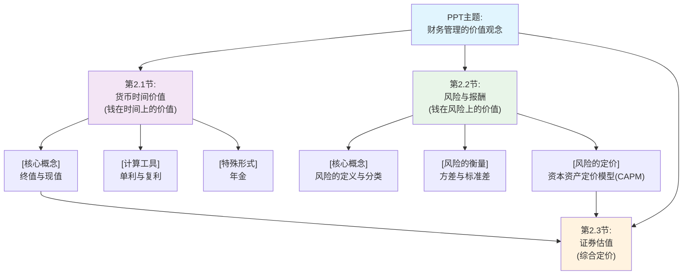

# 1 📋 《财务管理的价值观念》整体结构框架
## 1.1 🗂️ 章节目录与学习路径
### 1.1.1 章节概览
**第2.1节：货币时间价值** - **核心主题概括**: 本节主要解决“今天的1块钱不等于明天的1块钱”的问题。它会告诉你为什么金钱会随着时间增值，以及如何计算不同时间点的钱的价值，是整个财务管理的基础。
**第2.2节：风险与报酬** - **核心主题概括**: 这部分探讨投资中“高风险、高回报”的原理。它会解释什么是风险，如何衡量风险的大小，以及投资者因为承担了风险，应该得到多少额外的补偿（报酬）。
**第2.3节：证券估值** - **核心主题概括**: 这部分内容在PPT中没有详细展开，但根据标题推断，它旨在应用前两节的知识来评估股票、债券等金融资产的内在价值，解决“一个东西到底值多少钱”的问题。
### 1.1.2 📊 整体逻辑结构思维导图

### 1.1.3 🎯 学习建议顺序
- **建议学习顺序**：严格按照 **2.1节 → 2.2节** 的顺序学习。因为风险报酬的计算，尤其是资本资产定价模型，需要先理解货币时间价值中的“无风险报酬率”概念。
- **章节重要性**：
    - ⭐⭐⭐ **第2.1节**（考试绝对重点，计算题核心）
    - ⭐⭐⭐ **第2.2节**（考试绝对重点，计算与概念并重）
- **前置知识要求**：学习2.2节前，必须掌握2.1节中关于利率（折现率）的基本概念。
### 1.1.4 📝 使用指南
- 请输入 **“第2.1节”** 来获取该节的详细解析。
- 例如：输入 **“第2.1节”** 开始学习第一节内容。
### 1.1.5 🧵 整体逻辑主线概括
PPT整体思路：
这份PPT的核心思路是为“钱”在两个最重要的维度——“时间”和“风险”上进行定价。
它的逻辑起点是回答一个基本问题：**为什么不同时间点的钱价值不同？** 这就是 **第2.1节【货币时间价值】** 的内容，它教会我们用“终值”和“现值”的计算，在时间维度上对金钱进行换算，相当于建立了财务管理的“时间标尺”。
在解决了时间问题后，PPT引入了第二个维度：**不确定性（风险）**。**第2.2节【风险与报酬】** 探讨的是，如果一项投资有风险，我们应该如何衡量它？并且，为了补偿我们承担的风险，我们应该要求多高的“风险溢价”？本节通过方差、β系数等工具来度量风险，并最终给出了著名的**资本资产定价模型（CAPM）**，为风险定价提供了理论依据，相当于建立了财务管理的“风险标尺”。
最后，**第2.3节【证券估值】** (虽然未展开)的逻辑终点，就是将这两把“标尺”结合起来，去评估现实世界中金融资产（如股票）的真正价值。一个资产未来的现金流需要用“时间价值”的标尺折算到今天，同时还需要用“风险”的标尺来决定我们应该用多高的折现率。
**总而言之，整个PPT构建了一个从“时间”到“风险”的完整价值评估体系，让你理解财务决策背后最核心的定价逻辑。**