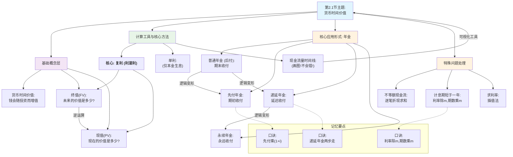

## 0.1 第2.1节：货币时间价值
### 0.1.1 🧒 8岁小孩也能懂的概念解释
- **本节核心问题**
    - **这一节要解决什么问题？**
        - 用最简单的话说：**为什么“现在就给你100块”比“一年后再给你100块”要好？** 这一节就是教我们怎么计算，现在的钱和未来的钱之间到底差了多少，怎么互相换算。
- **基础概念白话解释**
    - **货币时间价值**:
        - **8岁小孩版解释**：钱就像一颗能长大的种子。你今天把这颗种子（钱）种下去（投资），它自己就会慢慢发芽、长大，过段时间就能收获更多的果实（更多的钱）。如果你只是把种子攥在手里，它永远只是一颗种子。钱的这种“长大”的魔力，就是它的时间价值。
        - **PPT原文定义**：“货币在使用过程中随时间的推移而发生的增值。”
        - **为什么要这样定义**：PPT强调，钱的增值不是凭空产生的，必须把它“作为资本投入生产经营”才能产生。放在口袋里或埋在地下的钱，是不会自己变多的。
    - **复利 (利滚利)**：
        - **8岁小孩版解释**：这就像你的种子长成了一棵苹果树。第一年结了10个苹果，你没吃，而是把这10个苹果的籽也种了下去。第二年，你不仅有原来的大树结果子，还有10棵小树也开始结果子了！这就是“利滚利”，让你的财富像滚雪球一样越来越大。爱因斯坦说它是“世界第八大奇迹”。
        - **PPT原文定义**：“不仅本金要计算利息，利息也要计算利息。”
        - **概念之间的关系**：这是理解货币时间价值计算的**核心引擎**。之后所有的“终值”、“现值”计算，默认都是按复利来的。
    - **终值 (Future Value, FV)**：
        - **8岁小孩版解释**：就是问你“未来的价值”。比如，你今天把100块压岁钱存进银行，银行说每年给你10%的利息，那么5年后你的账户里会有多少钱？这个未来的数额就是**终值**。
        - **PPT原文定义**：“当前的一笔资金在若干期后所具有的价值。”
    - **现值 (Present Value, PV)**：
        - **8岁小孩版解释**：就是问你“现在的价值”。比如，你希望5年后账户里能有150块钱去买一个超酷的玩具，同样银行年利息是10%，那么你**今天**需要存进银行多少钱才够？这个今天要存的数额就是**现值**。这个计算过程也叫“折现”。
        - **PPT原文定义**：“未来年份收到或支付的现金在当前的价值。”
        - **概念之间的关系**：现值和终值是**互为逆运算**的关系。知道现在推未来，是算终值；知道未来推现在，是算现值。
### 0.1.2 📊 本节详细思维导图

### 0.1.3 📚 本节知识点详细讲解
#### 0.1.3.1 知识点1：复利终值 (FV) 与复利现值 (PV)
- **基础理解**
    - **8岁小孩版解释**：算终值就是把“现在的钱”这颗小雪球，放在时间的雪坡上，看它能滚多大；算现值就是看到山顶有个“未来的大雪球”，反推它在山脚下出发时有多小。
    - **核心要点**：两者是同一枚硬币的两面。计算终值的过程叫“复利”，计算现值的过程叫“折现”。折现率越高，未来的钱折回现在就越不值钱。
- **数学公式：📐**
    - **复利终值公式**: FVn​=PV×(1+i)n  
        - **直观理解**：这个公式就是本金(PV)连续乘以n次“(1+利息率)”。
        - **记忆口诀**：**终值 = 现值 × (1+i)的n次方**
        - **使用场景**：看到“存入…年后价值…”、“投资…未来价值…”就用它。
    - **复利现值公式**: PV=(1+i)nFVn​​=FVn​×(1+i)−n  
        - **直观理解**：这个公式就是用未来的钱(FV)连续除以n次“(1+利息率)”，把它“打折”回现在。
        - **记忆口诀**：**现值 = 终值 ÷ (1+i)的n次方**
        - **使用场景**：看到“未来要得到…现在应存…”、“未来收入的现值是…”就用它。
    - **易混提醒**：⚠️ **(1+i)^n** 叫复利终值系数 (FVIF)。**(1+i)^-n** 叫复利现值系数 (PVIF)。它俩互为倒数！
#### 0.1.3.2 知识点2：年金 (Annuity)
年金是一系列**金额相等**、**时间间隔相同**的收付款。比如房贷、养老金。
- **1. 普通年金 (后付年金)**
    - **基础理解**：每期**期末**的等额收付款。就像你每个月月底才收到工资。
    - **终值 (FVA)**：所有期末付款额滚到最后一期期末的本利和。
    - **现值 (PVA)**：所有期末付款额折算到第一期期初的价值总和。
    - **考试应用**：题目中如果只说“年金”，没说“先付”或“期初”，**默认就是普通年金**。
- **2. 先付年金**
    - **基础理解**：每期**期初**的等额收付款。就像你每个月月初就交房租。
    - **与普通年金的区别**：每一笔钱都比普通年金早一期发生，所以每一笔钱都能**多算一期利息**。
    - **计算技巧**：🔥 **这是最重要的考点和技巧！**
        - **记忆口诀**：**“先付多一期息，现值终值都乘以(1+i)”**
        - **计算方法**: 先把它当成普通年金，查表算出系数或结果，然后**乘以 (1+i)** 即可。
        - **先付年金终值** = 普通年金终值 × (1+i)
        - **先付年金现值** = 普通年金现值 × (1+i)
        - （PPT里还提到了“期数加1系数减1”或“期数减1系数加1”的方法，这个容易记混，强烈推荐用乘(1+i)的方法！）
- **3. 递延年金**
    - **基础理解**：等了**好几期之后**才开始的年金。比如，大学毕业后工作，约定从第5年开始，公司每年给你发奖金。前4年就是递延期。
    - **终值**：递延期的长短**不影响终值**。因为终值只看年金开始支付后、到最终时间点那一段。
    - **现值 (核心考点)**：
        - **记忆口诀**：**“递延现值分两步，先折年金再折现”**
        - **计算方法 (两步法)**：
            1. **第一步 (折年金)**：把递延年金当成一个**普通年金**，计算出它在**开始付款前一期**的现值。
            2. **第二步 (再折现)**：把这个“中转站”的现值，当成一个**单笔的钱 (复利现值)**，再往前折算到真正的第0期。
- **4. 永续年金**
    - **基础理解**：没有到期日、永远支付下去的年金。比如某些优先股的股息。
    - **终值**：没有终值，因为它永远不结束。
    - **现值 (核心考点)**：
        - **记忆口诀**：**“永续现值最简单，年金除以利率算”**
        - **公式**：PV=iA​ (A是每期年金额，i是利率)
#### 0.1.3.3 知识点3：时间价值计算的特殊问题
- **1. 计息期短于一年 (一年内多次计息)**
    - **基础理解**：银行告诉你年利率是12%，但每个月都给你算一次利息。这比一年只算一次要划算，因为1月份的利息在2月份就开始生息了。
    - **难点突破**：🔥 **这是计算题高频陷阱！**
        - **记忆口诀**：**“期数乘m，利率除m”**
        - **突破方法**：当一年计息m次时，计算前必须做两处修改：
            - **利率 i** → **i/m** (把年利率换算成期利率)
            - **期数 n** → **n×m** (把年数换算成总计息期数)
        - **例**：年利率12%，存5年，每季度计息一次。则 m=4。计算时应使用：利率 i = 12%/4 = 3%，期数 n = 5年×4 = 20期。
- **2. 折现率的计算 (插值法)**
    - **基础理解**：当你知道现值、年金和期数，反过来求利率，但算出来的系数在查表时，正好在两个数之间，就需要用插值法估算。
    - **考试应用**：这是笔试必备技能。
        - 解题思路：利用相似三角形原理，建立比例关系式。假设未知利率x在低利率i1和高利率i2之间：
            (x - i1) / (i2 - i1) = (对应系数 - i1的系数) / (i2的系数 - i1的系数)
### 0.1.4 🧠 本节记忆优化结构
- **第一层：PPT基础概念（必须会背）**
    - **复利终值/现值**：知道现值求未来值 / 知道未来值求现值。
    - **年金**：等额、等期的一系列收付款。
    - **记忆口诀**：**“终值是把钱滚大，现值是把钱折小”**
- **第二层：PPT逻辑关系（必须会用）**
    - **逻辑关系图**
        ```
        graph TD
            A["单笔钱的计算<br/>(复利终值/现值)"] --> B["一系列等额的钱<br/>(年金)"]
            B --> C["一系列不等额的钱<br/>(拆成多个单笔钱计算)"]
        ```
    - **逻辑关系记忆口诀**：**“单个计算是基础，年金是批处理，不等额就打回原形（逐个算）”**
### 0.1.5 🎯 本节考试高分策略
- 选择题高分技巧
    [!TIP] 选择题速胜法
    | 题目特征 | PPT对应内容 | 快速判断方法 | 高分技巧 |
    | :--- | :--- | :--- | :--- |
    | "期初"、"立即"、"从现在开始" | 先付年金 | 看到这些词，马上想到比普通年金多一期利息 | 结果一定是普通年金的(1+i)倍，可以快速排除错误选项 |
    | "从第X年起" | 递延年金 | 看到支付不是从第一期开始 | 脑中立刻浮现“两步法”，先折年金，再折现 |
    | "半年计息"、"按季付息" | 一年内多次计息 | 利率不是按年计算 | 立即做“期数乘m，利率除m”的转换，这是必考陷阱 |
    | "永不停止"、"无限期" | 永续年金 | 支付没有期限 | 直接用公式 A/i |
- 计算题高分技巧
    [!IMPORTANT] 计算题不丢分
    - **步骤模板（基于PPT）：**
        1. **第1步：画出现金流量时间线！** 这是最关键的一步，能帮你理清所有现金流的时间点。
        2. **第2步：识别题型** → 看是“一次性支付”（复利）还是“一系列支付”（年金）。是“期末”（普通）还是“期初”（先付）。
        3. **第3步：提取数据** → 明确 PV, FV, A, i, n 中哪些是已知的，要求哪个。
        4. **第4步：套用公式/查表** → 使用记忆口诀选择正确公式，注意先付年金要乘以(1+i)，多次计息要调整i和n。
        5. **第5步：仔细计算** → 避免计算器按错。
### 0.1.6 🧵 本节核心逻辑概括
- 本节完整思路：
    本节从一个财务管理中最根本的问题——“为什么钱有时间价值？”——开始。它首先通过复利这个强大的数学工具，揭示了价值增长的本质来源。接着，它为我们提供了两个最基本的测量工具：终值（FV）和现值（PV），教会我们如何在时间的维度上，对一笔单独的资金进行来回换算。
    然后，课程将这个基本工具应用到了更普遍的商业场景中——**一系列等额的现金流**，即**年金**。通过对普通年金、先付年金、递延年金和永续年金的分析，我们学会了对各种规律的现金流进行打包处理。最后，本节补充了一年内多次计息、不等额现金流等**特殊情况**的处理方法，使我们的工具箱趋于完善。
    **总而言之，本节就像是教会了我们财务管理的“通用语言”，通过“折现”和“复利”这两个核心语法，让我们能够读懂和比较任何发生在不同时间点的财务数据，为之后所有复杂的投资决策和资产评估打下了坚实的基础。**
- 记忆主线口诀：
    单一复利是根本，年金只是打包算。
    先付多乘(1+i)，递延两步往回搬。
    计息变频调i,n，永续直接A除i。
    画好时间生命线，一切计算都简单！
### 0.1.7 📋 本节内容完整性检查
- **覆盖度验证**
    - [x] PPT主题和核心观点
    - [x] PPT中的所有重要概念（8岁版+原文版）
    - [x] PPT中的所有公式（口诀+应用技巧）
    - [x] PPT中的所有对比和分类（直观对比+辨析口诀）
    - [x] PPT的逻辑展开过程（记忆链条）
    - [x] PPT的结论和总结（考试要点）
    - [x] PPT中需要精确记忆的理论表述（背诵口诀）
    - [x] 整节内容的逻辑概括和记忆主线
- **理解度自测（基于PPT内容）**
    - [ ] 能像对8岁小孩一样解释PPT的核心概念
    - [ ] 能熟练运用所有记忆口诀
    - [ ] 能快速识别考试题型并应对
    - [ ] 能准确区分PPT中的易混概念
    - [ ] 能在考试中应用所有高分技巧
    - [ ] 能用一段话完整概括本节的核心逻辑
✅ **本节学习完成！**
**下一步：**
- 输入 **“第2.2节”** 继续学习风险与报酬。
- 输入 **“复习第2.1节”** 重新查看本节内容。
- 输入 **“整体框架”** 回到总体结构图。