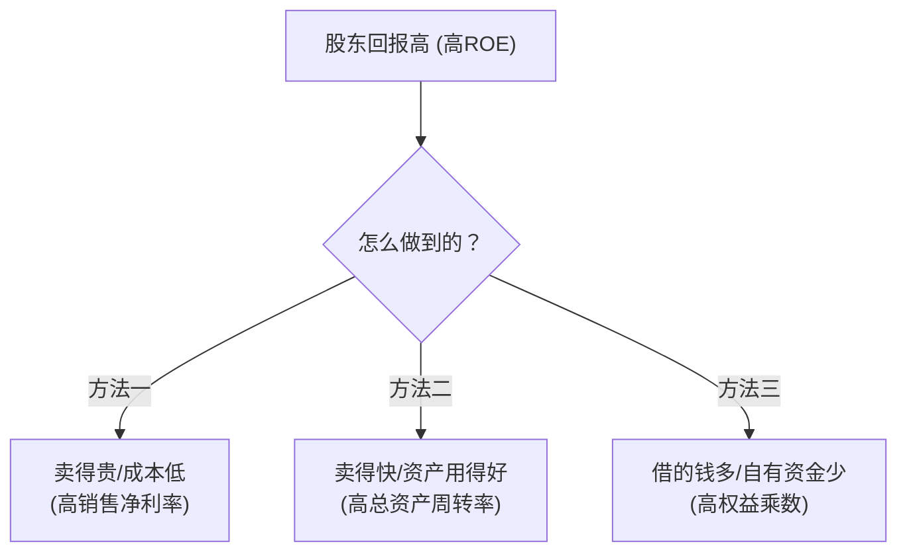
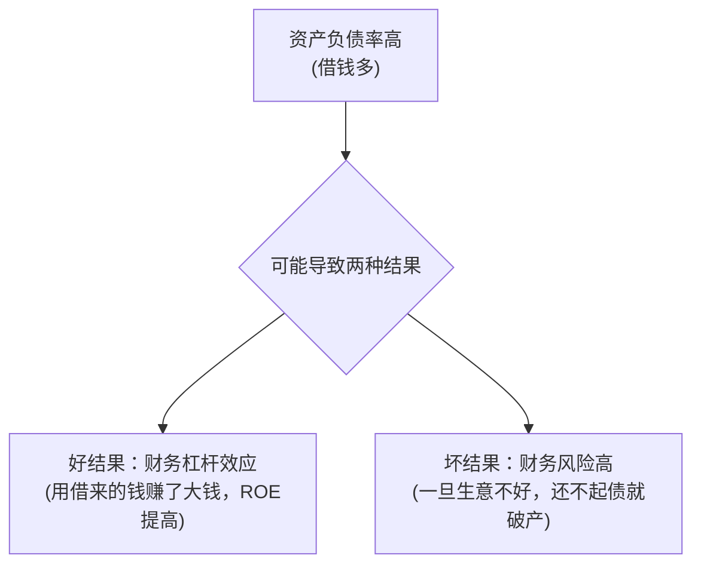

# 1 财务报表分析 (第三章)
## 1.1 🧒 8岁小孩也能懂的概念解释
**想象一下，一家公司就像一个柠檬水小摊，我们来看看它的“三张最重要的记录表”。**
### 1.1.1 基础概念白话解释
- **资产负债表 (Balance Sheet)**：
    - **8岁小孩版解释**：这张表就像在某个时间点（比如今天下午5点）给小摊拍了张照片。照片左边列出了小摊**拥有**的所有东西（**资产**），比如桌子、柠檬、糖、现金。照片右边列出了这些东西是**怎么来**的，一部分是**借**朋友的钱买的（**负债**），另一部分是**自己**掏腰包的钱（**所有者权益**）。照片两边的总金额一定是相等的，也就是“有多少家当”=“欠别人的钱”+“自己的钱”。
    - **PPT原文定义**：反映企业在某一时点全部资产、负债和所有者权益状况的报表。
    - **为什么要这样定义**：因为它是一个“存量”概念，像水库里的水，我们看的是某一刻的水位有多高，而不是水流了多少。它告诉我们，在特定的一天，公司的“家底”有多厚，以及这些“家底”的来源构成。
- **利润表 (Income Statement)**：
    - **8岁小孩版解释**：这张表就像在记录小摊**一段时间**（比如一整天）的经营故事。它记录了今天一共卖了多少杯柠檬水，赚了多少钱（**收入**），为了做这些柠檬水花了多少钱买柠檬和糖（**成本**），还花了多少钱吆喝、付场地费（**费用**）。最后，用总收入减去所有花销，剩下的就是今天**真正赚到的钱**（**利润**）。
    - **PPT原文定义**：用来衡量企业在一个特定时期（如一年）内的业绩。
    - **概念之间的关系**：利润表里最后赚到的钱（净利润），如果没分掉，就会跑到资产负债表的“自己的钱”（所有者权益）里，让家底变得更厚。
- **现金流量表 (Cash Flow Statement)**：
    - **8岁小孩版解释**：这张表只关心一件事：在这一天里，你的口袋里**真正有多少现金流进来，又有多少现金流出去**。卖柠檬水收到了现金（经营活动流入），买新桌子花掉了现金（投资活动流出），找妈妈借了点钱（筹资活动流入）。它不管你有没有“应该收但还没收到的钱”，只认实实在在的现金。
    - **PPT原文定义**：提供企业在一定会计期间现金和现金等价物流入流出信息。
    - **与利润表的区别**：利润表说“你今天**应该赚了**10块钱”（可能有人赊账还没给钱），而现金流量表说“你口袋里**实际多了**8块钱现金”。对于一个公司来说，有利润但没现金流入，就像“听起来很美但快渴死了”，是非常危险的。
## 1.2 📊 Gemini整体框架梳理
**这是根据PPT内容为你梳理的完整知识架构，帮你从全局把握学习脉络。**

```mermaid
graph TD
    A["财务分析"] --> B["财务分析基础 (第1节)"]
    A --> C["财务能力分析 (第2节)"]
    A --> D["财务趋势分析 (第3节)"]
    A --> E["财务综合分析 (第4节)"]
    subgraph "第一步：打好基础"
    B --> B1["财务分析的作用与目的"]
    B --> B2["财务分析的内容"]
    B --> B3["财务分析的方法"]
    B --> B4["财务分析的基础：三大报表"]
    B4 --> B4_1["资产负债表"]
    B4 --> B4_2["利润表"]
    B4 --> B4_3["现金流量表"]
    end
    subgraph "第二步：核心能力检测"
    C --> C1["偿债能力分析"]
    C --> C2["营运能力分析"]
    C --> C3["盈利能力分析"]
    C --> C4["发展能力分析"]
    C1 --> C1a["短期偿债能力"]
    C1a --> C1a1["流动比率"]
    C1a --> C1a2["速动比率"]
    C1a --> C1a3["现金比率"]
    C1a --> C1a4["现金流量比率"]
    C1 --> C1b["长期偿债能力"]
    C1b --> C1b1["资产负债率"]
    C1b --> C1b2["股东权益比率/权益乘数"]
    C1b --> C1b3["产权比率"]
    C1b --> C1b4["利息保障倍数"]
    C2 --> C2a["应收账款周转率"]
    C2 --> C2b["存货周转率"]
    C2 --> C2c["流动资产周转率"]
    C2 --> C2d["总资产周转率"]
    C3 --> C3a["基于销售的盈利指标"]
    C3a --> C3a1["销售毛利率"]
    C3a --> C3a2["销售净利率"]
    C3a --> C3a3["成本费用利润率"]
    C3 --> C3b["基于资产/股权的收益率"]
    C3b --> C3b1["总资产报酬率(ROA)"]
    C3b --> C3b2["净资产收益率(ROE)"]
    C3 --> C3c["上市公司专属指标"]
    C3c --> C3c1["每股收益(EPS)"]
    C3c --> C3c2["市盈率(P/E)"]
    C3c --> C3c3["市净率(P/B)"]
    C4 --> C4a["销售增长率"]
    C4 --> C4b["资产增长率"]
    C4 --> C4c["利润增长率"]
    C4 --> C4d["可持续增长率"]
    end
    subgraph "第三步：动态眼光看问题"
    D --> D1["比较财务报表 (水平分析)"]
    D --> D2["比较百分比财务报表 (结构分析)"]
    D --> D3["比较财务比率"]
    D --> D4["图解法"]
    end
    subgraph "第四步：融会贯通看全局"
    E --> E1["财务比率综合评分法 (沃尔评分法)"]
    E --> E2["杜邦分析体系 (DuPont Analysis)"]
    E2 --> E2_Core["核心：净资产收益率(ROE)"]
    E2_Core --> E2_1["资产净利率"]
    E2_Core --> E2_2["权益乘数"]
    E2_1 --> E2_1a["销售净利率"]
    E2_1 --> E2_1b["总资产周转率"]
    end
```

📍 重点标注
[!IMPORTANT] PPT重点内容
- **三大报表**：资产负债表、利润表、现金流量表是所有分析的基础。
- **四大能力**：偿债能力、营运能力、盈利能力、发展能力是财务分析的核心维度。
- **杜邦分析体系**：这是综合分析的灵魂，将各个财务比率串联起来，揭示了公司盈利能力的本质驱动因素。PPT花了大量篇幅讲解，是考试的绝对重点。
- **净资产收益率(ROE)**：被PPT反复强调为最核心、综合性最强的指标，是杜邦分析的核心。
⚠️ 难点解析
[!WARNING] PPT难点识别
难点1：权责发生制 vs. 收付实现制
- **8岁小孩版解释**：
    - **权责发生制**（利润表用的）：你帮邻居送了一天报纸，他**答应**给你10元，虽然钱还没到手，但你今天**有权利**收到这10元，所以利润表就记下你“赚了10元”。它关心的是“权利和责任”的发生。
    - **收付实现制**（现金流量表用的）：只有当邻居把10元硬币**真正放进你口袋里**时，现金流量表才会记下“现金流入10元”。它只关心“钱的实际进出”。
- **PPT原文表述**：利润表遵循权责发生制，收入的实现与现金的流入、成本费用支出与现金支出不相关。
- **逻辑分解**：利润 = 应该收到的钱 - 应该付出的钱。现金流 = 实际收到的钱 - 实际付出的钱。
- **关键理解**：一家公司可能利润很高（卖了很多货，但都是赊账），但现金流很差（没收回钱来），这种情况非常危险，叫“虚胖”，可能会导致资金链断裂。
**难点2：杜邦分析体系的内在逻辑**
- **8岁小孩版解释**：想知道你家柠檬水小摊为啥比隔壁摊更赚钱（**股东回报高，即ROE高**）？杜邦分析告诉你，原因不外乎三点：
    1. 是不是每杯柠檬水**利润更高**？（**销售净利率**）
    2. 是不是你的桌子板凳利用得**更有效率**，卖得更快？（**总资产周转率**）
    3. 是不是你更会**借钱生钱**，用别人的钱来扩大规模？（**权益乘数**，也叫财务杠杆）
- **逻辑关系图**：

🔄 易混点对比
[!CAUTION] PPT易混概念
**资本公积 vs. 盈余公积**

|   |   |   |   |   |
|---|---|---|---|---|
|**对比维度**|**资本公积**|**盈余公积**|**PPT中的区别说明**|**8岁小孩版理解**|
|**来源**|非经营收益（如别人捐赠、股价上涨多出来的钱）|税后利润中提取|资本公积来源于非利润因素；盈余公积是企业从税后利润中提取的。|**资本公积**是“天上掉下来的钱”或“意外之财”；**盈余公积**是“辛苦赚来的钱”里存起来的一部分。|
|**用途**|主要用于转增资本金（扩大公司注册规模）|可弥补亏损、转增资本金、分红|资本公积金一般不得用于弥补亏损，更不能用于向投资者分配利润。|**资本公积**主要是用来“壮大门面”的；**盈余公积**是“家庭储备金”，可以用来“补贴家用、过年发红包、或者继续投资”。|
📝 辨析必背口诀
>[!TIP] 基于PPT内容的逻辑记忆口诀
口诀：公积区分很简单，姓“资”姓“盈”看来源。姓“资”意外不算赚，姓“盈”利润兜里揣。
- **口诀逻辑解释**：
    - “姓‘资’姓‘盈’看来源”：区分这两个概念，核心就看它的钱是从哪里来的。
    - “姓‘资’意外不算赚”：**资**本公积，来源于投资、捐赠等非主营业务的“意外”收入，不能算作经营利润。
    - “姓‘盈’利润兜里揣”：**盈**余公积，来源于企业辛苦经营赚来的**盈**利，是从净利润里提取的。
- **什么时候用这个口诀**：当题目考到资产负债表中所有者权益的构成，或者问到某笔钱能否用来分红或弥补亏损时。
## 1.3 📐 数学公式详解（文科生友好版）
### 1.3.1 🎯 公式1：流动比率
公式直观印象
[!NOTE] 一眼记住这个公式：它就像在体检时看你口袋里的零钱够不够付今天的打车费。
一句话概括：用你短期内能变成钱的东西，去除以你短期内要还的债。
PPT原始公式：
流动比率=流动负债流动资产​
📝 文科友好记忆口诀
口诀：流动除流动，等于2正好。
- **口诀逻辑解释**：用流动资产除以流动负债，记住国际通用标准是2左右比较健康。意思是，你短期能用的钱，最好是短期要还的钱的两倍，这样才安全。
🔍 **公式逐项解释（8岁小孩版）**
- **流动资产**：你口袋里的现金、你同桌**承诺**明天就还你的钱、你准备明天卖掉的游戏卡。总之，是**一年内**能快速变成现金的东西。
- **流动负债**：你欠同桌的午饭钱（明天就要还）、下周要交的班费。总之，是**一年内**必须还的债。
- **运算关系**：为什么是除法？因为我们想知道“能还的钱”是“要还的钱”的**几倍**，倍数越高，还钱能力越强。
🎯 什么时候用这个公式

| 题目信号词识别 | 公式对应部分 | 你要想到的概念 | 具体操作步骤 |
| :--- | :--- | :--- | :--- |
| “短期偿债能力”、“流动性风险” | 整个公式 | 衡量短期内资金是否紧张 | 从资产负债表找到“流动资产合计”和“流动负债合计”，然后相除。 |
| 公司是否“安全” | 比率结果 | 与2进行比较 | 计算结果，如果远小于2（比如小于1），说明风险高；如果远大于2（比如4或5），说明钱没用好，太浪费。 |
### 1.3.2 🎯 公式2：资产负债率
公式直观印象
[!NOTE] 一眼记住这个公式：它就像看你家的房子，有多少是找银行贷款买的。
一句话概括：公司的总家当里，有多少比例是借来的。
PPT原始公式：
资产负债率=资产总额负债总额​×100%
📝 文科友好记忆口诀
口诀：负债除资产，一半最心安。
- **口诀逻辑解释**：用总负债除以总资产，记住一般认为50%（一半）左右比较稳健。
- **为什么这样记**：这个比率太高（比如80%），说明公司大部分钱都是借的，风险很大，像走钢丝；太低（比如20%），说明公司太保守，不敢借钱发展，可能会错过机会。
🔍 **公式逐项解释（8岁小孩版）**
- **负债总额**：你家房子总共欠银行的**所有**贷款，包括短期的和长期的。
- **资产总额**：你家**所有**的家当，包括房子、车子、存款等。
- **运算关系**：为什么是除法？因为我们想看“借来的钱”占“全部家当”的**百分比**。
🎯 什么时候用这个公式

| 题目信号词识别 | 公式对应部分 | 你要想到的概念 | 具体操作步骤 |
| :--- | :--- | :--- | :--- |
| “长期偿债能力”、“财务风险”、“杠杆” | 整个公式 | 衡量公司长期来看稳不稳健 | 从资产负债表找到“负债合计”和“资产总计”，然后相除。 |
| “股东风险”、“债权人风险” | 比率结果 | 比率越高，股东可能赚钱更快，但债权人风险越大 | 站在不同角色分析：对股东来说，适度高一点可以“借鸡生蛋”；对借钱给公司的人来说，当然是越低越好。 |
### 1.3.3 🎯 公式3：净资产收益率 (ROE) - **王中之王**
公式直观印象
[!NOTE] 一眼记住这个公式：它就是看你用自己的本钱，一年能翻几番。这是巴菲特最看重的指标！
一句话概 quát：用你自己出的钱，最终赚回来了多少纯利润。
PPT原始公式：
净资产收益率(ROE)=平均股东权益净利润​×100%
📝 文科友好记忆口诀
口诀：净利除权益，越高越牛气。
- **口诀逻辑解释**：用“净利润”除以“股东权益”（也就是自己的本钱），这个比率当然是越高越好，说明股东投资的回报率高。
🔍 **公式逐项解释（8岁小孩版）**
- **净利润**：你家柠檬水小摊，一年下来，去掉所有成本、费用、税收后，**最终落到口袋里的纯利润**。
- **平均股东权益**：你年初投入的本钱和年末本钱的平均数。就是你**真正属于自己的钱**。
- **运算关系**：为什么是除法？因为我们想知道，**每1块钱的本钱，能赚回多少纯利润**。
🎯 什么时候用这个公式

| 题目信号词识别 | 公式对应部分 | 你要想到的概念 | 具体操作步骤 |
| :--- | :--- | :--- | :--- |
| “股东回报”、“盈利能力核心”、“综合评价” | 整个公式 | 衡量为股东赚钱的最终效率 | 从利润表找到“净利润”，从资产负债表找到期初和期末的“股东权益合计”并计算平均值，然后相除。 |
| “杜邦分析” | 整个公式 | ROE可以被拆解 | 将ROE拆分为销售净利率、总资产周转率和权益乘数三个部分进行分析。 |
## 1.4 🧠 记忆优化结构
**把PPT内容分成三个层次来记，就像打游戏，先会走，再会跑，最后会放大招。**
### 1.4.1 **第一层：基础概念（必须会背）**
- **资产负债率是什么？**
    - **8岁版**：公司家当里，有多少是借来的。
    - **PPT定义**：负债总额对资产总额的比率。
    - **记忆口诀**：负债除资产，一半最心安。
    - **考试要点**：常用于判断公司的长期偿债能力和财务风险。债权人希望它低，股东可能希望它在合理范围内高一点（利用财务杠杆）。
### 1.4.2 **第二层：逻辑关系（必须会用）**

- **逻辑关系记忆口诀**：**借钱是把双刃剑，玩得好，赚翻天；玩不好，风险见。**
### 1.4.3 **第三层：综合应用（考试高分点）**
- **杜邦分析中的资产负债率**
    - **什么时候用**：在论述题中分析如何提高净资产收益率（ROE）时。
    - **怎么快速判断**：资产负债率通过影响“权益乘数”来影响ROE。资产负债率越高，权益乘数越大。
    - **高分答题模板**：
        1. “净资产收益率(ROE)受三个因素影响：销售净利率、总资产周转率和权益乘数。”
        2. “其中，权益乘数反映了公司的财务杠杆，其大小与资产负债率正相关。”
        3. “因此，在资产利润率高于负债利息率的前提下，适度提高资产负债率，可以放大财务杠杆，提升权益乘数，最终提高净资产收益率。”
        4. “但过高的资产负债率会显著增加企业的财务风险，可能导致偿债困难。因此，企业应在收益和风险之间寻求平衡，维持一个合理的资产负债率水平。”
## 1.5 🎯 考试高分策略（基于PPT重点）
### 1.5.1 **选择题高分技巧**
[!TIP] 选择题速胜法

| 题目特征       | PPT对应内容           | 快速判断方法                     | 高分技巧                                    |
| :--------- | :---------------- | :------------------------- | :-------------------------------------- |
| “评价短期偿债能力” | 流动比率、速动比率         | 看流动资产/负债。速动比率更严格，扣除了存货。    | 看到“变现能力最差的流动资产”，马上想到“存货”，跟速动比率挂钩。       |
| “评价资产使用效率” | 各种周转率             | 公式都是“销售收入 / 某种资产”。周转率越高越好。 | 看到“周转”二字，就找“效率”、“速度”相关的选项。              |
| “评价最终盈利能力” | 净资产收益率(ROE)       | 这是给股东看的最终成绩单。              | 题目问哪个指标最综合、最核心，无脑选ROE。                  |
| “股票投资决策”   | 市盈率(P/E)、市净率(P/B) | 带“市”字的，都和股价有关。             | P/E看盈利，P/B看家底。P/E是市价/每股收益，P/B是市价/每股净资产。 |
- **选择题口诀**：**短期还债看流动，存货一去就速动。效率要看周转率，核心盈利ROE。股价相关带个市，杜邦分析是整体。**
### 1.5.2 **计算题高分技巧**
[!IMPORTANT] 计算题不丢分
- **步骤模板（基于PPT）**：
    1. **第1步：读题审题** → 看到“偿债能力”，想到流动比率、资产负债率等。看到“盈利能力”，想到各种利润率和ROE。
    2. **第2步：找数据** → 题目会给资产负债表和利润表，按公式名字去找对应的数字。比如“流动资产合计”、“负债总计”、“净利润”。**注意**：算平均数时，要用(期初+期末)/2。
    3. **第3步：套公式** → 把数字代入公式。用记忆口诀检查一遍公式对不对。比如“流动除流动”。
    4. **第4步：写结论** → 别只写个数字！一定要和行业标准（如流动比率=2）或往年数据比较，并写一句结论，如“该公司的短期偿债能力较强，但流动资产利用效率有待提高”。
### 1.5.3 **论述题高分模板（以杜邦分析为例）**
[!NOTE] 论述题拿高分
- **万能答题框架（基于PPT逻辑）**：
    1. **提出核心（总）**：某公司的核心盈利能力指标——净资产收益率(ROE)为XX%，其水平主要由三个因素决定：销售净利率、总资产周转率和权益乘数。
    2. **分点解析（分）**：
        - **从盈利质量看**：该公司的销售净利率为XX%，这反映了其每单位销售收入获取净利润的能力。这主要受营业成本和各项期间费用的影响。
        - **从运营效率看**：该公司的总资产周转率为XX次，这反映了其资产运用的效率。它可以通过加快存货、应收账款等的周转来提升。
        - **从财务杠杆看**：该公司的权益乘数为XX，这反映了其利用负债进行经营的程度。它受资产负债率的影响。
    3. **综合评价（总）**：综上所述，该公司ROE的现状是[上升/下降/平稳]，主要原因是[某个/某几个指标]的[提升/下降]所导致的。
    4. **提出建议（展）**：为进一步提升股东回报，建议公司未来可以从以下几方面着手：1. [针对销售净利率提建议，如控制成本]；2. [针对总资产周转率提建议，如提高存货管理效率]；3. [针对财务杠杆提建议，如优化资本结构]。