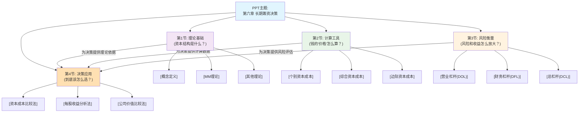

# 1 📋 第6章 资本结构决策新 整体结构框架
## 1.1 🗂️ 章节目录与学习路径
### 1.1.1 章节概览
第1节：资本结构的理论 - [本节主要介绍资本结构是什么，以及学术界如何看待它对公司价值的影响，是后续所有决策的理论基石。]
第2节：资本成本的测算 - [本节是全章的“计算中心”，教你如何把不同来源的钱（借款、债券、股票）换算成一个统一的“价格”——资本成本率。]
第3节：杠杆利益与风险的衡量 - [本节将复杂的经营和财务风险量化，通过“杠杆”这个工具，让你看清收益与风险是如何被放大的。]
第4节：资本结构决策分析 - [本节是最终的“决策中心”，综合运用前三节的理论、计算和风险评估工具，来选择最优的资本结构方案。]
### 1.1.2 📊 整体逻辑结构思维导图

### 1.1.3 🎯 学习建议顺序
- **建议学习顺序：** 严格按照 **第1节 → 第2节 → 第3节 → 第4节** 的顺序学习。这是一个层层递进的结构，跳过任何一节都会导致后续内容无法理解。
- **章节重要性：**
    - ⭐⭐⭐ **第2节 & 第4节**：第2节是计算题的核心，第4节是案例分析题的核心，两者都是考试的重中之重。
    - ⭐⭐ **第3节**：杠杆系数的计算和理解是常考内容，通常结合第4节出题。
    - ⭐ **第1节**：理论部分，主要以选择题和简答题形式考察，是理解全章的基础。
- **前置知识要求：**
    - 需要对**财务管理基础**有一定了解，特别是**货币时间价值**的概念（现值、年金等）。
    - 基本的代数运算能力。
📝 **使用指南**
- 现在，请输入 "**第1节**" 来获取该节的详细解析。
- 我将严格按照你提供的模板，为你进行文科友好、直观易懂的讲解。