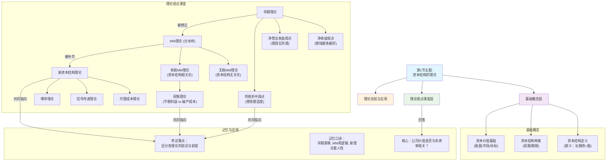

# 1 📈 第1节：资本结构的理论
## 1.1 🧒 8岁小孩也能懂的概念解释
### 1.1.1 **本节核心问题**
这一节主要在吵一个几十年都没吵完的问题：**一家公司是借钱发展好，还是用自己的钱发展好？借钱的比例到底会不会影响公司的总价值？**
- **用最简单的话说：** 想象你要开一家奶茶店。启动资金10万，你是应该自己全出呢？还是自己出5万，再跟银行借5万？或者找小明合伙，他出5万？这几种不同的“钱的组合”，哪一种能让你的奶茶店未来最值钱？这就是资本结构要解决的核心问题。
### 1.1.2 **基础概念白话解释**
- **资本结构 (Capital Structure)**：
    - **8岁小孩版解释：** 就是你开店的钱里面，“自己的钱”和“借来的钱”分别占多少。比如你总共有100块钱开店，自己出了60块（股权），找银行借了40块（债务），那你的资本结构就是6:4。PPT里说的**狭义资本结构**，主要就是关心这个“长期的借款”和“股东的钱”之间的比例。
    - **PPT原文定义：** 企业各种长期资本的构成及其比例关系，尤其是指长期债务资本与（长期）股权资本之间的构成及其比例关系。
    - **为什么要这样定义：** 因为短期借款很快就要还，对公司长远价值影响不大。而长期借款和股东的钱，是公司稳定发展的基石，它们的比例决定了公司的长期风险和回报，所以我们特别关注。
- **MM理论 (Modigliani-Miller Theory)**：
    - **8岁小孩版解释：** 这是两个叫M&M的聪明人想出来的理论，就像一个“披萨理论”。
        - **一开始（没考虑税）：** 他们说，公司就像一整个披萨。不管你怎么切（分给股东的多一点，还是分给银行的多一点），披萨的总大小（公司价值）是不变的。所以借不借钱，公司总价值都一样。
        - **后来（考虑税了）：** 他们发现，政府有个规定：付给银行的利息可以让你少交点税。这就好比，你每从银行借来一块钱，政府就会免费送你一点芝士撒在披萨上。这样一来，借的钱越多，送的芝士（节税利益）就越多，整个披萨（公司价值）就变大了！
    - **PPT原文定义：** (无税)公司的价值与其资本结构无关。(有税)有债务公司的价值等于...无债务公司的价值加上债务的节税利益。
    - **概念之间的关系：** MM理论是资本结构理论的“分水岭”。它之前的理论比较凭感觉，它之后的理论都是在它的基础上进行补充和修正。
## 1.2 📊 本节详细思维导图

## 1.3 📚 本节知识点详细讲解
### 1.3.1 **知识点1：资本结构的核心概念与种类**
- **基础理解**
    - **8岁小孩版解释：** 我们主要关心两件事：第一，钱是谁的（自己的还是借的，即**权属结构**）；第二，这钱能用多久（短期的还是长期的，即**期限结构**）。我们这章主要讨论的是“能长期使用的、自己的钱和借来的钱”的比例问题。
- **核心要点：**
    - **广义 vs. 狭义：** 广义包括所有钱，狭义只看**长期钱**。考试和实务中，我们说的资本结构**默认都是狭义的**。
    - **权属结构：** 债务资本 vs. 股权资本。
    - **期限结构：** 长期资本 vs. 短期资本。
- **易混提醒：⚠️**
    - **资本结构 vs. 财务结构：**
        - **8岁版区别解释：** “资本结构”是你为了开店和长期发展筹集的钱（比如买设备、装修的钱）。“财务结构”是你账上所有的钱，包括你明天就要拿去进货的短期借款。**资本结构是财务结构的核心部分。**
### 1.3.2 **知识点2：资本结构的价值基础**
- **基础理解**
    - **8岁小孩版解释：** 怎么算你公司的钱值多少？有三种算法：
        1. **账面价值：** 翻开你的账本，上面写着多少就是多少。优点是简单，缺点是可能跟不上时代。
        2. **市场价值：** 看看你的公司如果现在上市，股票和债券能在市场上卖多少钱。这个最能反映你公司现在的真实价值。
        3. **目标价值：** 你心里想的，未来希望公司达到的最理想的资本结构和价值。这是用来做未来规划的。
- **核心要点：** 决策时，**市场价值**和**目标价值**比账面价值更有意义，因为它们更能反映公司的未来。
### 1.3.3 **知识点3：早期资本结构理论（靠直觉的三种猜想）**
- **① 净收益观点**
    - **8岁小孩版解释：** 这派人觉得借钱是天大的好事，因为付给银行的利息比股东想要的分红便宜多了。所以他们认为，**负债越多，公司总的用钱成本就越低，公司就越值钱**。结论就是：**使劲借钱就对了！**
    - **核心要点：** 负债越多，公司价值V越高。
    - **易混提醒：⚠️** 这个观点太乐观了，它完全没考虑借钱太多还不起的风险（财务风险）。
- **② 净营业收益观点**
    - **8岁小孩版解释：** 这派人刚好相反。
    - 他们觉得，你借钱越多，股东就越害怕，因为万一还不上，股东的钱就打水漂了。
    - 所以你借钱省下的利息钱，刚好被股东要求的更高回报给抵消了。
    - 一来一回，**借不借钱、借多少，对公司总价值没影响。**
    - **核心要点：** 公司价值V与负债无关。
    - **易混提醒：⚠️** 这个观点又太悲观了，它忽略了借钱可以省税的好处。
- **③ 传统折中观点**
    - **8岁小孩版解释：** 这是个“和事佬”观点。它说，上面两个都太极端了。刚开始适度借点钱，确实能降低成本、提升价值。但借得太多了，风险就急剧上升，股东和新的债主都会害怕，导致用钱成本急剧上升，公司价值反而下降。所以存在一个**最佳的借钱比例**。
    - **核心要点：** 存在一个最优资本结构，使得综合资本成本最低，公司价值最高。
    - **记忆技巧：💡** 它的成本曲线是个“U”形，公司价值曲线是个倒“U”形，先升后降。
### 1.3.4 **知识点4：MM理论（改变游戏规则的逻辑派）**
- **难点突破：🔥**
    - **难在哪里：** MM理论引入了严格的假设，结论比较抽象。
    - **突破方法：** 牢记“披萨”比喻。核心是区分**无税**和**有税**两种情况。
    - **简化记忆：**
        - **无税世界：** 资本结构**无关**论。公司价值由经营能力（披萨有多好吃）决定，不由钱的来源（披萨怎么切）决定。
        - **有税世界：** 资本结构**相关**论。因为利息可以抵税（借钱送芝士），所以负债越多，节税利益越大，公司价值越高。
- **权衡理论 (Trade-off Theory)**
    - **8岁小孩版解释：** 这是在“有税MM理论”上的一个重要补充。它说，借钱虽然能“送芝士”（节税），但借太多了，披萨店就有倒闭的风险（财务危机成本/破产成本）。当“送的芝士”带来的好处，刚好等于“倒闭风险”带来的坏处时，就达到了最佳的平衡点。
    - **核心要点：** 最优资本结构是**债务的节税利益**和**财务危机成本**之间的权衡。
    - **考试应用：** 这是目前被最广泛接受的理论，也是论述题解释“为什么公司不100%负债”时的标准答案。
### 1.3.5 **知识点5：新的资本结构理论（关注“人性”的理论）**
- **① 代理成本理论**
    - **8岁小孩版解释：**
        - **约束管理者：** 如果公司全是股东的钱，管理者（比如CEO）可能会乱花钱。但如果借了银行的钱，每个月要还本付息，管理者就不敢乱来了，这就是**适度负债的好处**。
        - **债权人监督：** 但如果借太多，银行（债权人）会不放心，天天派人来查账，监督成本很高，这个成本最终也要公司承担。
- **② 信号传递理论**
    - **8岁小孩版解释：** 公司老板比外人更了解公司。
        - 当老板觉得自家股票被低估时，他会选择**发债**，因为他对未来有信心，还得起，也不想让新股东占便宜。这是一个“公司很好”的**好信号**。
        - 当老板觉得自家股票被高估时，他会赶紧**发新股**，让市场上的冤大头来接盘。这是一个“公司可能没那么好”的**坏信号**。
- **③ 啄序理论 (Pecking Order Theory)**
    - **8岁小孩版解释：** 公司筹钱就像我们普通人花钱一样，有个先后顺序。
        1. **首选：** 用自己赚的钱（**内部融资**，比如留存收益）。
        2. **次选：** 如果不够，就去借钱（**债务融资**）。
        3. **最后万不得已：** 才考虑让别人入股（**股权融资**），因为这会稀释原有股东的控制权。
    - **记忆口诀：💡** **内→债→股**，像鸟啄食一样，先吃近的，再吃远的。
## 1.4 🧠 本节记忆优化结构
### 1.4.1 **PPT内容分层记忆**
- **第一层：PPT基础概念（必须会背）**
    - **资本结构：** 狭义指长期债务和股权的比例。
    - **MM理论（有税）：** 公司价值 = 无负债公司价值 + 债务的节税利益。
    - **权衡理论：** 最优资本结构在“节税利益”和“财务危机成本”之间平衡。
    - **啄序理论：** 筹资顺序是内部融资 → 债务融资 → 股权融资。
- **第二层：PPT逻辑关系（必须会用）**
    - **逻辑关系图：**
        ```mermaid
        graph TD
            A["早期理论<br/>(凭直觉猜想)"] --> B{"MM理论<br/>(引入严格逻辑)"}
            B -- 无税环境 --> C["资本结构无关"]
            B -- 有税环境 --> D["负债越多越好"]
            D -- 增加破产成本 --> E["权衡理论<br/>(存在最优结构)"]
            B -- 考虑信息不对称 --> F["信号理论 & 啄序理论"]
        ```
    - **逻辑关系记忆口诀：** 早期**猜**，MM**算**，权衡来**平衡**，信号和啄序看**人性**。
- **第三层：PPT综合应用（考试高分点）**
    - **核心问题：** 现实中公司为什么不100%负债？
    - **高分答题模板（基于PPT）：**
        1. **首先，根据有税MM理论，** 负债的利息抵税效应确实会增加公司价值。
        2. **然而，这没有考虑财务风险。根据权衡理论，** 随着负债增加，公司的财务危机成本和破产成本也在上升，这会抵消节税带来的好处。
        3. **再者，根据代理成本理论，** 过高的负债会导致债权人监督成本上升。
        4. **最后，根据信号理论和啄序理论，** 公司也会考虑融资行为向市场传递的信号以及融资的便利性，不会单纯为了节税而无限负债。
        5. **因此，** 最优资本结构是综合考虑上述因素后的一个平衡点。
## 1.5 🎯 本节考试高分策略
### 1.5.1 **题型识别与应对**
- 选择题/判断题高分技巧
    [!TIP] 选择题速胜法
    - **题目信号词：**
        - 看到 “**无税**”、“**完美市场**” → 想到 **MM理论无关论**。
        - 看到 “**利息抵税**” → 想到 **MM理论相关论** 或 **权衡理论**。
        - 看到 “**破产成本**”、“**财务困境**” → 想到 **权衡理论**。
        - 看到 “**内部融资优先**” → 想到 **啄序理论**。
        - 看到 “**信息不对称**”、“**股价高估/低估**” → 想到 **信号传递理论**。
    - **选择题口诀：**
        - 无税MM价**不变**，有税MM价**上涨**。
        - 权衡理论有个**顶**，代理成本两头**翘**。
        - 信号专看发**股债**，啄序就按**内外**瞧。
- 计算题高分技巧
    [!IMPORTANT] 计算题不丢分
    - **本节纯属理论，不涉及计算题。** 所有的计算都在**第2、3、4节**。学好本节理论是理解后续计算公式背后逻辑的关键。
- 论述题/简答题高分模板
    [!NOTE] 论述题拿高分
    - **问题：** 请论述最优资本结构是如何决定的。
    - **万能答题框架（基于PPT逻辑）：**
        1. **定义概念：** 首先阐述资本结构的定义及其对企业的重要性。
        2. **理论演进：** 简述资本结构理论的演变过程。从早期理论的朴素观点，到MM理论突破性地提出在无税和有税环境下的不同结论。
        3. **核心理论：** 重点阐述**权衡理论**，说明最优资本结构是债务的“节税利益”和“财务危机成本”之间平衡的结果。这是核心得分点。
        4. **补充视角：** 进一步从**代理成本、信号传递、啄序理论**等角度，说明现实中影响资本结构决策的其他因素。
        5. **总结：** 综上所述，最优资本结构并非一个精确的点，而是一个动态的、需要综合权衡多方面因素的区间。
## 1.6 📖 本节知识脉络与考试要点
### 1.6.1 **考试重点总结**
- **必考知识点：⭐⭐⭐**
    - **MM理论（有税）**：结论和“节税利益”这个词必须牢记。
    - **权衡理论**：解释为什么存在最优资本结构的核心理论。
    - **啄序理论**：筹资顺序（内→债→股）是高频考点。
- **常考知识点：⭐⭐**
    - **传统折中观点**：其“U”型成本曲线和倒“U”型价值曲线的形状。
    - **信号传递理论**：发债和发股分别传递什么信号。
- **了解知识点：⭐**
    - 资本结构的广义和狭义定义。
    - 净收益观点和净营业收益观点（通常作为MM理论的铺垫出现）。
## 1.7 📋 本节内容完整性检查
### 1.7.1 **覆盖度验证**
- [x] PPT主题和核心观点
- [x] PPT中的所有重要概念（8岁版+原文版）
- [x] PPT中的所有理论观点（早期、MM、新理论）
- [x] PPT中的所有对比和分类（直观对比+辨析口诀）
- [x] PPT的逻辑展开过程（记忆链条）
- [x] PPT中理论的结论和总结（考试要点）
- [x] PPT中需要精确记忆的理论表述（MM理论、权衡理论）
### 1.7.2 **理解度自测（基于PPT内容）**
- [ ] 我能像对8岁小孩一样解释“权衡理论”和“啄序理论”吗？
- [ ] 我能看到“利息抵税”就立刻想到有税MM理论吗？
- [ ] 我能快速说出“啄序理论”的融资顺序吗？
- [ ] 我能准确区分“MM无关论”和“MM相关论”的前提条件吗？
- [ ] 我能在论述题中应用高分模板吗？
✅ **本节学习完成！**
**下一步：**
- 输入 "**第2节**" 继续学习计算核心——资本成本的测算。
- 输入 "**整体框架**" 回到总体结构图。