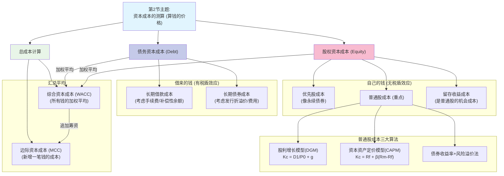

# 1 📐 第2节：资本成本的测算
## 1.1 🧒 8岁小孩也能懂的概念解释
### 1.1.1 **本节核心问题**
这一节只解决一个问题：**公司从不同地方搞来的钱，每种钱的“价格”到底是多少？把所有钱混在一起，总的平均“价格”又是多少？**
- **用最简单的话说：** 你开奶茶店，问妈妈借了1万块，她不要利息，但你答应每年给她买生日礼物（用资费用）；又问银行借了5万块，银行要收5%的利息（用资费用），还得交点手续费（筹资费用）。这两种钱的“价格”（也就是资本成本）显然不一样。这一节就是教你怎么把这些“礼物钱”、“利息钱”、“手续费”都统一算成一个百分比，方便比较哪种钱更“贵”，以及你所有钱的平均“价格”是多少。
### 1.1.2 **基础概念白话解释**
- **资本成本 (Cost of Capital)**：
    - **8岁小孩版解释：** 就是你使用钱需要付出的代价，可以理解为钱的“年租金率”。无论是给银行的利息，还是给股东的分红，都是资本成本。它是公司投资项目时，必须达到的“最低及格线”，因为项目赚的钱至少要能付得起这些“租金”。
    - **PPT原文定义：** 企业筹集和使用资本而承付的代价，包括用资费用和筹资费用。
    - **核心特征：** 这是一个**机会成本**。股东把钱投给你，就放弃了投给别人的机会，所以他们要求的报酬，就是你的资本成本。
- **个别/综合/边际 资本成本**：
    - **个别资本成本：** 就是**单一来源**钱的价格。比如只算银行借款的成本，或者只算发股票的成本。
    - **综合资本成本 (WACC)：** 就是把你所有长期钱（借款、债券、股票等）的成本，按它们各自占的比例，**加权平均**算出来的一个总成本。这是衡量公司整体资金成本的核心指标。
    - **边际资本成本：** 当你已经有很多钱之后，再想去**新借一笔钱**的成本。通常，钱越借越多，风险越大，新钱的成本就会越高。这个指标是为**未来追加投资**决策服务的。
## 1.2 📊 本节详细思维导图

## 1.3 📚 本节知识点详细讲解
### 1.3.1 **知识点1：债务资本成本的测算 (长期借款、长期债券)**
- **基础理解**
    - **8岁小孩版解释：** 借钱的成本主要是**利息**。但最爽的一点是，你付的利息可以在交税前扣掉，帮你省了一部分税钱（这叫**税盾效应**）。所以，你借钱的真实成本是**打了折的利息**。
    - **核心要点：** 债务成本的计算，**一定要乘以 `(1-T)`**，因为利息可以抵税！
- **数学公式：📐**
    - **长期借款成本率 `Kl`（简化版）：** Kl=Rl×(1−T)  
        - **直观理解：** 就是把银行的年利率 `Rl`，打个 `(1-T)` 的税收折扣。
    - **长期债券成本率 `Kb`（简化版）：** Kb=B0​×(1−f)I×(1−T)​  
        - **直观理解：** 分子是每年实际付出的、打了税收折扣的利息。分母是你发债券实际拿到手的钱（发行价 `B0` 减去发行费 `f`）。
        - **记忆口诀：** **“税后利息，除以到手净额”**
- **考试应用**
    - **常见陷阱：**
        1. **筹资费用 `f`：** 借款或发债时会有手续费、印刷费等，这会减少你实际到手的钱，从而**提高**资本成本。计算分母时别忘了乘以 `(1-f)`。
        2. **折价/溢价发行：** 债券不一定按面值卖。折价发行（卖得便宜），你到手的钱少，成本**更高**；溢价发行（卖得贵），你到手的钱多，成本**更低**。计算时分母的 `B0` 要用**实际发行价**。
        3. **补偿性余额：** 银行要求你借100万，必须有20万存着不准动。那你实际只能用80万，但利息还是按100万算，这会大大**提高**你的借款成本。
### 1.3.2 **知识点2：股权资本成本的测算 (优先股、普通股、留存收益)**
- **基础理解**
    - **8岁小孩版解释：** 用股东的钱，成本就是你要给股东的**分红**，或者他们期望的**股价上涨**。因为如果公司破产，借的钱要先还，股东的钱最后才能拿回来（甚至可能拿不回），所以股东承担的风险最大，他们要求的“价格”（回报率）也自然是**最高**的。
    - **核心要点：** 股权成本**不能**抵税，所以没有 `(1-T)` 的折扣。
- **① 优先股成本 `Kp`**
    - **公式：** Kp=Pp×(1−f)Dp​  
    - **直观理解：** 优先股每年分红 `Dp` 是固定的，像个没有到期日的债券。所以它的成本就是 **每年固定的股利** 除以 **发行优先股实际到手的钱**。
- **② 普通股成本 `Kc` (本节重中之重)**
    - **难点突破：🔥** 普通股未来的分红和股价都不确定，所以成本最难算。PPT提供了三种方法，必须都掌握。
    - **方法一：股利增长模型 (DGM)**
        - **公式：** Kc=P0​D1​​+g  
        - **直观理解：** 股东投资你，图两样东西：一是**股利**（像收租金），二是**股价上涨**（资产增值）。这个公式就是把这两部分加起来。`D1/P0` 是**明年的股利收益率**，`g` 是**预期的股价年增长率**（假设股利和股价同步增长）。
        - **记忆口诀：** **“明年股利除以现价，再加上增长率”**
        - **使用场景：** 适用于股利发放稳定且有规律增长的公司。
    - **方法二：资本资产定价模型 (CAPM)**
        - **公式：** Kc=Rf​+β×(Rm​−Rf​)  
        - **直观理解：** 这是从风险角度算的。股东投资你，要求的最低回报是：
            1. **无风险利率 `Rf`：** 把钱存银行或买国债的无风险收益。
            2. **风险溢价：** 因为投你的股票有风险，所以要给点额外补偿。补偿多少呢？就看整个股票市场的平均风险回报 `(Rm - Rf)`，再乘以你这只股票的风险系数 `β`。
        - **`β` 的8岁小孩版解释：** `β` 就是你这只股票的“脾气”或“弹性”。
            - `β = 1`：你的股票和市场“同手同脚”，市场涨10%，你也涨10%。
            - `β > 1`：你的股票是“疯牛”，市场涨10%，你可能涨15%（风险高，回报也高）。
            - `β < 1`：你的股票是“老黄牛”，市场涨10%，你可能只涨8%（风险低，回报也稳）。
        - **记忆口诀：** **“无风险利率保个底，市场风险乘脾气”**
    - **方法三：债券收益率 + 风险溢价法**
        - **直观理解：** 这是个估算方法。投资股票的风险肯定比买这家公司的债券高，那么股票的成本就等于**这家公司债券的成本**，再加上一个**风险补偿**（PPT里说一般是3%~5%）。
- **③ 留存收益成本**
    - **易混提醒：⚠️** 留存收益是公司自己赚的钱，还要成本吗？**要！**
    - **8岁版区别解释：** 这笔钱本来可以作为股利发给股东，但公司把它留下来再投资。对股东来说，这就是一笔追加投资。他们当然希望这笔钱能赚回至少和投资普通股一样的回报率。所以，留存收益的成本是**机会成本**。
    - **计算：** 和普通股成本的计算方法**基本一样**，唯一的区别是，留存收益是内部来的，**没有发行费用** `f`。所以它的成本通常比增发新普通股**略低**。
### 1.3.3 **知识点3：综合与边际资本成本 (WACC & MCC)**
- **① 综合资本成本 (WACC)**
    - **公式：** WACC=∑(Wj​×Kj​) （`W`是权重，`K`是单个成本）
    - **8岁小孩版解释：** 你开奶茶店的钱，60%是自己的（成本15%），40%是银行借的（税后成本4%）。那你总的平均成本就是 `60% × 15% + 40% × 4% = 9% + 1.6% = 10.6%`。这就是WACC。
    - **高分答题模板（计算）：**
        1. **第一步：算个别。** 分别算出所有长期资金来源（借款、债券、优先股、普通股等）的**税后**资本成本率。
        2. **第二步：定权重。** 确定每种资金占总资金的比例。**优先使用市场价值计算权重**，如果没有市场价值才用账面价值。
        3. **第三步：加权算。** 把第一步和第二步的结果相乘再相加，得到WACC。
    - **考试应用：** WACC是整个章节的**核心计算**，大概率以大题形式出现。
- **② 边际资本成本 (MCC)**
    - **基础理解：** WACC算的是**存量**资金的平均成本，而MCC算的是**增量**资金的成本。当公司需要一大笔新钱时，不同来源的钱，其成本会随着筹资额的增加而“涨价”（比如银行看你债多了，再借就要收更高利息）。MCC就是计算不同筹资总额区间的WACC。
    - **核心概念：筹资总额分界点 (Breakpoint)**
        - **8岁小孩版解释：** 假设你按“借40%、自己出60%”的比例筹钱。银行说，10万以内利息5%，超过10万就要8%。那么当银行借款达到10万时，你的总筹资额就到了一个“涨价点”。这个点就是分界点。
        - **分界点计算：** `BP = 某种筹资方式成本变化的临界点金额 / 该种方式在目标资本结构中的权重`
        - **考试应用：** 先算出所有可能的分界点，然后按从小到大的顺序划分筹资总额区间，再计算每个区间的WACC（即MCC）。
## 1.4 🧠 本节记忆优化结构
### 1.4.1 **PPT内容分层记忆**
- **第一层：PPT基础公式（必须会背）**
    - **债务成本：** 别忘 `(1-T)`
    - **普通股成本 (CAPM)：** Kc=Rf​+β×(Rm​−Rf​)  
    - **普通股成本 (DGM)：** Kc=P0​D1​​+g  
    - **WACC：** WACC=Wdebt​Kdebt​(1−T)+Wequity​Kequity​ (简化版)
- **第二层：PPT逻辑关系（必须会用）**
    ```mermaid
    graph TD
        A["先算单个钱的价格"] --> B["债务 (要抵税)"]
        A --> C["股权 (不抵税)"]
        B & C --> D{"再算所有钱的平均价 (WACC)"}
        D -- 权重乘以单个成本再相加 --> E["得出WACC"]
        D -- 如果要追加投资 --> F{"考虑成本会变,算边际成本 (MCC)"}
        F -- 找分界点,分段算WACC --> G["得出MCC曲线"]
    ```
- **逻辑关系记忆口诀：** **先算小的，再算大的；先算旧的，再算新的。**
## 1.5 🎯 本节考试高分策略
### 1.5.1 **计算题高分技巧**
[!IMPORTANT] 计算题不丢分
- **万能解题步骤模板 (WACC计算题):**
    1. **罗列来源：** 把题目中所有长期资金来源列出来（如：长期借款、债券、优先股、普通股、留存收益）。
    2. **计算个别成本 (K)：**
        - **债务类：** 找利率 `I`，找税率 `T`，套公式 `K_debt(1-T)`。注意发行费和折溢价。
        - **股权类：** 看题目给了什么条件。给 `β` 和 `Rf` 就用CAPM；给股利 `D` 和股价 `P`、增长率 `g` 就用DGM。
    3. **确定权重 (W)：**
        - **首选市场价值权重！** 题目给了市价，就用`市价 × 数量`算出每部分市值，再除以总市值得到权重。
        - 没给市价，再用账面价值。
    4. **加权汇总：** 制作一个表格，把每项的 `W` 和 `K` 填进去，相乘，最后竖列求和，得到最终的WACC。**小数点保留4位以保证精度**。
- **常见陷阱：**
    - 忘记债务成本要乘以 `(1-T)`。
    - 普通股和留存收益成本算混了（区别在于有无发行费 `f`）。
    - 权重用账面价值还是市场价值没分清。
## 1.6 📋 本节内容完整性检查
### 1.6.1 **覆盖度验证**
- [x] PPT中的所有重要概念（个别、综合、边际）
- [x] PPT中的所有公式（债务、股权、WACC、MCC）
- [x] PPT中所有公式的口诀和应用技巧
- [x] PPT中所有计算案例的逻辑
- [x] 考试要点和常见陷阱
### 1.6.2 **理解度自测（基于PPT内容）**
- [ ] 我能不看笔记，写出CAPM和DGM的公式吗？
- [ ] 我能解释为什么留存收益有成本，且成本低于新发普通股吗？
- [ ] 我能解释债务的“税盾效应”是什么意思吗？
- [ ] 给我一道WACC计算题，我能遵循“四步法”完整做出来吗？
- [ ] 我知道“边际资本成本分界点”是怎么算出来的吗？
✅ **本节学习完成！**
**下一步：**
- 输入 "**第3节**" 继续学习如何量化风险与收益。
- 输入 "**复习第1节**" 重新查看理论基础。
- 输入 "**整体框架**" 回到总体结构图。