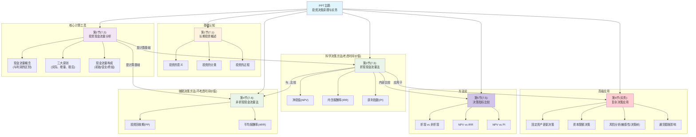

# 1 📋 投资决策原理与实务 整体结构框架
## 1.1 🗂️ 章节目录与学习路径
### 1.1.1 章节概览
这份PPT的核心内容是关于企业如何科学地进行长期投资决策。
- **第1节：长期投资概述 (7.1)** - **起点**：讲解投资是什么，为什么重要，以及投资决策的基本流程。
- **第2节：投资现金流量的分析 (7.2)** - **核心基础**：学习衡量投资项目价值的唯一标尺——现金流量，以及如何正确计算它。这是后续所有分析的前提。
- **第3节：折现现金流量方法 (7.3)** - **核心方法（重点）**：学习最科学的投资决策工具，如净现值(NPV)、内含报酬率(IRR)，这些方法考虑了“今天的一块钱比明天的一块钱更值钱”（货币时间价值）。
- **第4节：非折现现金流量方法 (7.4)** - **辅助方法**：学习一些相对简单但不那么精确的辅助决策工具，如投资回收期。
- **第5节：投资决策指标的比较 (7.5)** - **方法辨析**：对比上述两类方法的优劣，理解为什么折现现金流量法是现代财务管理的主流。
- **第6节：投资决策实务 (PPT后半部分)** - **综合应用（难点/考点）**：将前面的理论工具应用于更复杂的真实场景，如设备更新、有资金限制时的选择、风险分析和通货膨胀等。
### 1.1.2 📊 整体逻辑结构思维导图

🎯 **学习建议顺序**
- **建议学习顺序**：严格按照PPT的顺序学习： **7.1 → 7.2 → 7.3 → 7.4 → 7.5 → 实务应用**。这个顺序是“是什么→怎么算→怎么用→怎么选→怎么应对复杂情况”的逻辑，非常清晰。
- **章节重要性**：
    - ⭐⭐⭐ **第2节(7.2)、第3节(7.3)、第6节(实务应用)**：这三部分是绝对的考试重点，涵盖了核心计算和复杂案例分析。
    - ⭐⭐ **第5节(7.5)**：指标的比较是论述题和选择题的常考点。
    - ⭐ **第1节(7.1)、第4节(7.4)**：属于基础概念和辅助方法，理解即可，记忆量相对较小。
- **前置知识要求**：学习本章前，需要对“**货币时间价值**”（比如“现值”和“年金”的概念）有基本了解，这是理解第3节内容的关键。
📝 **使用指南**
- 请输入 **"第1节"** 来获取该节的详细解析。
- 例如：输入 **"第1节"** 开始学习第一节内容。
🧵 **整体逻辑主线概括**
这份PPT的整体思路，就像一个侦探解决案件的全过程：
**起点问题**：PPT开篇先告诉我们，企业为什么要像侦探一样去寻找好的“案子”（**长期投资**），以及立项侦查（**投资过程**）的基本规矩（第1节）。
**分析过程**：要破案，侦探需要最关键的线索。在投资决策里，这个唯一的、排他性的“线索”就是**现金流量**，而不是看似光鲜的“利润”（第2节）。拿到线索（现金流量）后，侦探需要专业的分析工具。这里有两种工具箱：一个是非常科学、能精准破案的“高科技工具箱”（**折现法**，第3节），它考虑到了所有线索发生的时间点价值；另一个是简单快速、能初步筛选线索的“常规工具箱”（**非折现法**，第4节）。
**得出结论**：有了不同的工具，侦探需要知道哪种最好用。通过对比（第5节），我们最终会明白，那个“高科技工具箱”（折现法）才是最可靠的，能帮我们做出最明智的判断。
**实际应用**：最后，学会了基本功的侦探要去应对各种复杂的真实案件，比如“老装备要不要换新的？”（设备更新）、“经费有限，哪个案子优先办？”（资本限额）、“这个案子风险有多大？”（风险分析）等等（第6节实务应用）。
**总结一下**：整个PPT就是从“**认识投资**”出发，到“**学会衡量投资价值的语言（现金流）**”，再到“**掌握科学的决策工具（折现法为主）**”，并最终“**将这些工具应用于复杂的实战**”的完整逻辑链条。