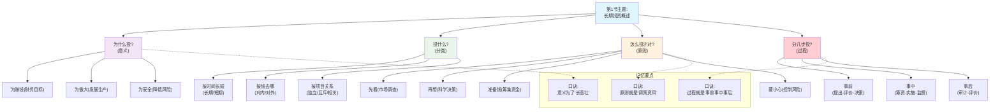

好的，我们现在开始解析第一节。
## 0.1 单节解析：第1节 长期投资概述 (7.1)
### 0.1.1 🧒 8岁小孩也能懂的概念解释
#### 0.1.1.1 本节核心问题
- **这一节要解决什么问题？**
    - 用最简单的话说：一个公司就像一个家庭，要决定花一大笔钱去做一件需要很长时间才能看到回报的事情，比如“盖一栋新房子”或者“让孩子去上一个很贵的学”。我们得先想清楚：**为什么要花这笔钱？有哪些花钱的方式？花钱的时候要遵守什么规矩？整个过程分几步走？**
#### 0.1.1.2 基础概念白话解释
- **企业投资的意义 1**
    - **8岁小孩版解释**：就像我们种一棵苹果树。
        1. **实现财务管理目标**：我们种树是为了将来能摘到很多苹果吃（企业为了赚钱）。
        2. **公司发展生产**：有了苹果树，我们就能开一个果汁店，生意越做越大（企业为了扩大生产）。
        3. **降低经营风险**：我们不光种苹果树，还种梨树。这样万一苹果树生病了，我们还有梨子吃（企业通过多样化投资来分散风险）。
    - **PPT原文定义**：企业投资是实现财务管理目标的基本前提、是公司发展生产的必要手段、是公司降低经营风险的重要方法 2。
- **企业投资的分类 3**
    - **8岁小孩版解释**：就像我们给玩具分类。
        - **长期 vs 短期**：是买一个能玩很多年的乐高城堡（长期），还是买一个很快就吃完的冰淇淋（短期）。
        - **对内 vs 对外**：是花钱把自己的房间装修得更漂亮（对内投资），还是把钱借给邻居让他开店，然后分红（对外投资）。
        - **互斥 vs 独立**：你口袋里的钱只够买一个变形金刚或者一辆遥控赛车，二选一（互斥）；你既可以买零食，也可以买漫画书，两件事不冲突（独立）。
    - **PPT原文定义**：按投资回收时间长短、投资方向、项目间关系等多种方法进行分类 4。
- **企业投资管理的原则 5**
    - **8岁小孩版解释**：这是你妈妈让你花钱前定下的规矩。
        1. **认真进行市场调查**：买玩具前，先去几家店比比价格，看看别的小朋友都在玩什么（调查机会）。
        2. **建立科学的决策程序**：不能拍脑袋就买，要想想这个玩具你是不是真的需要，能玩多久（可行性分析）。
        3. **及时足额地筹集资金**：确保你有足够的零花钱去买，不能买到一半发现钱不够了（保证资金供应）。
        4. **适当控制投资风险**：别把所有零花钱都花在一个可能很快就坏掉的玩具上（控制风险）。
    - **PPT原文定义**：包括进行市场调查、建立科学决策程序、及时筹集资金、控制风险等 6。
- **企业投资过程分析 7**
    - **8岁小孩版解释**：这就是你从“想要一个玩具”到“玩上新玩具”的全过程。
        1. **事前（做决定）**：你先在脑子里想好要买哪个玩具，说服你妈妈（提出项目、评价、决策）。
        2. **事中（去执行）**：你妈妈给你钱，你跑到商店把它买回来（筹集资金、实施方案）。
        3. **事后（看结果）**：你玩了一段时间后，想想这个玩具买得到底值不值（事后评价）。
    - **PPT原文定义**：投资过程分为事前、事中和事后三个阶段，分别对应决策、实施与监控、后续分析 8。
---
### 0.1.2 📊 本节详细思维导图
代码段

---
### 0.1.3 🧠 本节记忆优化结构
#### 0.1.3.1 PPT内容分层记忆
- **第一层：PPT基础概念（必须会背）**
    - **投资的意义**：
        - **8岁版**：为了让公司“长高”、“变壮”、“更安全”。
        - **PPT定义**：实现财务管理目标、发展生产、降低经营风险 9。
        - **记忆口诀**：**意**义就是“**长高壮**” (长：发展生产，高：财务目标，壮：降低风险)。
        - **考试要点**：多选题，考查投资的意义包括哪些。
    - **投资的过程**：
        - **8岁版**：做决定 → 去执行 → 看结果。
        - **PPT定义**：事前阶段、事中阶段、事后阶段 10。
        - **记忆口诀**：**过**程就是“**前中后**”。
        - **考试要点**：简答题或排序题，考查投资过程的三个阶段及其主要工作。
- **第二层：PPT逻辑关系（必须会用）**
    代码段
    ```mermaid
    graph TD
        A["为什么要做投资?<br/>(投资的意义)"] --> B["投资具体指哪些类型?<br/>(投资的分类)"]
        B --> C["做好投资要遵守什么规则?<br/>(管理的原则)"]
        C --> D["按什么步骤来做?<br/>(投资的过程)"]
    ```
    - **逻辑关系记忆口诀**：**因为有意义，所以要分类，遵守好原则，走对全过程。**
- **第三层：PPT综合应用（考试高分点）**
    - **本节的应用价值**：
        - **什么时候用**：本节内容是整个投资决策的“世界观”和“方法论”，是后面所有计算和分析的**出发点**。当你写一道大的论述题时，开头就可以用本节的“意义”和“原则”来拔高立意。
        - **高分答题模板**：在回答“如何进行一项成功的投资决策？”这类问题时，可以套用以下框架：
            1. **明确目标（意义）**：首先，一项成功的投资是为了实现企业...的目标。
            2. **遵循原则（原则）**：在决策中，我们必须遵循...四大原则。
            3. **执行流程（过程）**：具体来说，需要严格按照事前、事中、事后的科学流程来执行...
---
### 0.1.4 🎯 本节考试高分策略
#### 0.1.4.1 题型识别与应对
- 选择题高分技巧
    [!TIP] 选择题速胜法
    - **题目信号词**：
        - **题目特征**：问到“互斥项目”、“相关项目”属于哪种分类方式？
        - **PPT对应内容**：投资分类中的“根据不同投资项目之间的相互关系” 11。
        - **快速判断方法**：看到“互斥”、“独立”就想到“关系”。
        - **高分技巧**：分类方式是选择题高频考点，务必记清。
    - **选择题口诀**：**内外长短看方向，作用关系定种类。** （内外/长短是按方向和时间分；作用/关系是更具体的分类）。
- 论述题高分模板
    [!NOTE] 论述题拿高分
    - **题目**：请简述企业进行投资决策的科学过程。
    - **万能答题框架（基于PPT逻辑）**：
        1. **总述（一句话概括）**：企业投资决策是一个复杂的系统工程，可以按照时间顺序分为事前、事中、事后三个紧密联系的阶段 12。
        2. **分述（展开三阶段）**：
            - **事前阶段是决策核心**，主要包括投资项目的提出、评价与决策 13。具体工作有...（列出PPT中的要点）。
            - **事中阶段是方案执行**，主要工作是实施投资方案并对其进行监督与控制 14。具体工作有...（列出PPT中的要点）。
            - **事后阶段是总结反馈**，主要工作是对投资效果进行事后审计与评价 15。具体工作有...（列出PPT中的要点）。
        3. **总结（强调其重要性）**：这三个阶段环环相扣，构成了科学投资决策的完整闭环，是确保投资成功和实现企业价值最大化的重要保障。
---
### 0.1.5 🧵 本节核心逻辑概括
- 本节完整思路：
    本节内容首先从一个最根本的问题出发：“企业为什么要投资？”（即投资的意义），答案是为了赚钱、发展和安全 16。明确了动机之后，我们接着需要了解一下摆在面前的“投资菜单”上都有哪些菜式（即投资的分类），比如有对内的、对外的、长期的、短期的等等 17。知道了有哪些选择后，为了确保我们能选对、做好，PPT给我们定下了四条必须遵守的“游戏规则”（即投资的原则），告诉我们要调查、要科学、要钱够、要小心 18。最后，将这一切串起来，形成了一套标准的“行动指南”（即投资的过程），清晰地划分为决策的“事前”、执行的“事中”和总结的“事后”三个步骤 19。这为我们后续学习具体的决策计算方法，铺平了道路。
- **记忆主线口诀**：**意义分类定原则，投资过程分三段。**
---
### 0.1.6 ✅ 本节学习完成！
这一节是后面所有内容的基础，恭喜你已经掌握了投资决策的“世界观”。
下一步：
- 输入 **"第2节"** 继续学习核心基础——现金流量的分析。
- 输入 **"整体框架"** 回到总体结构图。