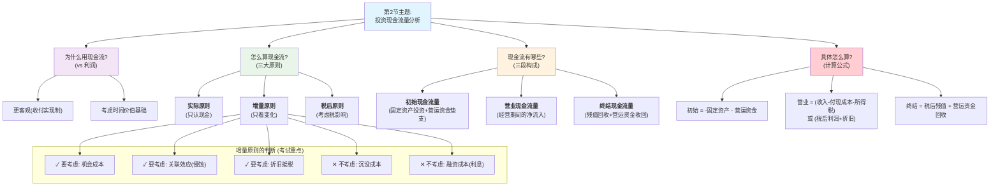

## 0.1 单节解析：第2节 投资现金流量的分析 (7.2)
### 0.1.1 🧒 8岁小孩也能懂的概念解释
#### 0.1.1.1 本节核心问题
- **这一节要解决什么问题？**
    - 用最简单的话说：在决定“要不要盖新房子”这件事上，我们不能光看账本上写的“预计能赚多少钱”（利润），而是要看我们口袋里实实在在“流入和流出多少钱”（现金流量）。这一节就是要搞清楚，**到底哪些钱该算，哪些钱不该算，以及怎么把这些钱算清楚**。
#### 0.1.1.2 基础概念白话解释
- **现金流量 vs. 利润**
    - **8岁小孩版解释**：你开了一个柠檬水小摊。
        - **利润**：就像你的记账本。你卖了10杯水，每杯10元，收入100元。但有5杯是小明赊账的，他说明天才给钱。你的记账本上写着今天赚了100元。
        - **现金流量**：是你口袋里今天真正收到的钱。虽然记账本上写着赚100元，但你口袋里只有50元现金。
        - **结论**：你只能用口袋里的50元去买新的柠檬，而不能用记账本上的100元。做投资决策，看的正是这口袋里的真金白银。
- **现金流量的三大原则**
    1. **实际现金流量原则**：
        - **8岁小孩版解释**：只认口袋里的钱，不认记账本上的数。
        - **PPT原文定义**：计量投资项目的成本和收益时，是用现金流量而不是会计收益。
    2. **增量现金流量原则（相关性原则）**：
        - **8岁小孩版解释**：你本来每天能赚10元。现在你想买一个新榨汁机，买了之后每天能赚15元。那么，这个榨汁机带来的“增量”现金流量就是 `15 - 10 = 5` 元。我们只关心这个“变化量”。
        - **PPT原文定义**：根据“有无”的原则确认有这项投资与没有这项投资现金流量之间的差额。
    3. **税后原则**：
        - **8岁小孩版解释**：你赚了钱，妈妈（税务局）要拿走一部分作为“家庭贡献”。你做决定时，必须考虑交完“妈妈税”之后，你还剩多少钱。
        - **PPT原文定义**：所得税构成企业的现金流出，必须予以考虑。
- **现金流量的构成（按时间）**
    - **8岁小孩版解释**：盖房子的钱，分为三笔。
        1. **初始现金流量**：盖房子前，买地、买砖头、请工人的钱。这是一笔大的流出。
        2. **营业现金流量**：房子盖好后，每年出租收到的租金，减去维修费、水电费。这是持续的流入。
        3. **终结现金流量**：过了很多年，你把房子卖掉了，收回一大笔钱。这是最后的流入。
### 0.1.2 📊 本节详细思维导图

### 0.1.3 📚 本节知识点详细讲解
#### 0.1.3.1 知识点1：增量原则下的“四要三不要”（考试核心）
这是本节最重要、最容易出错的地方，决定了你的计算题能不能做对。
- **要考虑：机会成本 (Opportunity Cost)**
    - **8岁小孩版解释**：你有一块空地，可以租给别人每年赚1万，也可以自己盖厂房。如果你选择盖厂房，你就放弃了那1万的租金。这被放弃的1万，就是你盖厂房的“机会成本”，必须算作你盖厂房的一项支出。
    - **核心要点**：因为做了A，而放弃的“B的收益”。
    - **记忆技巧**：💡 **机会成本，看不见但存在，必须算。**
- **要考虑：关联效应/侵蚀 (Erosion)**
    - **8岁小孩版解释**：你家本来卖苹果汁，现在新推出了橙汁。结果，一些原来买苹果汁的顾客，现在改买橙汁了。橙汁虽然赚钱了，但苹果汁的收入却减少了。这个“减少的苹果汁收入”，就是对老产品销售的“侵蚀”，计算新项目收益时必须减掉。
    - **核心要点**：新项目对老项目产生的负面影响。
    - **记忆技巧**：💡 **新业务抢老业务的生意，抢走的部分要扣除。**
- **要考虑：税收和折旧的影响 (Taxes & Depreciation)**
    - **难点突破**：🔥 **折旧本身不是现金流出（买设备时钱已经花掉了），但它能“抵税”，从而影响现金流。**
    - **8岁小孩版解释**：你赚了100块，妈妈要收走25%（25块）。但你说：“我的榨汁机变旧了，价值少了10块（折旧）”。妈妈说：“好吧，那就算你只赚了90块，我收你90块的25%就行了”。这样你就少交了税。这个“少交的税”就是“折旧抵税”带来的好处，它是一个**现金流入**。
    - **数学公式**：📐 **折旧抵税额 = 折旧额 × 所得税税率**
    - **记忆技巧**：💡 **折旧是省钱的盾牌，能挡掉一部分税。**
- **不要考虑：沉没成本 (Sunk Cost)**
    - **8岁小孩版解释**：你花50块买了一张电影票，进去发现电影巨难看。这时你朋友打电话叫你去打游戏。你该不该走？——应该走！因为那50块钱已经花出去了，无论你看不看，钱都回不来了。做决策只看未来，不看过去。这50块就是“沉没成本”。
    - **核心要点**：已经发生、无法收回的成本，与未来决策无关。
    - **易混提醒**：⚠️ **沉没成本 vs. 机会成本**：沉没成本是“过去”已经花了的钱；机会成本是“未来”将要放弃的钱。
    - **记忆技巧**：💡 **沉舟侧畔千帆过，沉没成本别管我。**
- **不要考虑：融资成本 (Financing Costs)**
    - **8岁小孩版解释**：你借钱买榨汁机，要付给别人利息。在算这个榨汁机项目本身赚不赚钱时，我们**暂时不考虑利息**。为什么？因为我们后面会用一个包含了利息成本的“折现率”来统一打折，如果在现金流里算了，后面又打折，就重复计算了。
    - **核心要点**：利息等筹资费用在资本成本（折现率）中统一考虑。
    - **记忆技巧**：💡 **利息在“打折”那一步算，现在先放过。**
#### 0.1.3.2 知识点2：营业现金流量（OCF）的计算（计算题核心）
这是所有计算题的“发动机”，必须熟练掌握。PPT中介绍了两种等价的计算方法。
- **方法一：税后利润+折旧法（好理解）**
    - **公式**：`OCF = 税后利润 + 折旧`
        - `税后利润 = (销售收入 - 付现成本 - 折旧) × (1 - 所得税率)`
    - **直观理解**：先把所有成本（包括不是现金的折旧）都减掉，算出账面利润，交完税，得到税后利润。但因为折旧那部分钱其实没花出去，所以要再加回来，得到真正的现金流量。
    - **记忆口诀**：💡 **先算账，再交税，别忘把“假支出（折旧）”拿回来。**
- **方法二：税收挡板法（好计算，推荐）**
    - **公式**：`OCF = (销售收入 - 付现成本) × (1 - 所得税率) + 折旧 × 所得税率`
    - **直观理解**：这个公式把现金流分成两部分：
        1. `(销售收入 - 付现成本) × (1 - 所得税率)`：这是你真金白银的收入和支出，在交完税后还剩多少。
        2. `折旧 × 所得税率`：这就是前面说的“折旧抵税”的好处，它像一个盾牌，帮你省下来的税钱。
    - **记忆口诀**：💡 **现金收支先打税折，折旧盾牌另外加成。**
    - **使用场景**：这个公式不需要计算利润，直接用原始数据，计算更快，不易出错。
### 0.1.4 🧠 本节记忆优化结构
- **第一层：PPT基础概念（必须会背）**
    - **现金流量三大原则**：实际、增量、税后。
    - **现金流量三段构成**：初始、营业、终结。
- **第二层：PPT逻辑关系（必须会用）**
    ```
    graph LR
        A["起点:<br/>利润不靠谱"] --> B["核心:<br/>必须用现金流"]
        B --> C{"怎么算?<br/>三大原则"}
        C --"增量原则"--> D["四要三不要<br/>(机会/沉没/折旧等)"]
        C --"时间原则"--> E["三段式构成<br/>(初/营/终)"]
        D & E --> F["终点:<br/>算出每期的净现金流量(NCF)"]
    ```
    - **逻辑关系记忆口诀**：**利润不准用现金，三大原则要记清；增量之中有取舍，时间三段算得精。**
- **第三层：PPT综合应用（考试高分点）**
    - **大华公司案例分析**：PPT中的例7-3是你必须亲手算一遍的模板。
        - **高分技巧**：在草稿纸上画一个表格，横轴是年份（0, 1, 2, 3...），纵轴是现金流项目（固定资产投资、营运资金、销售收入、付现成本、折旧、所得税、残值回收...），一项一项填，最后按列加总，得到每年的净现金流量。这样逻辑清晰，不会遗漏。
### 0.1.5 🎯 本节考试高分策略
#### 0.1.5.1 计算题高分技巧
[!IMPORTANT] 计算题不丢分
- **步骤模板（基于PPT例题）**：
    1. **第1步：算折旧** → 识别折旧方法（直线法/加速法），算出每年折旧额。这是“折旧抵税”的基础。
    2. **第2步：算各年营业现金流量（OCF）** → 推荐用“税收挡板法” `(S-C)(1-T) + D×T`。每年单独计算。
    3. **第3步：算初始现金流量（t=0）** → `-固定资产投资 - 垫支的营运资金`。注意都是负号。
    4. **第4步：算终结现金流量（最后一年）** → `固定资产税后残值 + 收回的营运资金`。
        - **常见陷阱**：⚠️ 固定资产残值收入可能要交税！如果变价收入 > 账面净值，差额要交税。
    5. **第5步：汇总成表** → 将上述所有流量填入时间轴表格，计算出每一年的“净现金流量（NCF）”。
### 0.1.6 🧵 本节核心逻辑概括
- 本节完整思路：
    本节的逻辑就像一位严谨的法官在审案。首先，法官宣布：“本庭只认证据（现金流），不听故事（利润）”，确立了审判的唯一标准。接着，法官给出了三条核心的“审判原则”：必须是“实际”发生的现金，必须是和本案“相关”的（增量），而且必须是扣除给国家上缴部分“税后”的。为了审理清楚，整个案件被分为“案发初期”（初始现金流）、“持续作案期”（营业现金流）和“结案期**”（终结现金流）三段来分析。其中，最复杂的“增量”原则，法官特别强调了哪些是重要证据（如机会成本、折旧抵税），哪些是无效信息（如沉没成本、利息）需要排除。最终，通过一套严密的计算公式，我们将所有有效证据量化，得出了每一时间点的确切现金流量，为下一节的“判决”（投资决策）提供了无可辩驳的依据。
- **记忆主线口诀**：**抛弃利润用现金，三大原则记在心，四要三不要分清，三段加总算得准。**
### 0.1.7 ✅ 本节学习完成！
你已经掌握了投资决策分析中最核心的计算基础。现在，所有的准备工作都已就绪。
下一步：
- 输入 **"第3节"** ，我们将利用本节算出的现金流量，学习如何做出最终的科学决策。
- 输入 **"整体框架"** 回到总体结构图。