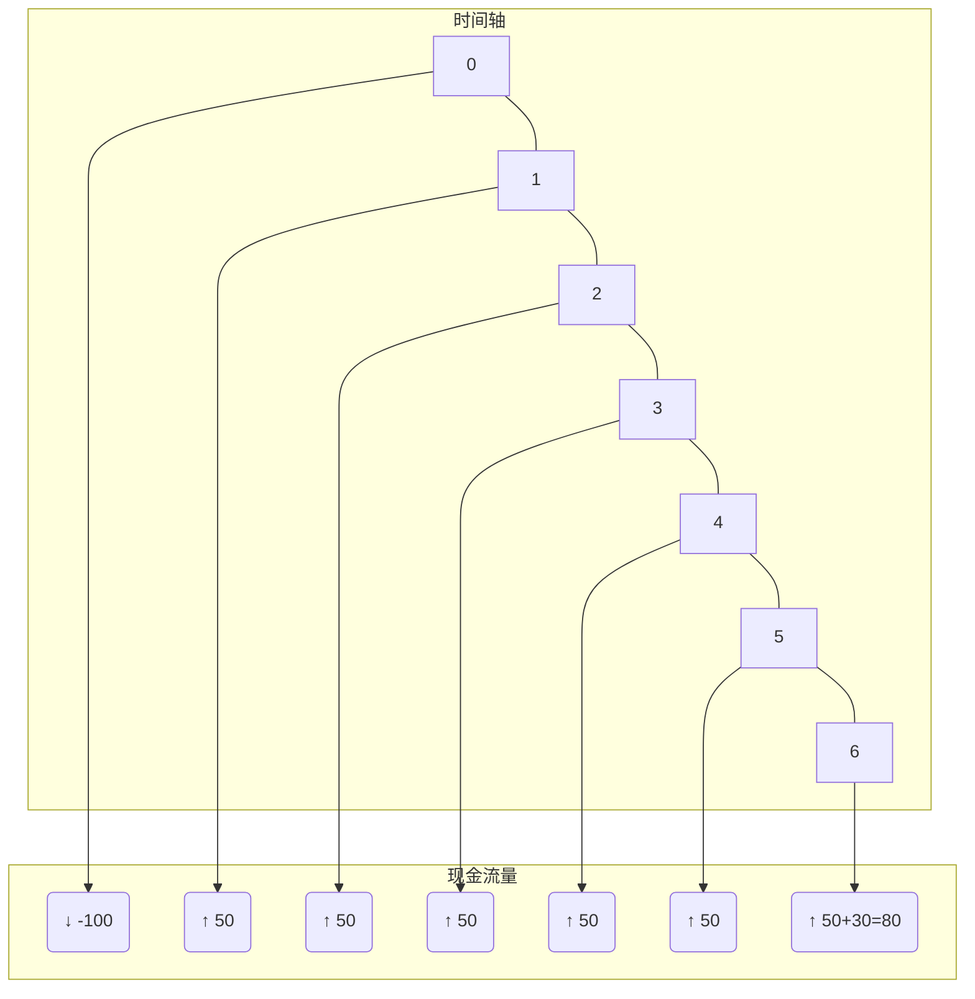
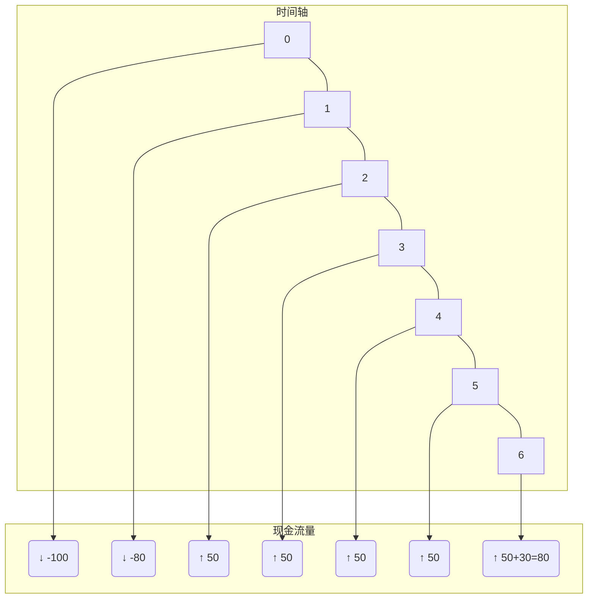

好的，没问题！作为您的学习伙伴，我将把刚才的课程内容，按照您的要求，整理成一份超级详细、适合零基础小白的Obsidian笔记。我会解释每一个细节，每一个概念的来源，并保留老师风趣的讲解风格。

---

# 1 第二节 投资项目财务评价指标

> **一句话通俗概括：** 这一节教我们用一套“尺子”（也就是各种指标）来衡量一个项目值不值得投钱，而所有这些“尺子”的刻度，都是基于项目能带来多少“真金白银”（也就是现金流）。

## 1.1 核心思想：现金为王
我们投资一个项目，最关心的是它能不能给我们带来持续、丰厚的现金回报。账面上的利润可能很好看，但那不一定是能揣进兜里的钱。所以，在投资决策中，我们最看重的是实实在在的**现金流入**和**现金流出**。

这一章节的所有评价指标，就像是把“现金流”这个原材料，通过不同的加工方式，组装成各种不同功能的“变形金刚”。它们外形各异，但本质和核心都是**现金流量**。

## 1.2 现金流量的概念
> **一句话通俗概括：** 项目的现金流量，就是把项目赚到的钱（流入）减去花出去的钱（流出）后，最终净剩下多少钱。

一个投资项目，既会给我们带来收入（现金流入），也需要我们不断投入成本（现金流出）。我们把流入的钱和流出的钱放在一起“轧”一下，得到的那个差额，就叫做**现金净流量**。

### 1.2.1 现金净流量 (Net Cash Flow - NCF)
- **英文全称：** Net Cash Flow
- **来源解释：**
    - `Net`：是“净”的意思，表示已经扣除了该扣的东西。我们上网用的 `Internet` 里的 `net` 是“网”的意思，这里是“净值”的意思。
    - `Cash`：就是现金。
    - `Flow`：就是流动。
- **重要性：** 这个缩写 **NCF** 一定要记住！在考试或者做笔记时，你可以直接用它来表示现金净流量，非常方便。
    - 比如：第一年的现金净流量可以写成 `NCF1`，第二年的可以写成 `NCF2`。
    - 有同学开玩笑说这是“脑残粉”的缩写，也行，怎么好记怎么来！
- **核心定义：** 在投资决策中，当我们提到“现金流量”时，通常默认指的就是**现金净流量（NCF）**，即已经考虑了所有流入和流出后的净额。

## 1.3 项目的生命周期与现金流量
> **一句话通俗概括：** 一个项目从出生到结束，可以分为花钱的“投资期”、赚钱的“营业期”和最后散伙分钱的“终结期”三个阶段。

我们可以把一个项目的整个生命周期想象成一条时间轴，它主要包含三个阶段：

*这是一个虚拟的图，帮助你理解*

上图是一个为期 $6$ 年的项目。
- `0` 时点是项目的开始。
- 从 `0` 时点到 `2` 时点年末，我们都在投钱，这是**投资期**。
- 从 `2` 时点年末（也就是第 `3` 年年初）开始，项目**投产**了，开始卖东西赚钱，这就进入了**营业期**。
- 在 `6` 时点年末，项目结束了，这是**终结期**。

---
### 1.3.1 投资期 (Investment Period)
> **一句话通俗概括：** 这是项目开始时，不断往里砸钱的阶段。

- **特点：** 在这个阶段，现金主要是**流出**的。我们在建厂房、买设备，所以钱是往外花的。
- **时间跨度：** 投资期可能是一个**时点**，也可能是一个**时期**。
    - **时点：** 我们可以假设在 `0` 时点，一次性把所有钱都投进去，第二天就开工赚钱。这在现实中不太可能，但在财务计算中可以这样简化。
    - **时期：** 更常见的情况是，投资分好几年进行，比如第 `0` 年投一部分，第 `1` 年再投一部分。

### 1.3.2 营业期 (Operating/Business Period)
> **一句话通俗概括：** 这是项目投产后，正式开始日常经营、赚钱回本的阶段。

- **定义：** 从**投产**那个时刻点开始，一直到项目结束前的整个时间段，都叫营业期。
- **特点：** 在这个阶段，项目开始产生收入，现金大概率是**净流入**的（流入 > 流出）。
- **时间跨度：** 营业期一定是一个**时期**或**时段**，比如从第 `3` 年到第 `6` 年。

### 1.3.3 终结期 (Terminal Period)
> **一句话通俗概括：** 这是项目结束的“最后一天”，在这一天我们要变卖家当，处理后事。

- **核心关键：** **终结期是一个时点数，不是一个时期！**
- **来源与理解（租房例子）：**
    1.  你租了一个店面做生意，租期到 `2024` 年 `12` 月 `31` 日截止。
    2.  在整个 `2024` 年，你是不是都在店里正常营业、赚钱？这整个 `2024` 年就是你的**营业期**。
    3.  到了 `12` 月 `31` 日这一天，租约到期了，房东说明天就不能用了。你会在这一天“金盆洗手”，把店里剩下的桌子、椅子、原材料等“破铜烂铁”全部处理掉，变卖成现金。
    4.  这个处理后事的动作，只发生在 `12` 月 `31` 日**这一个时点**上。这个时点，就是**终结期**。

- **重要结论：项目最后一年的现金流量非常特殊！**
    - 它包含了**两部分**：
        1.  **正常营业赚的钱**：就像你在 `2024` 年一整年经营店铺赚的钱。
        2.  **终结期处理资产的钱**：就像你在 `12` 月 `31` 日那天变卖家当收回的钱。
    - 所以，最后一年的现金净流量（NCF）通常会比之前的营业期要多。

### 1.3.4 重要提醒：别纠结分期，关注每年的现金流！
> **一句话通俗概括：** 别管什么“期”，考试做题时，你就老老实实地看图说话，算出每一年到底流入流出了多少钱就行。

老师强调，**投资期、营业期、终结期**这些概念是为了帮助我们理解，但在实际做题时，我们**不需要**去严格区分“投资期是几年”。考试真正要我们算的是**每一年的现金净流量是多少**。

你只需要根据题目给的条件，画出时间轴，把每一年发生的现金流标上去，然后计算出 `NCF0`, `NCF1`, `NCF2`... 就可以了。不要自己给自己加戏，胡思乱想，那样反而会搞混。

---
## 1.4 现金流量图实例解析

> **一句话通俗概括：** 我们把一个项目的钱的流入流出画在时间轴上，就能直观地看出每年的现金情况。

### 1.4.1 例子一：基础项目
假设一个 $6$ 年期的项目，`0` 时点一次性投资 $100$ 万，之后每年营业能净赚 $50$ 万，项目结束时还能收回 $30$ 万的资产余值。

- **解读：**
    - `0` 时点：箭头向下，表示现金**流出** $100$ 万。
    - `1` 到 `5` 时点：箭头向上，表示每年有 $50$ 万的现金**流入**。
    - `6` 时点：箭头向上，除了正常的营业流入 $50$ 万，还有一笔终结期收回的 $30$ 万，总流入是 $80$ 万。
- **写出NCF：**
    - **`NCF0`**: $$ -100 $$ (注意：现金流量要带正负号，流出为负)
    - **`NCF1~5`**: $$ 50 $$ (这是一种简写，表示第1年到第5年，每年的NCF都是50，不是合计)
    - **`NCF6`**: $$ 50 + 30 = 80 $$
- **特殊概念：投资额**
    - 如果题目问“投资额”是多少，答案是 $100$ 万。**投资额**是一个日常用语，不带正负号。

> **同学提问：** “老师，我不要贴现吗？”
> **老师回答：** 别急！我们现在只是第一步：**把每一年的现金流量算出来**。贴现是第二章学过的内容，是把未来的钱折算到今天的价值，那是我们做决策时的下一步操作。先把地基打好。

### 1.4.2 例子二：分期投资项目
假设一个 $6$ 年期的项目，`0` 时点投资 $100$ 万，`1` 时点再投资 $80$ 万，之后每年营业净赚 $50$ 万，项目结束时收回 $30$ 万。

- **写出NCF：**
    - **`NCF0`**: $$ -100 $$
    - **`NCF1`**: $$ -80 $$
    - **`NCF2~5`**: $$ 50 $$
    - **`NCF6`**: $$ 50 + 30 = 80 $$

> **同学提问：** “老师，这个营业期现金流每年都一样吗？”
> **老师回答：** 当然不一定！我们这里是为了教学简化，假设每年都一样。现实中和考试题目里，每年的现金流完全可能是不一样的。看图说话，题目给多少就是多少。

---

## 1.5 投资期现金流量的构成
> **一句话通俗概括：** 投资期花的钱，主要分两块：买设备厂房的“大钱”，和为了日常经营先垫付的“小钱”（比如原材料）。

1.  **长期资产投资：** 这是“大钱”，比如购买机器设备、建造厂房等固定资产的支出。
2.  **营运资金垫支：** 这是“小钱”，也叫 `Working Capital`。为了让项目能顺利开张，你得先花钱买点原材料、备点库存吧？这笔钱就是营运资金。

- **营运资金的精确来源：**
  $$ 营运资金 = 流动资产 - 流动负债 $$
- **例子：** 你开拉面店，需要花 $10$ 万元买面粉、牛肉等原材料（流动资产）。但你跟供应商关系好，可以先欠他 $2$ 万元的货款（应付账款，属于流动负债）。那么，你实际上自己需要掏出来的钱（垫支的营运资金）就只有 $$10 - 2 = 8$$ 万元。

### 1.5.1 什么是“垫支”？为什么营运资金能收回？
> **一句话通俗概括：** “垫支”就是你先替项目把这笔钱付了，等项目结束不干了，这笔钱理论上能原封不动地收回来。

- **“垫支”的含义：** 先支付，未来能收回。
- **财务管理的“乌龟的屁股”——规定（假设）：**
  我们假设，在**投资期最开始垫付的营运资金**，可以在项目**终结期那个时点上全额收回**。
- **为什么能收回（拉面店的简化例子）：**
    1.  **开张（投资期）：** 小郭花了 $5$ 万元垫资买原材料。此时：`现金 -5万`，`存货 +5万`。
    2.  **经营（营业期）：** 每天卖掉一部分面，收回现金，但为了维持经营，又得立刻花钱把卖掉的原材料补回来。这个过程循环往复，那 $5$ 万元的存货价值一直被动态地维持着。
    3.  **收工（终结期）：** 小郭决定不干了，他把最后所有原材料都做成面卖掉。当最后一碗面卖完，他最初垫进去的那 $5$ 万元，就以现金的形式全部回来了。

- **简化计算：** 正因为有这个假设，我们在计算时就变得很简单。只需要考虑两件事：
    1.  **期初：** 有一笔营运资金的**流出**。
    2.  **期末：** 有一笔等额的营运资金的**流入**。

---

## 1.6 营业期现金净流量的计算 (核心重点)
> **一句话通俗概括：** 这是计算项目在正常赚钱的年份里，每年到底能净赚多少现金的核心，有三个必须背下来的公式。

### 1.6.1 关键假设
1.  **发生时点：** 我们假设一整年所有的现金流入流出，都集中在**当年的年末**这一个时点发生。这就是为什么我们画图时都把现金流标在 $1, 2, 3$ 这些数字（代表年末）上。
2.  **现金收付：** 我们假设所有收入都是**现销**（当期收到现金），所有付了现金的成本和交的税，也都是在当期用现金支付的。

### 1.6.2 核心概念：付现成本 vs. 非付现成本
- **付现成本 (Cash Cost)：** 指那些需要**真正支付现金**的成本。比如买原材料、付工资、交水电费。
- **非付现成本 (Non-cash Cost)：** 指那些在会计上计入成本，但**没有发生实际现金流出**的费用。
    - **最重要的例子：**
        - **折旧 (Depreciation)：** 你买了一台 $100$ 万的机器，分 $10$ 年折旧，每年计提 $10$ 万折旧费。这个 $10$ 万是你的成本，但你并没有每年真的再掏 $10$ 万现金出去。
        - **摊销 (Amortization)：** 类似于无形资产的“折旧”。
    - **考试中最常见的非付现成本就是折旧和摊销。**

### 1.6.3 三大黄金公式（必须背诵！）
这三个公式是计算**营业期现金净流量 (NCF)** 的法宝，今天必须掌握！

#### 1.6.3.1 公式一：基本定义法
> **一句话通俗概括：** 赚到的现金，减去花掉的现金。

- **来源：** 这就是NCF最原始的定义，流入减流出。
- **公式：**
  $$ NCF = 营业收入 - 付现成本 - 所得税 $$
- **解读：**
    - `营业收入`：卖东西收到的现金，是**流入**。
    - `付现成本`：付工资、买材料花掉的现金，是**流出**。
    - `所得税`：交给税务局的现金，是**流出**。

#### 1.6.3.2 公式二：税后利润加折旧法
> **一句话通俗概括：** 在税后营业利润的基础上，把那个没有实际付现的“假成本”（折旧）给加回来。

- **来源：** 由公式一推导而来。我们在公式一的基础上，玩一个数学小花招：减一个数，再加一个数，值不变。
- **推导过程：**
  1.  从公式一开始：`收入 - 付现成本 - 所得税`
  2.  同时减去和加上`非付现成本`（我们就用“折旧”来代表）：
      `收入 - 付现成本 - 折旧 - 所得税 + 折旧`
  3.  我们看括号里的部分：`[收入 - 付现成本 - 折旧 - 所得税]`。
      - `收入`减去`付现成本`和`非付现成本`（折旧），就是减去了所有成本，得到的是**税前利润**。
      - `税前利润`再减去`所得税`，得到的就是**税后利润**。
      - **注意：** 因为我们在这里不考虑“利息”这种金融费用，所以这个利润是一个纯粹的、和经营相关的利润，我们给它一个专门的名字叫**税后营业利润**。它和会计报表上的“净利润”不完全一样，因为净利润扣了利息。
  4.  整理一下，就变成了：**税后营业利润 + 折旧**。
- **公式：**
  $$ NCF = 税后营业利润 + 折旧 $$
- **关键点：** 注意！这里的“折旧”是孤零零的一个数，后面**没有**乘以任何税率！

#### 1.6.3.3 公式三：税后收成折抵税法
> **一句话通俗概括：** 分别计算税后的收入和税后的付现成本，最后再加上折旧带来的“省税”福利。

- **来源：** 从公式二进一步推导而来，更适合直接用原始数据计算。
- **推导过程（了解即可，记住结果）：**
    1.  我们把公式二的`税后营业利润`展开，变成`税前营业利润 × (1 - 所得税率)`。
        `NCF = (收入 - 付现成本 - 折旧) × (1 - T) + 折旧`  (其中T是所得税率)
    2.  把括号打开，经过一系列合并同类项的初中数学运算后（老师担保这个推导没问题，我们不用自己推），最终得到公式三。
- **公式：**
  $$ NCF = 收入×(1-T) - 付现成本×(1-T) + 折旧×T $$
- **口诀与解读：**
    - **税后收成：** `收入×(1-T)` 是税后收入，`付现成本×(1-T)` 是税后付现成本。
    - **折抵税：** `折旧×T`，这部分叫做**折旧抵税**。
        - **来源：** 折旧虽然不付现，但它是个合法的成本，可以降低你的应税利润，从而让你少交税。少交的这部分税，就相当于一笔现金流入。所以，`折旧×T` 是一个**正号**，是**流入项**！
- **关键点：** 注意！这里的“折旧”后面是**乘以所得税率T**，而不是 `(1-T)`。

---

## 1.7 重要提示与细节补充

### 1.7.1 提示一：不考虑利息费用
在计算项目的营业现金净流量时，我们只考虑和**经营活动**相关的现金流。像支付银行贷款的**利息**，是**筹资活动（金融活动）** 产生的，我们在这里**不予考虑**。

### 1.7.2 提示二：公式口诀与对比
- **公式二口诀：** `税后利润加折旧`
- **公式三口诀：** `税后收成折抵税`
- **对比记忆：**
    - 公式二：折旧是**直接加**，后面光秃秃。
    - 公式三：折旧是**乘以税率T**再加。

### 1.7.3 提示三：关于折旧（非付现成本）的特别说明
1.  **折旧抵税是现金流入：** `折旧 × T` 这个金额，代表了因为有折旧这个项目而节省下来的所得税开支，对我们来说是一笔实实在在的**现金流入**，所以公式三里是 `+` 号。如果一个项目不考虑所得税（T=0），那折旧就对现金流没有任何影响了。

2.  **折旧的计算听谁的？——听税法的！**
    > **一句话通俗概括：** 算折旧的时候，别管企业自己账上怎么做，税务局大哥说怎么算，咱就得怎么算。
    - 我们在做投资决策时，计算的是会影响真实纳税额的现金流。因此，折旧的年限、方法、残值率，都必须严格按照**税法**的规定来计算。
    - 考试时，题目会明确告诉你税法允许的折旧方法和年限，99%的情况都是**直线法**，不用担心。