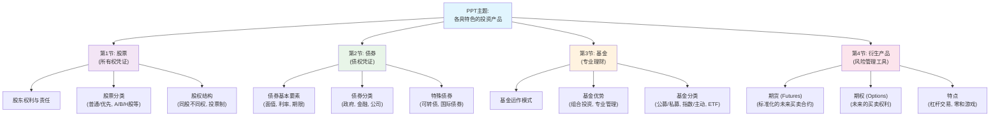

# 1 📋 [第二章 各具特色的投资产品] 整体结构框架
## 1.1 🗂️ 章节目录与学习路径
### 1.1.1 章节概览
本PPT共分为四个核心部分，清晰地介绍了金融市场中的主要投资工具：
- **第1节：股票** - 核心主题概括：讲解作为公司所有权凭证的股票，涉及股东的权利与责任、复杂的股权结构（如同股同权/不同权）以及多种分类方式。
- **第2节：债券** - 核心主题概括：介绍作为债权凭证的债券，包括其基本要素、发行人分类、特殊类型（如可转债）和国际债券。
- **第3节：基金** - 核心主题概括：阐述作为专业化理财工具的证券投资基金，涵盖其运作模式、优势以及从不同维度（募集方式、投资对象、投资理念）进行的分类。
- **第4节：衍生产品** - 核心主题概括：介绍价值依赖于基础资产的金融衍生工具，主要聚焦于期货和期权的概念、特点和风险管理应用。
### 1.1.2 📊 整体逻辑结构思维导图

### 1.1.3 🎯 学习建议顺序
- **建议学习顺序**：**第1节 → 第2节 → 第3节 → 第4节**。这个顺序完全符合PPT的编排，从最基础、最核心的资产类别（股票、债券）讲起，然后过渡到集合投资工具（基金），最后介绍最高级的衍生品，逻辑层层递进。
- **章节重要性**：
    - ⭐⭐⭐ **第1节 (股票) & 第2节 (债券)**：这是理解资本市场运作的基石，是所有后续产品的基础，考试绝对重点。
    - ⭐⭐ **第3节 (基金)**：是普通投资者最常接触的投资方式，实践意义强，考试常考。
    - ⭐ **第4节 (衍生产品)**：概念相对抽象，风险高，属于进阶内容，重点在于理解其基本原理和功能。
- **前置知识要求**：建议先理解PPT第3页关于“**金融市场**”、“**货币市场**”和“**资本市场**”的基本划分。这有助于你明白本章所有产品都属于“资本市场”的范畴，是进行长期资金融通的工具。
### 1.1.4 🧵 整体逻辑主线概括
PPT整体思路：
它首先从资本市场的核心问题——企业如何融资、投资者如何参与出发。为了解决这个问题，PPT首先展示了两种最基本的“武器”：股票（第1节），它代表着你成为公司“老板”之一（所有权），风险高收益也高；以及债券（第2节），它代表着你借钱给公司或政府（债权），风险和收益相对稳健。
在介绍了这两种基础资产后，PPT紧接着点出了一个现实难题：普通人直接挑选股票和债券既费时又费力，还容易“踩雷”。于是，它顺理成章地引出了**解决方案——基金**（第3节），这相当于你把钱交给“专业将军”（基金经理），由他帮你搭配一整个“武器组合”去打仗，从而分散风险。
最后，当掌握了基础和组合工具后，PPT将我们带到了一个更高级的层面——**衍生产品**（第4e节）。这些工具（如期货和期权）本身不直接创造价值，而是像“军事谋略”或“保险合同”，它们的价值依附于前三者。其核心功能是为了**管理和对冲**未来价格波动的风险（比如给你的资产买个保险），当然，也可能因为其高杠杆性而被用于投机，风险极高。
总而言之，这条主线从**拥有资产（股票）**，到**借出资金（债券）**，再到**委托专家管理资产（基金）**，最后到**为资产上保险或进行高级博弈（衍生品）**，构成了一个从简单到复杂、从基础到高级的完整投资产品知识体系。
### 1.1.5 ✅ 准备就绪
现在，我已经为你梳理了整个PPT的宏观结构和学习脉络。你可以随时开始深入每一节的学习。
**使用指南:**
- 请输入 **"第1节"** 来获取该节的详细解析。
- 例如：输入 **"第1节"** 开始学习关于股票的内容。