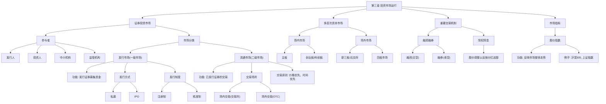

```mermaid
graph TD
    A["第三章 投资市场运行"] --> B["证券投资市场"]
    B --> B1["参与者"]
    B1 --> B1a["发行人"]
    B1 --> B1b["投资人"]
    B1 --> B1c["中介机构"]
    B1 --> B1d["监管机构"]
    
    B --> B2["市场分类"]
    B2 --> C["发行市场(一级市场)"]
    B2 --> D["流通市场(二级市场)"]
    
    C --> C1["功能: 发行证券募集资金"]
    C --> C2["发行方式"]
    C2 --> C2a["私募"]
    C2 --> C2b["IPO"]
    C --> C3["发行制度"]
    C3 --> C3a["注册制"]
    C3 --> C3b["核准制"]
    
    D --> D1["功能: 已发行证券的交易"]
    D --> D2["交易场所"]
    D2 --> D2a["场内交易(交易所)"]
    D2 --> D2b["场外交易(OTC)"]
    D --> D3["交易原则: 价格优先、时间优先"]
    
    A --> E["多层次资本市场"]
    E --> E1["场内市场"]
    E1 --> E1a["主板"]
    E1 --> E1b["创业板/科创板"]
    E --> E2["场外市场"]
    E2 --> E2a["新三板/北交所"]
    E2 --> E2b["四板市场"]
    
    A --> F["重要交易机制"]
    F --> F1["融资融券"]
    F1 --> F1a["融资(买空)"]
    F1 --> F1b["融券(卖空)"]
    F --> F2["除权除息"]
    F2 --> F2a["股价调整以反映分红送股"]
    
    A --> G["市场指标"]
    G --> G1["股价指数"]
    G1 --> G1a["功能: 反映市场整体走势"]
    G1 --> G1b["例子: 沪深300, 上证指数"]
```
