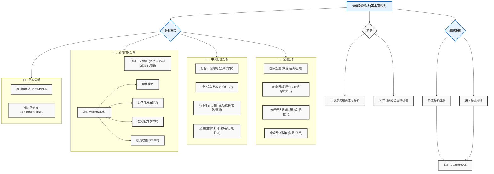

```mermaid
graph TD
    A["价值投资分析 (基本面分析)"] --> B{"前提"};
    B --> B1["1. 股票内在价值可分析"];
    B --> B2["2. 市场价格会回归价值"];

    A --> C{"分析框架"};
    C --> D["一、宏观分析"];
    C --> E["二、中观行业分析"];
    C --> F["三、公司财务分析"];
    C --> G["四、估值分析"];

    subgraph D [一、宏观分析]
        D1["国际宏观 (政治/经济/自然)"]
        D2["宏观经济形势 (GDP/利率/CPI...)"]
        D3["宏观经济周期 (康波/朱格拉...)"]
        D4["宏观经济政策 (财政/货币)"]
    end

    subgraph E [二、中观行业分析]
        E1["行业市场结构 (垄断/竞争)"]
        E2["行业竞争结构 (波特五力)"]
        E3["行业生命周期 (导入/成长/成熟/衰退)"]
        E4["经济周期与行业 (成长/周期/防守)"]
    end

    subgraph F [三、公司财务分析]
        F1["阅读三大报表 (资产负债/利润/现金流量)"]
        F2["分析关键财务指标"]
        F2 --> F2_1["偿债能力"]
        F2 --> F2_2["经营与发展能力"]
        F2 --> F2_3["盈利能力 (ROE)"]
        F2 --> F2_4["投资收益 (PE/PB)"]
    end

    subgraph G [四、估值分析]
        G1["绝对估值法 (DCF/DDM)"]
        G2["相对估值法 (PE/PB/PS/PEG)"]
    end

    A --> H{"最终决策"};
    H --> H1["价值分析选股"];
    H --> H2["技术分析择时"];
    H1 & H2 --> H3["长期持有优质股票"];

    classDef default fill:#f9f9f9,stroke:#333,stroke-width:2px;
    classDef category fill:#e6f3ff,stroke:#0066cc,stroke-width:2px,font-weight:bold;
    class A,C,H category;
```
