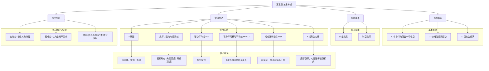

```mermaid
graph TD
    A[第五章 技术分析] --> B[基本假设]
    A --> C[基本要素]
    A --> D[常用方法]
    A --> E[相关争论]
    
    subgraph "基本假设"
        B1[1. 市场行为涵盖一切信息]
        B2[2. 价格沿趋势运动]
        B3[3. 历史会重演]
    end
    
    subgraph "基本要素"
        C1[价量关系]
        C2[时空关系]
    end
    
    subgraph "常用方法"
        D1[K线图]
        D2[支撑、阻力与趋势线]
        D3[移动平均线 MA]
        D4[平滑异同移动平均线 MACD]
        D5[相对强弱指标 RSI]
        D6[K线黄金定律]
    end
    
    subgraph "核心解读"
        D1a[阴阳线、实体、影线]
        D2a[反转形态: 头肩顶/底, 双重顶/底]
        D3a[金叉/死叉]
        D4a[DIF与DEA判断买卖点]
        D5a[超买大于70与超卖小于30]
        D6a[底部涨停、七连阳等追涨模式]
    end
    
    subgraph "相关争论与结论"
        E1[支持者: 相信其有效性]
        E2[反对者: 认为是概率游戏]
        E3[结论: 应与基本面分析结合使用]
    end
    
    B --> B1
    B --> B2
    B --> B3
    
    C --> C1
    C --> C2
    
    D --> D1
    D --> D2
    D --> D3
    D --> D4
    D --> D5
    D --> D6
    
    D1 --> D1a
    D2 --> D2a
    D3 --> D3a
    D4 --> D4a
    D5 --> D5a
    D6 --> D6a
    
    E --> E1
    E --> E2
    E --> E3
```
