### 0.1.1 **问题分析**
#### 0.1.1.1 **核心问题识别:**
- **什么是投资收益?** → **答案概括：** 投资所得报酬
- **如何衡量投资收益?** → **答案概括：** 使用收益率
- **收益率有哪几种?** → **答案概括：** 持有期、年化、预期
- **什么是投资风险?** → **答案概括：** 收益不确定性
- **投资风险分几类?** → **答案概括：** 系统性、非系统性
- **如何衡量投资风险?** → **答案概括：** 方差、标准差
- **风险和收益是何关系?** → **答案概括：** 相互匹配、正向相关
- **如何评估投资组合?** → **答案概括：** 使用夏普比率
#### 0.1.1.2 **问题关联分析:**
1. **投资收益** 和 **投资风险** 是投资中不可分割的两个核心概念，是本章内容的一体两面。理解“什么是收益”和“什么是风险”是进行一切投资决策的基础。
2. 对收益和风险的**量化衡量**（如收益率、标准差）是进行科学分析的前提。它们将抽象的概念转化为具体可比较的数字。
3. **收益与风险的关系**是核心，它揭示了高预期收益往往伴随着高风险。夏普比率等工具则提供了在二者之间进行权衡与评估的方法，最终指导投资决策。
### 0.1.2 **Mermaid图表**

```mermaid
graph TD
    A[第六章：投资收益与投资风险] --> B[第一部分：投资收益]
    A --> C[第二部分：投资风险]
    A --> D[第三部分：收益与风险的关系]
    
    subgraph 收益体系 [收益 Return]
        B --> B1[收益的基本概念]
        B1 --> B1a[定义：投资所获得的报酬]
        B1 --> B1b[收益来源]
        B1b --> B1b1[收入收益：股息、利息、租金等]
        B1b --> B1b2[资本利得：价格有利变动]
        B1 --> B1c[收益分类]
        B1c --> B1c1[已实现收益 Realized Return]
        B1c --> B1c2[预期收益 Expected Return]
        B1c --> B1c3[必要收益 Required Return]
        
        B --> B2[收益率的衡量]
        B2 --> B2a[收益率定义：收益相对于本金的比率]
        B2 --> B2b[持有期收益率 HPR]
        B2b --> B2b1[计算公式：期末价值加期间收入减期初价值除以期初价值]
        B2b --> B2b2[适用于任意持有期间]
        
        B2 --> B2c[年化收益率]
        B2c --> B2c1[目的：统一不同期限产品的收益标准]
        B2c --> B2c2[几何平均法 vs 算术平均法]
        B2c --> B2c3[复利效应的体现]
        
        B2 --> B2d[预期收益率ER]
        B2d --> B2d1[概念：未来各种可能收益的概率加权平均]
        B2d --> B2d2[估算方法]
        B2d2 --> B2d2a[历史数据法：基于历史收益率的统计]
        B2d2 --> B2d2b[情景分析法：基于不同情景的概率估算]
        B2d2 --> B2d2c[专家判断法：基于分析师预测]
    end
    
    subgraph 风险体系 [风险 Risk]
        C --> C1[风险的本质]
        C1 --> C1a[定义：投资收益率的不确定性]
        C1 --> C1b[表现形式：价格波动、收益偏离]
        C1 --> C1c[投资者心理：风险厌恶 损失厌恶]
        C1 --> C1d[深层含义：永久性损失的可能性]
        
        C --> C2[风险的分类]
        C2 --> C2a[系统性风险 Systematic Risk]
        C2a --> C2a1[特征：影响整个市场 不可分散]
        C2a --> C2a2[主要类型]
        C2a2 --> C2a2a[市场风险：整体市场波动]
        C2a2 --> C2a2b[利率风险：利率变动影响]
        C2a2 --> C2a2c[通胀风险：购买力下降]
        C2a2 --> C2a2d[汇率风险：外汇波动]
        C2a2 --> C2a2e[政策风险：法规政策变化]
        C2a --> C2a3[典型案例：金融危机、贸易战、疫情]
        
        C2 --> C2b[非系统性风险 Unsystematic Risk]
        C2b --> C2b1[特征：影响个别公司 可通过分散化降低]
        C2b --> C2b2[主要类型]
        C2b2 --> C2b2a[经营风险：业务运营相关]
        C2b2 --> C2b2b[财务风险：资本结构相关]
        C2b2 --> C2b2c[管理风险：管理层决策失误]
        C2b2 --> C2b2d[道德风险：信息披露不实]
        C2b --> C2b3[典型案例：公司财务造假、经营失败]
        
        C --> C3[风险的度量]
        C3 --> C3a[绝对风险指标]
        C3a --> C3a1[方差 Variance：偏离程度的平方均值]
        C3a --> C3a2[标准差 Standard Deviation：最常用指标]
        C3a --> C3a3[计算公式与应用]
        
        C3 --> C3b[相对风险指标]
        C3b --> C3b1[变异系数：标准差除以预期收益率]
        C3b --> C3b2[贝塔系数：系统性风险的度量]
        C3b --> C3b3[下行风险：仅考虑负面波动]
    end
    
    subgraph 关系评估 [收益风险关系与评估]
        D --> D1[基本关系原理]
        D1 --> D1a[核心定理：风险与收益正相关]
        D1 --> D1b[经济逻辑：收益是承担风险的补偿]
        D1 --> D1c[资本市场线 CML：风险收益均衡关系]
        D1 --> D1d[有效前沿：最优风险收益组合]
        
        D --> D2[风险补偿机制]
        D2 --> D2a[必要收益率模型]
        D2a --> D2a1[公式：Rf加风险溢价]
        D2a --> D2a2[无风险利率：国债收益率基准]
        D2a --> D2a3[风险溢价：超额收益补偿]
        D2 --> D2b[风险的价格]
        D2b --> D2b1[单位风险价格：溢价除以风险度量]
        D2b --> D2b2[市场风险溢价的形成机制]
        
        D --> D3[风险收益的不对称性]
        D3 --> D3a[收益分布特征：上涨无限 下跌有限]
        D3 --> D3b[损失的复利效应]
        D3b --> D3b1[损失50%需要涨100%才能回本]
        D3b --> D3b2[巴菲特投资原则的启示]
        D3 --> D3c[行为金融学视角：损失厌恶]
        
        D --> D4[投资组合评估指标]
        D4 --> D4a[夏普比率SharpeRatio]
        D4a --> D4a1[定义：单位风险的超额收益]
        D4a --> D4a2[公式：ER减Rf除以σ]
        D4a --> D4a3[应用：投资组合优劣比较]
        
        D4 --> D4b[其他评估指标]
        D4b --> D4b1[特雷诺比率：基于系统性风险]
        D4b --> D4b2[詹森指数：绝对超额收益]
        D4b --> D4b3[信息比率：主动投资评估]
        D4b --> D4b4[最大回撤：极端风险度量]
    end
    
    %% 样式设置
    classDef mainNode fill:#FFE4E1,stroke:#8B0000,stroke-width:3px,color:#000
    classDef returnNode fill:#E8F5E8,stroke:#006400,stroke-width:2px,color:#000
    classDef riskNode fill:#E6F3FF,stroke:#0066CC,stroke-width:2px,color:#000
    classDef relationNode fill:#FFF8DC,stroke:#DAA520,stroke-width:2px,color:#000
    classDef conceptNode fill:#F0F8FF,stroke:#4682B4,stroke-width:1px,color:#000
    
    class A mainNode
    class B,B1,B2 returnNode
    class C,C1,C2,C3 riskNode
    class D,D1,D2,D3,D4 relationNode
```

### 0.1.3 **使用说明**
1. **直接复制**：将上面的Mermaid代码块完整复制到您的Obsidian笔记中。
2. **自动渲染**：Obsidian会自动将代码渲染成一个可交互的流程图。
3. **自定义调整**：您可以根据自己的理解，直接在Obsidian中修改Mermaid代码，调整图表的结构、内容和样式。